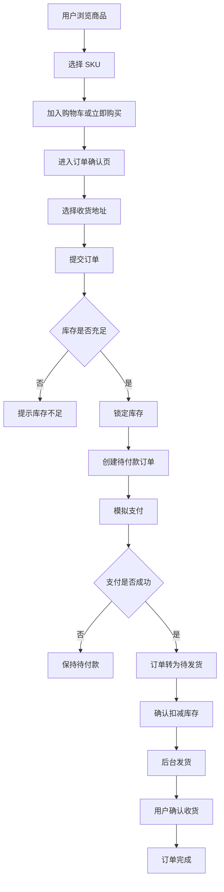
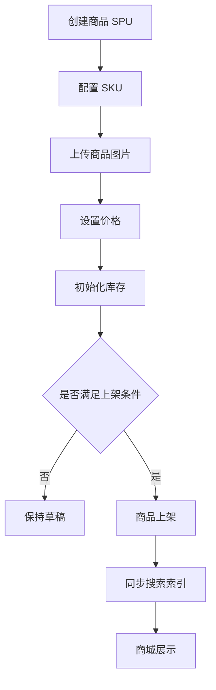
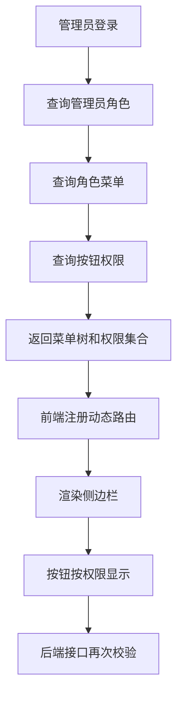
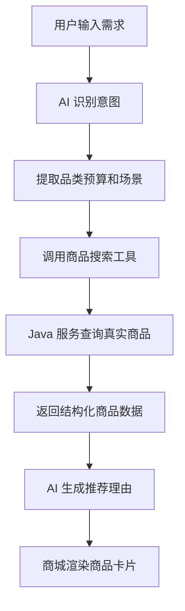

# AI 智能电商微服务平台——产品需求文档

## 1. 文档信息

- **项目名称**：AI 智能电商微服务平台
- **英文名称**：AI-Powered E-Commerce Platform
- **项目代号**：AI Mall
- **仓库名称**：`ai-mall-platform`
- **文档名称**：产品需求文档
- **文档路径**：`docs/01-产品需求文档.md`
- **当前版本**：V0.1
- **文档状态**：初稿
- **关联文档**：`docs/00-项目总览.md`

### 1.1 版本记录

| 版本 | 日期 | 说明 |
|---|---|---|
| V0.1 | 初始版本 | 明确商城端、后台管理端、AI 服务和核心业务需求 |

---

## 2. 文档目的

本文档用于明确 AI 智能电商微服务平台的产品范围、用户角色、功能模块、业务规则、优先级和验收标准，作为后续领域分析、系统设计、数据库设计、接口设计、开发、测试和验收的依据。

本文档重点回答以下问题：

1. 系统面向哪些用户；
2. 商城端需要实现哪些功能；
3. 后台管理端需要实现哪些功能；
4. AI 功能如何与真实业务结合；
5. 商品、购物车、订单、库存、权限和配置之间如何协作；
6. 第一版必须完成哪些功能；
7. 每个功能如何验收；
8. 哪些功能暂不纳入第一版。

---

## 3. 产品概述

AI 智能电商微服务平台由用户商城端、后台管理端、Java 微服务后端、Python AI 服务和基础设施组成。

```text
AI 智能电商微服务平台
├── 用户商城端 mall-web
├── 后台管理端 mall-admin
├── Java 微服务后端 backend
├── Python AI 服务 ai-service
├── 部署与基础设施 deploy
├── 数据库脚本 sql
└── 项目文档 docs
```

商城端面向普通消费者，提供商品浏览、搜索、购物车、下单、支付、订单、退款和 AI 导购等功能。

后台管理端面向平台管理员、商品管理员、订单管理员、运营人员和客服人员，提供商品、库存、订单、权限、动态菜单、系统配置和 AI 知识库管理能力。

系统后端采用 Spring Cloud Alibaba 微服务架构，并在核心业务服务内部采用 DDD 领域驱动设计。

AI 服务通过 Java 后端提供的受控接口读取商品、订单和知识库数据，不直接操作业务数据库。

---

## 4. 产品目标

### 4.1 核心目标

第一版产品需要完整跑通以下业务闭环：

```text
后台创建商品
→ 配置 SKU 和库存
→ 商品上架
→ 商城展示商品
→ 用户加入购物车
→ 用户提交订单
→ 系统锁定库存
→ 用户完成模拟支付
→ 系统确认扣减库存
→ 后台发货
→ 用户确认收货
→ 订单完成
```

同时需要实现以下管理闭环：

```text
超级管理员创建角色
→ 分配菜单和按钮权限
→ 管理员登录
→ 系统动态加载菜单
→ 管理员执行授权操作
→ 未授权操作被拒绝
```

以及以下 AI 闭环：

```text
用户输入购买需求
→ AI 解析需求
→ AI 调用真实商品搜索接口
→ 返回平台真实商品
→ 生成推荐理由
→ 商城展示商品卡片
```

### 4.2 非目标

第一版不以以下内容为目标：

- 完整复制淘宝或其他大型平台；
- 建设真实多商户平台；
- 接入真实支付宝或微信支付；
- 对接真实物流平台；
- 实现复杂供应链、采购、结算和财务系统；
- 实现大规模秒杀和高并发促销系统；
- 实现完整推荐算法平台；
- 实现微前端；
- 实现原生移动端应用或小程序；
- 实现 Kubernetes 生产集群。

---

## 5. 用户角色与使用场景

## 5.1 商城用户

### 5.1.1 游客

游客是未登录用户。

主要场景：

- 浏览首页；
- 浏览分类；
- 搜索商品；
- 查看商品详情；
- 查看部分公开 AI 导购结果；
- 注册或登录。

游客限制：

- 不允许提交订单；
- 不允许查看订单；
- 不允许申请退款；
- 不允许调用需要身份信息的订单 AI 工具；
- 不允许保存持久化收货地址。

### 5.1.2 普通用户

普通用户是完成注册和登录的消费者。

主要场景：

- 管理个人资料；
- 管理收货地址；
- 浏览和搜索商品；
- 选择 SKU；
- 使用购物车；
- 提交订单；
- 模拟支付；
- 取消订单；
- 查看订单；
- 确认收货；
- 申请退款；
- 使用 AI 智能导购；
- 使用 AI 商品对比；
- 使用 AI 客服和订单助手。

## 5.2 后台用户

### 5.2.1 超级管理员

拥有全部后台权限，负责：

- 管理后台用户；
- 管理角色；
- 管理菜单；
- 管理按钮权限；
- 管理功能配置；
- 管理系统参数；
- 查看操作日志；
- 处理特殊业务问题。

### 5.2.2 商品管理员

负责：

- 创建和编辑商品；
- 管理分类；
- 管理品牌；
- 配置 SPU 和 SKU；
- 上传商品图片；
- 设置商品价格；
- 商品上架和下架；
- 查看库存。

### 5.2.3 订单管理员

负责：

- 查询订单；
- 查看订单详情；
- 处理发货；
- 处理退款；
- 查看订单状态记录；
- 查看库存锁定结果。

### 5.2.4 运营人员

负责：

- 查看工作台；
- 维护商品内容；
- 管理 AI 知识库；
- 查看 AI 对话记录；
- 管理 AI 功能开关；
- 管理部分业务参数。

### 5.2.5 客服人员

负责：

- 查询订单；
- 查看订单详情；
- 查看退款进度；
- 查看 AI 对话记录；
- 协助处理用户咨询。

客服人员默认不允许：

- 修改商品；
- 修改库存；
- 审核退款；
- 管理角色；
- 管理菜单；
- 修改系统配置。

---

## 6. 功能优先级定义

本文档使用以下优先级：

| 优先级 | 含义 |
|---|---|
| P0 | 第一版必须完成，不完成则核心业务无法验收 |
| P1 | 重要增强，应在核心链路完成后实现 |
| P2 | 后续增强，有时间再实现 |
| OUT | 第一版明确不实现 |

---

## 7. 用户商城端需求

# 7.1 注册与登录

### 7.1.1 用户注册

- **需求编号**：`MALL-AUTH-001`
- **优先级**：P0

#### 功能说明

用户可通过用户名、手机号或邮箱中的一种方式完成注册。第一版可以只开放用户名加密码注册，手机号验证码可作为后续增强。

#### 业务规则

- 用户名必须唯一；
- 密码必须满足最小长度要求；
- 密码必须加密存储；
- 注册功能受后台功能开关控制；
- 注册成功后可自动登录或跳转登录页；
- 被禁用的账号不能登录。

#### 验收标准

- 输入合法信息后可以成功注册；
- 重复用户名不能注册；
- 非法密码不能注册；
- 后台关闭注册功能后，前端不显示注册入口，后端注册接口同时拒绝请求。

### 7.1.2 用户登录

- **需求编号**：`MALL-AUTH-002`
- **优先级**：P0

#### 功能说明

用户输入账号和密码后登录商城。

#### 业务规则

- 登录成功后返回访问令牌；
- 登录失败不暴露账号是否存在；
- 登录后恢复用户身份、购物车和个人数据；
- 令牌失效后需要重新登录；
- 禁用账号不能登录。

#### 验收标准

- 正确账号密码可以登录；
- 错误密码不能登录；
- 登录后可以访问个人订单；
- 未登录访问受保护页面时跳转登录页。

### 7.1.3 用户退出

- **需求编号**：`MALL-AUTH-003`
- **优先级**：P0

#### 验收标准

- 用户可以主动退出；
- 退出后本地令牌被清理；
- 退出后不能继续访问受保护接口。

---

# 7.2 商城首页

### 7.2.1 首页商品展示

- **需求编号**：`MALL-HOME-001`
- **优先级**：P0

#### 功能说明

首页展示平台基础导航、商品分类、推荐商品、新品或热销商品。

#### 页面内容

- 顶部导航；
- 搜索入口；
- 商品分类入口；
- 推荐商品列表；
- AI 智能导购入口；
- 用户登录状态；
- 购物车入口；
- 订单入口。

#### 业务规则

- 只展示已上架且状态正常的商品；
- 无库存商品可以展示，但必须明确标记缺货；
- 被后台关闭的功能入口不展示；
- 推荐列表第一版可采用后台配置或按销量排序，不实现复杂算法。

#### 验收标准

- 后台上架商品后可在商城显示；
- 后台下架商品后不再显示；
- 关闭 AI 导购功能后首页入口消失。

---

# 7.3 商品分类

### 7.3.1 分类浏览

- **需求编号**：`MALL-CATEGORY-001`
- **优先级**：P0

#### 功能说明

用户可以按照分类查看商品。

#### 业务规则

- 分类支持父子层级；
- 只显示启用状态的分类；
- 分类排序由后台配置；
- 分类下只显示已上架商品。

#### 验收标准

- 用户可以进入分类页；
- 点击分类后显示对应商品；
- 禁用分类不在商城显示。

---

# 7.4 商品搜索

### 7.4.1 关键词搜索

- **需求编号**：`MALL-SEARCH-001`
- **优先级**：P1

#### 功能说明

用户输入关键词搜索商品。

#### 搜索范围

- 商品名称；
- 商品副标题；
- 品牌名称；
- 分类名称；
- 商品关键词；
- 部分商品属性。

#### 业务规则

- 搜索结果只包含已上架商品；
- 支持分页；
- 支持关键词高亮；
- 无结果时提供空状态；
- 第一版 P0 阶段可使用 MySQL 模糊查询，P1 阶段切换 Elasticsearch。

#### 验收标准

- 输入商品名称关键词可以搜索到商品；
- 下架商品不能被搜索到；
- 分页结果正确；
- Elasticsearch 启用后可正常完成全文搜索。

### 7.4.2 条件筛选与排序

- **需求编号**：`MALL-SEARCH-002`
- **优先级**：P1

#### 支持条件

- 分类；
- 品牌；
- 价格区间；
- 是否有货；
- 综合排序；
- 价格升序；
- 价格降序；
- 销量排序。

#### 验收标准

- 组合筛选条件后结果正确；
- 切换排序后结果顺序正确。

---

# 7.5 商品详情

### 7.5.1 商品详情展示

- **需求编号**：`MALL-PRODUCT-001`
- **优先级**：P0

#### 页面内容

- 商品主图；
- 商品名称；
- 商品副标题；
- 价格区间；
- 品牌；
- 分类；
- 商品介绍；
- SKU 规格；
- 当前库存；
- 商品状态；
- 加入购物车按钮；
- 立即购买按钮；
- AI 商品对比入口。

#### 业务规则

- 详情页只允许访问存在的商品；
- 已下架商品可以返回已下架提示，但不能购买；
- 用户必须选择完整 SKU 后才能加入购物车或立即购买；
- 价格以所选 SKU 实际价格为准；
- 库存以库存服务返回结果为准。

#### 验收标准

- 选择不同 SKU 后价格和库存正确变化；
- 未选择完整规格时不能加入购物车；
- 无库存 SKU 不能购买；
- 下架商品不能提交购买请求。

### 7.5.2 商品收藏

- **需求编号**：`MALL-PRODUCT-002`
- **优先级**：P2

#### 验收标准

- 登录用户可以收藏和取消收藏；
- 收藏列表可以查看；
- 同一商品不能重复收藏。

### 7.5.3 浏览记录

- **需求编号**：`MALL-PRODUCT-003`
- **优先级**：P2

#### 验收标准

- 登录用户访问商品详情后生成浏览记录；
- 相同商品重复浏览可更新最后访问时间；
- 用户可以清空浏览记录。

---

# 7.6 购物车

### 7.6.1 加入购物车

- **需求编号**：`MALL-CART-001`
- **优先级**：P0

#### 业务规则

- 用户必须选择具体 SKU；
- 商品和 SKU 必须处于可售状态；
- 购买数量必须大于零；
- 购买数量不能超过系统配置；
- 相同 SKU 再次加入时合并数量；
- 加入时校验库存，但不锁定库存；
- 购物车主要存储在 Redis。

#### 验收标准

- 合法 SKU 可以加入购物车；
- 相同 SKU 重复加入后数量累加；
- 下架 SKU 不能加入；
- 超过最大数量时返回明确提示。

### 7.6.2 购物车管理

- **需求编号**：`MALL-CART-002`
- **优先级**：P0

#### 功能范围

- 查看购物车；
- 修改商品数量；
- 删除商品；
- 选择商品；
- 取消选择；
- 全选；
- 取消全选；
- 显示选中商品金额；
- 显示失效商品。

#### 业务规则

- 修改数量时重新校验商品状态和库存；
- 商品价格变化时提示用户；
- 商品下架或 SKU 禁用后标记失效；
- 失效商品不能结算；
- 购物车金额仅用于展示，最终金额在订单预览时重新计算。

#### 验收标准

- 修改数量后金额正确；
- 删除商品后购物车同步更新；
- 下架商品被标记为失效；
- 失效商品不能进入结算。

### 7.6.3 游客购物车

- **需求编号**：`MALL-CART-003`
- **优先级**：P1

#### 功能说明

游客购物车可以临时保存在浏览器本地，登录后与服务端购物车合并。

#### 合并规则

- 相同 SKU 合并数量；
- 合并后数量不得超过上限；
- 失效商品不写入有效购物车；
- 登录合并成功后清除本地临时购物车。

---

# 7.7 收货地址

### 7.7.1 地址管理

- **需求编号**：`MALL-ADDRESS-001`
- **优先级**：P0

#### 功能范围

- 新增地址；
- 编辑地址；
- 删除地址；
- 设置默认地址；
- 查看地址列表。

#### 业务规则

- 用户只能操作自己的地址；
- 每个用户最多一个默认地址；
- 删除默认地址后可自动选择其他地址为默认地址，也可以允许无默认地址；
- 已创建订单保存地址快照，不受用户后续修改影响。

#### 验收标准

- 用户不能查看或修改其他用户地址；
- 设置新默认地址后旧默认地址自动取消；
- 订单详情继续展示下单时的地址快照。

---

# 7.8 订单预览与结算

### 7.8.1 订单预览

- **需求编号**：`MALL-CHECKOUT-001`
- **优先级**：P0

#### 功能说明

用户从购物车或立即购买入口进入订单确认页。

#### 页面内容

- 结算商品；
- SKU 信息；
- 购买数量；
- 当前单价；
- 商品小计；
- 收货地址；
- 配送说明；
- 订单总金额；
- 用户备注；
- 提交订单按钮。

#### 业务规则

订单预览必须重新校验：

- 商品是否存在；
- 商品是否上架；
- SKU 是否启用；
- SKU 当前价格；
- SKU 当前库存；
- 购买数量；
- 收货地址归属；
- 功能配置状态。

订单预览不锁定库存。

#### 验收标准

- 商品价格变化时以最新价格展示；
- 库存不足时不能进入可提交状态；
- 无有效收货地址时提示新增地址。

---

# 7.9 创建订单

### 7.9.1 提交订单

- **需求编号**：`MALL-ORDER-001`
- **优先级**：P0

#### 业务规则

创建订单时必须：

1. 校验用户身份；
2. 校验幂等令牌；
3. 校验商品状态；
4. 校验 SKU 状态；
5. 重新计算商品价格；
6. 校验收货地址；
7. 请求库存服务锁定库存；
8. 创建订单和订单明细快照；
9. 返回待支付订单；
10. 记录订单状态日志。

#### 快照内容

订单明细至少保存：

- 商品 ID；
- SKU ID；
- 商品名称；
- SKU 规格；
- 商品图片；
- 成交单价；
- 购买数量；
- 商品小计。

订单保存收货地址快照。

#### 幂等要求

- 同一个提交令牌只能成功创建一次订单；
- 重复点击不能生成多笔订单；
- 创建失败时不得遗留不可恢复的库存锁定。

#### 验收标准

- 正常情况下可以创建待付款订单；
- 库存不足时创建失败；
- 重复提交不会产生重复订单；
- 创建订单失败后库存最终恢复；
- 订单金额与明细金额一致。

---

# 7.10 模拟支付

### 7.10.1 支付订单

- **需求编号**：`MALL-PAY-001`
- **优先级**：P0

#### 功能说明

第一版使用模拟支付，不接入真实支付平台。

#### 业务规则

- 只有待付款订单可以支付；
- 用户只能支付自己的订单；
- 支付接口必须幂等；
- 支付成功后订单转为待发货；
- 支付成功后库存服务确认扣减锁定库存；
- 重复支付请求不能重复扣减库存；
- 超时关闭的订单不能支付。

#### 验收标准

- 待付款订单可以模拟支付；
- 支付成功后订单状态变为待发货；
- 已支付订单重复支付不会重复处理；
- 已取消订单不能支付；
- 库存锁定数量正确转为已扣减数量。

---

# 7.11 订单中心

### 7.11.1 订单列表

- **需求编号**：`MALL-ORDER-002`
- **优先级**：P0

#### 功能范围

- 查看全部订单；
- 按状态筛选；
- 查看订单摘要；
- 进入订单详情；
- 对不同状态显示可执行操作。

#### 业务规则

用户只能查看自己的订单。

#### 验收标准

- 不同用户之间订单完全隔离；
- 状态筛选正确；
- 列表显示订单号、金额、状态、商品和时间。

### 7.11.2 订单详情

- **需求编号**：`MALL-ORDER-003`
- **优先级**：P0

#### 页面内容

- 订单号；
- 订单状态；
- 商品快照；
- 订单金额；
- 收货地址快照；
- 支付信息；
- 发货信息；
- 订单状态记录；
- 可执行操作。

#### 验收标准

- 显示信息来自订单快照；
- 商品后续修改不影响历史订单展示；
- 用户不能查看其他用户订单。

### 7.11.3 用户取消订单

- **需求编号**：`MALL-ORDER-004`
- **优先级**：P0

#### 业务规则

- 只有待付款订单允许用户直接取消；
- 取消后释放库存锁定；
- 取消操作必须幂等；
- 已支付订单不能通过普通取消接口取消。

#### 验收标准

- 待付款订单可以取消；
- 取消后订单状态变为已取消；
- 库存锁定被释放；
- 重复取消不会重复释放库存。

### 7.11.4 确认收货

- **需求编号**：`MALL-ORDER-005`
- **优先级**：P0

#### 业务规则

- 只有已发货订单可以确认收货；
- 确认收货后订单变为已完成；
- 已完成订单不能重复确认。

#### 验收标准

- 已发货订单可以确认收货；
- 待发货订单不能确认收货；
- 重复确认不会重复处理。

### 7.11.5 超时关闭订单

- **需求编号**：`MALL-ORDER-006`
- **优先级**：P1

#### 业务规则

- 待付款订单超过系统配置时间后自动关闭；
- 使用 RocketMQ 延迟消息或定时补偿处理；
- 如果订单已支付，则延迟消息不执行关闭；
- 关闭成功后释放锁定库存；
- 消息重复消费不能重复释放库存。

#### 验收标准

- 超时未支付订单自动变为已取消；
- 已支付订单不会被错误关闭；
- 释放库存结果正确；
- 重复消息不会造成库存异常。

---

# 7.12 发货与物流展示

### 7.12.1 查看发货信息

- **需求编号**：`MALL-DELIVERY-001`
- **优先级**：P0

#### 功能说明

用户可以在订单详情查看后台填写的物流公司、物流单号和发货时间。

第一版不对接真实物流轨迹。

#### 验收标准

- 后台发货后，用户端显示物流信息；
- 未发货订单不显示虚假物流信息。

---

# 7.13 退款与售后

### 7.13.1 用户申请退款

- **需求编号**：`MALL-REFUND-001`
- **优先级**：P1

#### 业务规则

- 允许申请退款的订单状态由业务规则决定；
- 用户只能申请自己的订单；
- 用户需填写退款原因；
- 同一订单不能重复创建未结束退款申请；
- 退款功能受系统功能开关控制；
- 第一版不接入真实资金原路退回，仅模拟退款状态。

#### 验收标准

- 合法订单可以提交退款申请；
- 非法状态订单不能申请；
- 关闭退款功能后前端入口消失，后端接口拒绝请求。

### 7.13.2 查看退款进度

- **需求编号**：`MALL-REFUND-002`
- **优先级**：P1

#### 验收标准

- 用户可以查看退款申请状态；
- 后台审核后用户端同步显示结果。

---

# 7.14 个人中心

### 7.14.1 个人资料

- **需求编号**：`MALL-PROFILE-001`
- **优先级**：P1

#### 功能范围

- 查看资料；
- 修改昵称；
- 修改头像；
- 修改基础信息。

#### 业务规则

- 用户只能修改自己的信息；
- 头像使用对象存储；
- 敏感字段不能直接从前端任意修改。

---

# 7.15 AI 智能导购

### 7.15.1 自然语言导购

- **需求编号**：`MALL-AI-001`
- **优先级**：P0

#### 功能说明

用户使用自然语言描述购买需求，AI 解析需求并调用真实商品搜索工具，返回推荐商品。

#### 输入示例

```text
预算 3000 元以内，想买一台适合学习编程的轻薄笔记本。
```

#### AI 解析内容

- 商品品类；
- 预算区间；
- 使用场景；
- 品牌偏好；
- 规格要求；
- 排除条件；
- 用户补充要求。

#### 输出内容

- 意图识别结果；
- 结构化筛选条件；
- 推荐商品列表；
- 每个商品的推荐理由；
- 需要继续追问的问题；
- 无匹配结果时的解释。

#### 业务规则

- 推荐商品必须来自真实商品服务或搜索服务；
- 只推荐已上架商品；
- 默认不推荐无库存商品；
- AI 不得捏造商品 ID、价格或库存；
- AI 服务关闭时商城入口不可见；
- AI 服务异常时返回友好降级信息，不影响基础商城功能。

#### 验收标准

- AI 能从用户描述中提取预算和用途；
- AI 能调用商品搜索工具；
- 返回商品均存在于商城；
- 点击推荐商品可进入真实商品详情页；
- AI 服务不可用时普通商品浏览和下单不受影响。

### 7.15.2 多轮需求澄清

- **需求编号**：`MALL-AI-002`
- **优先级**：P1

#### 功能说明

当需求不完整时，AI 通过多轮对话补充预算、场景或规格要求。

#### 验收标准

- AI 能保留当前会话上下文；
- 达到最大对话轮数后提示重新开始；
- 对话轮数由后台系统参数控制。

---

# 7.16 AI 商品对比

### 7.16.1 多商品对比

- **需求编号**：`MALL-AI-003`
- **优先级**：P1

#### 功能说明

用户选择两个或多个商品进行结构化比较。

#### 对比维度

- 商品价格；
- 核心参数；
- 规格差异；
- 优点；
- 缺点；
- 适用场景；
- 推荐人群；
- 性价比；
- 最终建议。

#### 业务规则

- 对比数据来自真实商品详情；
- 对比商品数量设置上限；
- 已下架商品可以显示历史信息，但需要标记不可购买；
- AI 不能修改商品原始参数。

#### 验收标准

- 可以选择至少两个商品进行比较；
- 对比结果与商品参数一致；
- 结果以结构化形式展示。

---

# 7.17 RAG 智能客服

### 7.17.1 平台规则问答

- **需求编号**：`MALL-AI-004`
- **优先级**：P1

#### 知识范围

- 发货规则；
- 退款规则；
- 退换货政策；
- 支付说明；
- 平台服务规则；
- 商品使用说明。

#### 业务规则

- 回答必须优先基于知识库；
- 尽量返回引用来源；
- 无法确定时必须明确说明；
- 不允许编造不存在的平台政策；
- 后台知识库更新后可以重新构建索引。

#### 验收标准

- 上传知识文档后可完成问答；
- 回答包含知识来源；
- 知识库中没有答案时不强行生成确定结论。

---

# 7.18 AI 订单助手

### 7.18.1 订单查询

- **需求编号**：`MALL-AI-005`
- **优先级**：P2

#### 功能说明

用户通过自然语言查询自己的订单。

#### 可调用工具

- 查询订单列表；
- 查询订单详情；
- 查询发货状态；
- 查询退款进度。

#### 业务规则

- 必须验证当前用户身份；
- 只能查询当前用户订单；
- AI 服务不直接访问订单数据库；
- 所有订单数据通过 Java 服务接口获取。

#### 验收标准

- 用户可以询问最近订单状态；
- AI 返回订单真实状态；
- 无法查询其他用户订单。

### 7.18.2 订单写操作

- **需求编号**：`MALL-AI-006`
- **优先级**：P2

#### 可执行操作

- 取消待付款订单；
- 发起退款申请。

#### 业务规则

- 写操作前必须二次确认；
- 最终业务校验由 Java 服务完成；
- AI 无权绕过订单状态机；
- 操作完成后返回真实执行结果。

---

## 8. 后台管理端需求

# 8.1 后台登录

### 8.1.1 管理员登录

- **需求编号**：`ADMIN-AUTH-001`
- **优先级**：P0

#### 业务规则

- 商城用户和后台管理员账号体系隔离；
- 管理员登录成功后返回菜单树和权限集合；
- 禁用管理员不能登录；
- 登录成功记录登录日志；
- 连续失败次数过多可临时限制登录，第一版可作为 P1。

#### 验收标准

- 正确账号可以登录后台；
- 普通商城用户令牌不能访问后台接口；
- 禁用管理员不能登录；
- 登录后看到与角色匹配的菜单。

---

# 8.2 工作台

### 8.2.1 数据概览

- **需求编号**：`ADMIN-DASHBOARD-001`
- **优先级**：P1

#### 展示内容

- 今日订单数；
- 今日支付金额；
- 待发货订单数；
- 待审核退款数；
- 在售商品数；
- 低库存 SKU 数；
- 最近订单；
- 销售趋势。

#### 业务规则

- 数据根据当前权限展示；
- 第一版使用基础聚合统计；
- 不建设复杂实时数仓。

---

# 8.3 商品管理

### 8.3.1 商品列表

- **需求编号**：`ADMIN-PRODUCT-001`
- **优先级**：P0

#### 功能范围

- 分页查询；
- 按名称查询；
- 按分类查询；
- 按品牌查询；
- 按状态查询；
- 查看商品详情；
- 编辑商品；
- 上架；
- 下架。

#### 验收标准

- 商品管理员可以访问；
- 无权限角色不显示菜单和按钮；
- 直接访问接口时仍会被后端拒绝。

### 8.3.2 创建和编辑商品

- **需求编号**：`ADMIN-PRODUCT-002`
- **优先级**：P0

#### 商品信息

- 商品名称；
- 商品副标题；
- 分类；
- 品牌；
- 商品介绍；
- 商品图片；
- 商品属性；
- SKU 列表；
- 销售价格；
- 商品状态。

#### 业务规则

- 商品名称不能为空；
- 分类必须有效；
- 品牌必须有效；
- 至少存在一个有效 SKU 才允许上架；
- 商品图片上传到 MinIO；
- 编辑商品不能直接改变历史订单快照。

#### 验收标准

- 可以创建 SPU 和多个 SKU；
- 创建后可以在列表查询；
- 上架后商城可见；
- 下架后商城不可购买。

### 8.3.3 商品上下架

- **需求编号**：`ADMIN-PRODUCT-003`
- **优先级**：P0

#### 业务规则

- 只有符合条件的商品可以上架；
- 上架后同步搜索索引；
- 下架后从搜索结果移除或标记不可售；
- 上下架操作记录操作日志；
- 操作必须具有 `product:publish` 权限。

#### 验收标准

- 上架后商城显示；
- 下架后商城不能购买；
- 无权限用户不能执行上下架。

---

# 8.4 分类管理

### 8.4.1 分类维护

- **需求编号**：`ADMIN-CATEGORY-001`
- **优先级**：P0

#### 功能范围

- 新增分类；
- 编辑分类；
- 启用和禁用；
- 配置父级分类；
- 配置排序；
- 查看分类树。

#### 业务规则

- 分类层级需要限制；
- 存在有效子分类时不能直接删除父分类；
- 被商品使用的分类不能物理删除；
- 禁用分类后商城不展示。

---

# 8.5 品牌管理

### 8.5.1 品牌维护

- **需求编号**：`ADMIN-BRAND-001`
- **优先级**：P0

#### 功能范围

- 新增品牌；
- 编辑品牌；
- 上传品牌标识；
- 启用和禁用；
- 品牌排序。

#### 业务规则

- 品牌名称不能重复；
- 被商品使用的品牌不能直接物理删除。

---

# 8.6 SKU 管理

### 8.6.1 SKU 配置

- **需求编号**：`ADMIN-SKU-001`
- **优先级**：P0

#### 功能范围

- 创建 SKU；
- 编辑规格；
- 设置价格；
- 设置 SKU 编码；
- 启用和禁用；
- 查看库存。

#### 业务规则

- 同一商品内 SKU 规格组合不能重复；
- SKU 编码必须唯一；
- 销售价格不能小于零；
- 禁用 SKU 后不能加入购物车或下单；
- 修改价格不影响已创建订单。

---

# 8.7 库存管理

### 8.7.1 库存查询

- **需求编号**：`ADMIN-INVENTORY-001`
- **优先级**：P0

#### 展示内容

- SKU；
- 总库存；
- 可用库存；
- 锁定库存；
- 已售数量；
- 库存状态；
- 最后更新时间。

#### 验收标准

- 可用库存和锁定库存变化正确；
- 下单、取消和支付后数据能够正确更新。

### 8.7.2 调整库存

- **需求编号**：`ADMIN-INVENTORY-002`
- **优先级**：P0

#### 业务规则

- 库存调整必须填写原因；
- 不允许调整后产生负数；
- 不允许直接修改锁定库存；
- 每次调整生成库存流水；
- 操作需要 `inventory:update` 权限。

#### 验收标准

- 合法调整成功；
- 非法调整被拒绝；
- 库存流水可以追溯。

### 8.7.3 低库存预警

- **需求编号**：`ADMIN-INVENTORY-003`
- **优先级**：P2

#### 功能说明

当可用库存低于预警值时，在后台工作台和库存列表提示。

---

# 8.8 订单管理

### 8.8.1 订单列表

- **需求编号**：`ADMIN-ORDER-001`
- **优先级**：P0

#### 筛选条件

- 订单号；
- 用户；
- 订单状态；
- 支付状态；
- 创建时间；
- 发货状态。

#### 展示内容

- 订单号；
- 用户；
- 商品摘要；
- 订单金额；
- 状态；
- 创建时间；
- 支付时间；
- 发货时间；
- 操作按钮。

### 8.8.2 订单详情

- **需求编号**：`ADMIN-ORDER-002`
- **优先级**：P0

#### 页面内容

- 订单基础信息；
- 用户信息；
- 商品快照；
- 地址快照；
- 支付信息；
- 发货信息；
- 退款信息；
- 状态变更日志。

#### 验收标准

- 订单管理员可以查看；
- 客服可以查看但不能执行未授权操作；
- 商品当前信息变化不影响历史订单详情。

### 8.8.3 后台发货

- **需求编号**：`ADMIN-ORDER-003`
- **优先级**：P0

#### 输入内容

- 物流公司；
- 物流单号；
- 发货备注。

#### 业务规则

- 只有待发货订单允许发货；
- 需要 `order:ship` 权限；
- 发货后订单转为已发货；
- 发货操作记录操作日志；
- 重复发货请求不能重复变更状态。

#### 验收标准

- 待发货订单可以成功发货；
- 其他状态订单不能发货；
- 用户端可以看到发货信息。

### 8.8.4 后台取消订单

- **需求编号**：`ADMIN-ORDER-004`
- **优先级**：P1

#### 业务规则

- 仅在允许状态下取消；
- 需要填写原因；
- 需要权限校验；
- 取消后按规则释放库存或进入退款流程；
- 记录操作日志。

---

# 8.9 退款管理

### 8.9.1 退款申请列表

- **需求编号**：`ADMIN-REFUND-001`
- **优先级**：P1

#### 功能范围

- 查询退款申请；
- 查看退款原因；
- 查看订单信息；
- 审核通过；
- 审核拒绝；
- 填写审核说明。

### 8.9.2 退款审核

- **需求编号**：`ADMIN-REFUND-002`
- **优先级**：P1

#### 业务规则

- 只有待审核申请可以处理；
- 审核操作必须幂等；
- 需要 `order:refund` 权限；
- 第一版模拟退款结果；
- 审核完成后用户端同步显示状态。

---

# 8.10 AI 知识库管理

### 8.10.1 知识库列表

- **需求编号**：`ADMIN-AI-KB-001`
- **优先级**：P1

#### 功能范围

- 创建知识库；
- 编辑知识库；
- 启用和停用；
- 查看文档数量；
- 查看索引状态。

### 8.10.2 文档管理

- **需求编号**：`ADMIN-AI-KB-002`
- **优先级**：P1

#### 功能范围

- 上传文档；
- 删除文档；
- 查看解析状态；
- 重新构建向量索引；
- 查看失败原因。

#### 业务规则

- 文件类型受限制；
- 文件大小受系统参数控制；
- 文档存储在 MinIO；
- 删除文档后同步删除对应向量数据；
- 解析失败不能进入可用状态。

---

# 8.11 AI 对话记录

### 8.11.1 对话记录查询

- **需求编号**：`ADMIN-AI-CHAT-001`
- **优先级**：P1

#### 展示内容

- 会话 ID；
- 用户；
- AI 功能类型；
- 用户问题；
- AI 回复摘要；
- 工具调用情况；
- 执行时间；
- 是否成功；
- 创建时间。

#### 业务规则

- 敏感信息需要脱敏；
- 不允许普通管理员任意查看超出权限范围的数据；
- 支持按功能类型和时间筛选。

---

# 8.12 管理员管理

### 8.12.1 管理员列表

- **需求编号**：`ADMIN-SYS-USER-001`
- **优先级**：P0

#### 功能范围

- 新增管理员；
- 编辑管理员；
- 启用和禁用；
- 重置密码；
- 分配角色；
- 查询管理员。

#### 业务规则

- 管理员账号唯一；
- 超级管理员不能被普通管理员禁用；
- 禁用后不能继续登录；
- 重要操作记录日志。

---

# 8.13 角色管理

### 8.13.1 角色维护

- **需求编号**：`ADMIN-SYS-ROLE-001`
- **优先级**：P0

#### 功能范围

- 新增角色；
- 编辑角色；
- 启用和禁用；
- 分配菜单；
- 分配按钮权限；
- 查看角色成员。

#### 业务规则

- 角色编码唯一；
- 系统内置超级管理员角色不能被删除；
- 角色权限变更后用户重新登录生效，P1 可实现主动刷新权限；
- 禁用角色后其用户不再获得对应权限。

#### 验收标准

- 可以创建商品管理员角色；
- 可以只分配商品菜单和商品按钮；
- 该角色登录后只看到授权内容；
- 未授权接口被后端拒绝。

---

# 8.14 菜单与动态路由

### 8.14.1 菜单管理

- **需求编号**：`ADMIN-SYS-MENU-001`
- **优先级**：P0

#### 菜单类型

- `M`：目录；
- `C`：页面；
- `B`：按钮权限。

#### 配置字段

- 菜单名称；
- 父级菜单；
- 菜单类型；
- 路由名称；
- 路由路径；
- 组件路径；
- 权限编码；
- 图标；
- 排序；
- 是否显示；
- 是否缓存；
- 启用状态。

#### 业务规则

- 目录和页面可以显示在侧边栏；
- 按钮权限不显示为侧边栏菜单；
- 权限编码必须唯一；
- 删除菜单前需要检查子节点和角色绑定；
- 动态组件路径必须在前端允许映射范围内。

### 8.14.2 动态菜单加载

- **需求编号**：`ADMIN-SYS-MENU-002`
- **优先级**：P0

#### 流程

```text
管理员登录
→ 后端查询角色
→ 查询角色对应菜单
→ 构建菜单树
→ 返回权限编码集合
→ 前端注册动态路由
→ 渲染侧边栏
```

#### 验收标准

- 不同角色看到不同菜单；
- 未授权页面不能通过手动输入地址访问；
- 刷新页面后动态路由能够恢复；
- 退出后动态路由被清理。

---

# 8.15 按钮与接口权限

### 8.15.1 按钮权限

- **需求编号**：`ADMIN-SYS-PERM-001`
- **优先级**：P0

#### 功能说明

前端根据权限编码控制按钮展示。

示例权限：

```text
product:create
product:update
product:publish
order:ship
order:refund
inventory:update
system:role:update
system:menu:update
```

#### 验收标准

- 无权限用户看不到对应按钮；
- 权限变更后重新登录能够生效。

### 8.15.2 接口权限

- **需求编号**：`ADMIN-SYS-PERM-002`
- **优先级**：P0

#### 业务规则

- 后端使用 Spring Security 完成最终校验；
- 前端隐藏按钮不能替代后端校验；
- 商城用户令牌不能访问后台接口；
- 无权限访问统一返回禁止访问错误。

#### 验收标准

- 使用无权限令牌直接调用接口会被拒绝；
- 使用商城令牌访问后台接口会被拒绝。

---

# 8.16 功能配置

### 8.16.1 功能开关

- **需求编号**：`ADMIN-SYS-FEATURE-001`
- **优先级**：P1

#### 可配置功能

- AI 智能导购；
- AI 商品对比；
- 用户注册；
- 订单退款；
- 商品评价；
- 收藏；
- 模拟支付；
- 商品审核。

#### 业务规则

- 功能配置修改后清除 Redis 缓存；
- 商城读取公开功能配置；
- 前端入口和后端接口同时受配置控制；
- 重要配置修改记录操作日志。

#### 验收标准

- 关闭 AI 导购后商城入口消失；
- 直接调用 AI 导购接口也会被拒绝；
- 重新开启后功能恢复。

---

# 8.17 系统参数

### 8.17.1 参数配置

- **需求编号**：`ADMIN-SYS-CONFIG-001`
- **优先级**：P1

#### 参数示例

```text
order.timeout.minutes
order.auto.confirm.days
cart.max.quantity
product.max.buy.quantity
ai.chat.max.rounds
upload.file.max.size
```

#### 业务规则

- 参数必须定义类型；
- 参数值修改前校验；
- 系统内置参数不能随意删除；
- 参数缓存需要主动失效；
- 参数修改需要操作日志。

---

# 8.18 操作日志

### 8.18.1 操作日志记录

- **需求编号**：`ADMIN-SYS-LOG-001`
- **优先级**：P1

#### 记录内容

- 操作用户；
- 所属角色；
- 业务模块；
- 操作类型；
- 请求路径；
- 请求方法；
- 业务对象 ID；
- 执行结果；
- 错误信息；
- 执行耗时；
- IP；
- 操作时间。

#### 重点记录操作

- 商品上下架；
- 库存调整；
- 订单发货；
- 退款审核；
- 管理员状态修改；
- 角色授权；
- 菜单修改；
- 功能配置修改；
- 系统参数修改。

#### 业务规则

- 密码、令牌等敏感信息不能写入日志；
- 日志只用于审计，不允许普通用户修改；
- 可使用 AOP 统一记录。

---

## 9. 核心业务规则

# 9.1 商品状态规则

商品状态建议包含：

```text
草稿
已上架
已下架
已禁用
```

规则：

- 草稿商品不能在商城展示；
- 只有满足上架条件的商品才能上架；
- 已上架商品可以正常浏览和购买；
- 已下架商品不能加入购物车或创建订单；
- 商品下架不影响历史订单快照；
- 已禁用商品不可恢复使用前需重新审核状态。

# 9.2 SKU 状态规则

SKU 状态建议包含：

```text
启用
禁用
```

规则：

- 只有启用 SKU 可以购买；
- 禁用 SKU 不允许新加入购物车；
- 购物车中的禁用 SKU 标记失效；
- 历史订单继续保留 SKU 快照。

# 9.3 订单状态规则

订单状态建议包含：

```text
待付款
待发货
已发货
已完成
已取消
退款中
已退款
```

允许状态流转：

```text
待付款 → 待发货
待付款 → 已取消
待发货 → 已发货
待发货 → 退款中
已发货 → 已完成
已发货 → 退款中
退款中 → 已退款
退款中 → 原订单状态
```

禁止行为示例：

- 已取消订单不能支付；
- 待付款订单不能发货；
- 已完成订单不能再次确认收货；
- 已退款订单不能再次退款；
- 任意非法状态变更必须被领域规则拒绝。

# 9.4 库存规则

库存字段至少包含：

```text
总库存
可用库存
锁定库存
已售数量
```

规则：

- 可用库存不得小于零；
- 锁定库存不得小于零；
- 下单成功前必须锁定库存；
- 支付成功后锁定库存转为正式扣减；
- 订单取消后释放锁定库存；
- 同一业务请求不能重复锁定、释放或扣减；
- 后台不能直接修改锁定库存；
- 所有库存变化必须生成库存流水。

# 9.5 金额规则

- 金额统一使用整数分或高精度 `DECIMAL`；
- 禁止使用浮点类型计算金额；
- 商品金额由后端重新计算；
- 前端金额仅用于展示；
- 订单总金额等于订单明细金额之和，后续加入优惠后再扩展优惠金额字段；
- 商品价格变化不影响已创建订单。

# 9.6 权限规则

- 菜单权限控制页面入口；
- 按钮权限控制前端操作展示；
- 接口权限完成最终安全控制；
- 数据归属规则控制用户只能访问自己的数据；
- 超级管理员拥有系统全部权限；
- 禁用角色和禁用管理员不能继续获得有效权限；
- 角色和菜单关系由数据库配置，不在前端写死。

# 9.7 功能配置规则

- 功能开关必须同时作用于前端入口和后端接口；
- 功能配置使用 Redis 缓存；
- 配置修改后主动清除缓存；
- 系统参数必须经过类型和范围校验；
- 配置变更记录操作日志。

# 9.8 AI 规则

- AI 不直接访问业务数据库；
- AI 工具调用通过 Java 内部接口；
- 商品推荐必须来自真实商品；
- 订单查询必须校验当前用户；
- AI 写操作必须二次确认；
- AI 不能绕过后端权限和业务状态；
- AI 服务故障不能影响普通商城交易；
- RAG 无依据时必须明确表达不确定性；
- AI 返回结构化数据时必须校验数据格式。

---

## 10. 页面清单

## 10.1 商城端页面

| 页面 | 优先级 |
|---|---|
| 登录页 | P0 |
| 注册页 | P0 |
| 商城首页 | P0 |
| 分类页 | P0 |
| 搜索结果页 | P1 |
| 商品详情页 | P0 |
| 购物车页 | P0 |
| 订单确认页 | P0 |
| 模拟支付页 | P0 |
| 订单列表页 | P0 |
| 订单详情页 | P0 |
| 收货地址页 | P0 |
| 退款申请页 | P1 |
| 退款详情页 | P1 |
| 个人中心 | P1 |
| 收藏页 | P2 |
| 浏览记录页 | P2 |
| AI 智能导购页 | P0 |
| AI 商品对比页 | P1 |
| AI 客服页 | P1 |
| AI 订单助手页 | P2 |

## 10.2 后台管理端页面

| 页面 | 优先级 |
|---|---|
| 后台登录页 | P0 |
| 工作台 | P1 |
| 商品列表 | P0 |
| 商品创建/编辑 | P0 |
| 分类管理 | P0 |
| 品牌管理 | P0 |
| SKU 管理 | P0 |
| 库存管理 | P0 |
| 库存流水 | P1 |
| 订单列表 | P0 |
| 订单详情 | P0 |
| 发货处理 | P0 |
| 退款管理 | P1 |
| AI 知识库 | P1 |
| AI 文档管理 | P1 |
| AI 对话记录 | P1 |
| 管理员管理 | P0 |
| 角色管理 | P0 |
| 菜单管理 | P0 |
| 功能配置 | P1 |
| 参数配置 | P1 |
| 操作日志 | P1 |
| 登录日志 | P2 |

---

## 11. 核心用户流程

## 11.1 用户购买流程



## 11.2 后台商品发布流程



## 11.3 后台动态权限流程



## 11.4 AI 导购流程



---

## 12. 非功能性需求

# 12.1 安全性

- 密码必须加密存储；
- 所有后台接口必须认证；
- 后台接口必须进行权限校验；
- 商城用户和后台管理员身份隔离；
- 用户只能访问自己的订单和地址；
- AI 工具调用必须传递可信身份；
- 敏感数据在日志中脱敏；
- 文件上传需要校验类型和大小；
- 重要写操作需要防重复提交；
- 所有请求参数需要统一校验。

# 12.2 性能

- 商品详情优先使用 Redis 缓存；
- 购物车存储在 Redis；
- 搜索使用 Elasticsearch；
- 列表接口必须分页；
- 配置和权限可使用 Redis 缓存；
- 避免跨服务数据库 JOIN；
- 后台统计避免每次全表扫描；
- AI 响应支持流式输出作为 P1 增强。

# 12.3 稳定性

- 所有服务统一异常处理；
- OpenFeign 调用设置超时；
- AI 服务失败时需要降级；
- RocketMQ 消费必须幂等；
- 核心消息支持重试；
- 订单和库存状态需要补偿机制；
- 服务不可用时返回明确错误；
- 关键业务操作记录链路 ID。

# 12.4 可维护性

- 统一返回结构；
- 统一错误码；
- 统一日志规范；
- 核心服务采用 DDD 分层；
- 领域对象与持久化对象分离；
- 服务之间不共享领域实体；
- API 和事件契约单独管理；
- 核心领域规则具有单元测试；
- 文档随功能变更同步更新。

# 12.5 可部署性

- 商城端和后台端独立构建；
- Java 微服务独立构建；
- AI 服务独立构建；
- 基础设施支持 Docker Compose；
- 提供初始化 SQL；
- 提供默认演示账号；
- 提供本地启动说明；
- 商城、后台和 API 可分别部署。

---

## 13. 异常与提示要求

系统需要对以下异常提供清晰提示：

- 登录失效；
- 无访问权限；
- 商品不存在；
- 商品已下架；
- SKU 已禁用；
- 库存不足；
- 商品价格已变化；
- 订单不存在；
- 订单不属于当前用户；
- 订单状态不允许操作；
- 重复提交订单；
- 支付已完成；
- 订单已超时关闭；
- 退款功能未开放；
- AI 功能未开放；
- AI 服务暂时不可用；
- 文件类型不支持；
- 文件大小超限；
- 系统参数错误。

错误提示必须面向用户表达清楚，不直接展示后端堆栈信息。

---

## 14. 埋点、日志与可观测需求

第一版至少记录以下业务行为：

- 用户注册；
- 用户登录；
- 商品浏览；
- 搜索关键词；
- 加入购物车；
- 提交订单；
- 支付成功；
- 订单取消；
- 后台发货；
- 确认收货；
- 退款申请；
- AI 导购请求；
- AI 工具调用；
- AI 调用失败；
- 商品上下架；
- 库存调整；
- 角色授权；
- 功能配置修改。

其中操作日志、业务日志和技术日志需要区分。

---

## 15. 数据与隐私要求

- 用户密码不得明文存储；
- 令牌不得写入普通日志；
- 收货地址属于敏感业务数据；
- 后台列表应对手机号等字段适当脱敏；
- AI 对话记录不得直接展示敏感身份信息；
- AI 服务只接收完成当前任务所需的最小数据；
- 删除用户数据的完整能力暂不作为 P0，但数据模型应避免不可治理设计。

---

## 16. 第一版范围汇总

## 16.1 P0 必须完成

### 商城端

- 注册；
- 登录；
- 首页；
- 分类；
- 商品详情；
- SKU 选择；
- 购物车；
- 收货地址；
- 订单预览；
- 创建订单；
- 模拟支付；
- 订单列表；
- 订单详情；
- 取消订单；
- 确认收货；
- AI 智能导购。

### 后台端

- 管理员登录；
- 商品管理；
- 分类管理；
- 品牌管理；
- SKU 管理；
- 库存管理；
- 订单管理；
- 后台发货；
- 管理员管理；
- 角色管理；
- 菜单管理；
- 动态菜单；
- 按钮权限；
- 接口权限。

### 后端核心能力

- Gateway；
- Nacos；
- JWT；
- Spring Security；
- RBAC；
- 商品服务；
- 购物车服务；
- 订单服务；
- 库存服务；
- 系统权限服务；
- Redis；
- MySQL；
- MinIO；
- 统一异常和错误码；
- 幂等提交；
- 基础服务调用。

### AI

- FastAPI 服务；
- 商品搜索工具；
- AI 导购；
- 结构化商品推荐；
- AI 服务异常降级。

## 16.2 P1 重要增强

- Elasticsearch 搜索；
- RocketMQ 延迟关闭订单；
- 退款流程；
- 功能配置；
- 系统参数；
- 操作日志；
- 工作台；
- AI 商品对比；
- RAG 智能客服；
- 游客购物车合并；
- AI 流式输出。

## 16.3 P2 后续增强

- 收藏；
- 浏览记录；
- 低库存预警；
- 登录日志；
- AI 订单助手；
- AI 运营分析；
- Sentinel；
- 链路追踪；
- 并发压力测试；
- 自动确认收货。

---

## 17. 第一版验收标准

第一版产品至少需要通过以下验收。

### 17.1 商品闭环

- 后台可以创建商品；
- 可以配置多个 SKU；
- 可以初始化库存；
- 可以上架商品；
- 上架后商城可见；
- 下架后商城不可购买。

### 17.2 购物闭环

- 用户可以登录；
- 可以选择 SKU；
- 可以加入购物车；
- 可以修改购物车数量；
- 可以选择收货地址；
- 可以提交订单；
- 可以完成模拟支付。

### 17.3 订单库存闭环

- 创建订单时锁定库存；
- 库存不足时拒绝下单；
- 重复提交不生成重复订单；
- 支付后确认扣减库存；
- 取消待付款订单后释放库存；
- 后台可以发货；
- 用户可以确认收货；
- 非法状态变更被拒绝。

### 17.4 权限闭环

- 超级管理员可以创建角色；
- 可以分配菜单和按钮权限；
- 不同角色登录看到不同菜单；
- 无权限按钮不显示；
- 直接访问无权限接口被拒绝；
- 商城用户令牌不能访问后台接口。

### 17.5 AI 闭环

- 用户可以输入自然语言购买需求；
- AI 可以提取预算和场景；
- AI 可以调用真实商品搜索工具；
- 推荐商品真实存在；
- 点击商品可以进入详情页；
- AI 服务不可用时普通购物功能仍然可用。

---

## 18. 项目迭代建议

### V0.1 文档与领域分析

- 项目总览；
- 产品需求文档；
- 统一语言词汇表；
- 事件风暴；
- 限界上下文；
- 核心聚合；
- 核心业务流程。

### V0.2 基础工程

- 前端工程；
- Java 父工程；
- Gateway；
- Nacos；
- MySQL；
- Redis；
- 统一异常；
- 统一返回；
- Docker Compose。

### V0.3 身份与权限

- 商城登录；
- 后台登录；
- JWT；
- RBAC；
- 动态菜单；
- 按钮权限；
- 接口权限。

### V0.4 商品与库存

- 分类；
- 品牌；
- SPU；
- SKU；
- 图片；
- 库存；
- 商品上下架；
- 商城商品展示。

### V0.5 购物车与订单

- Redis 购物车；
- 订单预览；
- 创建订单；
- 库存锁定；
- 模拟支付；
- 订单取消；
- 后台发货；
- 确认收货。

### V0.6 搜索与异步

- Elasticsearch；
- RocketMQ；
- 超时关闭订单；
- 搜索索引同步。

### V0.7 AI 功能

- AI 导购；
- 商品对比；
- RAG 客服；
- AI 订单助手。

### V1.0 完整演示版本

- 测试；
- Docker 部署；
- README；
- 架构图；
- 演示账号；
- 项目截图；
- 演示视频；
- 简历项目描述。

---

## 19. 需求变更原则

- 新需求必须明确所属模块；
- 新需求必须标记优先级；
- 新需求必须说明是否影响核心流程；
- 涉及领域边界变化时同步更新领域文档；
- 涉及接口变化时同步更新 API 契约；
- 涉及事件变化时同步更新事件契约；
- 涉及数据库变化时同步更新数据库文档和 SQL；
- 涉及权限变化时同步更新权限矩阵；
- 涉及第一版范围变化时同步更新项目总览。

本文档作为产品需求基线，后续开发、测试和验收原则上均以本文档为依据。
