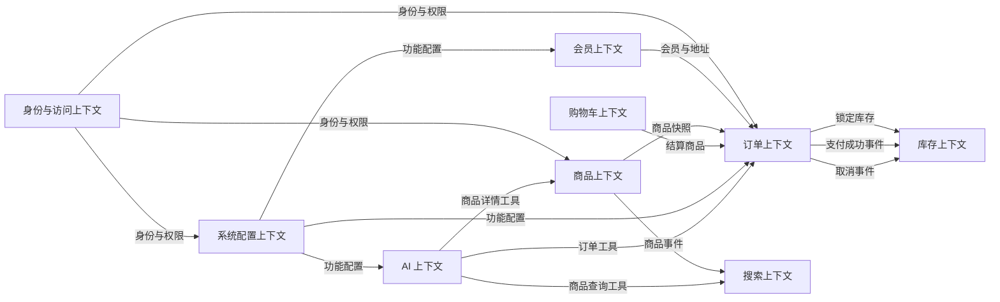

# AI 智能电商微服务平台——子域与限界上下文

## 1. 文档信息

- **项目名称**：AI 智能电商微服务平台
- **英文名称**：AI-Powered E-Commerce Platform
- **项目代号**：AI Mall
- **仓库名称**：`ai-mall-platform`
- **文档名称**：子域与限界上下文
- **文档路径**：`docs/04-子域与限界上下文.md`
- **当前版本**：V0.1
- **文档状态**：初稿
- **关联文档**：
  - `docs/00-项目总览.md`
  - `docs/01-产品需求文档.md`
  - `docs/02-统一语言词汇表.md`
  - `docs/03-领域事件风暴.md`

### 1.1 版本记录

| 版本 | 日期 | 说明 |
|---|---|---|
| V0.1 | 初始版本 | 完成子域分类、限界上下文划分、职责边界、数据归属和服务映射 |

---

## 2. 文档目的

本文档基于项目总览、产品需求、统一语言和领域事件风暴，对 AI 智能电商微服务平台进行战略级 DDD 设计，明确：

1. 项目包含哪些业务子域；
2. 哪些子域属于核心域、支撑域和通用域；
3. 每个限界上下文的边界；
4. 每个上下文负责哪些业务能力；
5. 每个上下文拥有哪些数据；
6. 每个上下文可以向外暴露哪些能力；
7. 不同上下文之间通过同步接口还是异步事件协作；
8. 哪些上下文应映射为独立微服务；
9. 哪些上下文第一版可以合并部署；
10. 哪些模型禁止跨上下文直接共享。

本文档用于指导后续：

- 上下文映射图；
- 聚合与领域模型设计；
- 微服务拆分；
- 数据库划分；
- API 契约；
- 集成事件设计；
- Java 工程结构；
- 团队或个人开发边界。

---

## 3. DDD 战略设计原则

### 3.1 先划分业务边界，再划分技术模块

微服务边界优先来自业务能力和统一语言，而不是根据数据库表、页面菜单或技术组件机械拆分。

错误示例：

```text
按 Controller 数量拆服务
按数据库表数量拆服务
按前端页面数量拆服务
按技术组件拆业务服务
```

推荐做法：

```text
识别业务能力
→ 识别业务规则
→ 识别统一语言
→ 划分限界上下文
→ 决定是否独立部署
```

### 3.2 一个上下文拥有自己的领域模型

同一个业务概念在不同上下文中可以有不同模型。

例如“商品”：

```text
商品上下文：Product 聚合
订单上下文：OrderItem 商品快照
搜索上下文：ProductSearchDocument
AI 上下文：ProductCandidate
```

这些对象名称和字段可以相似，但不能共用同一个领域实体。

### 3.3 数据归属唯一

每类核心业务数据只能有一个权威拥有者。

例如：

- 商品上下文拥有商品真实状态；
- 库存上下文拥有库存真实数量；
- 订单上下文拥有订单真实状态；
- 身份与访问上下文拥有后台角色和权限；
- 系统配置上下文拥有功能开关和系统参数。

其他上下文只能通过：

- API；
- 集成事件；
- 查询投影；
- 快照。

获取所需信息。

### 3.4 服务间不共享数据库

不同限界上下文之间禁止：

- 直接查询对方数据库表；
- 跨服务数据库 JOIN；
- 通过共享 Mapper 访问其他服务数据；
- 建立跨上下文数据库外键；
- 共享可变领域实体。

### 3.5 限界上下文不等于必须独立部署

一个限界上下文是模型和语言边界，不一定立即对应一个独立进程。

第一版可以：

```text
保持代码边界清晰
+
根据复杂度决定部署方式
```

但不允许因为合并部署而混合领域模型。

---

## 4. 业务领域总览

AI 智能电商微服务平台的总体业务领域可分为：

```text
电商交易领域
├── 商品
├── 购物车
├── 订单
├── 库存
├── 退款
└── 履约

平台管理领域
├── 身份认证
├── 管理员
├── 角色与权限
├── 菜单
├── 功能配置
├── 系统参数
└── 操作审计

会员领域
├── 会员账号
├── 个人资料
├── 收货地址
├── 收藏
└── 浏览记录

搜索领域
├── 商品索引
├── 全文检索
├── 筛选
└── 排序

AI 智能应用领域
├── 智能导购
├── 商品对比
├── RAG 智能客服
├── 订单助手
└── AI 会话与工具调用
```

---

## 5. 子域分类

## 5.1 核心域

核心域是项目最值得重点建模、实现和展示的部分。

### 5.1.1 订单子域

订单子域负责：

- 订单预览；
- 订单创建；
- 订单快照；
- 订单状态流转；
- 模拟支付结果；
- 订单取消；
- 超时取消；
- 后台发货；
- 用户确认收货；
- 退款状态关联；
- 订单状态日志。

订单子域属于核心域的原因：

- 业务规则复杂；
- 状态流转严格；
- 与商品、会员、库存、支付、退款均有协作；
- 涉及幂等、事务和最终一致性；
- 是整个交易链路的中心。

### 5.1.2 库存子域

库存子域负责：

- 库存初始化；
- 库存增加；
- 库存调整；
- 可用库存；
- 锁定库存；
- 库存释放；
- 确认扣减；
- 库存流水；
- 幂等控制；
- 库存补偿。

库存子域属于核心域的原因：

- 需要防止超卖；
- 需要维护数量不变量；
- 与订单状态紧密协作；
- 跨服务一致性要求高；
- 是面试中能够体现后端深度的重要模块。

---

## 5.2 支撑域

### 5.2.1 商品子域

商品子域负责：

- SPU；
- SKU；
- 分类；
- 品牌；
- 属性；
- 图片；
- 价格；
- 商品上下架；
- 商品快照。

商品是交易流程的基础，但项目最复杂的业务仍然集中在订单与库存，因此划为支撑域。

### 5.2.2 购物车子域

购物车子域负责：

- 购物车项；
- 商品数量；
- 选择状态；
- 失效状态；
- 游客购物车合并；
- 已结算购物车项清理。

购物车业务规则相对有限，可使用轻量模型实现。

### 5.2.3 会员子域

会员子域负责：

- 商城会员；
- 个人资料；
- 收货地址；
- 默认地址；
- 收藏；
- 浏览记录。

### 5.2.4 退款子域

第一版退款能力较简单，暂归订单上下文管理。

当后续出现以下需求时，可独立为退款上下文：

- 按订单明细退款；
- 部分退款；
- 多次退款；
- 退货入库；
- 逆向物流；
- 真实支付渠道退款；
- 复杂审核流程；
- 售后工单。

### 5.2.5 系统配置子域

系统配置子域负责：

- 功能开关；
- 系统参数；
- 公开配置；
- 内部配置；
- 配置缓存；
- 配置变更记录。

### 5.2.6 AI 业务编排子域

AI 业务编排负责：

- 智能导购；
- 商品对比；
- RAG 智能客服；
- AI 订单助手；
- 工具编排；
- 对话上下文；
- 结构化输出。

AI 功能是项目的差异化支撑能力，但基础交易流程不依赖 AI 才能运行。

---

## 5.3 通用域

### 5.3.1 身份认证与访问控制

负责：

- 商城登录；
- 后台登录；
- JWT；
- Token 刷新；
- 角色；
- 菜单；
- 权限；
- 动态菜单；
- 接口授权。

其中角色、菜单、权限具有一定业务含义，但从整个电商平台竞争力角度属于通用平台能力。

### 5.3.2 搜索

负责：

- Elasticsearch 索引；
- 全文检索；
- 筛选；
- 排序；
- 高亮；
- 搜索建议。

搜索是商品数据的查询投影，不拥有商品真实业务状态。

### 5.3.3 文件存储

负责：

- 商品图片；
- 用户头像；
- 知识文档；
- 文件上传；
- 文件访问。

### 5.3.4 网关

负责：

- 路由；
- 认证前置处理；
- 限流；
- 跨域；
- 请求日志；
- 商城接口和后台接口隔离。

### 5.3.5 操作审计

负责：

- 操作日志；
- 登录日志；
- 关键业务行为记录；
- 审计查询。

第一版可以归入系统上下文，不必单独部署。

---

## 6. 限界上下文总览

项目初步确定以下限界上下文：

| 编号 | 限界上下文 | 英文名称 | 建议服务 |
|---|---|---|---|
| BC-01 | 身份与访问上下文 | Identity and Access Context | `mall-identity` |
| BC-02 | 会员上下文 | Member Context | `mall-member` |
| BC-03 | 商品上下文 | Product Context | `mall-product` |
| BC-04 | 购物车上下文 | Cart Context | `mall-cart` |
| BC-05 | 订单上下文 | Order Context | `mall-order` |
| BC-06 | 库存上下文 | Inventory Context | `mall-inventory` |
| BC-07 | 搜索上下文 | Search Context | `mall-search` |
| BC-08 | 系统配置上下文 | System Configuration Context | `mall-system` |
| BC-09 | AI 上下文 | AI Context | `ai-service` |

辅助技术模块：

```text
mall-gateway
mall-common
mall-contracts
file-storage adapter
message infrastructure
```

这些技术模块不是独立业务上下文。

---

# 7. BC-01 身份与访问上下文

## 7.1 上下文定位

身份与访问上下文负责平台身份认证、后台管理员、角色、菜单和权限管理。

它为：

- 商城端；
- 后台端；
- Java 微服务；
- AI 工具调用。

提供可信身份信息和访问控制。

## 7.2 主要职责

### 商城身份

- 会员登录；
- 访问令牌；
- 刷新令牌；
- 退出登录；
- 账号状态校验。

### 后台身份

- 管理员登录；
- 管理员状态；
- 管理员角色；
- 角色维护；
- 菜单维护；
- 权限编码；
- 动态菜单生成；
- 动态路由数据；
- 接口权限集合；
- 后台登录日志。

## 7.3 核心模型候选

```text
AdminUser
Role
Menu
Account
Credential
AccessToken
RefreshToken
PermissionCode
```

商城会员实体不归此上下文拥有。

身份上下文只认证会员身份，会员详细资料归会员上下文。

## 7.4 拥有的数据

建议数据：

```text
admin_user
sys_role
sys_user_role
sys_menu
sys_role_menu
login_log
refresh_token
```

如果商城账号凭据独立存放，也可以包含：

```text
member_account
```

但会员个人资料不放在此上下文。

## 7.5 对外能力

### 商城接口

```text
POST /api/auth/member/login
POST /api/auth/member/refresh
POST /api/auth/member/logout
```

### 后台接口

```text
POST /api/auth/admin/login
POST /api/auth/admin/refresh
POST /api/auth/admin/logout
GET  /api/admin/current-user
GET  /api/admin/current-user/menus
GET  /api/admin/current-user/permissions
```

### 内部能力

- 验证 Token；
- 获取当前身份；
- 获取管理员权限；
- 获取会员身份；
- 检查账号状态。

## 7.6 发布事件

```text
AdminUserCreatedIntegrationEvent
AdminUserDisabledIntegrationEvent
RolePermissionsChangedIntegrationEvent
AdminSignedInIntegrationEvent
MemberSignedInIntegrationEvent
```

第一版不要求所有登录行为都发布 MQ 事件，登录日志可以本地或异步记录。

## 7.7 消费事件

可消费：

```text
MemberRegisteredIntegrationEvent
```

用于初始化商城登录凭据或账号映射。

## 7.8 上下文边界

身份与访问上下文不负责：

- 会员昵称；
- 会员头像；
- 收货地址；
- 商品数据；
- 订单状态；
- 库存；
- 功能开关。

## 7.9 关键规则

- 商城令牌和后台令牌必须区分；
- 禁用管理员不能登录；
- 禁用角色不能产生有效权限；
- 权限编码唯一；
- 菜单和接口权限不得仅依赖前端；
- Token 中不建议写入长期不变的大量菜单树；
- 权限变更后应通过重新登录、权限版本或缓存失效生效。

---

# 8. BC-02 会员上下文

## 8.1 上下文定位

会员上下文拥有商城用户的业务资料和用户侧数据。

## 8.2 主要职责

- 会员注册；
- 会员基础资料；
- 会员状态；
- 收货地址；
- 默认地址；
- 收藏；
- 浏览记录；
- 会员信息查询。

## 8.3 核心模型候选

```text
Member
MemberProfile
ShippingAddress
Favorite
BrowsingHistory
MemberId
```

## 8.4 拥有的数据

```text
member
member_profile
shipping_address
member_favorite
browsing_history
```

## 8.5 对外能力

### 商城接口

```text
POST   /api/mall/members
GET    /api/mall/members/me
PUT    /api/mall/members/me
GET    /api/mall/shipping-addresses
POST   /api/mall/shipping-addresses
PUT    /api/mall/shipping-addresses/{id}
DELETE /api/mall/shipping-addresses/{id}
POST   /api/mall/shipping-addresses/{id}/set-default
```

### 内部能力

```text
获取会员基础信息
获取收货地址
验证地址归属
获取默认地址
```

## 8.6 发布事件

```text
MemberRegisteredIntegrationEvent
MemberProfileUpdatedIntegrationEvent
ShippingAddressAddedIntegrationEvent
DefaultShippingAddressChangedIntegrationEvent
```

## 8.7 消费事件

第一版可不强制消费外部事件。

后续可消费：

```text
OrderCompletedIntegrationEvent
```

用于会员成长值或消费统计。

## 8.8 上下文边界

会员上下文不负责：

- 订单状态；
- 商品收藏后的商品详情；
- 后台管理员；
- 权限；
- 订单地址快照；
- AI 会话。

订单上下文只保存地址快照，不直接持有会员实体。

## 8.9 关键规则

- 会员只能访问自己的资料；
- 每个会员最多一个默认地址；
- 删除或修改地址不影响历史订单；
- 收藏记录只保存商品标识，不复制商品聚合。

---

# 9. BC-03 商品上下文

## 9.1 上下文定位

商品上下文是平台商品信息的权威来源，负责商品生命周期和可售基础信息。

## 9.2 主要职责

- 商品 SPU；
- SKU；
- 分类；
- 品牌；
- 商品属性；
- 规格属性；
- 商品图片；
- SKU 价格；
- 商品上下架；
- SKU 启用和禁用；
- 商品快照；
- 商品缓存失效通知。

## 9.3 核心模型候选

```text
Product
Sku
Category
Brand
ProductAttribute
Specification
ProductImage
Money
ProductStatus
SkuStatus
```

## 9.4 聚合候选

### Product 聚合

负责：

- 商品基本信息；
- SKU 配置；
- 商品状态；
- 上下架规则。

### Category 聚合

负责：

- 分类层级；
- 分类状态；
- 分类排序。

### Brand 聚合

负责：

- 品牌信息；
- 品牌状态。

是否将 SKU 独立为聚合，将在聚合设计文档中确认。

## 9.5 拥有的数据

```text
product_spu
product_sku
product_category
product_brand
product_attribute
product_attribute_value
product_image
```

## 9.6 对外能力

### 商城接口

```text
GET /api/mall/products
GET /api/mall/products/{id}
GET /api/mall/categories
GET /api/mall/brands
```

### 后台接口

```text
GET  /api/admin/products
POST /api/admin/products
PUT  /api/admin/products/{id}
POST /api/admin/products/{id}/publish
POST /api/admin/products/{id}/unpublish
POST /api/admin/products/{id}/skus
PUT  /api/admin/products/{productId}/skus/{skuId}
```

### 内部能力

```text
获取商品快照
批量获取 SKU 快照
校验商品可售状态
校验 SKU 状态
获取商品搜索投影数据
```

## 9.7 发布事件

```text
ProductCreatedIntegrationEvent
ProductPublishedIntegrationEvent
ProductUnpublishedIntegrationEvent
ProductUpdatedIntegrationEvent
SkuCreatedIntegrationEvent
SkuUpdatedIntegrationEvent
SkuPriceChangedIntegrationEvent
SkuEnabledIntegrationEvent
SkuDisabledIntegrationEvent
```

第一版可只发布对外真正需要的事件：

```text
ProductPublishedIntegrationEvent
ProductUnpublishedIntegrationEvent
ProductUpdatedIntegrationEvent
SkuPriceChangedIntegrationEvent
SkuDisabledIntegrationEvent
```

## 9.8 消费事件

可消费：

```text
InventoryInitializedIntegrationEvent
```

用于后台展示 SKU 是否已初始化库存，但不应将库存数量复制为商品真实数据。

## 9.9 上下文边界

商品上下文不负责：

- 可用库存真实数量；
- 购物车；
- 订单；
- 订单成交价格；
- 历史订单商品信息；
- Elasticsearch 搜索索引；
- AI 推荐结果。

## 9.10 关键规则

- 商品上架必须满足完整性条件；
- SKU 规格组合不能重复；
- 商品和 SKU 状态分开；
- 商品上架不代表一定有库存；
- 商品价格变化不影响已创建订单；
- 商品历史数据通过订单快照保存。

---

# 10. BC-04 购物车上下文

## 10.1 上下文定位

购物车上下文负责用户下单前的临时待购集合。

## 10.2 主要职责

- 加入购物车；
- 修改数量；
- 删除购物车项；
- 选择和取消选择；
- 全选和取消全选；
- 购物车项失效；
- 游客购物车合并；
- 清理已结算购物车项。

## 10.3 核心模型候选

```text
ShoppingCart
CartItem
CartId
CartItemId
PurchaseQuantity
CartItemStatus
```

## 10.4 数据存储

第一版建议：

```text
Redis 为主要存储
```

可选持久化：

```text
cart
cart_item
```

但第一版不强制数据库持久化。

## 10.5 对外能力

### 商城接口

```text
GET    /api/mall/cart
POST   /api/mall/cart/items
PUT    /api/mall/cart/items/{skuId}
DELETE /api/mall/cart/items/{skuId}
POST   /api/mall/cart/items/{skuId}/select
POST   /api/mall/cart/items/{skuId}/unselect
POST   /api/mall/cart/select-all
POST   /api/mall/cart/unselect-all
```

### 内部能力

```text
获取选中购物车项
清理已结算购物车项
合并游客购物车
```

## 10.6 发布事件

第一版可以不对外发布大量购物车事件。

可选事件：

```text
CartMergedIntegrationEvent
CartCheckedOutIntegrationEvent
```

## 10.7 消费事件

第一版可不主动消费商品事件。

购物车详情查询时实时校验：

- 商品状态；
- SKU 状态；
- 当前价格；
- 库存提示。

这种方式避免商品下架时批量更新所有购物车。

## 10.8 上下文边界

购物车上下文不负责：

- 最终成交价格；
- 锁定库存；
- 创建订单；
- 支付；
- 商品真实状态；
- 历史快照。

## 10.9 关键规则

- 加入购物车不锁定库存；
- 相同 SKU 合并数量；
- 购物车金额仅用于展示；
- 下单前必须再次校验；
- 失效购物车项不能结算。

---

# 11. BC-05 订单上下文

## 11.1 上下文定位

订单上下文是交易流程的核心上下文，负责订单生命周期、交易快照和履约状态。

## 11.2 主要职责

- 订单预览编排；
- 创建订单；
- 订单编号；
- 商品快照；
- 地址快照；
- 价格快照；
- 待付款；
- 模拟支付；
- 订单取消；
- 超时取消；
- 待发货；
- 发货；
- 确认收货；
- 订单完成；
- 退款申请；
- 退款状态；
- 订单状态日志；
- 订单查询模型。

## 11.3 核心模型候选

```text
Order
OrderItem
OrderId
OrderNo
BuyerId
OrderStatus
OrderAmount
Money
ProductSnapshot
SkuSnapshot
ShippingAddressSnapshot
PaymentRecord
RefundRequest
OrderStatusHistory
LogisticsInfo
```

## 11.4 聚合候选

### Order 聚合

维护：

- 订单状态；
- 订单明细；
- 订单金额；
- 购买人；
- 地址快照；
- 发货信息；
- 状态流转规则。

### RefundRequest 聚合

第一版可作为订单聚合内部实体或独立聚合。

最终边界在聚合设计文档确认。

## 11.5 拥有的数据

```text
mall_order
order_item
order_payment
order_refund
order_status_history
order_shipping
```

## 11.6 对外能力

### 商城接口

```text
POST /api/mall/orders/preview
POST /api/mall/orders
GET  /api/mall/orders
GET  /api/mall/orders/{id}
POST /api/mall/orders/{id}/pay
POST /api/mall/orders/{id}/cancel
POST /api/mall/orders/{id}/confirm-receipt
POST /api/mall/orders/{id}/refund-requests
```

### 后台接口

```text
GET  /api/admin/orders
GET  /api/admin/orders/{id}
POST /api/admin/orders/{id}/ship
POST /api/admin/refund-requests/{id}/approve
POST /api/admin/refund-requests/{id}/reject
```

### 内部能力

```text
按会员查询订单
获取订单详情
获取订单状态
AI 查询订单
订单超时检查
```

## 11.7 同步依赖

订单上下文同步调用：

### 商品上下文

- 获取商品快照；
- 获取 SKU 快照；
- 校验商品和 SKU 可售状态；
- 获取实时价格。

### 会员上下文

- 获取收货地址；
- 校验地址归属。

### 库存上下文

- 锁定库存；
- 创建失败时释放库存；
- 查询锁定结果。

## 11.8 发布事件

```text
OrderCreatedIntegrationEvent
PaymentSucceededIntegrationEvent
OrderCancelledIntegrationEvent
OrderShippedIntegrationEvent
OrderCompletedIntegrationEvent
RefundRequestedIntegrationEvent
RefundApprovedIntegrationEvent
RefundRejectedIntegrationEvent
RefundCompletedIntegrationEvent
```

第一版核心事件：

```text
OrderCreatedIntegrationEvent
PaymentSucceededIntegrationEvent
OrderCancelledIntegrationEvent
OrderCompletedIntegrationEvent
```

## 11.9 消费事件

可消费：

```text
InventoryReservationFailedIntegrationEvent
InventoryDeductionFailedIntegrationEvent
```

第一版若锁定库存使用同步调用，则不必消费库存锁定结果事件。

## 11.10 上下文边界

订单上下文不负责：

- 修改商品；
- 管理商品价格；
- 管理库存数值；
- 管理会员地址；
- 管理搜索索引；
- 直接操作购物车存储；
- AI 推理。

## 11.11 关键规则

- 待付款订单才能支付；
- 待付款订单才能主动取消；
- 待发货订单才能发货；
- 已发货订单才能确认收货；
- 订单快照创建后不可被商品变更覆盖；
- 订单金额由服务端计算；
- 用户只能访问自己的订单；
- 重复提交、支付、取消和发货必须幂等；
- 状态变化必须通过聚合行为完成。

---

# 12. BC-06 库存上下文

## 12.1 上下文定位

库存上下文是交易核心上下文，负责 SKU 库存数量和库存业务记录。

## 12.2 主要职责

- 初始化库存；
- 增加库存；
- 减少可用库存；
- 调整库存；
- 查询库存；
- 锁定库存；
- 释放库存；
- 确认扣减；
- 库存流水；
- 低库存预警；
- 幂等记录；
- 库存补偿。

## 12.3 核心模型候选

```text
Inventory
InventoryId
SkuId
InventoryReservation
InventoryTransaction
Quantity
InventoryStatus
InventoryBusinessNo
```

## 12.4 聚合候选

### Inventory 聚合

每个 SKU 对应一个库存聚合，维护：

- 总库存；
- 可用库存；
- 锁定库存；
- 已售数量；
- 库存版本。

### InventoryReservation

库存锁定记录可作为：

- Inventory 聚合内部实体；
- 独立持久化记录。

最终在聚合设计中确认。

## 12.5 拥有的数据

```text
inventory_stock
inventory_reservation
inventory_transaction
inventory_compensation_task
```

## 12.6 对外能力

### 后台接口

```text
GET  /api/admin/inventories
GET  /api/admin/inventories/{skuId}
POST /api/admin/inventories/{skuId}/increase
POST /api/admin/inventories/{skuId}/decrease
POST /api/admin/inventories/{skuId}/adjust
GET  /api/admin/inventory-transactions
```

### 内部接口

```text
POST /api/internal/inventories/reserve
POST /api/internal/inventories/release
POST /api/internal/inventories/confirm-deduction
GET  /api/internal/inventories/{skuId}/availability
```

## 12.7 发布事件

```text
InventoryInitializedIntegrationEvent
InventoryReservedIntegrationEvent
InventoryReleasedIntegrationEvent
InventoryDeductedIntegrationEvent
LowStockDetectedIntegrationEvent
InventoryCompensationFailedIntegrationEvent
```

第一版跨服务事件可精简为：

```text
InventoryInitializedIntegrationEvent
LowStockDetectedIntegrationEvent
```

锁定、释放、确认扣减结果若同步返回，可只保留领域事件。

## 12.8 消费事件

```text
PaymentSucceededIntegrationEvent
OrderCancelledIntegrationEvent
```

可用于异步确认扣减和释放库存。

第一版可采用：

```text
创建订单时同步锁定库存
支付成功后异步确认扣减
订单取消后异步释放库存
```

## 12.9 上下文边界

库存上下文不负责：

- 商品上下架；
- 商品价格；
- 订单状态；
- 支付结果真实性；
- 后台角色权限；
- 搜索。

## 12.10 关键规则

- 可用库存不能小于零；
- 锁定库存不能小于零；
- 同一业务号不能重复锁定；
- 已释放锁定不能再次释放；
- 已确认扣减不能再次扣减；
- 确认扣减必须基于有效锁定；
- 后台不能直接修改锁定库存；
- 所有变更产生库存流水。

---

# 13. BC-07 搜索上下文

## 13.1 上下文定位

搜索上下文是商品数据的查询投影，负责高性能商品检索。

## 13.2 主要职责

- 商品搜索文档；
- 商品索引创建；
- 商品索引更新；
- 商品索引删除；
- 全文检索；
- 分类筛选；
- 品牌筛选；
- 价格筛选；
- 排序；
- 高亮；
- 搜索建议；
- 索引重建。

## 13.3 核心模型候选

搜索上下文不强调富领域模型，主要使用：

```text
ProductSearchDocument
SearchCriteria
SearchResult
SearchSort
SearchHighlight
```

## 13.4 拥有的数据

```text
Elasticsearch 商品索引
搜索建议数据
索引同步记录
```

搜索上下文不拥有 MySQL 商品真实数据。

## 13.5 对外能力

```text
GET  /api/mall/search/products
GET  /api/mall/search/suggestions
POST /api/admin/search/rebuild-index
GET  /api/admin/search/index-status
```

内部能力：

```text
创建商品搜索文档
更新商品搜索文档
删除商品搜索文档
```

## 13.6 消费事件

```text
ProductPublishedIntegrationEvent
ProductUnpublishedIntegrationEvent
ProductUpdatedIntegrationEvent
SkuPriceChangedIntegrationEvent
SkuDisabledIntegrationEvent
```

## 13.7 发布事件

可选：

```text
ProductIndexUpdatedIntegrationEvent
ProductIndexUpdateFailedIntegrationEvent
ProductIndexRebuiltIntegrationEvent
```

第一版索引失败可以记录内部日志和补偿任务，不必对外发布大量事件。

## 13.8 上下文边界

搜索上下文不负责：

- 商品真实状态；
- 商品管理；
- 库存扣减；
- 订单；
- 最终购买校验；
- AI 最终推荐逻辑。

## 13.9 关键规则

- 搜索结果允许短暂延迟；
- 购买前必须查询商品和库存真实状态；
- 索引同步失败不能回滚商品上架；
- 索引需要重试和重建能力；
- 搜索文档是可重建投影。

---

# 14. BC-08 系统配置上下文

## 14.1 上下文定位

系统配置上下文负责业务功能开关、系统参数和后台操作审计。

## 14.2 主要职责

- 功能配置；
- 功能开关；
- 系统参数；
- 参数类型；
- 参数默认值；
- 公开配置；
- 内部配置；
- 配置缓存；
- 配置缓存失效；
- 操作日志；
- 登录日志查询。

## 14.3 核心模型候选

```text
FeatureConfig
SystemParameter
ConfigKey
ConfigValue
ConfigGroup
OperationLog
```

## 14.4 拥有的数据

```text
feature_config
system_parameter
operation_log
login_log
```

登录日志也可由身份上下文写入，系统上下文提供统一查询。

## 14.5 对外能力

### 商城接口

```text
GET /api/mall/public-features
GET /api/mall/public-configs
```

### 后台接口

```text
GET /api/admin/feature-configs
PUT /api/admin/feature-configs/{key}
GET /api/admin/system-parameters
PUT /api/admin/system-parameters/{key}
GET /api/admin/operation-logs
GET /api/admin/login-logs
```

### 内部能力

```text
检查功能是否启用
获取系统参数
清理配置缓存
记录操作日志
```

## 14.6 发布事件

```text
FeatureConfigChangedIntegrationEvent
SystemParameterChangedIntegrationEvent
```

## 14.7 消费事件

可消费各后台关键业务事件，用于操作审计。

第一版操作日志更适合使用 AOP 或异步日志消息，不一定消费所有领域事件。

## 14.8 上下文边界

系统配置上下文不负责：

- Nacos 技术配置；
- 商品状态；
- 订单状态；
- 角色权限；
- AI 推理；
- 业务数据本身。

业务功能配置和 Nacos 技术配置必须区分：

```text
业务功能开关 → mall-system
技术运行配置 → Nacos
```

## 14.9 关键规则

- 配置键唯一；
- 参数值必须校验类型；
- 功能关闭后前端入口和后端接口同时失效；
- 配置变更后主动清理 Redis 缓存；
- 关键配置变更记录操作日志；
- 已创建订单使用创建时确定的支付截止时间，不受后续参数变化影响。

---

# 15. BC-09 AI 上下文

## 15.1 上下文定位

AI 上下文负责基于大模型、RAG 和 Agent 的智能能力。

AI 上下文不拥有电商交易真实数据，而是通过受控工具访问 Java 业务上下文。

## 15.2 主要职责

- AI 导购会话；
- 用户意图识别；
- 购买条件提取；
- 商品搜索工具调用；
- 商品推荐；
- 商品对比；
- RAG 智能客服；
- 知识库；
- 文档解析；
- 文档分块；
- 向量索引；
- AI 订单查询；
- AI 订单写操作确认；
- 工具调用日志；
- 结构化输出；
- AI 降级。

## 15.3 核心模型候选

```text
Conversation
Message
ShoppingIntent
ShoppingCriteria
ProductCandidate
ProductRecommendation
ProductComparison
KnowledgeBase
KnowledgeDocument
DocumentChunk
Citation
ToolCall
AgentExecution
```

## 15.4 拥有的数据

```text
ai_conversation
ai_message
ai_tool_call
ai_knowledge_base
ai_document
ai_document_chunk
ai_prompt
ai_prompt_version
```

向量数据存放于向量数据库。

知识原始文档存放于 MinIO。

## 15.5 对外能力

### 经 Java 网关暴露的接口

```text
POST /api/ai/shopping-assistant/chat
POST /api/ai/product-comparisons
POST /api/ai/customer-service/chat
POST /api/ai/order-assistant/chat
```

### 后台接口

```text
GET    /api/admin/ai/knowledge-bases
POST   /api/admin/ai/knowledge-bases
POST   /api/admin/ai/knowledge-bases/{id}/documents
DELETE /api/admin/ai/documents/{id}
POST   /api/admin/ai/documents/{id}/reindex
GET    /api/admin/ai/conversations
GET    /api/admin/ai/tool-calls
```

## 15.6 依赖的 Java 内部能力

### 商品或搜索上下文

```text
search_products
get_product_detail
compare_products
```

### 订单上下文

```text
list_orders
get_order_detail
get_shipping_status
get_refund_status
cancel_order
apply_refund
```

### 系统配置上下文

```text
检查 AI 功能是否启用
获取最大对话轮数
获取文件大小限制
```

## 15.7 发布事件

```text
AiConversationCreatedIntegrationEvent
AiRecommendationGeneratedIntegrationEvent
AiToolCallFailedIntegrationEvent
KnowledgeDocumentIndexedIntegrationEvent
KnowledgeDocumentIndexFailedIntegrationEvent
```

第一版可以内部记录，不强制全部发布 MQ。

## 15.8 消费事件

可消费：

```text
ProductPublishedIntegrationEvent
ProductUpdatedIntegrationEvent
ProductUnpublishedIntegrationEvent
```

仅当 AI 构建独立商品向量索引时需要。

第一版 AI 导购直接调用商品搜索接口，不必维护重复商品库。

## 15.9 上下文边界

AI 上下文不负责：

- 直接修改订单数据库；
- 直接修改库存；
- 直接判断最终订单状态；
- 直接管理商品；
- 直接绕过权限；
- 生成不存在的真实商品；
- 定义平台退款政策。

## 15.10 关键规则

- AI 不直接访问业务数据库；
- AI 工具必须通过 Java 内部接口；
- 推荐商品必须真实存在；
- 订单查询必须校验当前会员；
- 写操作必须二次确认；
- AI 服务失败不能影响基础交易；
- RAG 回答应提供引用；
- 结构化输出需要 Schema 校验。

---

# 16. 上下文与微服务映射

## 16.1 推荐最终映射

| 限界上下文 | 部署服务 | 是否独立部署 |
|---|---|---|
| 身份与访问 | `mall-identity` | 是 |
| 会员 | `mall-member` | 是 |
| 商品 | `mall-product` | 是 |
| 购物车 | `mall-cart` | 是 |
| 订单 | `mall-order` | 是 |
| 库存 | `mall-inventory` | 是 |
| 搜索 | `mall-search` | 是 |
| 系统配置 | `mall-system` | 是 |
| AI | `ai-service` | 是，Python |

基础技术服务：

```text
mall-gateway
```

公共契约与基础库：

```text
mall-common
mall-contracts
```

## 16.2 第一版简化部署方案

考虑个人项目开发成本，第一版可以采用：

```text
mall-identity
mall-member
mall-product
mall-cart
mall-order
mall-inventory
mall-search
mall-system
ai-service
```

仍然保持独立服务。

如开发资源不足，可临时合并：

```text
mall-identity + mall-system
```

但必须保持包结构和模型边界：

```text
identity context
system context
```

不建议合并：

```text
mall-order + mall-inventory
```

因为订单和库存的边界正是项目展示微服务和最终一致性的核心。

## 16.3 不建议的拆分

第一版不建议独立拆出：

```text
mall-payment
mall-refund
mall-file
mall-notification
mall-audit
mall-recommendation
mall-logistics
```

原因：

- 业务复杂度尚不足；
- 会增加部署和通信成本；
- 容易形成空壳微服务；
- 不利于从零完成核心闭环。

---

# 17. 数据归属矩阵

| 数据 | 权威上下文 | 其他上下文使用方式 |
|---|---|---|
| 后台管理员 | 身份与访问 | Token 或内部查询 |
| 角色 | 身份与访问 | 权限校验 |
| 菜单 | 身份与访问 | 动态菜单 API |
| 会员资料 | 会员 | 内部 API |
| 收货地址 | 会员 | 创建订单时转为地址快照 |
| 商品 SPU | 商品 | API、事件、搜索投影 |
| 商品 SKU | 商品 | API、快照 |
| 商品价格 | 商品 | 下单时读取并保存快照 |
| 商品搜索文档 | 搜索 | 可重建查询投影 |
| 购物车 | 购物车 | 订单预览时读取 |
| 订单 | 订单 | API、事件 |
| 订单商品快照 | 订单 | 订单查询 |
| 订单地址快照 | 订单 | 订单查询 |
| 库存 | 库存 | 内部 API |
| 库存锁定记录 | 库存 | 内部 API、补偿 |
| 功能配置 | 系统配置 | API、缓存 |
| 系统参数 | 系统配置 | API、缓存 |
| AI 会话 | AI | 后台查询 API |
| AI 知识文档 | AI | 对象存储与向量库 |
| 操作日志 | 系统配置/审计 | 后台查询 |

---

# 18. 跨上下文交互矩阵

| 调用方 | 被调用方 | 场景 | 方式 |
|---|---|---|---|
| 订单 | 商品 | 获取商品和 SKU 快照 | 同步 API |
| 订单 | 会员 | 获取并校验收货地址 | 同步 API |
| 订单 | 库存 | 锁定库存 | 同步 API |
| 订单 | 库存 | 创建失败后释放库存 | 同步补偿 |
| 订单 | 购物车 | 清理已结算购物车项 | 同步或异步 |
| 商品 | 搜索 | 同步商品索引 | 集成事件 |
| 订单 | 库存 | 支付后确认扣减 | 集成事件 |
| 订单 | 库存 | 取消后释放库存 | 集成事件 |
| 身份 | 系统 | 记录登录日志 | 异步 |
| 各后台服务 | 系统 | 记录操作日志 | 异步 |
| AI | 搜索 | 搜索真实商品 | 同步 API |
| AI | 商品 | 获取商品详情 | 同步 API |
| AI | 订单 | 查询订单 | 同步 API |
| AI | 订单 | 取消订单或申请退款 | 同步 API |
| 商城 | 系统 | 获取公开功能配置 | 同步 API |
| 各服务 | 系统 | 检查功能开关或参数 | 缓存/API |

---

# 19. 关键上下文协作流程

## 19.1 商品发布

```text
商品上下文
→ 商品已上架
→ ProductPublishedIntegrationEvent
→ 搜索上下文
→ 更新商品搜索文档
```

商品上下文是上游，搜索上下文是下游。

搜索上下文接受商品事件，但使用自己的搜索模型。

## 19.2 创建订单

```text
订单上下文
→ 调用商品上下文获取商品快照
→ 调用会员上下文获取地址
→ 调用库存上下文锁定库存
→ 创建订单
→ 清理购物车
```

订单上下文负责用例编排。

商品、会员和库存不需要知道完整订单模型。

## 19.3 支付成功

```text
订单上下文
→ 订单支付成功
→ PaymentSucceededIntegrationEvent
→ 库存上下文
→ 确认扣减库存
```

库存上下文不信任外部直接传入的库存数值，只按已有锁定记录处理。

## 19.4 订单取消

```text
订单上下文
→ 订单已取消
→ OrderCancelledIntegrationEvent
→ 库存上下文
→ 释放锁定库存
```

## 19.5 AI 导购

```text
AI 上下文
→ 解析购买需求
→ 调用搜索上下文
→ 获取真实商品候选
→ 调用商品上下文补充详情
→ 生成推荐结果
```

AI 上下文只编排和解释，不拥有商品真实状态。

---

# 20. 上游与下游关系初步判断

## 20.1 商品与搜索

```text
商品上下文：上游
搜索上下文：下游
```

关系类型：

```text
发布语言 + 事件订阅
```

搜索上下文使用防腐层将商品事件转换为搜索文档。

## 20.2 订单与库存

业务上双方关系紧密，但数据权威独立。

创建订单时：

```text
订单上下文：调用方
库存上下文：能力提供方
```

支付和取消时：

```text
订单上下文：事件发布方
库存上下文：事件消费方
```

不允许订单上下文直接修改库存模型。

## 20.3 订单与商品

```text
商品上下文：商品信息上游
订单上下文：快照消费方
```

订单使用防腐层将商品快照转为订单明细。

## 20.4 订单与会员

```text
会员上下文：会员和地址上游
订单上下文：地址快照消费方
```

## 20.5 AI 与业务上下文

```text
Java 业务上下文：权威数据上游
AI 上下文：受控数据消费者和业务编排方
```

AI 不定义核心交易规则。

---

# 21. 防腐层设计要求

每个上下文调用其他上下文时，需要在本上下文内部提供适配层。

## 21.1 订单调用商品

订单上下文内部：

```text
ProductSnapshotGateway
ProductSnapshotClient
ProductSnapshotTranslator
```

外部返回对象：

```text
ProductSnapshotResponse
```

转换为订单内部对象：

```text
OrderProductSnapshot
OrderSkuSnapshot
```

订单领域层不直接依赖商品服务 DTO。

## 21.2 订单调用会员

```text
MemberAddressGateway
MemberAddressClient
ShippingAddressTranslator
```

转换为：

```text
ShippingAddressSnapshot
```

## 21.3 订单调用库存

```text
InventoryReservationGateway
InventoryClient
InventoryReservationResult
```

## 21.4 AI 调用订单

```text
OrderTool
OrderApiClient
OrderToolResult
```

AI 不直接使用订单数据库模型或 Java 领域对象。

---

# 22. 共享内核边界

本项目尽量避免共享业务内核。

允许共享：

```text
技术基础类型
统一响应结构
错误码基础接口
分页对象
TraceId
事件元数据
基础安全上下文
```

不允许共享：

```text
Product
Order
Inventory
Member
Role
Menu
RefundRequest
```

这些属于各自上下文的领域模型。

## 22.1 mall-common

可以包含：

```text
统一异常基类
统一返回结果
分页结构
日志上下文
JWT 基础工具
Redis 基础封装
MQ 基础配置
Feign 基础配置
```

不得包含：

```text
OrderStatus 业务规则
Product 实体
Inventory 实体
跨领域 Service
```

## 22.2 mall-contracts

用于共享稳定的集成契约：

```text
API 契约 DTO
集成事件结构
事件版本
内部接口协议
```

不得将领域对象作为契约。

---

# 23. 数据库与 Schema 规划

建议一个 MySQL 实例下按上下文划分数据库或 Schema：

```text
mall_identity_db
mall_member_db
mall_product_db
mall_order_db
mall_inventory_db
mall_system_db
```

搜索数据：

```text
Elasticsearch
```

购物车：

```text
Redis
```

AI 数据：

```text
ai_db
向量数据库
MinIO
```

## 23.1 数据访问规则

- 一个服务只访问自己的数据库；
- 不跨库 JOIN；
- 不建立跨上下文外键；
- 外部 ID 只作为普通值保存；
- 查询需要的数据通过 API、事件投影或快照获得。

## 23.2 第一版开发环境

为了简化本地部署，可使用一个 MySQL 实例。

但逻辑上仍然划分：

```text
不同数据库
或
不同 Schema
或
严格不同表前缀和数据访问模块
```

推荐使用独立数据库，边界更清晰。

---

# 24. 接口前缀与上下文归属

## 24.1 身份与访问

```text
/api/auth/**
/api/admin/admin-users/**
/api/admin/roles/**
/api/admin/menus/**
```

## 24.2 会员

```text
/api/mall/members/**
/api/mall/shipping-addresses/**
```

## 24.3 商品

```text
/api/mall/products/**
/api/admin/products/**
/api/admin/categories/**
/api/admin/brands/**
```

## 24.4 购物车

```text
/api/mall/cart/**
```

## 24.5 订单

```text
/api/mall/orders/**
/api/admin/orders/**
/api/admin/refund-requests/**
```

## 24.6 库存

```text
/api/admin/inventories/**
/api/internal/inventories/**
```

## 24.7 搜索

```text
/api/mall/search/**
/api/admin/search/**
```

## 24.8 系统配置

```text
/api/mall/public-features
/api/admin/feature-configs/**
/api/admin/system-parameters/**
/api/admin/operation-logs/**
```

## 24.9 AI

```text
/api/ai/**
/api/admin/ai/**
```

---

# 25. 部署单元建议

## 25.1 后端工程结构

```text
backend
├── pom.xml
├── mall-common
├── mall-contracts
├── mall-gateway
└── mall-services
    ├── mall-identity
    ├── mall-member
    ├── mall-product
    ├── mall-cart
    ├── mall-order
    ├── mall-inventory
    ├── mall-search
    └── mall-system
```

Python：

```text
ai-service
```

## 25.2 每个业务服务内部

```text
interfaces
application
domain
infrastructure
```

示例：

```text
mall-order
└── src/main/java/com/aimall/order
    ├── interfaces
    ├── application
    ├── domain
    └── infrastructure
```

---

# 26. 第一版优先级

## 26.1 第一阶段必须独立实现

```text
mall-identity
mall-product
mall-order
mall-inventory
mall-system
```

原因：

- 权限是后台基础；
- 商品是交易基础；
- 订单和库存是核心；
- 系统配置支撑动态功能。

## 26.2 可快速实现

```text
mall-member
mall-cart
mall-search
```

其中搜索可以先使用 MySQL 查询，再切换 Elasticsearch。

## 26.3 后接入

```text
ai-service
```

AI 必须建立在真实商品、订单和知识库接口完成之后。

---

# 27. 上下文边界检查清单

每个上下文设计时需要检查：

- 是否拥有明确统一语言；
- 是否有唯一数据权威；
- 是否包含互相冲突的模型；
- 是否依赖其他上下文数据库；
- 是否将外部 DTO 直接传入领域层；
- 是否共享了不应共享的实体；
- 是否清楚发布和消费哪些事件；
- 是否明确同步和异步交互；
- 是否存在循环依赖；
- 是否可以独立测试；
- 是否可以独立演化；
- 是否存在过度拆分。

---

# 28. 当前存在的边界争议

## 28.1 身份与访问与系统配置是否合并

### 方案 A：独立服务

```text
mall-identity
mall-system
```

优点：

- 边界清晰；
- 权限与配置独立演化；
- 更符合 DDD。

缺点：

- 服务数量增加；
- 个人项目开发成本更高。

### 方案 B：合并部署，保留上下文

```text
mall-system-service
├── identity
└── configuration
```

优点：

- 开发和部署更简单；
- 适合第一版。

缺点：

- 容易混合模型。

### 当前建议

第一版仍使用两个逻辑上下文。

部署上可以先独立，也可以暂时合并，但代码中必须完全分包。

---

## 28.2 退款是否独立上下文

当前建议：

```text
退款作为订单上下文的一部分
```

当退款复杂度提高后再拆分。

---

## 28.3 支付是否独立上下文

当前第一版只有模拟支付，因此：

```text
支付记录归订单上下文
```

后续接入真实支付后，可拆分：

```text
Payment Context
mall-payment
```

---

## 28.4 文件存储是否独立服务

当前建议：

```text
MinIO 作为基础设施
各业务服务通过统一文件适配器使用
```

第一版不单独建立 `mall-file` 微服务。

---

## 28.5 操作日志是否独立服务

当前建议：

```text
操作日志归 mall-system
```

后期数据量增大后可拆分审计服务。

---

# 29. 禁止的架构做法

项目中禁止出现以下情况：

## 29.1 订单服务直接查询商品数据库

错误：

```text
mall-order
→ product_spu 表
```

正确：

```text
mall-order
→ 商品内部 API
→ 商品快照
```

## 29.2 订单服务直接修改库存表

错误：

```text
mall-order
→ UPDATE inventory_stock
```

正确：

```text
mall-order
→ 库存内部 API 或事件
→ Inventory 聚合
```

## 29.3 AI 服务直接访问业务库

错误：

```text
ai-service
→ mall_order 表
```

正确：

```text
ai-service
→ Java 订单内部 API
```

## 29.4 多服务共享 Product 实体

错误：

```text
mall-common 中定义 Product
所有服务直接依赖
```

正确：

```text
商品上下文：Product
订单上下文：OrderItemSnapshot
搜索上下文：ProductSearchDocument
AI 上下文：ProductCandidate
```

## 29.5 通过数据库外键连接不同上下文

错误：

```text
mall_order.product_id
外键指向 mall_product_db.product_spu
```

正确：

```text
只保存 product_id 值
不建立跨上下文外键
```

---

# 30. 核心上下文边界图



---

# 31. 限界上下文结论

当前版本确定：

```text
身份与访问上下文
会员上下文
商品上下文
购物车上下文
订单上下文
库存上下文
搜索上下文
系统配置上下文
AI 上下文
```

核心结论：

1. 订单与库存是核心域，必须重点建模；
2. 商品是商品真实信息权威来源；
3. 库存是库存数量权威来源；
4. 订单通过快照保存成交信息；
5. 搜索是可重建查询投影；
6. AI 不拥有交易真实数据；
7. 权限和系统配置不与商品、订单领域模型混合；
8. 每个上下文拥有自己的数据库或逻辑数据边界；
9. 服务间通过 API 和事件通信；
10. 不共享领域实体，不跨服务访问数据库。

---

# 32. 下一步文档

下一份文档为：

```text
docs/05-上下文映射图.md
```

下一份文档需要进一步明确：

1. 各上下文的上游和下游关系；
2. Customer/Supplier 关系；
3. Conformist 关系；
4. Anti-Corruption Layer；
5. Open Host Service；
6. Published Language；
7. Shared Kernel 的限制；
8. 每条同步调用链；
9. 每条异步事件链；
10. 循环依赖检查；
11. 服务失败和降级策略；
12. 上下文映射图。

本文档作为 V0.1 战略边界基线。后续聚合设计、API 设计或微服务拆分发生变化时，应同步更新本文档。
