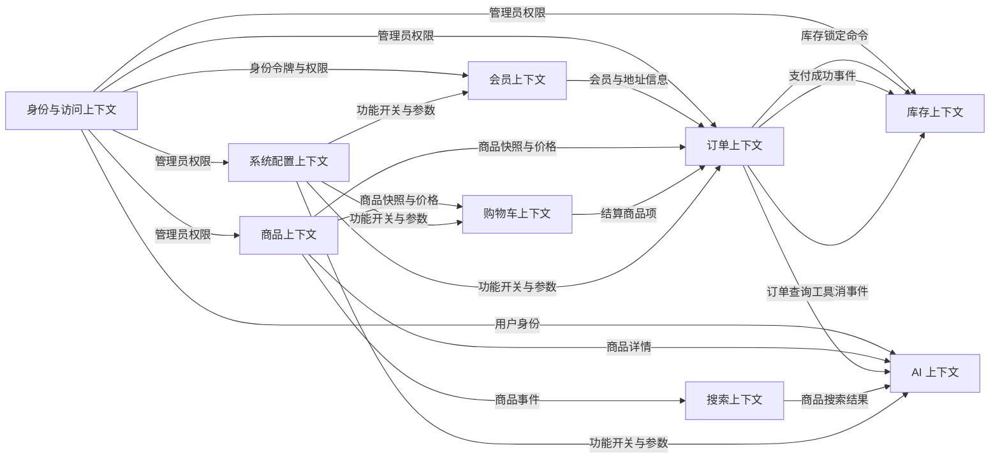
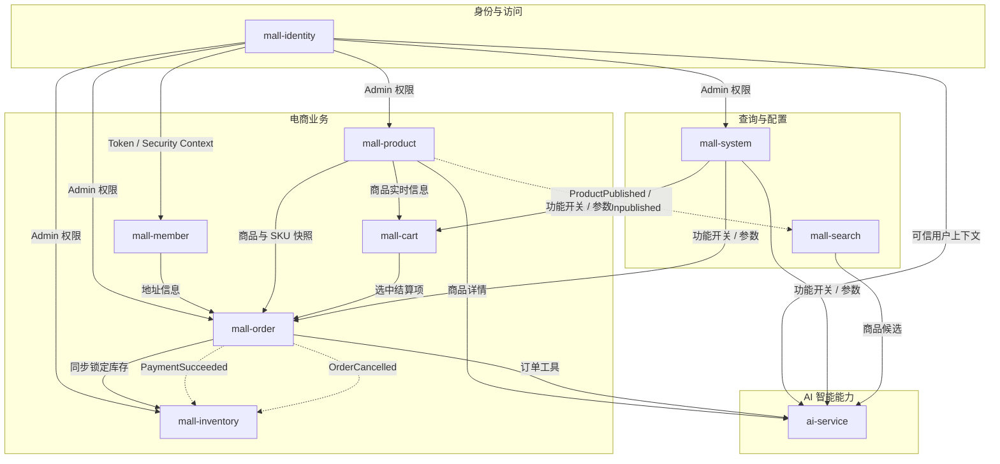

# AI 智能电商微服务平台——上下文映射图

## 1. 文档信息

- **项目名称**：AI 智能电商微服务平台
- **英文名称**：AI-Powered E-Commerce Platform
- **项目代号**：AI Mall
- **仓库名称**：`ai-mall-platform`
- **文档名称**：上下文映射图
- **文档路径**：`docs/05-上下文映射图.md`
- **当前版本**：V0.1
- **文档状态**：初稿
- **关联文档**：
  - `docs/00-项目总览.md`
  - `docs/01-产品需求文档.md`
  - `docs/02-统一语言词汇表.md`
  - `docs/03-领域事件风暴.md`
  - `docs/04-子域与限界上下文.md`

### 1.1 版本记录

| 版本 | 日期 | 说明 |
|---|---|---|
| V0.1 | 初始版本 | 明确上下文关系、上下游方向、集成模式、同步调用、异步事件和故障处理原则 |

---

## 2. 文档目的

本文档用于描述 AI 智能电商微服务平台各限界上下文之间的关系，并明确：

1. 哪个上下文是上游，哪个上下文是下游；
2. 哪个上下文拥有业务规则和数据解释权；
3. 上下文之间采用何种 DDD 集成模式；
4. 哪些交互通过同步 API 完成；
5. 哪些交互通过异步事件完成；
6. 哪些交互必须设置防腐层；
7. 哪些上下文可以接受上游模型；
8. 哪些上下文不能共享领域模型；
9. 服务失败时如何降级和补偿；
10. 如何避免循环依赖；
11. 如何管理接口契约和事件版本；
12. 第一版开发时优先实现哪些映射关系。

本文档属于 DDD 战略设计文档，不展开具体聚合字段、数据库字段和 Java 类实现。

---

## 3. 上下文清单

当前确定的限界上下文如下：

| 编号 | 限界上下文 | 英文名称 | 服务名称 |
|---|---|---|---|
| BC-01 | 身份与访问上下文 | Identity and Access Context | `mall-identity` |
| BC-02 | 会员上下文 | Member Context | `mall-member` |
| BC-03 | 商品上下文 | Product Context | `mall-product` |
| BC-04 | 购物车上下文 | Cart Context | `mall-cart` |
| BC-05 | 订单上下文 | Order Context | `mall-order` |
| BC-06 | 库存上下文 | Inventory Context | `mall-inventory` |
| BC-07 | 搜索上下文 | Search Context | `mall-search` |
| BC-08 | 系统配置上下文 | System Configuration Context | `mall-system` |
| BC-09 | AI 上下文 | AI Context | `ai-service` |

技术基础设施：

```text
mall-gateway
mall-common
mall-contracts
Nacos
Redis
RocketMQ
Elasticsearch
MinIO
Nginx
```

技术基础设施不作为独立业务限界上下文。

---

## 4. DDD 上下文映射关系说明

本文档使用以下上下文关系模式。

### 4.1 Customer / Supplier

上游上下文为 Supplier，下游上下文为 Customer。

含义：

- 上游提供能力或数据；
- 下游依赖上游；
- 下游需求可能影响上游接口；
- 双方需要协商契约。

示例：

```text
商品上下文 Supplier
订单上下文 Customer
```

订单上下文需要商品快照，因此商品上下文提供内部商品快照接口。

### 4.2 Conformist

下游接受上游模型和语言，不进行复杂转换。

适用于：

- 上游模型稳定；
- 语义简单；
- 下游没有必要建立独立领域模型。

本项目谨慎使用 Conformist，核心业务之间优先使用防腐层。

### 4.3 Anti-Corruption Layer

下游通过防腐层将上游模型转换为自己的模型。

适用于：

- 两个上下文的业务语言不同；
- 下游不能直接依赖上游 DTO；
- 下游需要保护自己的领域模型；
- 外部系统模型可能变化。

例如：

```text
商品服务返回 ProductSnapshotResponse
订单上下文转换为 OrderProductSnapshot
```

### 4.4 Open Host Service

上游通过稳定的服务接口向多个下游提供能力。

例如：

```text
商品上下文提供内部商品快照 API
订单上下文和 AI 上下文均可调用
```

### 4.5 Published Language

上游和下游约定稳定的公开语言。

本项目中包括：

- 内部 API 请求和响应 DTO；
- RocketMQ 集成事件；
- 权限编码；
- 功能配置键；
- 统一事件元数据。

Published Language 放在：

```text
mall-contracts
```

但领域实体不放入 `mall-contracts`。

### 4.6 Separate Ways

两个上下文无直接依赖，各自独立实现。

例如：

- 购物车与系统权限之间没有直接业务模型关系；
- 搜索上下文与后台角色之间不直接通信；
- AI 知识库与库存上下文之间没有直接依赖。

### 4.7 Shared Kernel

多个上下文共享极少量稳定内核。

本项目严格限制 Shared Kernel，只允许共享技术基础：

- 统一响应；
- TraceId；
- 分页结构；
- 事件元数据；
- 安全上下文接口；
- 基础错误码协议。

禁止共享：

```text
Product
Order
Inventory
Member
Role
Menu
RefundRequest
```

---

## 5. 总体上下文映射图



---

## 6. 总体关系矩阵

| 上游上下文 | 下游上下文 | 关系模式 | 主要数据或能力 | 主要通信方式 |
|---|---|---|---|---|
| 身份与访问 | 会员 | OHS + Published Language | 当前用户身份 | Token / 内部身份上下文 |
| 身份与访问 | 商品 | OHS + Published Language | 管理员身份与权限 | Gateway + Spring Security |
| 身份与访问 | 订单 | OHS + Published Language | 会员身份、管理员权限 | Gateway + Security Context |
| 身份与访问 | 库存 | OHS + Published Language | 管理员权限 | Gateway + Security Context |
| 身份与访问 | 系统配置 | OHS + Published Language | 管理员权限 | Gateway + Security Context |
| 身份与访问 | AI | OHS + ACL | 会员身份与权限 | Java 转发可信身份 |
| 会员 | 订单 | Customer/Supplier + ACL | 收货地址和会员状态 | 同步内部 API |
| 商品 | 购物车 | Customer/Supplier + ACL | 商品和 SKU 状态、实时价格 | 同步内部 API |
| 商品 | 订单 | Customer/Supplier + ACL | 商品快照、SKU 快照、实时价格 | 同步内部 API |
| 商品 | 搜索 | Supplier/Customer + Published Language | 商品上架、下架、更新事件 | RocketMQ |
| 商品 | AI | OHS + ACL | 商品详情和商品候选 | 同步内部 API |
| 购物车 | 订单 | Customer/Supplier + ACL | 结算购物车项 | 同步内部 API |
| 订单 | 库存 | Partnership + ACL | 锁定、释放、确认扣减 | 同步 API + MQ |
| 订单 | AI | OHS + ACL | 订单查询与写操作 | 同步内部 API |
| 搜索 | AI | OHS + ACL | 商品搜索结果 | 同步内部 API |
| 系统配置 | 各业务上下文 | OHS + Published Language | 功能开关、系统参数 | Redis 缓存 + 内部 API |
| 各后台上下文 | 系统配置 | Published Language | 操作日志 | 异步消息 |

---

# 7. 身份与访问上下文映射

## 7.1 身份与访问 → 会员

### 关系

```text
身份与访问：上游
会员：下游
```

采用：

```text
Open Host Service
+
Published Language
```

### 上游提供

- 当前会员 ID；
- 会员身份类型；
- Token 有效性；
- 账号状态；
- 登录会话。

### 下游使用

会员上下文只使用：

```text
MemberId
```

会员上下文不直接依赖：

- JWT 结构；
- Token 加密算法；
- 登录凭据；
- 认证数据库模型。

### 交互方式

```text
Gateway 校验 Token
→ 将可信 MemberId 写入请求上下文
→ 会员服务读取当前 MemberId
```

### 约束

- 前端传入的 MemberId 不可信；
- 下游只能从可信安全上下文读取身份；
- MemberId 不应由前端任意指定；
- 商城 Token 与后台 Token 必须区分。

---

## 7.2 身份与访问 → 商品、订单、库存、系统配置

### 关系

```text
身份与访问：上游
后台业务上下文：下游
```

采用：

```text
Open Host Service
+
Published Language
```

### 上游提供

- AdminUserId；
- 角色；
- 权限编码；
- 身份类型；
- Token 状态。

### 下游使用

各后台服务通过：

```text
@PreAuthorize
SecurityContext
AdminUserId
PermissionCode
```

完成接口权限控制和审计。

### 约束

- 各业务服务不自己重复实现登录；
- 各业务服务可以进行领域级二次权限检查；
- Gateway 负责初步认证，不承担全部授权；
- 后端服务是权限安全的最终执行者。

---

## 7.3 身份与访问 → AI

### 关系

```text
身份与访问：上游
AI：下游
```

采用：

```text
Open Host Service
+
Anti-Corruption Layer
```

### 原因

Python AI 服务不应理解 Java JWT、角色表和权限模型。

Java 侧应转换为最小可信身份上下文：

```json
{
  "subjectId": "10001",
  "subjectType": "MEMBER",
  "permissions": ["order:list", "order:cancel"],
  "traceId": "..."
}
```

### 约束

- AI 不直接解析用户浏览器 Token；
- AI 不信任前端传入的用户 ID；
- Java 服务调用 AI 时传递受控身份；
- AI 调用订单工具时再次由 Java 服务校验身份；
- AI 不能将管理员权限映射为商城会员权限。

---

# 8. 会员上下文与订单上下文映射

## 8.1 关系

```text
会员上下文：上游 Supplier
订单上下文：下游 Customer
```

采用：

```text
Customer / Supplier
+
Anti-Corruption Layer
```

## 8.2 订单需要的会员能力

- 验证会员存在且状态正常；
- 获取收货地址；
- 验证地址归属；
- 获取默认地址；
- 获取必要的会员摘要。

## 8.3 内部接口建议

```text
GET /api/internal/members/{memberId}/status
GET /api/internal/members/{memberId}/shipping-addresses/{addressId}
GET /api/internal/members/{memberId}/default-shipping-address
```

## 8.4 Published Language

会员上下文返回：

```json
{
  "memberId": "10001",
  "addressId": "20001",
  "receiverName": "张三",
  "receiverPhone": "138****0000",
  "province": "江苏省",
  "city": "南京市",
  "district": "鼓楼区",
  "detailAddress": "示例地址",
  "postalCode": "210000"
}
```

订单上下文转换为：

```text
ShippingAddressSnapshot
```

## 8.5 防腐层

订单上下文内部建议：

```text
MemberAddressGateway
MemberAddressClient
MemberAddressResponse
ShippingAddressSnapshotAssembler
```

领域层只看到：

```text
ShippingAddressSnapshot
```

不依赖会员服务 DTO。

## 8.6 一致性规则

- 订单创建时读取当前地址；
- 地址复制为订单快照；
- 订单创建后会员修改地址不影响订单；
- 会员地址服务暂时不可用时不能创建订单；
- 订单查询不再调用会员服务获取历史地址。

## 8.7 故障策略

| 故障 | 策略 |
|---|---|
| 会员不存在 | 拒绝创建订单 |
| 会员已禁用 | 拒绝创建订单 |
| 地址不存在 | 拒绝创建订单 |
| 地址不属于当前会员 | 返回禁止访问 |
| 会员服务超时 | 创建订单失败，可重试 |
| 地址查询成功但后续下单失败 | 无需补偿会员数据 |

---

# 9. 商品上下文与购物车上下文映射

## 9.1 关系

```text
商品上下文：上游 Supplier
购物车上下文：下游 Customer
```

采用：

```text
Customer / Supplier
+
Anti-Corruption Layer
```

## 9.2 购物车需要的商品能力

- 查询商品是否存在；
- 查询商品是否上架；
- 查询 SKU 是否启用；
- 查询当前价格；
- 查询主图；
- 查询规格描述；
- 查询最大购买限制相关信息。

## 9.3 内部接口建议

```text
GET  /api/internal/products/{productId}/summary
GET  /api/internal/skus/{skuId}/sale-info
POST /api/internal/skus/batch-sale-info
```

## 9.4 购物车内部模型

商品服务返回：

```text
SkuSaleInfoResponse
```

购物车转换为：

```text
CartProductSnapshot
CartSkuSnapshot
CartItemDisplay
```

注意：

- 购物车中的商品信息不是订单快照；
- 购物车展示信息允许刷新；
- 购物车金额不是成交金额。

## 9.5 读取策略

第一版建议：

```text
购物车保存 skuId、数量、选择状态
+
查询购物车时批量获取商品实时信息
```

可适当缓存：

- 商品名称；
- 图片；
- 加入时价格。

但展示和结算必须以实时数据为准。

## 9.6 失效策略

当商品下架或 SKU 禁用时：

```text
购物车查询
→ 批量校验商品状态
→ 将购物车项标记为失效
```

不要求商品上下文主动向所有购物车发布更新命令。

## 9.7 故障策略

- 商品服务不可用时购物车可以显示缓存摘要；
- 但不能进入结算；
- 商品实时状态无法确认时，购物车项标记“暂时无法结算”；
- 不因为商品服务临时失败而删除购物车项。

---

# 10. 商品上下文与订单上下文映射

## 10.1 关系

```text
商品上下文：上游 Supplier
订单上下文：下游 Customer
```

采用：

```text
Customer / Supplier
+
Open Host Service
+
Anti-Corruption Layer
```

这是核心映射关系。

## 10.2 订单需要的商品能力

- 批量查询商品和 SKU；
- 验证商品已上架；
- 验证 SKU 已启用；
- 获取实时价格；
- 获取商品名称；
- 获取 SKU 规格；
- 获取商品图片；
- 获取商品业务标识；
- 生成订单商品快照数据。

## 10.3 内部接口建议

```text
POST /api/internal/products/order-snapshots
```

请求：

```json
{
  "items": [
    {
      "productId": "10001",
      "skuId": "11001",
      "quantity": 2
    }
  ]
}
```

响应：

```json
{
  "items": [
    {
      "productId": "10001",
      "skuId": "11001",
      "productName": "示例商品",
      "skuSpecification": "黑色 / 256GB",
      "mainImage": "https://...",
      "salePrice": 299900,
      "productStatus": "PUBLISHED",
      "skuStatus": "ENABLED"
    }
  ]
}
```

## 10.4 订单防腐层

```text
ProductSnapshotGateway
ProductSnapshotFeignClient
ProductSnapshotResponse
OrderProductSnapshotAssembler
```

转换为订单领域值对象：

```text
ProductId
SkuId
ProductNameSnapshot
SkuSpecificationSnapshot
ProductImageSnapshot
Money
```

## 10.5 一致性规则

- 商品价格由商品上下文提供；
- 订单应用层重新计算金额；
- 订单创建后保存快照；
- 历史订单不再依赖商品服务；
- 商品变价不影响已创建订单；
- 商品下架不影响已创建订单履约；
- 商品服务不可用时不能创建订单。

## 10.6 禁止做法

禁止：

```text
订单服务直接读取 product_spu 或 product_sku 表
订单领域对象直接持有 Product 实体
订单详情实时查询商品名称代替快照
前端传入价格作为成交价格
```

## 10.7 故障策略

| 故障 | 策略 |
|---|---|
| 商品不存在 | 下单失败 |
| 商品已下架 | 下单失败 |
| SKU 已禁用 | 下单失败 |
| 价格变化 | 返回最新价格，要求重新确认或按最新价格下单 |
| 商品服务超时 | 下单失败，可重试 |
| 部分商品无效 | 整笔订单失败，并返回无效项 |

---

# 11. 商品上下文与搜索上下文映射

## 11.1 关系

```text
商品上下文：上游 Supplier
搜索上下文：下游 Customer
```

采用：

```text
Published Language
+
Conformist
+
Anti-Corruption Layer
```

说明：

- 搜索上下文接受商品事件的业务含义；
- 但将事件转换为自己的 `ProductSearchDocument`；
- 搜索上下文不直接复用 Product 聚合。

## 11.2 集成事件

商品上下文发布：

```text
ProductPublishedIntegrationEvent
ProductUpdatedIntegrationEvent
ProductUnpublishedIntegrationEvent
SkuPriceChangedIntegrationEvent
SkuDisabledIntegrationEvent
```

## 11.3 事件示例

```json
{
  "eventId": "evt-001",
  "eventType": "ProductPublished",
  "eventVersion": "1.0",
  "occurredAt": "2026-08-01T10:00:00Z",
  "producer": "mall-product",
  "traceId": "trace-001",
  "payload": {
    "productId": "10001"
  }
}
```

第一版建议事件只包含必要标识：

```text
productId
eventType
version
```

搜索服务收到后调用商品内部 API 获取完整索引数据。

优点：

- 减少事件体积；
- 避免事件携带过多商品结构；
- 商品索引结构变化时不必频繁改变事件。

缺点：

- 消费事件时需要额外调用商品服务；
- 商品服务不可用时需要重试。

## 11.4 搜索防腐层

```text
ProductIndexEventConsumer
ProductIndexSourceClient
ProductIndexSourceResponse
ProductSearchDocumentAssembler
```

## 11.5 一致性模型

采用：

```text
最终一致性
```

商品上架成功后，搜索结果允许短暂延迟。

## 11.6 失败处理

```text
商品事件已消费
→ 索引更新失败
→ 记录失败任务
→ MQ 重试
→ 超过次数进入死信或补偿表
→ 定时任务重新同步
```

## 11.7 重建能力

搜索上下文必须支持：

```text
全量重建索引
按商品重建索引
查询索引同步状态
```

因为搜索数据是可重建投影。

## 11.8 禁止做法

- 商品上下文直接写 Elasticsearch；
- 搜索服务直接查询商品数据库；
- 搜索结果作为购买时唯一判断；
- 搜索文档成为商品权威数据。

---

# 12. 商品上下文与 AI 上下文映射

## 12.1 关系

```text
商品上下文：上游 Supplier
AI 上下文：下游 Customer
```

采用：

```text
Open Host Service
+
Anti-Corruption Layer
```

## 12.2 AI 需要的商品能力

- 获取商品详情；
- 获取商品参数；
- 获取 SKU 和价格；
- 获取商品可售状态；
- 获取适合比较的结构化字段。

## 12.3 AI 内部模型

Java 商品服务返回：

```text
ProductDetailResponse
```

AI 转换为：

```text
ProductCandidate
ProductComparisonItem
RecommendationEvidence
```

AI 不直接理解：

- 商品聚合内部状态机；
- MyBatis 持久化对象；
- Java 枚举实现；
- 商品数据库结构。

## 12.4 约束

- AI 推荐的商品必须真实存在；
- AI 不缓存长期不一致的价格；
- 用户点击推荐结果后仍进入真实商品详情；
- AI 输出的商品 ID 必须通过 Java 服务校验；
- AI 不能将下架商品表述为可购买商品。

---

# 13. 购物车上下文与订单上下文映射

## 13.1 关系

```text
购物车上下文：上游 Supplier
订单上下文：下游 Customer
```

采用：

```text
Customer / Supplier
+
Anti-Corruption Layer
```

## 13.2 订单需要的购物车能力

- 获取当前会员选中购物车项；
- 获取 SKU ID 和购买数量；
- 下单成功后清理已结算项。

## 13.3 订单不信任购物车金额

购物车只提供：

```text
skuId
quantity
selected
```

订单不直接采用：

```text
cartPrice
cartTotalAmount
```

订单必须重新调用商品服务计算价格。

## 13.4 内部接口建议

```text
GET    /api/internal/carts/{memberId}/selected-items
DELETE /api/internal/carts/{memberId}/checked-out-items
```

## 13.5 下单方式

支持两种来源：

```text
CART
BUY_NOW
```

订单命令统一转为：

```text
OrderSubmissionItem
```

避免订单领域直接依赖购物车实体。

## 13.6 清理策略

推荐：

```text
订单创建成功
→ 同步或异步清理已结算购物车项
```

第一版可同步调用。

如果清理失败：

- 订单仍然有效；
- 记录补偿任务；
- 用户再次查看购物车时可根据订单信息清理或手动删除。

购物车清理失败不应回滚已创建订单。

---

# 14. 订单上下文与库存上下文映射

## 14.1 关系

订单与库存属于核心协作关系。

采用：

```text
Partnership
+
Customer / Supplier
+
Anti-Corruption Layer
+
Published Language
```

不同阶段的上游方向不同：

### 下单阶段

```text
订单：调用方 Customer
库存：能力提供方 Supplier
```

### 支付和取消阶段

```text
订单：事件发布方
库存：事件消费方
```

## 14.2 为什么不合并上下文

订单与库存的核心模型不同：

订单关心：

- 买了什么；
- 谁购买；
- 订单状态；
- 成交金额；
- 履约状态。

库存关心：

- 某 SKU 有多少库存；
- 多少可用；
- 多少被锁定；
- 哪个业务号占用；
- 是否重复扣减。

合并会导致：

- 聚合过大；
- 状态复杂；
- 事务边界混乱；
- 难以展示分布式一致性。

---

## 14.3 库存锁定

### 同步调用

```text
订单应用服务
→ InventoryReservationGateway
→ 库存内部 API
→ Inventory 聚合
→ 返回锁定结果
```

内部接口：

```text
POST /api/internal/inventories/reservations
```

请求：

```json
{
  "businessNo": "ORDER-20260801-000001",
  "items": [
    {
      "skuId": "11001",
      "quantity": 2
    }
  ]
}
```

响应：

```json
{
  "reservationNo": "RES-20260801-000001",
  "status": "RESERVED",
  "items": [
    {
      "skuId": "11001",
      "quantity": 2,
      "status": "RESERVED"
    }
  ]
}
```

### 订单内部模型

转换为：

```text
InventoryReservationResult
ReservationNo
ReservedItem
```

### 规则

- businessNo 唯一；
- 重复请求返回原结果；
- 所有项锁定成功才返回成功；
- 失败时返回具体 SKU；
- 订单创建失败后使用 reservationNo 释放。

---

## 14.4 支付后确认扣减

推荐采用异步事件：

```text
订单支付成功
→ PaymentSucceededIntegrationEvent
→ 库存服务消费
→ 确认扣减锁定库存
```

事件最小字段：

```json
{
  "orderNo": "ORDER-20260801-000001",
  "reservationNo": "RES-20260801-000001",
  "paidAt": "2026-08-01T10:30:00Z"
}
```

### 规则

- 库存服务按 reservationNo 幂等；
- 必须存在有效锁定；
- 重复事件不重复扣减；
- 消费失败自动重试；
- 最终失败进入补偿任务。

---

## 14.5 订单取消后释放库存

```text
订单已取消
→ OrderCancelledIntegrationEvent
→ 库存服务消费
→ 释放锁定库存
```

事件：

```json
{
  "orderNo": "ORDER-20260801-000001",
  "reservationNo": "RES-20260801-000001",
  "cancelReason": "PAYMENT_TIMEOUT",
  "cancelledAt": "2026-08-01T11:00:00Z"
}
```

### 规则

- 重复事件不重复释放；
- 已确认扣减的锁定不能释放；
- 已释放锁定直接返回成功；
- 释放失败进入重试和补偿。

---

## 14.6 创建订单失败补偿

创建订单前已锁定库存，但本地订单事务失败：

```text
库存锁定成功
→ 订单创建失败
→ 同步调用释放库存
```

如果同步释放失败：

```text
记录库存补偿任务
→ 定时重试
→ 必要时发送补偿消息
```

## 14.7 一致性结论

采用：

```text
下单锁定：同步强校验
支付确认扣减：异步最终一致
订单取消释放：异步最终一致
订单创建失败释放：同步补偿 + 定时补偿
```

## 14.8 禁止做法

- 订单服务直接修改库存表；
- 库存服务直接修改订单状态；
- 使用一个跨库事务覆盖订单和库存；
- 只依赖 Redis 分布式锁而没有数据库约束；
- 消息消费不做幂等。

---

# 15. 订单上下文与 AI 上下文映射

## 15.1 关系

```text
订单上下文：上游 Supplier
AI 上下文：下游 Customer
```

采用：

```text
Open Host Service
+
Anti-Corruption Layer
```

## 15.2 查询能力

AI 可调用：

```text
list_orders
get_order_detail
get_shipping_status
get_refund_status
```

Java 内部接口：

```text
GET /api/internal/members/{memberId}/orders
GET /api/internal/members/{memberId}/orders/{orderId}
```

## 15.3 写能力

AI 可请求：

```text
cancel_order
apply_refund
```

但必须经过：

```text
用户二次确认
→ Java 身份校验
→ Java 订单领域规则
→ 返回真实结果
```

## 15.4 AI 防腐层

AI 内部：

```text
OrderTool
OrderApiClient
OrderToolRequest
OrderToolResult
OrderAssistantState
```

AI 不直接接触：

- Order 聚合；
- 数据库字段；
- Java 持久化对象；
- 内部状态变更方法。

## 15.5 安全约束

- AI 不能传任意 memberId；
- Java 根据可信上下文识别当前会员；
- AI 写操作必须携带确认状态；
- Java 仍需验证订单归属和状态；
- AI 返回内容不得暴露其他用户信息。

---

# 16. 搜索上下文与 AI 上下文映射

## 16.1 关系

```text
搜索上下文：上游 Supplier
AI 上下文：下游 Customer
```

采用：

```text
Open Host Service
+
Anti-Corruption Layer
```

## 16.2 AI 导购搜索

AI 将自然语言条件转换为：

```text
商品品类
预算区间
品牌偏好
使用场景
属性要求
排除条件
```

再调用：

```text
POST /api/internal/search/products
```

请求：

```json
{
  "keyword": "轻薄笔记本",
  "category": "电脑",
  "priceMin": 0,
  "priceMax": 300000,
  "requiredFeatures": ["适合编程", "轻薄"],
  "excludeOutOfStock": true,
  "pageSize": 10
}
```

## 16.3 AI 内部转换

搜索响应转换为：

```text
ProductCandidate
```

字段包括：

- productId；
- title；
- priceRange；
- highlights；
- matchedFeatures；
- availability；
- relevanceScore。

## 16.4 约束

- 搜索结果只是候选；
- AI 生成最终推荐前可补充调用商品详情；
- 价格和状态需要保持新鲜；
- AI 不得自己构造商品 ID；
- 无结果时返回无匹配，不捏造商品。

---

# 17. 系统配置上下文与业务上下文映射

## 17.1 关系

```text
系统配置：上游 Supplier
会员、购物车、订单、AI：下游 Customer
```

采用：

```text
Open Host Service
+
Published Language
```

## 17.2 功能配置

示例：

```text
member.register.enabled
refund.enabled
ai.shopping.enabled
ai.compare.enabled
payment.simulation.enabled
```

## 17.3 系统参数

示例：

```text
order.timeout.minutes
order.auto-confirm.days
cart.max-quantity
product.max-buy-quantity
ai.chat.max-rounds
upload.file.max-size
```

## 17.4 获取方式

优先级：

```text
本地短缓存
→ Redis 配置缓存
→ mall-system 内部 API
→ 数据库
```

## 17.5 配置变更

```text
管理员修改配置
→ mall-system 保存
→ 清理 Redis 缓存
→ 发布 FeatureConfigChangedIntegrationEvent
→ 下游清理本地缓存
```

## 17.6 规则

- 功能关闭必须同时影响前端和后端；
- 前端配置仅用于展示；
- 后端必须再次校验；
- 已创建订单保存创建时的关键参数快照；
- 新参数通常只影响新业务对象；
- 配置服务短暂不可用时可使用最后有效缓存。

## 17.7 降级策略

| 配置类型 | 服务不可用时策略 |
|---|---|
| AI 开关 | 默认关闭高风险 AI 写能力 |
| 用户注册开关 | 使用最近缓存；无缓存时默认关闭 |
| 退款开关 | 使用最近缓存；无缓存时默认关闭 |
| 订单超时时间 | 使用本地默认值或最后缓存 |
| 购物车数量上限 | 使用本地安全默认值 |
| 文件大小限制 | 使用本地安全默认值 |

---

# 18. 各后台上下文与操作日志映射

## 18.1 关系

```text
商品、订单、库存、身份、系统配置：事件发布方
系统配置/审计：日志记录方
```

采用：

```text
Published Language
+
Asynchronous Messaging
```

## 18.2 操作日志消息

建议统一定义：

```text
AdminOperationRecordedCommand
```

或使用统一审计事件：

```json
{
  "operationId": "op-001",
  "operatorId": "admin-001",
  "module": "PRODUCT",
  "action": "PUBLISH",
  "resourceType": "PRODUCT",
  "resourceId": "10001",
  "result": "SUCCESS",
  "traceId": "trace-001",
  "occurredAt": "2026-08-01T10:00:00Z"
}
```

## 18.3 规则

- 日志失败不回滚业务；
- 敏感参数不记录；
- 操作日志消费幂等；
- 关键失败操作也应记录；
- 业务服务不依赖日志服务成功。

---

# 19. 上下文同步调用总表

| 调用方 | 被调用方 | 接口目的 | 是否核心链路 | 失败策略 |
|---|---|---|---|---|
| 订单 | 商品 | 获取商品和 SKU 快照 | 是 | 下单失败 |
| 订单 | 会员 | 获取收货地址 | 是 | 下单失败 |
| 订单 | 库存 | 锁定库存 | 是 | 下单失败 |
| 订单 | 库存 | 创建失败时释放库存 | 是 | 记录补偿 |
| 订单 | 购物车 | 获取选中项 | 是 | 无法按购物车下单 |
| 订单 | 购物车 | 清理结算项 | 否 | 记录补偿，不回滚订单 |
| 购物车 | 商品 | 获取实时商品信息 | 否 | 显示降级，禁止结算 |
| AI | 搜索 | 搜索商品 | 否 | 返回无可用推荐 |
| AI | 商品 | 获取商品详情 | 否 | 跳过该候选 |
| AI | 订单 | 查询订单 | 否 | 返回查询失败 |
| AI | 订单 | 取消订单/申请退款 | 否 | 返回真实失败结果 |
| 各服务 | 系统配置 | 查询功能和参数 | 视场景 | 使用缓存或安全默认值 |
| Gateway | 身份与访问 | 验证身份 | 是 | 拒绝访问 |

---

# 20. 上下文异步事件总表

| 事件 | 发布方 | 消费方 | 业务目的 |
|---|---|---|---|
| `ProductPublishedIntegrationEvent` | 商品 | 搜索 | 创建商品索引 |
| `ProductUpdatedIntegrationEvent` | 商品 | 搜索 | 更新商品索引 |
| `ProductUnpublishedIntegrationEvent` | 商品 | 搜索 | 下架搜索文档 |
| `PaymentSucceededIntegrationEvent` | 订单 | 库存 | 确认扣减库存 |
| `OrderCancelledIntegrationEvent` | 订单 | 库存 | 释放锁定库存 |
| `OrderCreatedIntegrationEvent` | 订单 | 订单延迟任务 | 安排超时关闭 |
| `OrderCompletedIntegrationEvent` | 订单 | 会员/统计 | 后续统计或成长值 |
| `FeatureConfigChangedIntegrationEvent` | 系统配置 | 相关服务 | 清理本地配置缓存 |
| `SystemParameterChangedIntegrationEvent` | 系统配置 | 相关服务 | 清理参数缓存 |
| `AdminOperationIntegrationEvent` | 各后台服务 | 系统/审计 | 记录操作日志 |
| `KnowledgeDocumentUploadedEvent` | AI 管理接口 | AI 解析任务 | 解析和建立索引 |

---

# 21. 事件主题与标签建议

## 21.1 Topic 规划

第一版可按业务域划分 Topic：

```text
product-events
order-events
inventory-events
system-events
audit-events
ai-events
```

## 21.2 Tag 示例

### product-events

```text
PRODUCT_PUBLISHED
PRODUCT_UPDATED
PRODUCT_UNPUBLISHED
SKU_PRICE_CHANGED
SKU_DISABLED
```

### order-events

```text
ORDER_CREATED
PAYMENT_SUCCEEDED
ORDER_CANCELLED
ORDER_SHIPPED
ORDER_COMPLETED
REFUND_REQUESTED
```

### system-events

```text
FEATURE_CONFIG_CHANGED
SYSTEM_PARAMETER_CHANGED
```

### audit-events

```text
ADMIN_OPERATION
LOGIN_EVENT
```

## 21.3 消费者组

```text
search-product-index-consumer
inventory-payment-consumer
inventory-order-cancel-consumer
order-timeout-consumer
system-config-cache-consumer
audit-log-consumer
ai-document-index-consumer
```

---

# 22. Published Language 设计原则

## 22.1 API 契约

统一存放于：

```text
mall-contracts/mall-api-contracts
```

只放：

- 请求 DTO；
- 响应 DTO；
- 内部 API 接口定义；
- 稳定枚举代码；
- 错误码协议。

不放：

- 聚合根；
- 领域实体；
- Repository；
- MyBatis PO；
- 应用服务。

## 22.2 事件契约

统一存放于：

```text
mall-contracts/mall-event-contracts
```

每个事件包含：

```text
eventId
eventType
eventVersion
occurredAt
producer
traceId
payload
```

## 22.3 契约版本

事件版本示例：

```text
1.0
1.1
2.0
```

规则：

- 新增可选字段可以提升小版本；
- 删除字段或改变语义需要大版本；
- 消费方必须兼容至少当前主版本；
- 不在同一事件名称下静默改变字段含义。

---

# 23. 防腐层统一结构

每个下游上下文调用上游时建议包含：

```text
application/port
infrastructure/client
infrastructure/acl
```

示例：订单调用商品。

```text
mall-order
├── application
│   └── port
│       └── ProductSnapshotGateway.java
├── infrastructure
│   ├── client
│   │   └── ProductSnapshotFeignClient.java
│   └── acl
│       └── ProductSnapshotTranslator.java
└── domain
    └── model
        └── OrderProductSnapshot.java
```

依赖方向：

```text
Application
→ ProductSnapshotGateway

Infrastructure
→ 实现 ProductSnapshotGateway

Domain
→ 不依赖 Feign DTO
```

---

# 24. 循环依赖检查

## 24.1 禁止的循环

禁止：

```text
订单同步调用库存
库存同步调用订单
```

禁止：

```text
商品同步调用搜索
搜索同步调用商品完成业务写入
```

禁止：

```text
身份服务调用系统服务获取权限
系统服务又调用身份服务获取角色
```

## 24.2 当前建议依赖方向

```text
身份与访问 → 提供身份
会员 → 提供会员和地址
商品 → 提供商品信息
购物车 → 提供结算项
订单 → 编排交易
库存 → 提供库存能力
搜索 → 提供查询投影
系统配置 → 提供配置
AI → 消费业务能力
```

## 24.3 事件反向通知

如果下游需要通知上游，优先使用事件，而不是同步反向调用。

例如：

```text
支付成功
→ 订单发布事件
→ 库存消费
```

库存不需要同步调用订单确认状态。

---

# 25. 服务失败与降级策略

## 25.1 商品服务失败

影响：

- 商品详情不可查询；
- 购物车无法刷新实时信息；
- 无法创建订单；
- AI 无法获取商品详情。

策略：

- 商品详情可短时间使用缓存；
- 购物车可显示旧摘要但禁止结算；
- 下单必须失败；
- AI 跳过失败候选；
- 不使用过期数据完成交易。

## 25.2 会员服务失败

影响：

- 无法验证地址；
- 无法创建订单。

策略：

- 订单创建失败；
- 不使用前端传入地址绕过验证；
- 订单历史查询不受影响，因为使用地址快照。

## 25.3 库存服务失败

影响：

- 无法锁定库存；
- 无法创建订单；
- 支付后的确认扣减可能延迟；
- 订单取消后的释放可能延迟。

策略：

- 下单立即失败；
- 已支付订单通过 MQ 重试确认扣减；
- 已取消订单通过 MQ 重试释放；
- 建立补偿任务和告警。

## 25.4 搜索服务失败

影响：

- 搜索功能不可用；
- AI 导购候选搜索受影响。

策略：

- 商城可降级到分类浏览；
- 可选降级到 MySQL 简单搜索；
- AI 提示暂时无法推荐；
- 不影响商品详情和订单流程。

## 25.5 系统配置服务失败

策略：

- 使用 Redis 或本地最后有效缓存；
- 无缓存时使用安全默认值；
- 高风险功能默认关闭；
- 核心交易参数使用明确本地默认值。

## 25.6 AI 服务失败

策略：

- 返回友好提示；
- 提供传统搜索入口；
- 不影响商品、购物车、订单和后台；
- 记录 AI 调用失败日志；
- 不在 Java 核心交易中同步依赖 AI。

## 25.7 RocketMQ 失败

策略：

- 本地事务不依赖消息即时成功；
- 使用本地消息表或可靠消息机制；
- 消息发送失败重试；
- 消费失败进入重试；
- 超过次数进入死信和补偿任务。

---

# 26. 数据一致性分类

## 26.1 强一致场景

同一服务本地事务内：

```text
订单与订单明细
订单与支付记录
库存主记录与库存流水
角色与角色菜单关系
商品与 SKU 配置
功能配置数据库写入
```

## 26.2 最终一致场景

跨上下文：

```text
商品与搜索索引
支付成功与库存确认扣减
订单取消与库存释放
配置变更与本地缓存失效
后台操作与操作日志
AI 文档与向量索引
```

## 26.3 快照一致性

```text
订单商品快照
订单 SKU 快照
订单地址快照
订单成交价格
订单支付截止时间
```

创建后不随上游变化。

---

# 27. 服务调用超时和重试原则

## 27.1 同步调用

- 设置明确连接超时；
- 设置明确读取超时；
- 查询接口可有限重试；
- 写接口不能盲目自动重试；
- 写接口必须幂等后才能安全重试；
- 超时后不能假设上游一定未执行。

## 27.2 MQ 消费

- 消费者必须幂等；
- 失败自动重试；
- 重试次数可配置；
- 业务不可恢复错误不应无限重试；
- 超过次数进入死信或补偿表；
- 补偿过程需要操作记录。

## 27.3 幂等键

| 场景 | 幂等键 |
|---|---|
| 创建订单 | `idempotencyToken` |
| 锁定库存 | `businessNo` |
| 确认扣减 | `reservationNo` |
| 释放库存 | `reservationNo` |
| 支付 | `paymentNo` 或 `orderNo` |
| 订单取消 | `orderNo` |
| 商品索引更新 | `eventId` 或 `productId + version` |
| 配置事件 | `eventId` |
| 操作日志 | `operationId` |

---

# 28. 接口安全边界

## 28.1 公共接口

```text
/api/auth/**
/api/mall/public-features
/api/mall/products/**
/api/mall/search/**
```

部分接口允许游客访问。

## 28.2 商城会员接口

```text
/api/mall/cart/**
/api/mall/orders/**
/api/mall/shipping-addresses/**
/api/ai/order-assistant/**
```

必须具有 MEMBER 身份。

## 28.3 后台接口

```text
/api/admin/**
```

必须具有 ADMIN 身份，并校验权限编码。

## 28.4 内部接口

```text
/api/internal/**
```

要求：

- 不直接暴露公网；
- 通过服务间认证；
- 校验调用方身份；
- 使用内部网络；
- 必要时加入服务签名或 mTLS；
- 不允许浏览器直接调用。

---

# 29. 第一版上下文映射实现优先级

## 29.1 P0

必须先实现：

1. 身份与访问 → 后台业务上下文；
2. 商品 → 订单；
3. 会员 → 订单；
4. 订单 → 库存锁定；
5. 订单取消 → 库存释放；
6. 支付成功 → 库存确认扣减；
7. 系统配置 → AI 功能开关；
8. 商品 → 购物车实时校验。

## 29.2 P1

随后实现：

1. 商品 → 搜索事件同步；
2. 订单创建 → 延迟关闭；
3. 各后台服务 → 操作日志；
4. 搜索 → AI 导购；
5. 订单 → AI 订单查询；
6. 功能配置变更 → 本地缓存失效。

## 29.3 P2

后续实现：

1. 订单完成 → 会员成长值；
2. 低库存事件 → 后台通知；
3. AI 商品向量索引；
4. 自动确认收货；
5. 复杂退款和退货上下文。

---

# 30. 上下文映射验收标准

本阶段设计完成后，应满足：

- 每个上下文有明确上游和下游；
- 每类数据有唯一权威上下文；
- 订单不直接查询商品数据库；
- 订单不直接修改库存数据库；
- AI 不直接访问业务数据库；
- 搜索不拥有商品真实状态；
- 商品不直接写搜索索引；
- 订单使用商品和地址快照；
- 跨上下文模型通过 ACL 转换；
- API 和事件采用 Published Language；
- 不存在同步循环依赖；
- 核心写操作具备幂等策略；
- 跨服务一致性有补偿路径；
- 服务失败有明确降级策略；
- 第一版实现优先级清楚。

---

# 31. 完整上下文映射图



图例：

```text
实线：同步 API 或安全上下文调用
虚线：异步集成事件
```

---

# 32. 当前决策记录

## 32.1 已确定

- 订单和库存保持独立上下文；
- 下单时同步锁定库存；
- 支付后异步确认扣减；
- 取消后异步释放库存；
- 订单保存商品和地址快照；
- 商品通过事件同步搜索索引；
- AI 通过 Java 内部接口访问业务数据；
- 功能配置属于 `mall-system`；
- 权限属于 `mall-identity`；
- 不跨服务访问数据库；
- 不共享领域实体；
- 通过 `mall-contracts` 管理稳定契约。

## 32.2 待后续确认

- 是否采用 Outbox 本地消息表；
- RocketMQ 事务消息是否使用；
- 角色权限变更是否实时使 Token 失效；
- 购物车清理采用同步还是异步；
- 退款是否作为独立聚合；
- 商品索引事件携带完整数据还是只携带 productId；
- AI 工具调用是否经过统一 Java AI Gateway；
- 内部服务认证采用签名、内部 Token 还是 mTLS；
- 配置变更是否需要版本号；
- 是否增加服务级熔断与 Sentinel 规则。

---

# 33. 下一步文档

下一份文档为：

```text
docs/06-聚合与领域模型设计.md
```

下一份文档需要基于本上下文映射进一步明确：

1. 每个上下文有哪些聚合；
2. 每个聚合的聚合根；
3. 聚合内部实体和值对象；
4. 聚合不变量；
5. 聚合对外业务行为；
6. 仓储接口；
7. 领域服务；
8. 领域事件；
9. 应用服务和用例；
10. 领域对象与持久化对象的转换；
11. 哪些查询绕过聚合使用查询模型；
12. 订单和库存核心领域模型。

本文档作为 V0.1 上下文协作基线。后续聚合、API、事件和部署方案发生变化时，应同步更新本文档。
