# AI 智能电商微服务平台——核心业务流程

## 1. 文档信息

- **项目名称**：AI 智能电商微服务平台
- **英文名称**：AI-Powered E-Commerce Platform
- **项目代号**：AI Mall
- **仓库名称**：`ai-mall-platform`
- **文档名称**：核心业务流程
- **文档路径**：`docs/07-核心业务流程.md`
- **当前版本**：V0.1
- **文档状态**：初稿
- **关联文档**：
  - `docs/00-项目总览.md`
  - `docs/01-产品需求文档.md`
  - `docs/02-统一语言词汇表.md`
  - `docs/03-领域事件风暴.md`
  - `docs/04-子域与限界上下文.md`
  - `docs/05-上下文映射图.md`
  - `docs/06-聚合与领域模型设计.md`

### 1.1 版本记录

| 版本 | 日期 | 说明 |
|---|---|---|
| V0.1 | 初始版本 | 明确商城、后台、订单、库存、权限、配置和 AI 的核心业务流程 |

---

## 2. 文档目的

本文档用于描述 AI 智能电商微服务平台的核心端到端业务流程，明确：

1. 每条流程由谁发起；
2. 经过哪些页面、接口和微服务；
3. 哪些步骤属于本地事务；
4. 哪些步骤需要跨服务调用；
5. 哪些步骤通过异步事件完成；
6. 每个流程的业务规则；
7. 每个流程的异常路径；
8. 每个流程的幂等要求；
9. 每个流程的补偿策略；
10. 每个流程的验收标准。

本文档不展开数据库字段和接口完整参数，具体内容将在后续《数据库设计》和《API 与事件契约》中说明。

---

## 3. 流程设计原则

### 3.1 核心交易优先保证正确性

订单、支付和库存流程优先保证：

- 状态正确；
- 金额正确；
- 库存正确；
- 幂等；
- 可补偿；
- 可追踪。

不得为了简化页面体验而绕过后端业务规则。

### 3.2 前端不作为业务安全边界

前端可以：

- 隐藏按钮；
- 禁用操作；
- 提示用户；
- 防止重复点击。

但后端仍必须进行：

- 身份校验；
- 权限校验；
- 状态校验；
- 数据归属校验；
- 幂等校验；
- 参数校验。

### 3.3 同步与异步合理划分

同步调用用于：

- 用户正在等待结果；
- 必须立即判断成功或失败；
- 需要返回明确业务结果。

异步事件用于：

- 搜索索引同步；
- 操作日志；
- 订单超时；
- 支付后库存确认扣减；
- 订单取消后库存释放；
- AI 文档解析；
- 统计和通知。

### 3.4 所有跨服务写操作必须幂等

重点包括：

- 创建订单；
- 锁定库存；
- 释放库存；
- 确认扣减库存；
- 支付；
- 取消订单；
- 发货；
- 退款审核；
- 搜索索引更新；
- 配置变更事件消费。

### 3.5 失败必须有明确处理方式

每个关键步骤必须明确：

- 直接失败；
- 重试；
- 回滚；
- 补偿；
- 降级；
- 记录告警；
- 人工处理。

---

# 4. 系统角色与入口

## 4.1 商城角色

```text
游客
会员
```

商城入口：

```text
mall-web
```

## 4.2 后台角色

```text
超级管理员
商品管理员
订单管理员
运营人员
客服人员
```

后台入口：

```text
mall-admin
```

## 4.3 系统服务

```text
mall-gateway
mall-identity
mall-member
mall-product
mall-cart
mall-order
mall-inventory
mall-search
mall-system
ai-service
```

---

# 5. 会员注册流程

## 5.1 流程目标

游客创建商城会员账号，并获得可登录身份。

## 5.2 参与方

- 游客；
- `mall-web`；
- `mall-gateway`；
- `mall-identity`；
- `mall-member`；
- `mall-system`。

## 5.3 正常流程

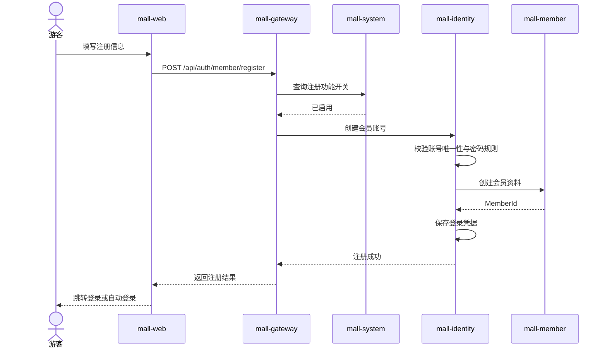
```mermaid
sequenceDiagram
    actor Guest as 游客
    participant Web as mall-web
    participant Gateway as mall-gateway
    participant System as mall-system
    participant Identity as mall-identity
    participant Member as mall-member

    Guest->>Web: 填写注册信息
    Web->>Gateway: POST /api/auth/member/register
    Gateway->>System: 查询注册功能开关
    System-->>Gateway: 已启用
    Gateway->>Identity: 创建会员账号
    Identity->>Identity: 校验账号唯一性与密码规则
    Identity->>Member: 创建会员资料
    Member-->>Identity: MemberId
    Identity->>Identity: 保存登录凭据
    Identity-->>Gateway: 注册成功
    Gateway-->>Web: 返回注册结果
    Web-->>Guest: 跳转登录或自动登录
```

## 5.4 业务步骤

1. 游客进入注册页；
2. 前端读取 `member.register.enabled`；
3. 用户填写账号和密码；
4. 后端再次检查注册功能是否启用；
5. 校验账号格式；
6. 校验账号唯一性；
7. 校验密码强度；
8. 密码加密；
9. 创建会员业务资料；
10. 创建会员认证账号；
11. 返回注册结果；
12. 记录注册日志。

## 5.5 本地事务边界

如果会员账号和会员资料在不同服务：

```text
mall-identity 本地事务
mall-member 本地事务
```

不能使用跨库事务。

第一版建议流程：

```text
先创建 Member
→ 再创建认证账号
```

若认证账号创建失败：

```text
记录补偿任务
→ 禁用或删除未完成会员资料
```

也可以使用注册 Saga，但第一版不强制。

## 5.6 异常路径

| 异常 | 处理 |
|---|---|
| 注册功能关闭 | 返回“当前暂不开放注册” |
| 账号已存在 | 拒绝注册 |
| 密码不符合规则 | 返回明确提示 |
| 会员服务不可用 | 注册失败 |
| 账号创建成功但会员资料失败 | 回滚账号本地事务 |
| 会员资料成功但账号创建失败 | 记录补偿并清理孤立资料 |

## 5.7 验收标准

- 正常信息可注册；
- 重复账号不能注册；
- 密码不合规不能注册；
- 功能关闭后前后端均不可注册；
- 密码不以明文保存；
- 注册失败不会留下可登录但无会员资料的账号。

---

# 6. 会员登录流程

## 6.1 流程目标

会员通过账号和密码登录商城，并获得访问令牌。

## 6.2 正常流程

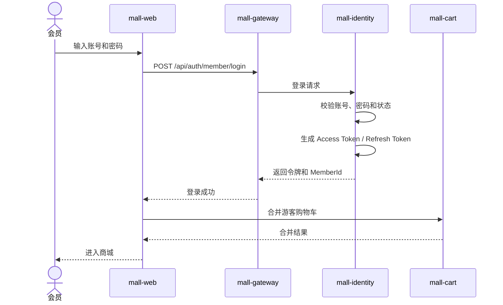
```mermaid
sequenceDiagram
    actor MemberUser as 会员
    participant Web as mall-web
    participant Gateway as mall-gateway
    participant Identity as mall-identity
    participant Cart as mall-cart

    MemberUser->>Web: 输入账号和密码
    Web->>Gateway: POST /api/auth/member/login
    Gateway->>Identity: 登录请求
    Identity->>Identity: 校验账号、密码和状态
    Identity->>Identity: 生成 Access Token / Refresh Token
    Identity-->>Gateway: 返回令牌和 MemberId
    Gateway-->>Web: 登录成功
    Web->>Cart: 合并游客购物车
    Cart-->>Web: 合并结果
    Web-->>MemberUser: 进入商城
```

## 6.3 业务规则

- 禁用会员不能登录；
- 密码错误不暴露账号是否存在；
- Token 必须包含身份类型；
- 商城 Token 不允许访问后台接口；
- 游客购物车合并失败不影响登录成功；
- 登录成功后恢复用户信息和购物车。

## 6.4 异常路径

| 异常 | 处理 |
|---|---|
| 账号或密码错误 | 返回统一错误提示 |
| 账号已禁用 | 拒绝登录 |
| 账号已锁定 | 提示稍后重试或联系管理员 |
| Token 生成失败 | 登录失败 |
| 购物车合并失败 | 登录成功，提示购物车同步失败 |

## 6.5 验收标准

- 正确账号可登录；
- 错误密码不能登录；
- 禁用用户不能登录；
- 商城 Token 不能访问后台接口；
- 登录后可访问个人订单；
- 游客购物车可正确合并。

---

# 7. 后台管理员登录与动态菜单流程

## 7.1 流程目标

管理员登录后台后，根据角色动态加载菜单、页面和按钮权限。

## 7.2 参与方

- 后台管理员；
- `mall-admin`；
- `mall-gateway`；
- `mall-identity`；
- Redis。

## 7.3 正常流程

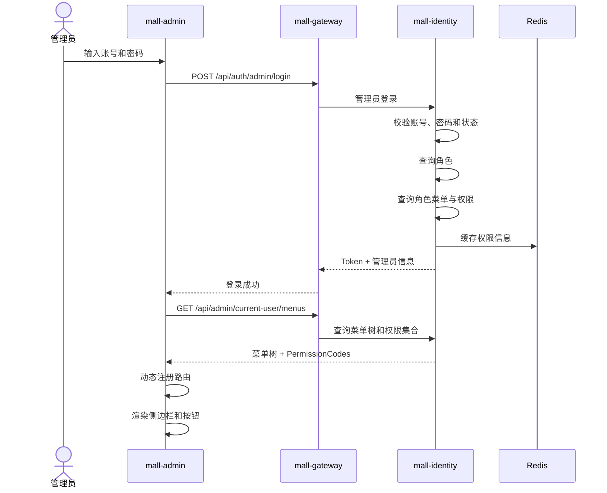
```mermaid
sequenceDiagram
    actor Admin as 管理员
    participant Web as mall-admin
    participant Gateway as mall-gateway
    participant Identity as mall-identity
    participant Redis as Redis

    Admin->>Web: 输入账号和密码
    Web->>Gateway: POST /api/auth/admin/login
    Gateway->>Identity: 管理员登录
    Identity->>Identity: 校验账号、密码和状态
    Identity->>Identity: 查询角色
    Identity->>Identity: 查询角色菜单与权限
    Identity->>Redis: 缓存权限信息
    Identity-->>Gateway: Token + 管理员信息
    Gateway-->>Web: 登录成功
    Web->>Gateway: GET /api/admin/current-user/menus
    Gateway->>Identity: 查询菜单树和权限集合
    Identity-->>Web: 菜单树 + PermissionCodes
    Web->>Web: 动态注册路由
    Web->>Web: 渲染侧边栏和按钮
```

## 7.4 业务步骤

1. 管理员提交登录；
2. 校验管理员账号；
3. 校验密码；
4. 校验管理员状态；
5. 查询有效角色；
6. 查询角色菜单；
7. 过滤禁用菜单；
8. 构建菜单树；
9. 汇总权限编码；
10. 生成后台 Token；
11. 前端获取菜单树；
12. 前端调用 `router.addRoute()`；
13. 前端根据权限编码控制按钮；
14. 后端接口继续使用 Spring Security 校验。

## 7.5 菜单类型

```text
DIRECTORY
PAGE
BUTTON
```

## 7.6 刷新页面流程

```text
页面刷新
→ 读取本地 Token
→ 请求当前用户菜单
→ 重新注册动态路由
→ 恢复页面
```

## 7.7 权限变更生效

第一版建议：

```text
管理员重新登录后生效
```

P1 可增强：

```text
角色权限版本变更
→ 清理 Redis 权限缓存
→ 当前用户下次请求重新加载
```

## 7.8 异常路径

| 异常 | 处理 |
|---|---|
| 管理员禁用 | 拒绝登录 |
| 角色禁用 | 不加载该角色权限 |
| 无任何角色 | 可登录但只能看到无权限页，或直接拒绝后台登录 |
| 菜单组件路径不存在 | 前端跳过并记录错误 |
| 权限缓存不可用 | 回源数据库 |
| 直接访问无权限页面 | 路由守卫拒绝 |
| 直接调用无权限接口 | 后端返回 403 |

## 7.9 验收标准

- 不同角色看到不同菜单；
- 无权限按钮不显示；
- 手动输入无权限路由不能访问；
- 直接调用无权限 API 返回 403；
- 刷新页面后动态路由可恢复；
- 退出登录后动态路由被清理。

---

# 8. 角色授权流程

## 8.1 流程目标

超级管理员为角色分配目录、页面和按钮权限。

## 8.2 正常流程

```text
超级管理员进入角色管理
→ 选择角色
→ 加载菜单权限树
→ 勾选目录、页面和按钮
→ 提交授权
→ 后端校验角色状态
→ 后端校验菜单有效性
→ 替换角色菜单关系
→ 清理权限缓存
→ 记录操作日志
```

## 8.3 业务规则

- 只有具备 `system:role:update` 权限的管理员可授权；
- 内置超级管理员角色不能被清空；
- 禁用菜单不能授予；
- 权限编码必须唯一；
- 授权提交采用覆盖式更新；
- 角色菜单关系在本地事务内更新；
- 变更后清理相关管理员权限缓存。

## 8.4 幂等要求

相同菜单集合重复提交：

```text
结果不变
```

## 8.5 验收标准

- 可以创建商品管理员角色；
- 只授予商品菜单；
- 登录后只显示商品相关内容；
- 无订单发货权限时无法调用发货接口。

---

# 9. 商品创建流程

## 9.1 流程目标

商品管理员创建商品 SPU，并配置基础信息。

## 9.2 正常流程

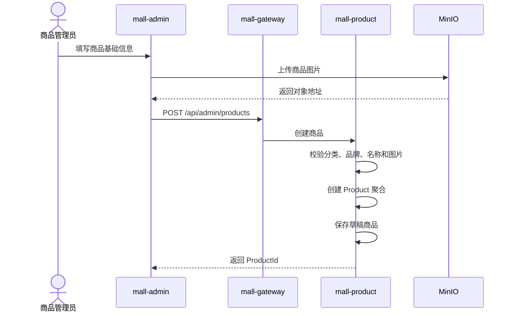
```mermaid
sequenceDiagram
    actor Admin as 商品管理员
    participant Web as mall-admin
    participant Gateway as mall-gateway
    participant Product as mall-product
    participant MinIO as MinIO

    Admin->>Web: 填写商品基础信息
    Web->>MinIO: 上传商品图片
    MinIO-->>Web: 返回对象地址
    Web->>Gateway: POST /api/admin/products
    Gateway->>Product: 创建商品
    Product->>Product: 校验分类、品牌、名称和图片
    Product->>Product: 创建 Product 聚合
    Product->>Product: 保存草稿商品
    Product-->>Web: 返回 ProductId
```

## 9.3 业务步骤

1. 管理员进入商品创建页；
2. 选择分类；
3. 选择品牌；
4. 填写商品名称和描述；
5. 上传主图和详情图；
6. 前端提交创建请求；
7. 后端校验权限；
8. 校验分类有效；
9. 校验品牌有效；
10. 校验商品编码唯一；
11. 创建 Product 聚合；
12. 状态设置为 `DRAFT`；
13. 保存商品；
14. 记录操作日志。

## 9.4 业务规则

- 商品名称不能为空；
- 商品编码唯一；
- 主图只能有一张；
- 商品初始状态为草稿；
- 草稿不能在商城显示；
- 商品创建不自动初始化库存；
- 商品创建不自动上架。

## 9.5 异常路径

| 异常 | 处理 |
|---|---|
| 分类不存在 | 创建失败 |
| 品牌不存在 | 创建失败 |
| 商品编码重复 | 创建失败 |
| 图片上传失败 | 不提交商品或允许保存无图草稿 |
| 商品保存失败 | 返回失败，已上传孤立文件后续清理 |

---

# 10. SKU 配置流程

## 10.1 流程目标

为商品创建可销售规格，并设置价格。

## 10.2 正常流程

```text
管理员打开商品编辑页
→ 添加规格维度
→ 生成 SKU 组合
→ 设置 SKU 编码
→ 设置销售价格
→ 设置 SKU 图片
→ 提交 SKU 配置
→ Product 聚合校验
→ SKU 已添加
```

## 10.3 业务规则

- SKU 编码唯一；
- 同一商品中规格组合唯一；
- 价格不能小于零；
- SKU 默认状态可设置为启用；
- SKU 没有初始化库存时仍不可完成交易；
- 商品上架后修改 SKU 需要触发搜索索引更新。

## 10.4 验收标准

- 可创建多个 SKU；
- 重复规格组合被拒绝；
- 负价格被拒绝；
- SKU 修改不影响历史订单；
- 禁用 SKU 不能购买。

---

# 11. 库存初始化流程

## 11.1 流程目标

为 SKU 创建初始库存记录。

## 11.2 参与方

- 商品管理员；
- `mall-admin`；
- `mall-inventory`；
- `mall-product`。

## 11.3 正常流程

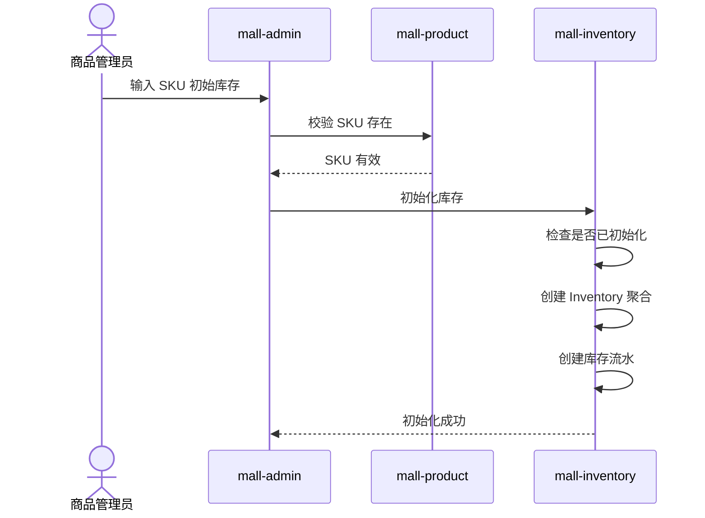
```mermaid
sequenceDiagram
    actor Admin as 商品管理员
    participant Web as mall-admin
    participant Product as mall-product
    participant Inventory as mall-inventory

    Admin->>Web: 输入 SKU 初始库存
    Web->>Product: 校验 SKU 存在
    Product-->>Web: SKU 有效
    Web->>Inventory: 初始化库存
    Inventory->>Inventory: 检查是否已初始化
    Inventory->>Inventory: 创建 Inventory 聚合
    Inventory->>Inventory: 创建库存流水
    Inventory-->>Web: 初始化成功
```

## 11.4 业务规则

- SKU 必须存在；
- 同一 SKU 只能初始化一次；
- 初始库存不能小于零；
- 初始可用库存等于总库存；
- 锁定库存为零；
- 已售数量为零；
- 生成库存流水；
- 初始化操作需要库存权限。

## 11.5 幂等要求

以 `skuId` 唯一约束保证：

```text
重复初始化不重复创建库存
```

## 11.6 验收标准

- 新 SKU 可以初始化；
- 重复初始化被拒绝或返回原结果；
- 负数库存被拒绝；
- 初始化后后台可查询；
- 初始化后商品满足库存上架条件。

---

# 12. 商品上架流程

## 12.1 流程目标

将满足条件的草稿或已下架商品设置为可售状态。

## 12.2 正常流程

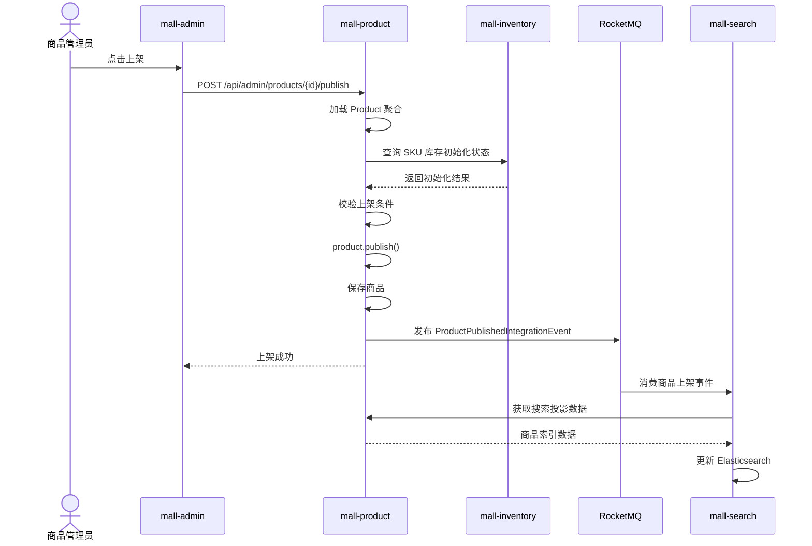
```mermaid
sequenceDiagram
    actor Admin as 商品管理员
    participant Web as mall-admin
    participant Product as mall-product
    participant Inventory as mall-inventory
    participant MQ as RocketMQ
    participant Search as mall-search

    Admin->>Web: 点击上架
    Web->>Product: POST /api/admin/products/{id}/publish
    Product->>Product: 加载 Product 聚合
    Product->>Inventory: 查询 SKU 库存初始化状态
    Inventory-->>Product: 返回初始化结果
    Product->>Product: 校验上架条件
    Product->>Product: product.publish()
    Product->>Product: 保存商品
    Product->>MQ: 发布 ProductPublishedIntegrationEvent
    Product-->>Web: 上架成功
    MQ->>Search: 消费商品上架事件
    Search->>Product: 获取搜索投影数据
    Product-->>Search: 商品索引数据
    Search->>Search: 更新 Elasticsearch
```

## 12.3 上架条件

- 商品基础信息完整；
- 分类有效；
- 品牌有效；
- 主图存在；
- 至少一个 SKU；
- 至少一个启用 SKU；
- SKU 价格合法；
- SKU 规格组合合法；
- 至少一个可售 SKU 已初始化库存；
- 商品未被禁用。

## 12.4 事务边界

商品上架本地事务：

```text
修改 Product 状态
+
保存领域事件或 Outbox
```

搜索索引更新不参与商品本地事务。

## 12.5 异常路径

| 异常 | 处理 |
|---|---|
| 商品资料不完整 | 返回缺失项 |
| 无有效 SKU | 拒绝上架 |
| 库存未初始化 | 拒绝上架 |
| 商品已禁用 | 拒绝上架 |
| 商品保存失败 | 上架失败 |
| MQ 发送失败 | 本地消息重试 |
| 搜索索引失败 | 搜索服务重试或补偿 |

## 12.6 验收标准

- 满足条件商品可上架；
- 不满足条件不能上架；
- 上架后商城商品列表可见；
- 搜索索引延迟后可搜索；
- 搜索失败不回滚商品上架；
- 无权限管理员不能上架。

---

# 13. 商品下架流程

## 13.1 正常流程

```text
商品管理员点击下架
→ 校验 product:unpublish 权限
→ 加载 Product
→ product.unpublish()
→ 保存商品
→ 发布 ProductUnpublishedIntegrationEvent
→ 清理商品缓存
→ 搜索服务移除或禁用索引
→ 商城不再允许购买
```

## 13.2 业务规则

- 已下架商品重复下架幂等；
- 下架不影响已创建订单；
- 购物车中的该商品标记失效；
- 历史订单继续展示快照；
- 商品下架后不允许新建订单。

## 13.3 验收标准

- 下架后商品不再出现在可售列表；
- 商品详情提示已下架；
- 购物车项显示失效；
- 已有订单仍能查看。

---

# 14. 商城商品浏览流程

## 14.1 商品列表

```text
游客或会员打开商城
→ mall-web 请求商品列表
→ Gateway
→ mall-product 或 mall-search
→ 只返回已上架商品
→ 前端渲染商品卡片
```

## 14.2 商品详情

```text
用户点击商品
→ 查询 Product 详情
→ 查询 SKU
→ 查询库存可用性
→ 合并为商品详情 DTO
→ 返回前端
```

## 14.3 业务规则

- 下架商品可以返回详情提示，但不能购买；
- SKU 价格来自商品服务；
- 库存来自库存服务；
- 商品服务不可使用库存缓存作为最终交易依据；
- 商品详情可以使用 Redis 缓存；
- 库存展示允许短暂延迟，提交订单时必须重新校验。

---

# 15. 商品搜索流程

## 15.1 正常流程

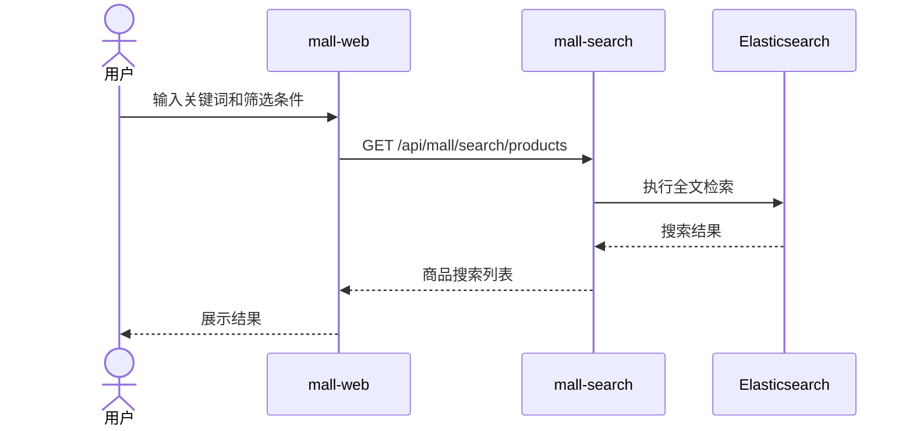
```mermaid
sequenceDiagram
    actor User as 用户
    participant Web as mall-web
    participant Search as mall-search
    participant ES as Elasticsearch

    User->>Web: 输入关键词和筛选条件
    Web->>Search: GET /api/mall/search/products
    Search->>ES: 执行全文检索
    ES-->>Search: 搜索结果
    Search-->>Web: 商品搜索列表
    Web-->>User: 展示结果
```

## 15.2 查询条件

- 关键词；
- 分类；
- 品牌；
- 价格区间；
- 是否有货；
- 排序；
- 分页。

## 15.3 降级流程

搜索服务不可用时：

```text
搜索失败
→ 前端提示
→ 提供分类浏览
```

P1 可实现：

```text
降级为 MySQL 简单模糊查询
```

## 15.4 验收标准

- 关键词可搜索商品；
- 下架商品不出现在结果；
- 组合筛选正确；
- 排序正确；
- 搜索不可用时不影响商品详情访问。

---

# 16. 加入购物车流程

## 16.1 正常流程

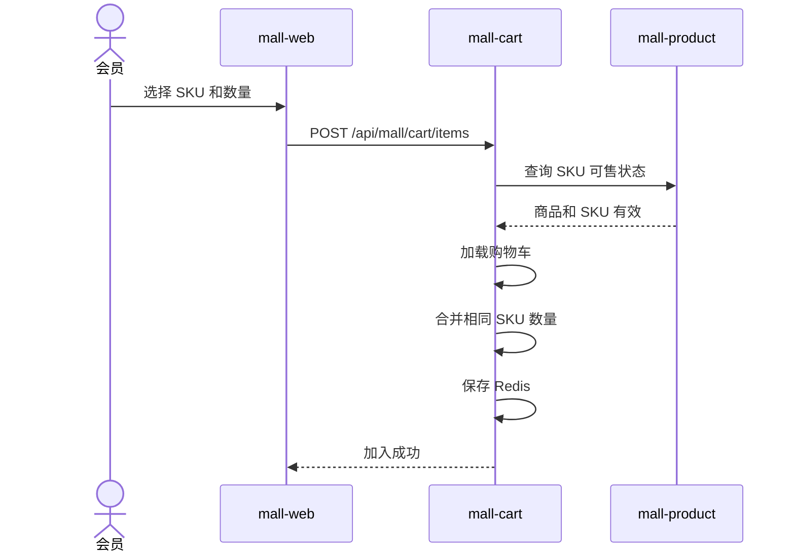
```mermaid
sequenceDiagram
    actor Member as 会员
    participant Web as mall-web
    participant Cart as mall-cart
    participant Product as mall-product

    Member->>Web: 选择 SKU 和数量
    Web->>Cart: POST /api/mall/cart/items
    Cart->>Product: 查询 SKU 可售状态
    Product-->>Cart: 商品和 SKU 有效
    Cart->>Cart: 加载购物车
    Cart->>Cart: 合并相同 SKU 数量
    Cart->>Cart: 保存 Redis
    Cart-->>Web: 加入成功
```

## 16.2 业务规则

- 必须登录，或游客使用本地购物车；
- 必须选择完整 SKU；
- 商品必须上架；
- SKU 必须启用；
- 数量大于零；
- 数量不超过系统上限；
- 加入购物车不锁定库存；
- 相同 SKU 合并数量。

## 16.3 异常路径

| 异常 | 处理 |
|---|---|
| 商品已下架 | 拒绝加入 |
| SKU 已禁用 | 拒绝加入 |
| 数量超过上限 | 返回最大数量 |
| 商品服务超时 | 加入失败，不写入购物车 |
| Redis 失败 | 加入失败 |

## 16.4 验收标准

- 正常 SKU 可加入；
- 相同 SKU 数量合并；
- 下架商品不能加入；
- 数量限制生效；
- 库存不足时可提示，但不锁定库存。

---

# 17. 购物车查询与失效检查流程

## 17.1 正常流程

```text
会员打开购物车
→ mall-cart 从 Redis 读取购物车项
→ 批量调用 mall-product 查询商品和 SKU 信息
→ 批量调用 mall-inventory 查询可用库存
→ 组装购物车展示模型
→ 标记有效项和失效项
→ 计算选中项展示金额
```

## 17.2 失效原因

```text
PRODUCT_UNPUBLISHED
SKU_DISABLED
PRODUCT_NOT_FOUND
SKU_NOT_FOUND
TEMPORARILY_UNAVAILABLE
```

## 17.3 业务规则

- 失效项不自动删除；
- 失效项不能结算；
- 商品价格变更时显示最新价格；
- 购物车金额不作为订单成交金额；
- 服务不可用时标记暂时不可结算。

---

# 18. 订单预览流程

## 18.1 流程目标

在用户正式提交订单前，汇总并重新校验商品、价格、数量、库存和地址。

## 18.2 正常流程

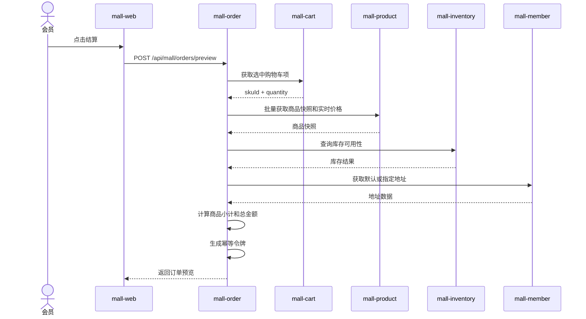
```mermaid
sequenceDiagram
    actor Member as 会员
    participant Web as mall-web
    participant Order as mall-order
    participant Cart as mall-cart
    participant Product as mall-product
    participant Inventory as mall-inventory
    participant MemberSvc as mall-member

    Member->>Web: 点击结算
    Web->>Order: POST /api/mall/orders/preview
    Order->>Cart: 获取选中购物车项
    Cart-->>Order: skuId + quantity
    Order->>Product: 批量获取商品快照和实时价格
    Product-->>Order: 商品快照
    Order->>Inventory: 查询库存可用性
    Inventory-->>Order: 库存结果
    Order->>MemberSvc: 获取默认或指定地址
    MemberSvc-->>Order: 地址数据
    Order->>Order: 计算商品小计和总金额
    Order->>Order: 生成幂等令牌
    Order-->>Web: 返回订单预览
```

## 18.3 预览数据

- 商品名称；
- SKU 规格；
- 图片；
- 实时价格；
- 购买数量；
- 商品小计；
- 库存状态；
- 收货地址；
- 总金额；
- 支付截止时间说明；
- 幂等令牌。

## 18.4 业务规则

- 预览不锁定库存；
- 预览不创建订单；
- 预览金额不是最终承诺；
- 提交订单再次校验；
- 地址必须属于当前会员；
- 无效商品不能进入可提交状态；
- 幂等令牌与当前会员和预览内容关联。

## 18.5 异常路径

| 异常 | 处理 |
|---|---|
| 无选中商品 | 返回空结算错误 |
| 商品已下架 | 标记无效 |
| SKU 已禁用 | 标记无效 |
| 库存不足 | 禁止提交 |
| 地址不存在 | 提示新增地址 |
| 商品服务失败 | 预览失败 |
| 库存服务失败 | 预览失败或显示暂不可结算 |

## 18.6 验收标准

- 可生成完整订单预览；
- 价格变化后展示最新价格；
- 库存不足不能提交；
- 地址归属校验有效；
- 预览阶段不产生库存锁定。

---

# 19. 创建订单与库存锁定流程

## 19.1 流程目标

会员提交订单，系统锁定库存并创建待付款订单。

## 19.2 正常流程

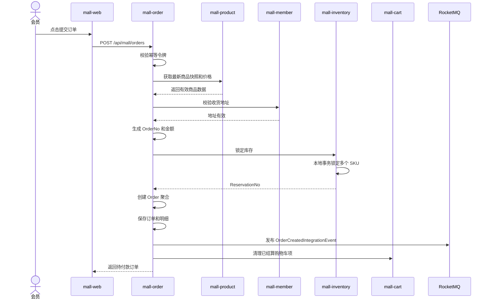
```mermaid
sequenceDiagram
    actor Member as 会员
    participant Web as mall-web
    participant Order as mall-order
    participant Product as mall-product
    participant MemberSvc as mall-member
    participant Inventory as mall-inventory
    participant Cart as mall-cart
    participant MQ as RocketMQ

    Member->>Web: 点击提交订单
    Web->>Order: POST /api/mall/orders
    Order->>Order: 校验幂等令牌
    Order->>Product: 获取最新商品快照和价格
    Product-->>Order: 返回有效商品数据
    Order->>MemberSvc: 校验收货地址
    MemberSvc-->>Order: 地址有效
    Order->>Order: 生成 OrderNo 和金额
    Order->>Inventory: 锁定库存
    Inventory->>Inventory: 本地事务锁定多个 SKU
    Inventory-->>Order: ReservationNo
    Order->>Order: 创建 Order 聚合
    Order->>Order: 保存订单和明细
    Order->>MQ: 发布 OrderCreatedIntegrationEvent
    Order->>Cart: 清理已结算购物车项
    Order-->>Web: 返回待付款订单
```

## 19.3 核心步骤

1. 获取当前会员；
2. 校验幂等令牌；
3. 校验提交商品非空；
4. 查询商品和 SKU；
5. 校验商品可售状态；
6. 获取最新价格；
7. 校验收货地址；
8. 生成订单号；
9. 计算订单金额；
10. 调用库存服务锁定库存；
11. 创建订单和订单明细；
12. 保存商品快照和地址快照；
13. 初始状态设为待付款；
14. 保存支付截止时间；
15. 发布订单已创建事件；
16. 清理购物车；
17. 返回订单结果。

## 19.4 事务边界

### 库存服务

```text
批量锁定库存
+
创建库存锁定记录
+
创建库存流水
```

在库存服务本地事务内完成。

### 订单服务

```text
创建订单
+
创建订单明细
+
创建初始状态记录
+
保存 Outbox 事件
```

在订单服务本地事务内完成。

## 19.5 幂等策略

### 订单幂等

```text
idempotencyToken 唯一
```

### 库存锁定幂等

```text
businessNo + skuId 唯一
```

### 数据库约束

- 订单号唯一；
- 幂等令牌唯一；
- 库存业务锁定唯一；
- 锁定记录编号唯一。

## 19.6 异常路径一：库存不足

```text
请求锁定库存
→ 某 SKU 可用库存不足
→ 库存服务整体返回失败
→ 不创建订单
→ 返回库存不足商品
```

## 19.7 异常路径二：库存锁定成功，订单创建失败

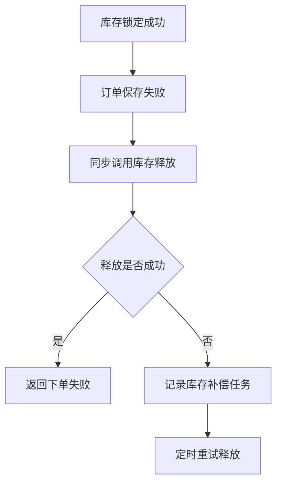
```mermaid
flowchart TD
    A[库存锁定成功] --> B[订单保存失败]
    B --> C[同步调用库存释放]
    C --> D{释放是否成功}
    D -- 是 --> E[返回下单失败]
    D -- 否 --> F[记录库存补偿任务]
    F --> G[定时重试释放]
```

## 19.8 异常路径三：购物车清理失败

```text
订单已创建
→ 清理购物车失败
→ 订单不回滚
→ 记录补偿
→ 用户可手动删除或后续自动清理
```

## 19.9 异常路径四：重复提交

```text
相同 idempotencyToken 再次提交
→ 返回已创建订单
或
→ 返回重复提交提示
```

推荐返回原订单结果，用户体验更好。

## 19.10 验收标准

- 正常下单生成待付款订单；
- 库存不足时不创建订单；
- 重复提交不创建重复订单；
- 订单金额由后端计算；
- 商品和地址快照完整；
- 订单保存失败后库存最终释放；
- 购物车清理失败不影响订单有效性。

---

# 20. 模拟支付流程

## 20.1 流程目标

用户对待付款订单执行模拟支付，订单变为待发货，并触发库存确认扣减。

## 20.2 正常流程

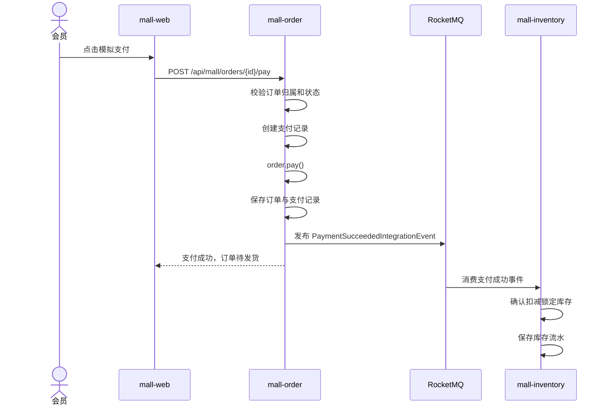
```mermaid
sequenceDiagram
    actor Member as 会员
    participant Web as mall-web
    participant Order as mall-order
    participant MQ as RocketMQ
    participant Inventory as mall-inventory

    Member->>Web: 点击模拟支付
    Web->>Order: POST /api/mall/orders/{id}/pay
    Order->>Order: 校验订单归属和状态
    Order->>Order: 创建支付记录
    Order->>Order: order.pay()
    Order->>Order: 保存订单与支付记录
    Order->>MQ: 发布 PaymentSucceededIntegrationEvent
    Order-->>Web: 支付成功，订单待发货
    MQ->>Inventory: 消费支付成功事件
    Inventory->>Inventory: 确认扣减锁定库存
    Inventory->>Inventory: 保存库存流水
```

## 20.3 业务规则

- 只有待付款订单可支付；
- 会员只能支付自己的订单；
- 超时订单不能支付；
- 已取消订单不能支付；
- 支付操作必须幂等；
- 支付成功后订单状态为待发货；
- 库存确认扣减基于原锁定记录；
- 重复支付事件不重复扣减库存。

## 20.4 事务边界

订单服务本地事务：

```text
支付记录
+
订单状态
+
支付成功 Outbox
```

库存确认扣减异步完成。

## 20.5 异常路径

### 订单已支付

```text
重复支付
→ 返回原支付成功结果
→ 不重复发布业务结果
```

### 订单已超时

```text
支付请求
→ 发现支付截止时间已过
→ 拒绝支付
→ 可触发订单超时取消
```

### 库存确认扣减失败

```text
PaymentSucceeded 事件
→ 库存消费失败
→ MQ 重试
→ 超过次数进入补偿任务
→ 告警
```

## 20.6 验收标准

- 待付款订单可支付；
- 支付后状态变为待发货；
- 重复支付不重复处理；
- 已取消订单不能支付；
- 库存锁定最终转为已售；
- 库存消费失败可重试。

---

# 21. 用户主动取消订单流程

## 21.1 正常流程

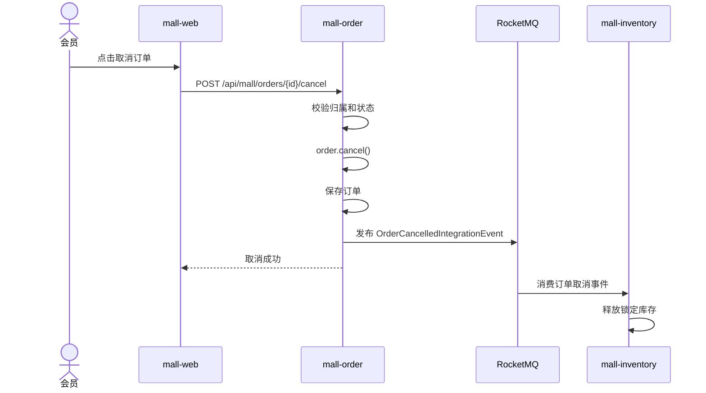
```mermaid
sequenceDiagram
    actor Member as 会员
    participant Web as mall-web
    participant Order as mall-order
    participant MQ as RocketMQ
    participant Inventory as mall-inventory

    Member->>Web: 点击取消订单
    Web->>Order: POST /api/mall/orders/{id}/cancel
    Order->>Order: 校验归属和状态
    Order->>Order: order.cancel()
    Order->>Order: 保存订单
    Order->>MQ: 发布 OrderCancelledIntegrationEvent
    Order-->>Web: 取消成功
    MQ->>Inventory: 消费订单取消事件
    Inventory->>Inventory: 释放锁定库存
```

## 21.2 业务规则

- 只有待付款订单可主动取消；
- 用户只能取消自己的订单；
- 取消原因可记录；
- 重复取消幂等；
- 已支付订单不能普通取消；
- 取消后库存最终释放。

## 21.3 异常路径

| 异常 | 处理 |
|---|---|
| 订单不存在 | 返回订单不存在 |
| 非本人订单 | 返回禁止访问 |
| 已支付 | 拒绝取消 |
| 已取消 | 返回幂等成功 |
| 库存释放失败 | MQ 重试和补偿 |

## 21.4 验收标准

- 待付款订单可取消；
- 取消后状态为已取消；
- 库存最终恢复；
- 重复取消不重复释放；
- 已支付订单不能取消。

---

# 22. 订单超时取消流程

## 22.1 流程目标

待付款订单超过支付截止时间后自动取消。

## 22.2 正常流程

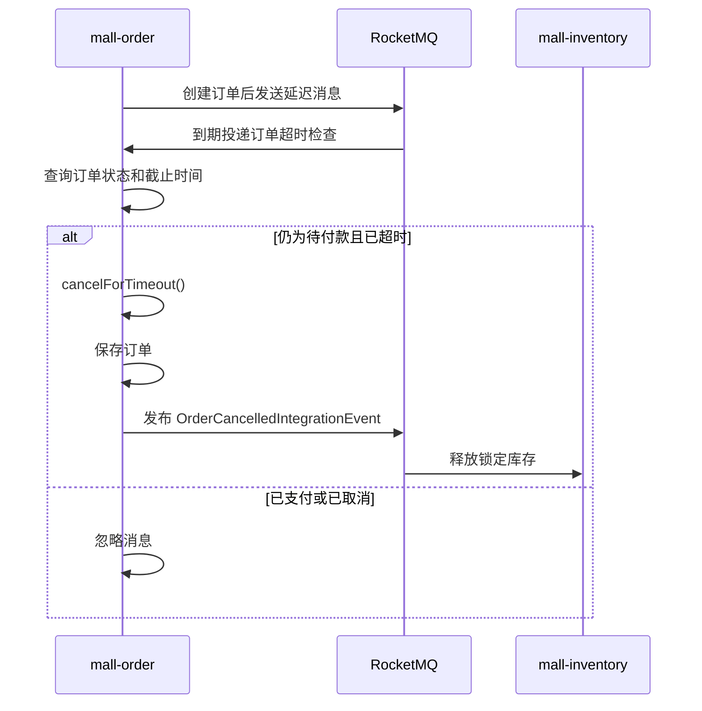
```mermaid
sequenceDiagram
    participant Order as mall-order
    participant MQ as RocketMQ
    participant Inventory as mall-inventory

    Order->>MQ: 创建订单后发送延迟消息
    MQ->>Order: 到期投递订单超时检查
    Order->>Order: 查询订单状态和截止时间
    alt 仍为待付款且已超时
        Order->>Order: cancelForTimeout()
        Order->>Order: 保存订单
        Order->>MQ: 发布 OrderCancelledIntegrationEvent
        MQ->>Inventory: 释放锁定库存
    else 已支付或已取消
        Order->>Order: 忽略消息
    end
```

## 22.3 业务规则

- 超时时间来自系统参数；
- 创建订单时保存实际支付截止时间；
- 参数后续变化不影响已有订单；
- 延迟消息到达时重新检查状态；
- 重复消息幂等；
- 已支付订单不能取消；
- 库存释放最终一致。

## 22.4 补偿机制

除延迟消息外，增加定时任务：

```text
扫描超时待付款订单
→ 补偿取消
```

避免延迟消息丢失。

## 22.5 验收标准

- 超时未支付订单自动取消；
- 已支付订单不被误取消；
- 重复延迟消息不重复处理；
- 库存最终释放；
- 定时补偿可处理漏单。

---

# 23. 后台发货流程

## 23.1 正常流程

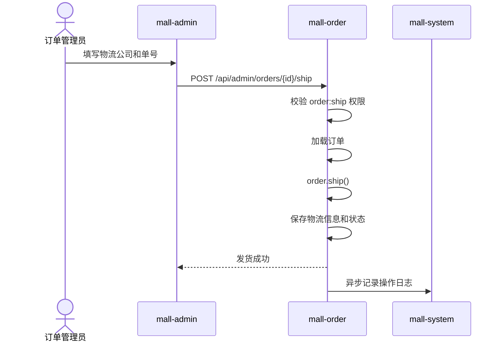
```mermaid
sequenceDiagram
    actor Admin as 订单管理员
    participant Web as mall-admin
    participant Order as mall-order
    participant Audit as mall-system

    Admin->>Web: 填写物流公司和单号
    Web->>Order: POST /api/admin/orders/{id}/ship
    Order->>Order: 校验 order:ship 权限
    Order->>Order: 加载订单
    Order->>Order: order.ship()
    Order->>Order: 保存物流信息和状态
    Order-->>Web: 发货成功
    Order->>Audit: 异步记录操作日志
```

## 23.2 业务规则

- 只有待发货订单可发货；
- 必须有 `order:ship` 权限；
- 物流公司和单号不能为空；
- 发货操作幂等；
- 发货后状态变为已发货；
- 用户端可查看物流信息；
- 第一版不对接真实物流轨迹。

## 23.3 验收标准

- 待发货订单可发货；
- 其他状态不能发货；
- 无权限管理员不能发货；
- 用户端显示物流信息；
- 发货操作有审计日志。

---

# 24. 确认收货流程

## 24.1 正常流程

```text
会员打开已发货订单
→ 点击确认收货
→ mall-order 校验订单归属
→ 校验订单状态为 SHIPPED
→ order.confirmReceipt()
→ 保存订单为 COMPLETED
→ 发布 OrderCompletedIntegrationEvent
```

## 24.2 业务规则

- 只有已发货订单可确认；
- 会员只能确认自己的订单；
- 已完成订单重复确认幂等；
- 确认后订单完成；
- P2 可支持自动确认收货。

## 24.3 验收标准

- 已发货订单可确认；
- 待发货订单不能确认；
- 重复确认不产生异常副作用；
- 完成时间正确保存。

---

# 25. 退款申请流程

## 25.1 正常流程

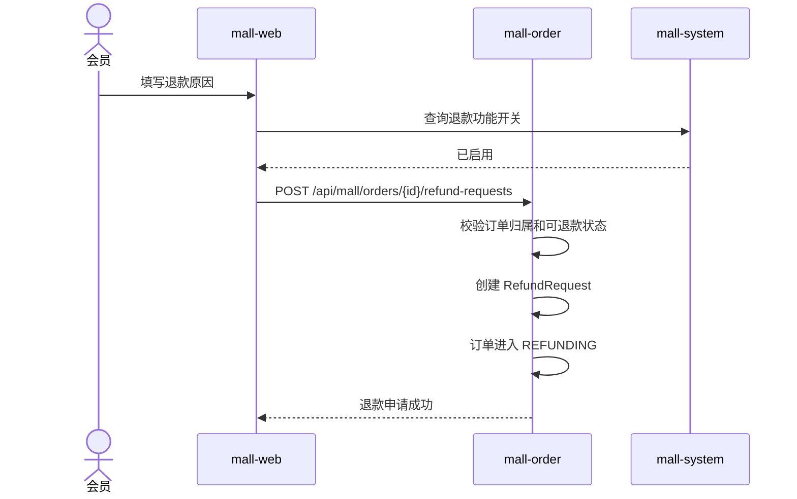
```mermaid
sequenceDiagram
    actor Member as 会员
    participant Web as mall-web
    participant Order as mall-order
    participant System as mall-system

    Member->>Web: 填写退款原因
    Web->>System: 查询退款功能开关
    System-->>Web: 已启用
    Web->>Order: POST /api/mall/orders/{id}/refund-requests
    Order->>Order: 校验订单归属和可退款状态
    Order->>Order: 创建 RefundRequest
    Order->>Order: 订单进入 REFUNDING
    Order-->>Web: 退款申请成功
```

## 25.2 业务规则

- 退款功能必须启用；
- 用户只能申请自己的订单；
- 订单状态必须允许退款；
- 同一订单不能有多个进行中的退款；
- 第一版只支持整单退款；
- 退款金额不得超过可退金额；
- 退款原因不能为空。

## 25.3 验收标准

- 合法订单可申请退款；
- 非法状态被拒绝；
- 关闭退款功能后不能申请；
- 重复申请被拒绝；
- 订单状态变为退款中。

---

# 26. 退款审核流程

## 26.1 审核通过

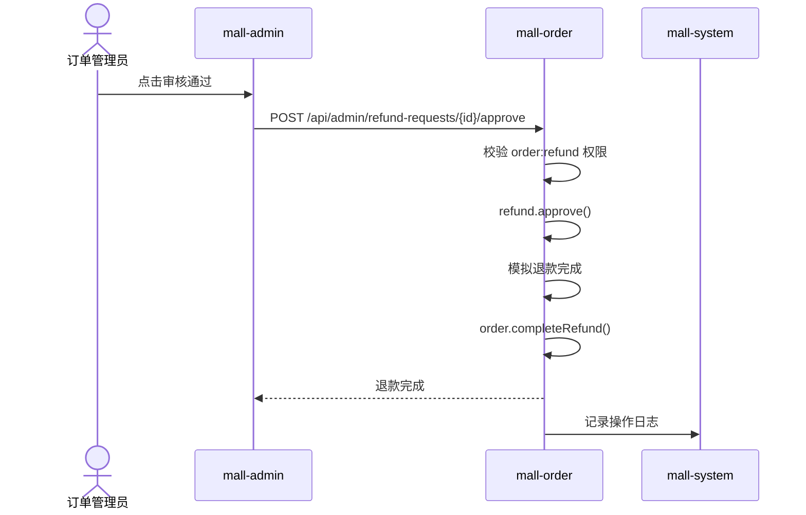
```mermaid
sequenceDiagram
    actor Admin as 订单管理员
    participant Web as mall-admin
    participant Order as mall-order
    participant Audit as mall-system

    Admin->>Web: 点击审核通过
    Web->>Order: POST /api/admin/refund-requests/{id}/approve
    Order->>Order: 校验 order:refund 权限
    Order->>Order: refund.approve()
    Order->>Order: 模拟退款完成
    Order->>Order: order.completeRefund()
    Order-->>Web: 退款完成
    Order->>Audit: 记录操作日志
```

## 26.2 审核拒绝

```text
管理员拒绝退款
→ 校验权限
→ refund.reject()
→ 订单恢复原状态
→ 保存审核说明
→ 用户端展示拒绝结果
```

## 26.3 业务规则

- 只有待审核申请可处理；
- 审核操作幂等；
- 审核人必须有权限；
- 审核说明需要保存；
- 第一版模拟退款，不处理真实资金；
- 第一版不自动回补库存，除非后续明确退货入库。

## 26.4 验收标准

- 管理员可审核；
- 无权限管理员不能审核；
- 重复审核不重复处理；
- 用户端可查看结果；
- 订单状态恢复或进入已退款。

---

# 27. 后台库存调整流程

## 27.1 正常流程

```text
库存管理员进入库存列表
→ 选择 SKU
→ 输入调整类型、数量和原因
→ 提交调整
→ 校验 inventory:update 权限
→ 加载 Inventory 聚合
→ inventory.increase / decrease
→ 保存库存
→ 创建库存流水
→ 记录操作日志
```

## 27.2 业务规则

- 调整原因必填；
- 增加数量必须大于零；
- 减少库存只能减少可用库存；
- 不能直接修改锁定库存；
- 调整后不能出现负数；
- 使用乐观锁处理并发；
- 每次调整生成库存流水。

## 27.3 验收标准

- 合法调整成功；
- 非法减少被拒绝；
- 并发冲突可重试或提示；
- 流水可追溯；
- 操作日志完整。

---

# 28. 功能配置修改流程

## 28.1 正常流程

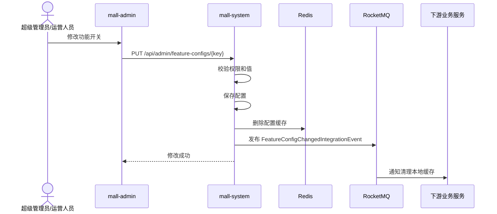
```mermaid
sequenceDiagram
    actor Admin as 超级管理员/运营人员
    participant Web as mall-admin
    participant System as mall-system
    participant Redis as Redis
    participant MQ as RocketMQ
    participant Service as 下游业务服务

    Admin->>Web: 修改功能开关
    Web->>System: PUT /api/admin/feature-configs/{key}
    System->>System: 校验权限和值
    System->>System: 保存配置
    System->>Redis: 删除配置缓存
    System->>MQ: 发布 FeatureConfigChangedIntegrationEvent
    System-->>Web: 修改成功
    MQ->>Service: 通知清理本地缓存
```

## 28.2 业务规则

- 配置键唯一；
- 操作人必须有权限；
- 公开和内部配置区分；
- 后端接口和前端入口同时受控；
- 配置变更后清理缓存；
- 高风险功能无配置时默认关闭；
- 修改记录操作日志。

## 28.3 示例：关闭 AI 导购

```text
后台关闭 ai.shopping.enabled
→ 保存配置
→ 清理 Redis
→ 商城重新读取公开配置
→ AI 入口隐藏
→ 直接调用 AI 接口也被拒绝
```

## 28.4 验收标准

- 配置修改后生效；
- 前端入口和后端接口一致；
- 配置缓存正确失效；
- 配置服务短暂不可用时使用安全默认值。

---

# 29. 系统参数修改流程

## 29.1 示例参数

```text
order.timeout.minutes
cart.max-quantity
product.max-buy-quantity
ai.chat.max-rounds
upload.file.max-size
```

## 29.2 正常流程

```text
管理员修改参数
→ 校验权限
→ 校验参数类型
→ 校验最小值和最大值
→ 保存参数
→ 清理缓存
→ 发布参数变更事件
```

## 29.3 参数生效规则

### 订单超时时间

```text
仅影响新创建订单
```

订单创建时保存：

```text
paymentDeadline
```

### AI 最大轮数

```text
新会话读取最新值
现有会话保持创建时限制
```

### 文件大小限制

```text
下一次上传请求立即使用新值
```

---

# 30. 操作日志流程

## 30.1 目标

对后台关键业务操作进行审计。

## 30.2 正常流程

```text
后台业务操作完成
→ 生成 AdminOperationIntegrationEvent
→ RocketMQ
→ mall-system 消费
→ 保存 operation_log
```

## 30.3 日志内容

- 操作者 ID；
- 操作者名称；
- 模块；
- 操作类型；
- 资源类型；
- 资源 ID；
- 请求路径；
- 执行结果；
- 错误信息；
- TraceId；
- IP；
- 时间；
- 耗时。

## 30.4 业务规则

- 日志失败不回滚核心业务；
- 密码和 Token 不记录；
- 消息消费幂等；
- 失败操作也应记录；
- 普通管理员不能修改日志。

---

# 31. AI 智能导购流程

## 31.1 流程目标

用户通过自然语言描述需求，AI 返回平台真实商品推荐。

## 31.2 正常流程

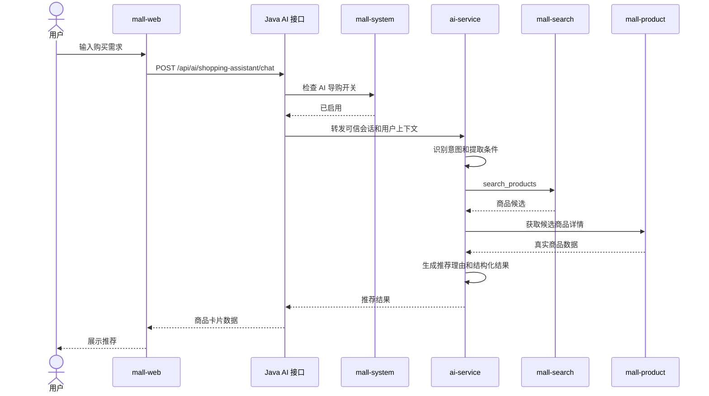
```mermaid
sequenceDiagram
    actor User as 用户
    participant Web as mall-web
    participant Java as Java AI 接口
    participant System as mall-system
    participant AI as ai-service
    participant Search as mall-search
    participant Product as mall-product

    User->>Web: 输入购买需求
    Web->>Java: POST /api/ai/shopping-assistant/chat
    Java->>System: 检查 AI 导购开关
    System-->>Java: 已启用
    Java->>AI: 转发可信会话和用户上下文
    AI->>AI: 识别意图和提取条件
    AI->>Search: search_products
    Search-->>AI: 商品候选
    AI->>Product: 获取候选商品详情
    Product-->>AI: 真实商品数据
    AI->>AI: 生成推荐理由和结构化结果
    AI-->>Java: 推荐结果
    Java-->>Web: 商品卡片数据
    Web-->>User: 展示推荐
```

## 31.3 输入条件

- 品类；
- 预算；
- 使用场景；
- 品牌偏好；
- 规格要求；
- 排除条件；
- 其他说明。

## 31.4 输出结构

```json
{
  "intent": "SHOPPING_RECOMMENDATION",
  "criteria": {
    "category": "笔记本电脑",
    "maxPrice": 300000,
    "useCase": "学习编程"
  },
  "recommendations": [
    {
      "productId": "10001",
      "title": "示例商品",
      "price": 299900,
      "reason": "满足预算并适合学习编程"
    }
  ],
  "followUpQuestion": null
}
```

## 31.5 业务规则

- AI 功能必须启用；
- 推荐商品必须来自真实搜索结果；
- 商品 ID 必须真实存在；
- 只推荐已上架商品；
- 默认过滤无库存商品；
- AI 不直接访问业务数据库；
- AI 不得编造价格和库存；
- AI 失败不影响普通商城功能。

## 31.6 无结果流程

```text
AI 提取条件
→ 搜索无结果
→ 返回无匹配
→ 建议放宽预算或条件
```

不得生成不存在商品。

## 31.7 降级流程

```text
AI 服务异常
→ Java 捕获错误
→ 返回友好提示
→ 提供普通搜索入口
```

## 31.8 验收标准

- 能识别预算和用途；
- 能调用真实商品搜索；
- 推荐商品均存在；
- 点击可进入详情；
- AI 关闭后前后端均不可用；
- AI 故障不影响下单。

---

# 32. AI 商品对比流程

## 32.1 正常流程

```text
用户选择两个或多个商品
→ 提交商品 ID
→ Java 校验商品存在
→ AI 获取商品详情和参数
→ 生成结构化对比
→ 返回优缺点、适用场景和建议
```

## 32.2 业务规则

- 对比商品数量有上限；
- 商品必须真实存在；
- 参数来自商品服务；
- 下架商品标记不可购买；
- AI 不修改商品原始参数；
- 对比结果必须结构化。

## 32.3 验收标准

- 至少支持两个商品；
- 参数对比准确；
- 结果结构清晰；
- 不存在商品被拒绝。

---

# 33. RAG 智能客服流程

## 33.1 文档上传流程

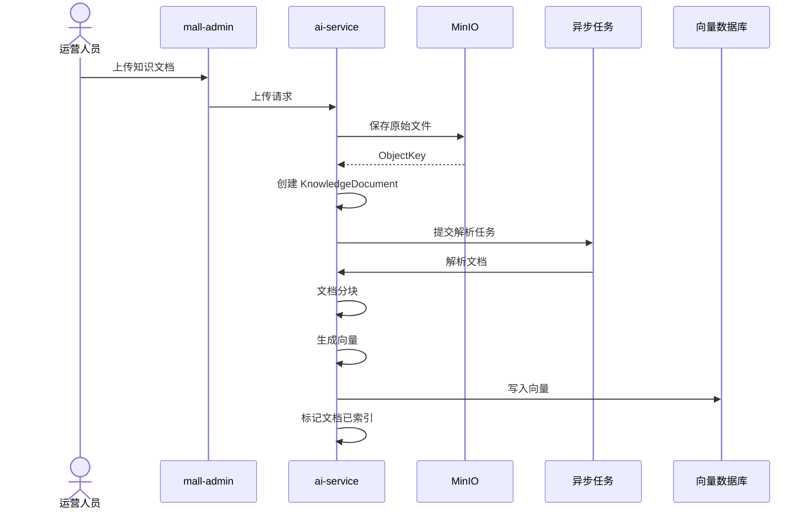
```mermaid
sequenceDiagram
    actor Admin as 运营人员
    participant Web as mall-admin
    participant AI as ai-service
    participant MinIO as MinIO
    participant Queue as 异步任务
    participant Vector as 向量数据库

    Admin->>Web: 上传知识文档
    Web->>AI: 上传请求
    AI->>MinIO: 保存原始文件
    MinIO-->>AI: ObjectKey
    AI->>AI: 创建 KnowledgeDocument
    AI->>Queue: 提交解析任务
    Queue->>AI: 解析文档
    AI->>AI: 文档分块
    AI->>AI: 生成向量
    AI->>Vector: 写入向量
    AI->>AI: 标记文档已索引
```

## 33.2 问答流程

```mermaid
sequenceDiagram
    actor User as 用户
    participant Web as mall-web
    participant AI as ai-service
    participant Vector as 向量数据库
    participant LLM as 大模型

    User->>Web: 提交规则问题
    Web->>AI: 客服问答请求
    AI->>Vector: 检索相关知识片段
    Vector-->>AI: 返回文档片段
    AI->>LLM: 问题 + 知识片段
    LLM-->>AI: 回答
    AI-->>Web: 回答 + 引用来源
```

## 33.3 业务规则

- 文档类型和大小受限；
- 解析失败不能参与检索；
- 删除文档同步删除向量；
- 无依据时明确说明；
- 返回引用来源；
- 不编造平台规则。

## 33.4 验收标准

- 文档可上传；
- 文档状态可查询；
- 解析失败有原因；
- 问答可返回来源；
- 无知识时不强行回答。

---

# 34. AI 订单助手流程

## 34.1 查询订单

```text
会员询问“我的订单发货了吗”
→ AI 识别订单查询意图
→ 调用 list_orders 或 get_order_detail
→ Java 校验当前会员
→ 订单服务返回真实订单
→ AI 组织自然语言回答
```

## 34.2 取消订单

```mermaid
flowchart TD
    A[用户请求取消订单] --> B[AI 识别取消意图]
    B --> C[查询订单真实状态]
    C --> D{是否允许取消}
    D -- 否 --> E[返回不能取消原因]
    D -- 是 --> F[请求用户二次确认]
    F --> G{用户是否确认}
    G -- 否 --> H[终止操作]
    G -- 是 --> I[调用 cancel_order 工具]
    I --> J[Java 订单服务执行领域规则]
    J --> K[返回真实结果]
```

## 34.3 业务规则

- 必须登录；
- 只能查询本人订单；
- 写操作必须二次确认；
- AI 不直接修改数据库；
- Java 服务完成最终校验；
- AI 不能绕过订单状态机；
- 失败结果必须真实返回。

## 34.4 验收标准

- 可查询本人订单；
- 不能查询他人订单；
- 取消前有二次确认；
- 非法状态取消失败；
- 成功取消后库存按正常流程释放。

---

# 35. 文件上传流程

## 35.1 使用场景

- 商品图片；
- 品牌标识；
- 用户头像；
- AI 知识文档。

## 35.2 正常流程

```text
前端选择文件
→ 请求上传
→ 后端校验身份
→ 查询文件大小限制
→ 校验 MIME 类型
→ 生成 ObjectKey
→ 上传 MinIO
→ 返回文件引用
→ 业务服务保存引用关系
```

## 35.3 业务规则

- 不信任前端文件扩展名；
- 校验 MIME；
- 文件大小受系统参数控制；
- 对象存储路径按业务分组；
- 业务保存失败时孤立文件进入清理任务；
- 敏感文档不公开访问；
- 商品图片可通过受控公开 URL 访问。

---

# 36. 服务降级总览

| 服务 | 不可用影响 | 降级策略 |
|---|---|---|
| mall-identity | 无法登录或鉴权 | 拒绝受保护请求 |
| mall-member | 无法查询地址 | 禁止创建订单 |
| mall-product | 无法获取实时商品 | 商品详情可用缓存，禁止下单 |
| mall-cart | 无法读取购物车 | 可使用立即购买，购物车暂不可用 |
| mall-order | 无法交易 | 明确提示系统繁忙 |
| mall-inventory | 无法锁定库存 | 禁止创建订单 |
| mall-search | 无法搜索 | 降级分类浏览或 MySQL 简单搜索 |
| mall-system | 无法读取配置 | 使用最后缓存或安全默认值 |
| ai-service | AI 不可用 | 返回传统搜索和客服入口 |
| RocketMQ | 异步事件受阻 | 本地消息重试与补偿 |
| Elasticsearch | 搜索不可用 | 分类浏览或 MySQL 降级 |
| MinIO | 文件上传不可用 | 暂停上传，不影响已存在文件 |
| Redis | 缓存和购物车受影响 | 部分回源数据库，购物车明确失败 |

---

# 37. 幂等设计总览

| 流程 | 幂等标识 |
|---|---|
| 创建订单 | `idempotencyToken` |
| 库存锁定 | `businessNo + skuId` |
| 库存释放 | `reservationNo` |
| 库存确认扣减 | `reservationNo` |
| 支付 | `paymentNo` 或 `orderNo` |
| 取消订单 | `orderNo` |
| 超时取消 | `orderNo` |
| 发货 | `orderNo` |
| 退款审核 | `refundNo` |
| 商品上架 | `productId + version` |
| 搜索索引更新 | `eventId` 或 `productId + version` |
| 配置变更消费 | `eventId` |
| 操作日志 | `operationId` |
| AI 工具写调用 | `toolCallId` |

---

# 38. 事务与补偿总览

| 场景 | 本地事务 | 跨服务处理 |
|---|---|---|
| 创建商品 | 商品数据 | 无 |
| 商品上架 | 商品状态 + Outbox | 搜索索引最终一致 |
| 创建订单 | 订单 + 明细 + Outbox | 库存同步锁定 |
| 订单创建失败 | 无 | 同步释放库存 + 补偿 |
| 支付 | 订单状态 + 支付记录 + Outbox | 库存异步确认扣减 |
| 取消订单 | 订单状态 + Outbox | 库存异步释放 |
| 发货 | 订单状态 + 物流信息 | 操作日志异步 |
| 退款审核 | 退款聚合 + 订单状态 | 日志异步 |
| 配置修改 | 配置数据 + Outbox | 缓存失效最终一致 |
| AI 文档上传 | 文档记录 | 解析和向量化异步 |

---

# 39. 核心链路验收场景

## 39.1 商品发布链路

```text
创建商品
→ 添加 SKU
→ 初始化库存
→ 上架
→ 商城展示
→ 搜索可见
```

## 39.2 正常购买链路

```text
登录
→ 商品详情
→ 加入购物车
→ 订单预览
→ 提交订单
→ 库存锁定
→ 模拟支付
→ 库存确认扣减
→ 后台发货
→ 确认收货
```

## 39.3 取消链路

```text
创建待付款订单
→ 主动取消
→ 订单已取消
→ 库存释放
```

## 39.4 超时链路

```text
创建待付款订单
→ 不支付
→ 延迟消息
→ 超时取消
→ 库存释放
```

## 39.5 权限链路

```text
创建角色
→ 分配菜单和按钮
→ 管理员登录
→ 动态菜单
→ 按钮权限
→ API 权限
```

## 39.6 AI 链路

```text
输入购买需求
→ 提取条件
→ 搜索真实商品
→ 返回推荐
→ 点击进入商品详情
```

---

# 40. 流程实施优先级

## 40.1 P0

必须先完成：

1. 后台登录；
2. 动态菜单；
3. 角色授权；
4. 商品创建；
5. SKU 配置；
6. 库存初始化；
7. 商品上架；
8. 商品详情；
9. 加入购物车；
10. 订单预览；
11. 创建订单；
12. 库存锁定；
13. 模拟支付；
14. 库存确认扣减；
15. 订单取消；
16. 后台发货；
17. 确认收货；
18. AI 智能导购。

## 40.2 P1

随后完成：

1. Elasticsearch 搜索；
2. 超时取消；
3. 退款；
4. 功能配置；
5. 系统参数；
6. 操作日志；
7. AI 商品对比；
8. RAG 客服。

## 40.3 P2

后续完成：

1. 游客购物车合并；
2. 收藏；
3. 浏览记录；
4. 低库存预警；
5. AI 订单助手；
6. 自动确认收货；
7. AI 运营分析。

---

# 41. 当前流程决策

## 41.1 已确定

- 商品创建后默认为草稿；
- SKU 属于 Product 聚合内部实体；
- 库存按 SKU 独立管理；
- 订单预览不锁定库存；
- 提交订单时同步锁定库存；
- 订单创建失败同步释放库存；
- 支付后异步确认扣减库存；
- 取消后异步释放库存；
- 订单创建时保存商品和地址快照；
- 订单超时使用 RocketMQ 延迟消息和定时补偿；
- 退款第一版采用整单模拟退款；
- 动态菜单由后端返回；
- AI 不直接访问业务数据库；
- AI 写操作必须二次确认。

## 41.2 待确认

- 购物车清理采用同步还是异步；
- 是否采用 Outbox；
- 是否使用 RocketMQ 事务消息；
- 退款完成后是否回补库存；
- 商品上架是否强制所有启用 SKU 初始化库存；
- 后台角色权限是否实时失效；
- 文件孤立对象清理周期；
- 内部服务认证方式；
- AI 会话保存期限；
- Elasticsearch 降级是否在第一版实现。

---

# 42. 下一步文档

下一份文档为：

```text
docs/08-系统与微服务架构.md
```

下一份文档需要明确：

1. 系统总体架构；
2. 前端应用架构；
3. Java 微服务结构；
4. DDD 服务内部结构；
5. 网关、注册中心和配置中心；
6. MySQL、Redis、RocketMQ、Elasticsearch 和 MinIO；
7. AI 服务架构；
8. 服务通信；
9. 安全架构；
10. 缓存架构；
11. 消息架构；
12. 可观测性；
13. 本地开发与部署拓扑；
14. 服务端口和依赖关系；
15. 技术选型和使用边界。

本文档作为 V0.1 核心业务流程基线。后续接口、聚合、事件或部署方式发生变化时，应同步更新本文档。
