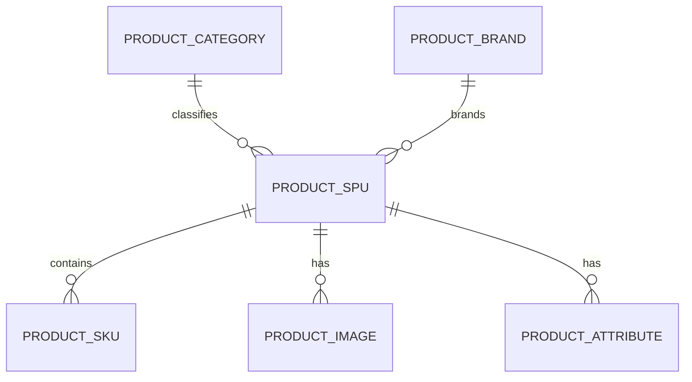
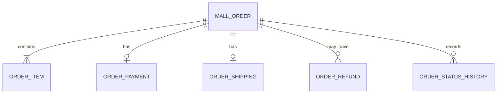
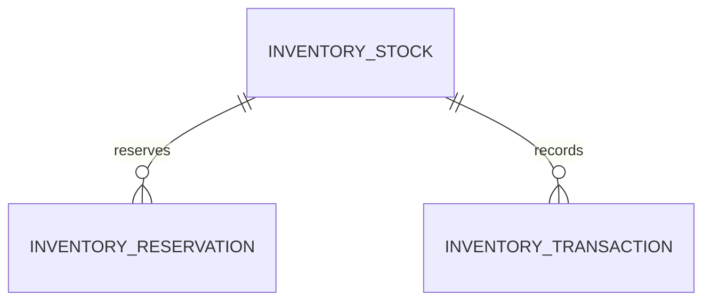
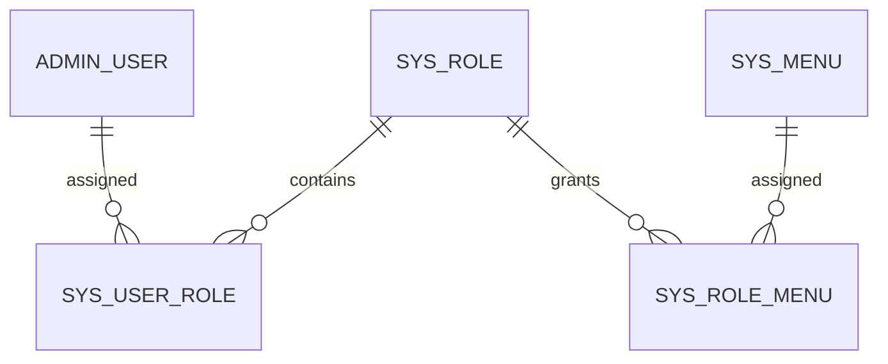

# AI 智能电商微服务平台——数据库设计

## 1. 文档信息

- **项目名称**：AI 智能电商微服务平台
- **英文名称**：AI-Powered E-Commerce Platform
- **项目代号**：AI Mall
- **仓库名称**：`ai-mall-platform`
- **文档名称**：数据库设计
- **文档路径**：`docs/09-数据库设计.md`
- **当前版本**：V0.1
- **文档状态**：初稿
- **关联文档**：
  - `docs/00-项目总览.md`
  - `docs/01-产品需求文档.md`
  - `docs/02-统一语言词汇表.md`
  - `docs/03-领域事件风暴.md`
  - `docs/04-子域与限界上下文.md`
  - `docs/05-上下文映射图.md`
  - `docs/06-聚合与领域模型设计.md`
  - `docs/07-核心业务流程.md`
  - `docs/08-系统与微服务架构.md`

### 1.1 版本记录

| 版本 | 日期 | 说明 |
|---|---|---|
| V0.1 | 初始版本 | 完成数据库划分、核心表结构、索引、约束、审计字段、消息表和数据迁移设计 |

---

## 2. 文档目的

本文档用于定义 AI 智能电商微服务平台的数据存储方案，明确：

1. 数据库和 Schema 如何划分；
2. 每个微服务拥有哪些数据；
3. 核心业务表如何设计；
4. 主键、业务编号和外部引用如何定义；
5. 字段类型、默认值和非空约束；
6. 唯一索引、普通索引和组合索引；
7. 乐观锁、逻辑删除和审计字段；
8. 商品、订单、库存、权限、配置和 AI 数据模型；
9. Outbox、消费幂等和补偿任务表；
10. 数据初始化、迁移、备份和恢复策略；
11. 哪些数据进入 MySQL、Redis、Elasticsearch、MinIO 和向量数据库；
12. 数据库设计如何与 DDD 聚合边界保持一致。

---

# 3. 数据库设计原则

## 3.1 每个服务拥有自己的数据

每个业务服务只访问自己的数据库。

禁止：

```text
mall-order 直接访问 mall-product_db
mall-inventory 直接访问 mall-order_db
ai-service 直接访问业务数据库
mall-search 直接查询商品 MySQL 表
```

允许：

```text
内部 API
集成事件
查询投影
订单快照
缓存
```

---

## 3.2 不建立跨上下文外键

例如订单表可以保存：

```text
member_id
product_id
sku_id
```

但不建立跨数据库外键。

原因：

- 服务独立部署；
- 数据库独立演化；
- 降低耦合；
- 避免跨库事务；
- 保持限界上下文边界。

外部 ID 只作为普通业务引用值保存。

---

## 3.3 聚合与事务边界一致

同一聚合需要在同一个数据库内持久化。

例如：

```text
Order
├── mall_order
├── order_item
├── order_shipping
└── order_status_history
```

创建订单时，这些表可以在同一个本地事务中写入。

---

## 3.4 领域对象和数据库对象分离

领域模型：

```text
Order
Money
ShippingAddressSnapshot
Inventory
```

持久化对象：

```text
OrderPO
OrderItemPO
InventoryStockPO
```

数据库结构不能直接决定领域对象结构。

---

## 3.5 金额不使用浮点类型

金额统一使用：

```text
BIGINT，单位为分
```

推荐字段：

```text
unit_price
line_amount
order_amount
refund_amount
```

均使用 `BIGINT`。

示例：

```text
299900 = 2999.00 元
```

---

## 3.6 时间统一

推荐 MySQL 字段：

```text
DATETIME(3)
```

应用统一使用：

```text
UTC 或明确的系统时区
```

API 对外使用 ISO 8601。

字段命名：

```text
created_at
updated_at
paid_at
shipped_at
completed_at
cancelled_at
```

---

## 3.7 核心交易数据不物理删除

以下数据原则上不物理删除：

- 订单；
- 订单明细；
- 支付记录；
- 退款记录；
- 库存流水；
- 库存锁定记录；
- 操作日志；
- 消息消费记录。

商品、角色、菜单等可使用逻辑删除。

---

## 3.8 核心业务使用数据库约束兜底

不能只依赖 Java 校验。

应使用：

- 唯一索引；
- 非空约束；
- 乐观锁；
- 条件更新；
- 状态校验；
- 业务唯一键；
- 幂等记录。

---

# 4. 数据库划分

## 4.1 MySQL 数据库

推荐一个 MySQL 实例内创建：

```text
mall_identity_db
mall_member_db
mall_product_db
mall_order_db
mall_inventory_db
mall_system_db
ai_db
```

购物车主要存储于 Redis。

搜索主要存储于 Elasticsearch。

原始文件存储于 MinIO。

RAG 向量存储于向量数据库。

---

## 4.2 服务与数据库映射

| 服务 | 数据库 |
|---|---|
| `mall-identity` | `mall_identity_db` |
| `mall-member` | `mall_member_db` |
| `mall-product` | `mall_product_db` |
| `mall-cart` | Redis |
| `mall-order` | `mall_order_db` |
| `mall-inventory` | `mall_inventory_db` |
| `mall-search` | Elasticsearch |
| `mall-system` | `mall_system_db` |
| `ai-service` | `ai_db` + 向量数据库 + MinIO |

---

# 5. 公共字段规范

## 5.1 基础字段

普通业务表建议包含：

```sql
id BIGINT NOT NULL,
created_at DATETIME(3) NOT NULL,
updated_at DATETIME(3) NOT NULL,
created_by BIGINT NULL,
updated_by BIGINT NULL,
version BIGINT NOT NULL DEFAULT 0,
deleted TINYINT NOT NULL DEFAULT 0
```

## 5.2 字段说明

| 字段 | 说明 |
|---|---|
| `id` | 数据库主键 |
| `created_at` | 创建时间 |
| `updated_at` | 更新时间 |
| `created_by` | 创建人 ID |
| `updated_by` | 更新人 ID |
| `version` | 乐观锁版本 |
| `deleted` | 逻辑删除标记 |

## 5.3 不同表的差异

交易流水表可以不使用 `deleted`。

例如：

```text
order_item
inventory_transaction
operation_log
message_consume_record
```

这些表不可逻辑删除。

---

# 6. 主键与业务编号

## 6.1 数据库主键

推荐：

```text
BIGINT
```

生成方式：

- 雪花算法；
- MyBatis-Plus ASSIGN_ID；
- 独立 ID 生成器。

不建议核心分布式业务完全依赖自增 ID。

## 6.2 业务编号

对外展示使用独立业务编号：

```text
order_no
payment_no
refund_no
reservation_no
product_code
sku_code
```

## 6.3 业务编号示例

```text
ORD202608010001
PAY202608010001
REF202608010001
RES202608010001
PRD000001
SKU000001
```

## 6.4 业务编号约束

- 唯一索引；
- 不包含数据库物理含义；
- 不复用；
- 不因数据删除重新使用；
- 可用于幂等和追踪。

---

# 7. mall_identity_db 设计

## 7.1 表清单

```text
admin_user
sys_role
sys_menu
sys_user_role
sys_role_menu
member_account
refresh_token
login_log
outbox_event
message_consume_record
```

---

## 7.2 admin_user

### 7.2.1 用途

存储后台管理员账号和状态。

### 7.2.2 表结构

```sql
CREATE TABLE admin_user (
    id BIGINT NOT NULL,
    account VARCHAR(64) NOT NULL,
    password_hash VARCHAR(255) NOT NULL,
    display_name VARCHAR(64) NOT NULL,
    avatar_url VARCHAR(512) NULL,
    status VARCHAR(32) NOT NULL,
    super_admin TINYINT NOT NULL DEFAULT 0,
    last_login_at DATETIME(3) NULL,
    password_updated_at DATETIME(3) NULL,
    created_at DATETIME(3) NOT NULL,
    updated_at DATETIME(3) NOT NULL,
    created_by BIGINT NULL,
    updated_by BIGINT NULL,
    version BIGINT NOT NULL DEFAULT 0,
    deleted TINYINT NOT NULL DEFAULT 0,
    PRIMARY KEY (id),
    UNIQUE KEY uk_admin_user_account (account, deleted),
    KEY idx_admin_user_status (status),
    KEY idx_admin_user_created_at (created_at)
);
```

### 7.2.3 状态

```text
ENABLED
DISABLED
LOCKED
```

### 7.2.4 约束

- `account` 唯一；
- `password_hash` 不允许为空；
- 超级管理员不能被普通管理员禁用；
- 密码不进入日志。

---

## 7.3 sys_role

```sql
CREATE TABLE sys_role (
    id BIGINT NOT NULL,
    role_code VARCHAR(64) NOT NULL,
    role_name VARCHAR(64) NOT NULL,
    description VARCHAR(255) NULL,
    status VARCHAR(32) NOT NULL,
    built_in TINYINT NOT NULL DEFAULT 0,
    sort_order INT NOT NULL DEFAULT 0,
    created_at DATETIME(3) NOT NULL,
    updated_at DATETIME(3) NOT NULL,
    created_by BIGINT NULL,
    updated_by BIGINT NULL,
    version BIGINT NOT NULL DEFAULT 0,
    deleted TINYINT NOT NULL DEFAULT 0,
    PRIMARY KEY (id),
    UNIQUE KEY uk_sys_role_code (role_code, deleted),
    KEY idx_sys_role_status (status)
);
```

状态：

```text
ENABLED
DISABLED
```

---

## 7.4 sys_menu

```sql
CREATE TABLE sys_menu (
    id BIGINT NOT NULL,
    parent_id BIGINT NULL,
    menu_name VARCHAR(64) NOT NULL,
    menu_type VARCHAR(32) NOT NULL,
    route_name VARCHAR(128) NULL,
    route_path VARCHAR(255) NULL,
    component_path VARCHAR(255) NULL,
    permission_code VARCHAR(128) NULL,
    icon VARCHAR(128) NULL,
    sort_order INT NOT NULL DEFAULT 0,
    visible TINYINT NOT NULL DEFAULT 1,
    cacheable TINYINT NOT NULL DEFAULT 0,
    status VARCHAR(32) NOT NULL,
    external_link TINYINT NOT NULL DEFAULT 0,
    link_url VARCHAR(512) NULL,
    created_at DATETIME(3) NOT NULL,
    updated_at DATETIME(3) NOT NULL,
    created_by BIGINT NULL,
    updated_by BIGINT NULL,
    version BIGINT NOT NULL DEFAULT 0,
    deleted TINYINT NOT NULL DEFAULT 0,
    PRIMARY KEY (id),
    UNIQUE KEY uk_sys_menu_permission (permission_code, deleted),
    KEY idx_sys_menu_parent (parent_id),
    KEY idx_sys_menu_type (menu_type),
    KEY idx_sys_menu_status (status),
    KEY idx_sys_menu_sort (sort_order)
);
```

菜单类型：

```text
DIRECTORY
PAGE
BUTTON
```

说明：

- 目录和页面可有路由；
- 按钮通常只配置权限编码；
- `permission_code` 允许目录为空；
- 唯一索引对 NULL 的处理需结合 MySQL 行为验证；
- 如需严格唯一，可使用单独权限表或业务校验。

---

## 7.5 sys_user_role

```sql
CREATE TABLE sys_user_role (
    id BIGINT NOT NULL,
    admin_user_id BIGINT NOT NULL,
    role_id BIGINT NOT NULL,
    created_at DATETIME(3) NOT NULL,
    created_by BIGINT NULL,
    PRIMARY KEY (id),
    UNIQUE KEY uk_user_role (admin_user_id, role_id),
    KEY idx_user_role_role (role_id)
);
```

不建立跨服务外键，但该表和 `admin_user`、`sys_role` 属于同一数据库，可以选择建立本库外键。

第一版建议仍不使用数据库外键，由应用层维护。

---

## 7.6 sys_role_menu

```sql
CREATE TABLE sys_role_menu (
    id BIGINT NOT NULL,
    role_id BIGINT NOT NULL,
    menu_id BIGINT NOT NULL,
    created_at DATETIME(3) NOT NULL,
    created_by BIGINT NULL,
    PRIMARY KEY (id),
    UNIQUE KEY uk_role_menu (role_id, menu_id),
    KEY idx_role_menu_menu (menu_id)
);
```

---

## 7.7 member_account

### 7.7.1 用途

存储商城会员登录凭据。

```sql
CREATE TABLE member_account (
    id BIGINT NOT NULL,
    member_id BIGINT NOT NULL,
    login_name VARCHAR(64) NOT NULL,
    password_hash VARCHAR(255) NOT NULL,
    status VARCHAR(32) NOT NULL,
    last_login_at DATETIME(3) NULL,
    password_updated_at DATETIME(3) NULL,
    created_at DATETIME(3) NOT NULL,
    updated_at DATETIME(3) NOT NULL,
    version BIGINT NOT NULL DEFAULT 0,
    deleted TINYINT NOT NULL DEFAULT 0,
    PRIMARY KEY (id),
    UNIQUE KEY uk_member_account_login_name (login_name, deleted),
    UNIQUE KEY uk_member_account_member_id (member_id, deleted),
    KEY idx_member_account_status (status)
);
```

`member_id` 是对 `mall_member_db.member.id` 的普通引用，不建立跨库外键。

---

## 7.8 refresh_token

```sql
CREATE TABLE refresh_token (
    id BIGINT NOT NULL,
    token_id VARCHAR(128) NOT NULL,
    subject_id BIGINT NOT NULL,
    subject_type VARCHAR(32) NOT NULL,
    token_hash VARCHAR(255) NOT NULL,
    expires_at DATETIME(3) NOT NULL,
    revoked TINYINT NOT NULL DEFAULT 0,
    revoked_at DATETIME(3) NULL,
    created_at DATETIME(3) NOT NULL,
    PRIMARY KEY (id),
    UNIQUE KEY uk_refresh_token_id (token_id),
    KEY idx_refresh_token_subject (subject_id, subject_type),
    KEY idx_refresh_token_expires (expires_at)
);
```

---

## 7.9 login_log

```sql
CREATE TABLE login_log (
    id BIGINT NOT NULL,
    subject_id BIGINT NULL,
    subject_type VARCHAR(32) NOT NULL,
    account VARCHAR(64) NULL,
    login_result VARCHAR(32) NOT NULL,
    failure_reason VARCHAR(255) NULL,
    ip_address VARCHAR(64) NULL,
    user_agent VARCHAR(512) NULL,
    trace_id VARCHAR(64) NULL,
    login_at DATETIME(3) NOT NULL,
    PRIMARY KEY (id),
    KEY idx_login_log_subject (subject_id, subject_type),
    KEY idx_login_log_result (login_result),
    KEY idx_login_log_time (login_at),
    KEY idx_login_log_trace (trace_id)
);
```

---

# 8. mall_member_db 设计

## 8.1 表清单

```text
member
member_profile
shipping_address
member_favorite
browsing_history
outbox_event
message_consume_record
```

---

## 8.2 member

```sql
CREATE TABLE member (
    id BIGINT NOT NULL,
    member_no VARCHAR(64) NOT NULL,
    nickname VARCHAR(64) NOT NULL,
    avatar_url VARCHAR(512) NULL,
    status VARCHAR(32) NOT NULL,
    registered_at DATETIME(3) NOT NULL,
    created_at DATETIME(3) NOT NULL,
    updated_at DATETIME(3) NOT NULL,
    version BIGINT NOT NULL DEFAULT 0,
    deleted TINYINT NOT NULL DEFAULT 0,
    PRIMARY KEY (id),
    UNIQUE KEY uk_member_no (member_no, deleted),
    KEY idx_member_status (status),
    KEY idx_member_registered_at (registered_at)
);
```

状态：

```text
ENABLED
DISABLED
```

---

## 8.3 member_profile

```sql
CREATE TABLE member_profile (
    id BIGINT NOT NULL,
    member_id BIGINT NOT NULL,
    real_name VARCHAR(64) NULL,
    gender VARCHAR(16) NULL,
    birthday DATE NULL,
    email VARCHAR(128) NULL,
    mobile VARCHAR(32) NULL,
    bio VARCHAR(255) NULL,
    created_at DATETIME(3) NOT NULL,
    updated_at DATETIME(3) NOT NULL,
    version BIGINT NOT NULL DEFAULT 0,
    PRIMARY KEY (id),
    UNIQUE KEY uk_member_profile_member (member_id),
    KEY idx_member_profile_mobile (mobile),
    KEY idx_member_profile_email (email)
);
```

说明：

- 第一版可只使用昵称和头像；
- 敏感字段是否存储需要遵守最小化原则；
- 手机号和邮箱展示时脱敏。

---

## 8.4 shipping_address

```sql
CREATE TABLE shipping_address (
    id BIGINT NOT NULL,
    member_id BIGINT NOT NULL,
    receiver_name VARCHAR(64) NOT NULL,
    receiver_phone VARCHAR(32) NOT NULL,
    province_code VARCHAR(32) NULL,
    province_name VARCHAR(64) NOT NULL,
    city_code VARCHAR(32) NULL,
    city_name VARCHAR(64) NOT NULL,
    district_code VARCHAR(32) NULL,
    district_name VARCHAR(64) NOT NULL,
    detail_address VARCHAR(255) NOT NULL,
    postal_code VARCHAR(16) NULL,
    default_flag TINYINT NOT NULL DEFAULT 0,
    status VARCHAR(32) NOT NULL DEFAULT 'ENABLED',
    created_at DATETIME(3) NOT NULL,
    updated_at DATETIME(3) NOT NULL,
    version BIGINT NOT NULL DEFAULT 0,
    deleted TINYINT NOT NULL DEFAULT 0,
    PRIMARY KEY (id),
    KEY idx_shipping_address_member (member_id, deleted),
    KEY idx_shipping_address_default (member_id, default_flag, deleted)
);
```

### 默认地址约束

MySQL 普通唯一索引难以直接表达“同一会员最多一个 default_flag=1”。

第一版通过：

- 应用服务本地事务；
- 更新旧默认地址；
- 再设置新默认地址；
- 必要时使用锁。

保证。

---

## 8.5 member_favorite

```sql
CREATE TABLE member_favorite (
    id BIGINT NOT NULL,
    member_id BIGINT NOT NULL,
    product_id BIGINT NOT NULL,
    created_at DATETIME(3) NOT NULL,
    PRIMARY KEY (id),
    UNIQUE KEY uk_member_favorite (member_id, product_id),
    KEY idx_favorite_product (product_id),
    KEY idx_favorite_created (created_at)
);
```

---

## 8.6 browsing_history

```sql
CREATE TABLE browsing_history (
    id BIGINT NOT NULL,
    member_id BIGINT NOT NULL,
    product_id BIGINT NOT NULL,
    last_browsed_at DATETIME(3) NOT NULL,
    browse_count INT NOT NULL DEFAULT 1,
    created_at DATETIME(3) NOT NULL,
    updated_at DATETIME(3) NOT NULL,
    PRIMARY KEY (id),
    UNIQUE KEY uk_browsing_history (member_id, product_id),
    KEY idx_browsing_member_time (member_id, last_browsed_at)
);
```

---

# 9. mall_product_db 设计

## 9.1 表清单

```text
product_spu
product_sku
product_category
product_brand
product_image
product_attribute
product_sku_spec
outbox_event
message_consume_record
```

---

## 9.2 product_spu

```sql
CREATE TABLE product_spu (
    id BIGINT NOT NULL,
    product_code VARCHAR(64) NOT NULL,
    product_name VARCHAR(255) NOT NULL,
    subtitle VARCHAR(255) NULL,
    description LONGTEXT NULL,
    category_id BIGINT NOT NULL,
    brand_id BIGINT NOT NULL,
    status VARCHAR(32) NOT NULL,
    min_price BIGINT NULL,
    max_price BIGINT NULL,
    main_image_url VARCHAR(512) NULL,
    sales_count BIGINT NOT NULL DEFAULT 0,
    published_at DATETIME(3) NULL,
    unpublished_at DATETIME(3) NULL,
    created_at DATETIME(3) NOT NULL,
    updated_at DATETIME(3) NOT NULL,
    created_by BIGINT NULL,
    updated_by BIGINT NULL,
    version BIGINT NOT NULL DEFAULT 0,
    deleted TINYINT NOT NULL DEFAULT 0,
    PRIMARY KEY (id),
    UNIQUE KEY uk_product_code (product_code, deleted),
    KEY idx_product_status (status),
    KEY idx_product_category (category_id, status),
    KEY idx_product_brand (brand_id, status),
    KEY idx_product_created (created_at),
    KEY idx_product_published (published_at)
);
```

状态：

```text
DRAFT
PUBLISHED
UNPUBLISHED
DISABLED
```

说明：

- `min_price` 和 `max_price` 是查询投影字段；
- 真实 SKU 价格仍在 `product_sku`；
- 商品价格变更后同步更新区间；
- `sales_count` 可为统计投影。

---

## 9.3 product_sku

```sql
CREATE TABLE product_sku (
    id BIGINT NOT NULL,
    product_id BIGINT NOT NULL,
    sku_code VARCHAR(64) NOT NULL,
    sale_price BIGINT NOT NULL,
    status VARCHAR(32) NOT NULL,
    main_image_url VARCHAR(512) NULL,
    specification_json JSON NOT NULL,
    specification_hash VARCHAR(128) NOT NULL,
    created_at DATETIME(3) NOT NULL,
    updated_at DATETIME(3) NOT NULL,
    created_by BIGINT NULL,
    updated_by BIGINT NULL,
    version BIGINT NOT NULL DEFAULT 0,
    deleted TINYINT NOT NULL DEFAULT 0,
    PRIMARY KEY (id),
    UNIQUE KEY uk_sku_code (sku_code, deleted),
    UNIQUE KEY uk_product_spec_hash (product_id, specification_hash, deleted),
    KEY idx_sku_product (product_id, status),
    KEY idx_sku_status (status),
    KEY idx_sku_price (sale_price)
);
```

### specification_json 示例

```json
{
  "颜色": "黑色",
  "存储": "256GB"
}
```

### specification_hash

将排序后的规格键值序列生成稳定哈希，防止同一商品下规格组合重复。

---

## 9.4 product_category

```sql
CREATE TABLE product_category (
    id BIGINT NOT NULL,
    parent_id BIGINT NULL,
    category_name VARCHAR(128) NOT NULL,
    category_code VARCHAR(64) NOT NULL,
    level INT NOT NULL,
    path VARCHAR(512) NULL,
    sort_order INT NOT NULL DEFAULT 0,
    status VARCHAR(32) NOT NULL,
    created_at DATETIME(3) NOT NULL,
    updated_at DATETIME(3) NOT NULL,
    created_by BIGINT NULL,
    updated_by BIGINT NULL,
    version BIGINT NOT NULL DEFAULT 0,
    deleted TINYINT NOT NULL DEFAULT 0,
    PRIMARY KEY (id),
    UNIQUE KEY uk_category_code (category_code, deleted),
    KEY idx_category_parent (parent_id),
    KEY idx_category_status (status),
    KEY idx_category_sort (sort_order)
);
```

---

## 9.5 product_brand

```sql
CREATE TABLE product_brand (
    id BIGINT NOT NULL,
    brand_code VARCHAR(64) NOT NULL,
    brand_name VARCHAR(128) NOT NULL,
    logo_url VARCHAR(512) NULL,
    description VARCHAR(512) NULL,
    sort_order INT NOT NULL DEFAULT 0,
    status VARCHAR(32) NOT NULL,
    created_at DATETIME(3) NOT NULL,
    updated_at DATETIME(3) NOT NULL,
    created_by BIGINT NULL,
    updated_by BIGINT NULL,
    version BIGINT NOT NULL DEFAULT 0,
    deleted TINYINT NOT NULL DEFAULT 0,
    PRIMARY KEY (id),
    UNIQUE KEY uk_brand_code (brand_code, deleted),
    UNIQUE KEY uk_brand_name (brand_name, deleted),
    KEY idx_brand_status (status)
);
```

---

## 9.6 product_image

```sql
CREATE TABLE product_image (
    id BIGINT NOT NULL,
    product_id BIGINT NOT NULL,
    sku_id BIGINT NULL,
    image_type VARCHAR(32) NOT NULL,
    object_key VARCHAR(512) NOT NULL,
    image_url VARCHAR(512) NOT NULL,
    sort_order INT NOT NULL DEFAULT 0,
    main_flag TINYINT NOT NULL DEFAULT 0,
    created_at DATETIME(3) NOT NULL,
    created_by BIGINT NULL,
    PRIMARY KEY (id),
    KEY idx_product_image_product (product_id, image_type),
    KEY idx_product_image_sku (sku_id),
    KEY idx_product_image_sort (product_id, sort_order)
);
```

图片类型：

```text
MAIN
GALLERY
DETAIL
SKU
```

---

## 9.7 product_attribute

```sql
CREATE TABLE product_attribute (
    id BIGINT NOT NULL,
    product_id BIGINT NOT NULL,
    attribute_name VARCHAR(128) NOT NULL,
    attribute_value VARCHAR(512) NOT NULL,
    sort_order INT NOT NULL DEFAULT 0,
    created_at DATETIME(3) NOT NULL,
    updated_at DATETIME(3) NOT NULL,
    PRIMARY KEY (id),
    UNIQUE KEY uk_product_attribute (product_id, attribute_name),
    KEY idx_product_attribute_product (product_id, sort_order)
);
```

---

## 9.8 product_sku_spec

第一版已经在 `product_sku.specification_json` 保存规格。

如果后续需要复杂筛选，可增加规格明细表：

```sql
CREATE TABLE product_sku_spec (
    id BIGINT NOT NULL,
    product_id BIGINT NOT NULL,
    sku_id BIGINT NOT NULL,
    spec_name VARCHAR(128) NOT NULL,
    spec_value VARCHAR(128) NOT NULL,
    sort_order INT NOT NULL DEFAULT 0,
    PRIMARY KEY (id),
    UNIQUE KEY uk_sku_spec_name (sku_id, spec_name),
    KEY idx_product_spec (product_id, spec_name, spec_value)
);
```

第一版可以暂不使用该表。

---

# 10. 购物车 Redis 设计

## 10.1 Key

```text
aimall:{env}:cart:member:{memberId}
```

游客：

```text
aimall:{env}:cart:guest:{guestId}
```

## 10.2 数据结构

推荐 Redis Hash。

Hash Key：

```text
skuId
```

Hash Value：

```json
{
  "productId": "10001",
  "skuId": "11001",
  "quantity": 2,
  "selected": true,
  "addedAt": "2026-08-01T10:00:00Z",
  "cachedProductName": "示例商品",
  "cachedSkuSpecification": "黑色 / 256GB",
  "cachedImage": "https://...",
  "cachedPrice": 299900
}
```

## 10.3 TTL

建议：

```text
30 天
```

每次修改购物车刷新 TTL。

## 10.4 规则

- Redis 购物车不是订单成交依据；
- 结算时重新查询商品和库存；
- 相同 SKU 使用同一 Hash Field；
- 游客登录后合并；
- 合并后删除游客 Key；
- 数据量较大时可拆分商品摘要和状态。

---

# 11. mall_order_db 设计

## 11.1 表清单

```text
mall_order
order_item
order_payment
order_shipping
order_refund
order_status_history
order_idempotency
order_timeout_task
outbox_event
message_consume_record
compensation_task
```

---

## 11.2 mall_order

```sql
CREATE TABLE mall_order (
    id BIGINT NOT NULL,
    order_no VARCHAR(64) NOT NULL,
    member_id BIGINT NOT NULL,
    order_source VARCHAR(32) NOT NULL,
    order_status VARCHAR(32) NOT NULL,
    order_amount BIGINT NOT NULL,
    currency VARCHAR(8) NOT NULL DEFAULT 'CNY',
    item_count INT NOT NULL,
    receiver_name VARCHAR(64) NOT NULL,
    receiver_phone VARCHAR(32) NOT NULL,
    province_name VARCHAR(64) NOT NULL,
    city_name VARCHAR(64) NOT NULL,
    district_name VARCHAR(64) NOT NULL,
    detail_address VARCHAR(255) NOT NULL,
    postal_code VARCHAR(16) NULL,
    order_remark VARCHAR(255) NULL,
    payment_deadline DATETIME(3) NOT NULL,
    paid_at DATETIME(3) NULL,
    shipped_at DATETIME(3) NULL,
    completed_at DATETIME(3) NULL,
    cancelled_at DATETIME(3) NULL,
    cancel_reason VARCHAR(64) NULL,
    refund_status VARCHAR(32) NULL,
    reservation_no VARCHAR(64) NOT NULL,
    created_at DATETIME(3) NOT NULL,
    updated_at DATETIME(3) NOT NULL,
    version BIGINT NOT NULL DEFAULT 0,
    PRIMARY KEY (id),
    UNIQUE KEY uk_order_no (order_no),
    UNIQUE KEY uk_order_reservation_no (reservation_no),
    KEY idx_order_member_status (member_id, order_status),
    KEY idx_order_member_created (member_id, created_at),
    KEY idx_order_status_created (order_status, created_at),
    KEY idx_order_payment_deadline (order_status, payment_deadline),
    KEY idx_order_paid_at (paid_at),
    KEY idx_order_created_at (created_at)
);
```

订单状态：

```text
PENDING_PAYMENT
PENDING_SHIPMENT
SHIPPED
COMPLETED
CANCELLED
REFUNDING
REFUNDED
```

---

## 11.3 order_item

```sql
CREATE TABLE order_item (
    id BIGINT NOT NULL,
    order_id BIGINT NOT NULL,
    order_no VARCHAR(64) NOT NULL,
    product_id BIGINT NOT NULL,
    sku_id BIGINT NOT NULL,
    product_name VARCHAR(255) NOT NULL,
    sku_specification_json JSON NOT NULL,
    product_image_url VARCHAR(512) NULL,
    unit_price BIGINT NOT NULL,
    quantity INT NOT NULL,
    line_amount BIGINT NOT NULL,
    created_at DATETIME(3) NOT NULL,
    PRIMARY KEY (id),
    KEY idx_order_item_order_id (order_id),
    KEY idx_order_item_order_no (order_no),
    KEY idx_order_item_product (product_id),
    KEY idx_order_item_sku (sku_id)
);
```

约束：

```text
line_amount = unit_price × quantity
```

由应用层和领域层保证。

---

## 11.4 order_payment

```sql
CREATE TABLE order_payment (
    id BIGINT NOT NULL,
    payment_no VARCHAR(64) NOT NULL,
    order_id BIGINT NOT NULL,
    order_no VARCHAR(64) NOT NULL,
    payment_type VARCHAR(32) NOT NULL,
    payment_status VARCHAR(32) NOT NULL,
    payment_amount BIGINT NOT NULL,
    currency VARCHAR(8) NOT NULL DEFAULT 'CNY',
    paid_at DATETIME(3) NULL,
    failure_reason VARCHAR(255) NULL,
    created_at DATETIME(3) NOT NULL,
    updated_at DATETIME(3) NOT NULL,
    version BIGINT NOT NULL DEFAULT 0,
    PRIMARY KEY (id),
    UNIQUE KEY uk_payment_no (payment_no),
    UNIQUE KEY uk_payment_order_type (order_no, payment_type),
    KEY idx_payment_order_id (order_id),
    KEY idx_payment_status (payment_status),
    KEY idx_payment_created_at (created_at)
);
```

支付类型：

```text
SIMULATED
```

支付状态：

```text
PENDING
SUCCEEDED
FAILED
```

---

## 11.5 order_shipping

```sql
CREATE TABLE order_shipping (
    id BIGINT NOT NULL,
    order_id BIGINT NOT NULL,
    order_no VARCHAR(64) NOT NULL,
    logistics_company VARCHAR(128) NOT NULL,
    tracking_number VARCHAR(128) NOT NULL,
    shipping_remark VARCHAR(255) NULL,
    shipped_by BIGINT NOT NULL,
    shipped_at DATETIME(3) NOT NULL,
    created_at DATETIME(3) NOT NULL,
    updated_at DATETIME(3) NOT NULL,
    PRIMARY KEY (id),
    UNIQUE KEY uk_shipping_order (order_id),
    KEY idx_shipping_tracking (tracking_number),
    KEY idx_shipping_time (shipped_at)
);
```

---

## 11.6 order_refund

```sql
CREATE TABLE order_refund (
    id BIGINT NOT NULL,
    refund_no VARCHAR(64) NOT NULL,
    order_id BIGINT NOT NULL,
    order_no VARCHAR(64) NOT NULL,
    member_id BIGINT NOT NULL,
    refund_amount BIGINT NOT NULL,
    refund_reason VARCHAR(512) NOT NULL,
    refund_status VARCHAR(32) NOT NULL,
    reviewer_id BIGINT NULL,
    review_remark VARCHAR(512) NULL,
    reviewed_at DATETIME(3) NULL,
    completed_at DATETIME(3) NULL,
    created_at DATETIME(3) NOT NULL,
    updated_at DATETIME(3) NOT NULL,
    version BIGINT NOT NULL DEFAULT 0,
    PRIMARY KEY (id),
    UNIQUE KEY uk_refund_no (refund_no),
    KEY idx_refund_order (order_id),
    KEY idx_refund_member (member_id),
    KEY idx_refund_status_created (refund_status, created_at)
);
```

退款状态：

```text
PENDING_REVIEW
APPROVED
REJECTED
COMPLETED
CANCELLED
```

### 进行中退款唯一性

MySQL 无法简单通过普通索引表达“同一订单只能有一个进行中退款”。

第一版通过：

- 应用层查询；
- 本地事务；
- 必要时使用订单行锁；
- 数据库辅助字段 `active_flag`。

可增加：

```sql
active_flag TINYINT NOT NULL DEFAULT 1
```

并建立：

```sql
UNIQUE KEY uk_order_active_refund (order_id, active_flag)
```

完成或拒绝后设置 `active_flag=0`。

---

## 11.7 order_status_history

```sql
CREATE TABLE order_status_history (
    id BIGINT NOT NULL,
    order_id BIGINT NOT NULL,
    order_no VARCHAR(64) NOT NULL,
    from_status VARCHAR(32) NULL,
    to_status VARCHAR(32) NOT NULL,
    action VARCHAR(64) NOT NULL,
    operator_id BIGINT NULL,
    operator_type VARCHAR(32) NOT NULL,
    remark VARCHAR(512) NULL,
    trace_id VARCHAR(64) NULL,
    occurred_at DATETIME(3) NOT NULL,
    PRIMARY KEY (id),
    KEY idx_order_history_order (order_id, occurred_at),
    KEY idx_order_history_order_no (order_no),
    KEY idx_order_history_trace (trace_id)
);
```

---

## 11.8 order_idempotency

```sql
CREATE TABLE order_idempotency (
    id BIGINT NOT NULL,
    idempotency_token VARCHAR(128) NOT NULL,
    member_id BIGINT NOT NULL,
    request_hash VARCHAR(128) NOT NULL,
    order_id BIGINT NULL,
    order_no VARCHAR(64) NULL,
    status VARCHAR(32) NOT NULL,
    expires_at DATETIME(3) NOT NULL,
    created_at DATETIME(3) NOT NULL,
    updated_at DATETIME(3) NOT NULL,
    PRIMARY KEY (id),
    UNIQUE KEY uk_order_idempotency_token (idempotency_token),
    KEY idx_order_idempotency_member (member_id),
    KEY idx_order_idempotency_expire (expires_at)
);
```

状态：

```text
CREATED
PROCESSING
SUCCEEDED
FAILED
```

---

## 11.9 order_timeout_task

```sql
CREATE TABLE order_timeout_task (
    id BIGINT NOT NULL,
    order_id BIGINT NOT NULL,
    order_no VARCHAR(64) NOT NULL,
    execute_at DATETIME(3) NOT NULL,
    task_status VARCHAR(32) NOT NULL,
    retry_count INT NOT NULL DEFAULT 0,
    last_error VARCHAR(512) NULL,
    next_retry_at DATETIME(3) NULL,
    created_at DATETIME(3) NOT NULL,
    updated_at DATETIME(3) NOT NULL,
    PRIMARY KEY (id),
    UNIQUE KEY uk_order_timeout_order (order_id),
    KEY idx_timeout_task_execute (task_status, execute_at),
    KEY idx_timeout_task_retry (task_status, next_retry_at)
);
```

该表作为 RocketMQ 延迟消息的补偿基础。

---

# 12. mall_inventory_db 设计

## 12.1 表清单

```text
inventory_stock
inventory_reservation
inventory_transaction
inventory_compensation_task
outbox_event
message_consume_record
```

---

## 12.2 inventory_stock

```sql
CREATE TABLE inventory_stock (
    id BIGINT NOT NULL,
    sku_id BIGINT NOT NULL,
    total_quantity BIGINT NOT NULL,
    available_quantity BIGINT NOT NULL,
    reserved_quantity BIGINT NOT NULL,
    sold_quantity BIGINT NOT NULL,
    low_stock_threshold BIGINT NOT NULL DEFAULT 0,
    status VARCHAR(32) NOT NULL,
    created_at DATETIME(3) NOT NULL,
    updated_at DATETIME(3) NOT NULL,
    version BIGINT NOT NULL DEFAULT 0,
    PRIMARY KEY (id),
    UNIQUE KEY uk_inventory_sku (sku_id),
    KEY idx_inventory_status (status),
    KEY idx_inventory_available (available_quantity),
    KEY idx_inventory_low_stock (status, available_quantity, low_stock_threshold)
);
```

状态：

```text
ACTIVE
DISABLED
```

业务约束：

```text
total_quantity >= 0
available_quantity >= 0
reserved_quantity >= 0
sold_quantity >= 0
```

MySQL 8 可使用 CHECK，但仍需要应用层保证。

---

## 12.3 inventory_reservation

```sql
CREATE TABLE inventory_reservation (
    id BIGINT NOT NULL,
    reservation_no VARCHAR(64) NOT NULL,
    business_no VARCHAR(64) NOT NULL,
    sku_id BIGINT NOT NULL,
    quantity BIGINT NOT NULL,
    reservation_status VARCHAR(32) NOT NULL,
    reserved_at DATETIME(3) NOT NULL,
    released_at DATETIME(3) NULL,
    deducted_at DATETIME(3) NULL,
    created_at DATETIME(3) NOT NULL,
    updated_at DATETIME(3) NOT NULL,
    version BIGINT NOT NULL DEFAULT 0,
    PRIMARY KEY (id),
    UNIQUE KEY uk_reservation_no_sku (reservation_no, sku_id),
    UNIQUE KEY uk_business_sku (business_no, sku_id),
    KEY idx_reservation_status (reservation_status),
    KEY idx_reservation_business (business_no),
    KEY idx_reservation_sku_status (sku_id, reservation_status)
);
```

状态：

```text
RESERVED
RELEASED
DEDUCTED
```

---

## 12.4 inventory_transaction

```sql
CREATE TABLE inventory_transaction (
    id BIGINT NOT NULL,
    sku_id BIGINT NOT NULL,
    transaction_no VARCHAR(64) NOT NULL,
    transaction_type VARCHAR(32) NOT NULL,
    business_no VARCHAR(64) NULL,
    quantity_change BIGINT NOT NULL,
    available_before BIGINT NOT NULL,
    available_after BIGINT NOT NULL,
    reserved_before BIGINT NOT NULL,
    reserved_after BIGINT NOT NULL,
    sold_before BIGINT NOT NULL,
    sold_after BIGINT NOT NULL,
    operator_id BIGINT NULL,
    operator_type VARCHAR(32) NOT NULL,
    reason VARCHAR(512) NULL,
    trace_id VARCHAR(64) NULL,
    occurred_at DATETIME(3) NOT NULL,
    PRIMARY KEY (id),
    UNIQUE KEY uk_inventory_transaction_no (transaction_no),
    KEY idx_inventory_tx_sku_time (sku_id, occurred_at),
    KEY idx_inventory_tx_business (business_no),
    KEY idx_inventory_tx_type (transaction_type),
    KEY idx_inventory_tx_trace (trace_id)
);
```

类型：

```text
INITIALIZE
INCREASE
DECREASE
RESERVE
RELEASE
DEDUCT
COMPENSATE
```

---

## 12.5 inventory_compensation_task

```sql
CREATE TABLE inventory_compensation_task (
    id BIGINT NOT NULL,
    task_type VARCHAR(32) NOT NULL,
    business_no VARCHAR(64) NOT NULL,
    reservation_no VARCHAR(64) NULL,
    task_status VARCHAR(32) NOT NULL,
    retry_count INT NOT NULL DEFAULT 0,
    max_retry_count INT NOT NULL DEFAULT 10,
    next_retry_at DATETIME(3) NULL,
    last_error VARCHAR(1024) NULL,
    created_at DATETIME(3) NOT NULL,
    updated_at DATETIME(3) NOT NULL,
    PRIMARY KEY (id),
    UNIQUE KEY uk_inventory_compensation (task_type, business_no),
    KEY idx_inventory_compensation_retry (task_status, next_retry_at)
);
```

任务类型：

```text
RELEASE_RESERVATION
CONFIRM_DEDUCTION
```

---

# 13. mall_system_db 设计

## 13.1 表清单

```text
feature_config
system_parameter
operation_log
configuration_history
outbox_event
message_consume_record
```

---

## 13.2 feature_config

```sql
CREATE TABLE feature_config (
    id BIGINT NOT NULL,
    config_key VARCHAR(128) NOT NULL,
    feature_name VARCHAR(128) NOT NULL,
    config_group VARCHAR(64) NOT NULL,
    enabled TINYINT NOT NULL DEFAULT 0,
    public_flag TINYINT NOT NULL DEFAULT 0,
    built_in TINYINT NOT NULL DEFAULT 0,
    description VARCHAR(512) NULL,
    created_at DATETIME(3) NOT NULL,
    updated_at DATETIME(3) NOT NULL,
    created_by BIGINT NULL,
    updated_by BIGINT NULL,
    version BIGINT NOT NULL DEFAULT 0,
    deleted TINYINT NOT NULL DEFAULT 0,
    PRIMARY KEY (id),
    UNIQUE KEY uk_feature_config_key (config_key, deleted),
    KEY idx_feature_group (config_group),
    KEY idx_feature_public (public_flag)
);
```

示例键：

```text
member.register.enabled
refund.enabled
ai.shopping.enabled
ai.compare.enabled
payment.simulation.enabled
```

---

## 13.3 system_parameter

```sql
CREATE TABLE system_parameter (
    id BIGINT NOT NULL,
    config_key VARCHAR(128) NOT NULL,
    parameter_name VARCHAR(128) NOT NULL,
    parameter_type VARCHAR(32) NOT NULL,
    config_value VARCHAR(1024) NOT NULL,
    default_value VARCHAR(1024) NOT NULL,
    min_value VARCHAR(128) NULL,
    max_value VARCHAR(128) NULL,
    config_group VARCHAR(64) NOT NULL,
    public_flag TINYINT NOT NULL DEFAULT 0,
    built_in TINYINT NOT NULL DEFAULT 0,
    description VARCHAR(512) NULL,
    created_at DATETIME(3) NOT NULL,
    updated_at DATETIME(3) NOT NULL,
    created_by BIGINT NULL,
    updated_by BIGINT NULL,
    version BIGINT NOT NULL DEFAULT 0,
    deleted TINYINT NOT NULL DEFAULT 0,
    PRIMARY KEY (id),
    UNIQUE KEY uk_system_parameter_key (config_key, deleted),
    KEY idx_parameter_group (config_group),
    KEY idx_parameter_public (public_flag)
);
```

类型：

```text
STRING
INTEGER
LONG
DECIMAL
BOOLEAN
DURATION
```

---

## 13.4 operation_log

```sql
CREATE TABLE operation_log (
    id BIGINT NOT NULL,
    operation_id VARCHAR(64) NOT NULL,
    operator_id BIGINT NULL,
    operator_name VARCHAR(128) NULL,
    operator_type VARCHAR(32) NOT NULL,
    module VARCHAR(64) NOT NULL,
    action VARCHAR(64) NOT NULL,
    resource_type VARCHAR(64) NULL,
    resource_id VARCHAR(128) NULL,
    request_path VARCHAR(512) NULL,
    http_method VARCHAR(16) NULL,
    request_summary TEXT NULL,
    result VARCHAR(32) NOT NULL,
    error_code VARCHAR(64) NULL,
    error_message VARCHAR(1024) NULL,
    ip_address VARCHAR(64) NULL,
    user_agent VARCHAR(512) NULL,
    trace_id VARCHAR(64) NULL,
    duration_ms BIGINT NULL,
    occurred_at DATETIME(3) NOT NULL,
    PRIMARY KEY (id),
    UNIQUE KEY uk_operation_id (operation_id),
    KEY idx_operation_operator (operator_id, occurred_at),
    KEY idx_operation_module_action (module, action),
    KEY idx_operation_resource (resource_type, resource_id),
    KEY idx_operation_trace (trace_id),
    KEY idx_operation_time (occurred_at)
);
```

---

## 13.5 configuration_history

```sql
CREATE TABLE configuration_history (
    id BIGINT NOT NULL,
    config_type VARCHAR(32) NOT NULL,
    config_key VARCHAR(128) NOT NULL,
    old_value VARCHAR(1024) NULL,
    new_value VARCHAR(1024) NULL,
    changed_by BIGINT NOT NULL,
    change_reason VARCHAR(512) NULL,
    trace_id VARCHAR(64) NULL,
    changed_at DATETIME(3) NOT NULL,
    PRIMARY KEY (id),
    KEY idx_config_history_key (config_type, config_key, changed_at),
    KEY idx_config_history_user (changed_by, changed_at)
);
```

---

# 14. ai_db 设计

## 14.1 表清单

```text
ai_conversation
ai_message
ai_tool_call
ai_knowledge_base
ai_document
ai_prompt
ai_prompt_version
ai_execution_log
outbox_event
message_consume_record
```

---

## 14.2 ai_conversation

```sql
CREATE TABLE ai_conversation (
    id BIGINT NOT NULL,
    conversation_id VARCHAR(64) NOT NULL,
    subject_id BIGINT NULL,
    subject_type VARCHAR(32) NOT NULL,
    conversation_type VARCHAR(32) NOT NULL,
    conversation_status VARCHAR(32) NOT NULL,
    round_count INT NOT NULL DEFAULT 0,
    max_rounds INT NOT NULL,
    title VARCHAR(255) NULL,
    created_at DATETIME(3) NOT NULL,
    updated_at DATETIME(3) NOT NULL,
    completed_at DATETIME(3) NULL,
    PRIMARY KEY (id),
    UNIQUE KEY uk_ai_conversation_id (conversation_id),
    KEY idx_ai_conversation_subject (subject_id, subject_type),
    KEY idx_ai_conversation_type (conversation_type),
    KEY idx_ai_conversation_created (created_at)
);
```

会话类型：

```text
SHOPPING_ASSISTANT
PRODUCT_COMPARISON
CUSTOMER_SERVICE
ORDER_ASSISTANT
```

状态：

```text
ACTIVE
COMPLETED
FAILED
EXPIRED
```

---

## 14.3 ai_message

```sql
CREATE TABLE ai_message (
    id BIGINT NOT NULL,
    conversation_id VARCHAR(64) NOT NULL,
    message_id VARCHAR(64) NOT NULL,
    message_role VARCHAR(32) NOT NULL,
    content LONGTEXT NOT NULL,
    content_type VARCHAR(32) NOT NULL DEFAULT 'TEXT',
    tool_call_id VARCHAR(64) NULL,
    token_count INT NULL,
    created_at DATETIME(3) NOT NULL,
    PRIMARY KEY (id),
    UNIQUE KEY uk_ai_message_id (message_id),
    KEY idx_ai_message_conversation (conversation_id, created_at),
    KEY idx_ai_message_tool_call (tool_call_id)
);
```

角色：

```text
SYSTEM
USER
ASSISTANT
TOOL
```

---

## 14.4 ai_tool_call

```sql
CREATE TABLE ai_tool_call (
    id BIGINT NOT NULL,
    tool_call_id VARCHAR(64) NOT NULL,
    conversation_id VARCHAR(64) NOT NULL,
    tool_name VARCHAR(128) NOT NULL,
    request_payload JSON NULL,
    response_payload JSON NULL,
    call_status VARCHAR(32) NOT NULL,
    error_message VARCHAR(1024) NULL,
    duration_ms BIGINT NULL,
    trace_id VARCHAR(64) NULL,
    created_at DATETIME(3) NOT NULL,
    completed_at DATETIME(3) NULL,
    PRIMARY KEY (id),
    UNIQUE KEY uk_ai_tool_call_id (tool_call_id),
    KEY idx_ai_tool_conversation (conversation_id, created_at),
    KEY idx_ai_tool_name_status (tool_name, call_status),
    KEY idx_ai_tool_trace (trace_id)
);
```

状态：

```text
PENDING
SUCCEEDED
FAILED
CANCELLED
```

---

## 14.5 ai_knowledge_base

```sql
CREATE TABLE ai_knowledge_base (
    id BIGINT NOT NULL,
    knowledge_base_id VARCHAR(64) NOT NULL,
    name VARCHAR(128) NOT NULL,
    description VARCHAR(512) NULL,
    status VARCHAR(32) NOT NULL,
    created_at DATETIME(3) NOT NULL,
    updated_at DATETIME(3) NOT NULL,
    created_by BIGINT NULL,
    updated_by BIGINT NULL,
    version BIGINT NOT NULL DEFAULT 0,
    deleted TINYINT NOT NULL DEFAULT 0,
    PRIMARY KEY (id),
    UNIQUE KEY uk_knowledge_base_id (knowledge_base_id),
    UNIQUE KEY uk_knowledge_base_name (name, deleted),
    KEY idx_knowledge_base_status (status)
);
```

---

## 14.6 ai_document

```sql
CREATE TABLE ai_document (
    id BIGINT NOT NULL,
    document_id VARCHAR(64) NOT NULL,
    knowledge_base_id VARCHAR(64) NOT NULL,
    file_name VARCHAR(255) NOT NULL,
    file_type VARCHAR(64) NOT NULL,
    file_size BIGINT NOT NULL,
    object_key VARCHAR(512) NOT NULL,
    document_status VARCHAR(32) NOT NULL,
    chunk_count INT NOT NULL DEFAULT 0,
    checksum VARCHAR(128) NULL,
    error_message VARCHAR(1024) NULL,
    uploaded_by BIGINT NOT NULL,
    uploaded_at DATETIME(3) NOT NULL,
    parsed_at DATETIME(3) NULL,
    indexed_at DATETIME(3) NULL,
    updated_at DATETIME(3) NOT NULL,
    version BIGINT NOT NULL DEFAULT 0,
    deleted TINYINT NOT NULL DEFAULT 0,
    PRIMARY KEY (id),
    UNIQUE KEY uk_ai_document_id (document_id),
    UNIQUE KEY uk_ai_document_checksum (knowledge_base_id, checksum, deleted),
    KEY idx_ai_document_kb_status (knowledge_base_id, document_status),
    KEY idx_ai_document_uploaded (uploaded_at)
);
```

状态：

```text
UPLOADED
PARSING
PARSED
INDEXING
INDEXED
FAILED
DISABLED
```

---

## 14.7 ai_prompt

```sql
CREATE TABLE ai_prompt (
    id BIGINT NOT NULL,
    prompt_code VARCHAR(128) NOT NULL,
    prompt_name VARCHAR(128) NOT NULL,
    prompt_type VARCHAR(32) NOT NULL,
    active_version VARCHAR(32) NULL,
    status VARCHAR(32) NOT NULL,
    description VARCHAR(512) NULL,
    created_at DATETIME(3) NOT NULL,
    updated_at DATETIME(3) NOT NULL,
    created_by BIGINT NULL,
    updated_by BIGINT NULL,
    PRIMARY KEY (id),
    UNIQUE KEY uk_ai_prompt_code (prompt_code),
    KEY idx_ai_prompt_status (status)
);
```

---

## 14.8 ai_prompt_version

```sql
CREATE TABLE ai_prompt_version (
    id BIGINT NOT NULL,
    prompt_code VARCHAR(128) NOT NULL,
    version_no VARCHAR(32) NOT NULL,
    prompt_content LONGTEXT NOT NULL,
    model_name VARCHAR(128) NULL,
    temperature DECIMAL(5,4) NULL,
    response_schema JSON NULL,
    published TINYINT NOT NULL DEFAULT 0,
    created_at DATETIME(3) NOT NULL,
    created_by BIGINT NOT NULL,
    PRIMARY KEY (id),
    UNIQUE KEY uk_prompt_version (prompt_code, version_no),
    KEY idx_prompt_version_published (prompt_code, published)
);
```

---

# 15. Elasticsearch 索引设计

## 15.1 索引名称

```text
aimall_product_v1
```

别名：

```text
aimall_product
```

## 15.2 文档示例

```json
{
  "productId": "10001",
  "productCode": "PRD000001",
  "productName": "示例笔记本电脑",
  "subtitle": "轻薄高性能",
  "categoryId": "20001",
  "categoryName": "笔记本电脑",
  "brandId": "30001",
  "brandName": "示例品牌",
  "keywords": ["轻薄", "编程", "学生"],
  "attributes": {
    "屏幕尺寸": "14 英寸",
    "处理器": "示例处理器"
  },
  "minPrice": 299900,
  "maxPrice": 399900,
  "mainImage": "https://...",
  "published": true,
  "available": true,
  "salesCount": 100,
  "updatedAt": "2026-08-01T10:00:00Z"
}
```

## 15.3 Mapping 原则

- 商品名称使用中文分词；
- 品牌和分类使用 keyword；
- 价格使用 long；
- 属性可使用 flattened 或 nested；
- 关键词支持全文检索；
- `productId` 使用 keyword；
- `published` 和 `available` 使用 boolean。

## 15.4 索引重建

```text
创建 aimall_product_v2
→ 全量写入
→ 校验
→ 别名从 v1 切换到 v2
→ 删除旧索引
```

---

# 16. MinIO 对象结构

## 16.1 Bucket

建议：

```text
aimall-public
aimall-private
```

## 16.2 公共对象

```text
products/{productId}/main/{fileName}
products/{productId}/gallery/{fileName}
brands/{brandId}/{fileName}
avatars/{memberId}/{fileName}
```

## 16.3 私有对象

```text
knowledge-bases/{knowledgeBaseId}/{documentId}/{fileName}
exports/{subjectId}/{fileName}
```

## 16.4 数据库存储

数据库只保存：

```text
object_key
file_name
file_size
file_type
checksum
```

公开 URL 可以动态生成，不建议长期保存带签名 URL。

---

# 17. 向量数据库设计

## 17.1 Collection

```text
knowledge_chunks
```

## 17.2 元数据

```json
{
  "knowledgeBaseId": "kb-001",
  "documentId": "doc-001",
  "chunkId": "chunk-001",
  "chunkIndex": 1,
  "sourceFileName": "退款规则.pdf",
  "content": "退款申请应在……",
  "enabled": true
}
```

## 17.3 规则

- 文档删除后同步删除向量；
- 文档禁用后不参与召回；
- 分块保留来源；
- 向量索引可重建；
- 原始文档仍在 MinIO；
- MySQL 保存处理状态；
- 向量库不是文档权威来源。

---

# 18. Outbox 设计

## 18.1 用途

保证本地业务事务和待发送集成事件在同一数据库事务中提交。

## 18.2 表结构

每个需要发布事件的服务数据库均可建立：

```sql
CREATE TABLE outbox_event (
    id BIGINT NOT NULL,
    event_id VARCHAR(64) NOT NULL,
    aggregate_type VARCHAR(64) NOT NULL,
    aggregate_id VARCHAR(64) NOT NULL,
    event_type VARCHAR(128) NOT NULL,
    event_version VARCHAR(16) NOT NULL,
    topic VARCHAR(128) NOT NULL,
    tag VARCHAR(128) NULL,
    payload JSON NOT NULL,
    trace_id VARCHAR(64) NULL,
    event_status VARCHAR(32) NOT NULL,
    retry_count INT NOT NULL DEFAULT 0,
    next_retry_at DATETIME(3) NULL,
    last_error VARCHAR(1024) NULL,
    occurred_at DATETIME(3) NOT NULL,
    created_at DATETIME(3) NOT NULL,
    sent_at DATETIME(3) NULL,
    PRIMARY KEY (id),
    UNIQUE KEY uk_outbox_event_id (event_id),
    KEY idx_outbox_status_retry (event_status, next_retry_at),
    KEY idx_outbox_aggregate (aggregate_type, aggregate_id),
    KEY idx_outbox_created (created_at)
);
```

状态：

```text
PENDING
SENDING
SENT
FAILED
```

## 18.3 投递流程

```text
业务事务写入聚合
+
写入 outbox_event
→ 事务提交
→ 定时任务扫描 PENDING
→ 发送 RocketMQ
→ 更新为 SENT
```

## 18.4 清理策略

已发送事件保留：

```text
30～90 天
```

之后归档或删除。

---

# 19. 消息消费幂等表

```sql
CREATE TABLE message_consume_record (
    id BIGINT NOT NULL,
    event_id VARCHAR(64) NOT NULL,
    consumer_group VARCHAR(128) NOT NULL,
    event_type VARCHAR(128) NOT NULL,
    consume_status VARCHAR(32) NOT NULL,
    retry_count INT NOT NULL DEFAULT 0,
    last_error VARCHAR(1024) NULL,
    first_consumed_at DATETIME(3) NOT NULL,
    last_consumed_at DATETIME(3) NOT NULL,
    PRIMARY KEY (id),
    UNIQUE KEY uk_consume_event_group (event_id, consumer_group),
    KEY idx_consume_status (consume_status),
    KEY idx_consume_event_type (event_type)
);
```

状态：

```text
PROCESSING
SUCCEEDED
FAILED
```

## 19.1 使用规则

消费前：

```text
插入 PROCESSING
```

若唯一键冲突：

- 已成功则直接返回；
- 处理中则按策略判断；
- 失败可重试。

业务状态和唯一约束仍是最终幂等保障。

---

# 20. 通用补偿任务表

```sql
CREATE TABLE compensation_task (
    id BIGINT NOT NULL,
    task_no VARCHAR(64) NOT NULL,
    task_type VARCHAR(64) NOT NULL,
    business_no VARCHAR(64) NOT NULL,
    payload JSON NULL,
    task_status VARCHAR(32) NOT NULL,
    retry_count INT NOT NULL DEFAULT 0,
    max_retry_count INT NOT NULL DEFAULT 10,
    next_retry_at DATETIME(3) NULL,
    last_error VARCHAR(1024) NULL,
    created_at DATETIME(3) NOT NULL,
    updated_at DATETIME(3) NOT NULL,
    completed_at DATETIME(3) NULL,
    PRIMARY KEY (id),
    UNIQUE KEY uk_compensation_task_no (task_no),
    UNIQUE KEY uk_compensation_business (task_type, business_no),
    KEY idx_compensation_retry (task_status, next_retry_at)
);
```

状态：

```text
PENDING
PROCESSING
SUCCEEDED
FAILED
MANUAL_REQUIRED
```

---

# 21. 索引设计原则

## 21.1 唯一索引

必须建立：

```text
admin_user.account
sys_role.role_code
sys_menu.permission_code
member_account.login_name
product_spu.product_code
product_sku.sku_code
mall_order.order_no
order_payment.payment_no
order_refund.refund_no
inventory_stock.sku_id
inventory_reservation.business_no + sku_id
feature_config.config_key
system_parameter.config_key
outbox_event.event_id
message_consume_record.event_id + consumer_group
```

## 21.2 列表查询索引

后台列表常见条件：

```text
status
created_at
category_id
brand_id
member_id
order_status
refund_status
```

组合索引应与常用查询条件顺序一致。

## 21.3 避免无效索引

不应为每个字段建立索引。

避免：

- 低选择性字段单独大量索引；
- 重复索引；
- 左前缀完全重叠索引；
- 对长文本字段直接普通索引；
- 未基于查询验证的组合索引。

## 21.4 索引验证

使用：

```text
EXPLAIN
EXPLAIN ANALYZE
慢查询日志
```

验证。

---

# 22. 乐观锁与并发控制

## 22.1 使用 version 的表

重点：

```text
product_spu
product_sku
mall_order
order_refund
inventory_stock
inventory_reservation
feature_config
system_parameter
admin_user
sys_role
```

## 22.2 库存更新

库存锁定建议使用条件更新：

```sql
UPDATE inventory_stock
SET available_quantity = available_quantity - :quantity,
    reserved_quantity = reserved_quantity + :quantity,
    version = version + 1,
    updated_at = NOW(3)
WHERE sku_id = :skuId
  AND status = 'ACTIVE'
  AND available_quantity >= :quantity
  AND version = :version;
```

更新行数为零时：

- 库存不足；
- 版本冲突；
- 库存已禁用。

应用层重新读取并判断。

## 22.3 订单状态更新

使用：

```text
WHERE id = ?
AND order_status = ?
AND version = ?
```

防止并发支付、取消和发货冲突。

---

# 23. 逻辑删除策略

## 23.1 可以逻辑删除

```text
admin_user
sys_role
sys_menu
member
product_spu
product_sku
product_category
product_brand
feature_config
system_parameter
ai_knowledge_base
ai_document
```

## 23.2 不允许逻辑删除或物理删除

```text
mall_order
order_item
order_payment
order_refund
order_status_history
inventory_transaction
inventory_reservation
operation_log
login_log
outbox_event
message_consume_record
```

这些数据用于：

- 审计；
- 对账；
- 故障恢复；
- 业务追踪。

---

# 24. 数据初始化

## 24.1 SQL 目录

```text
sql
├── identity
│   ├── 001_schema.sql
│   ├── 002_seed_admin.sql
│   └── 003_seed_permissions.sql
├── member
├── product
├── order
├── inventory
├── system
└── ai
```

## 24.2 初始管理员

```text
账号：admin
角色：SUPER_ADMIN
密码：通过环境变量或首次启动生成
```

禁止在公开仓库提交固定明文密码。

## 24.3 初始角色

```text
SUPER_ADMIN
PRODUCT_ADMIN
ORDER_ADMIN
OPERATOR
CUSTOMER_SERVICE
```

## 24.4 初始功能配置

```text
member.register.enabled = true
refund.enabled = true
ai.shopping.enabled = true
ai.compare.enabled = false
payment.simulation.enabled = true
```

## 24.5 初始系统参数

```text
order.timeout.minutes = 30
cart.max-quantity = 99
product.max-buy-quantity = 20
ai.chat.max-rounds = 20
upload.file.max-size = 10485760
```

---

# 25. 数据迁移策略

## 25.1 推荐工具

```text
Flyway
```

每个微服务维护自己的迁移脚本。

## 25.2 文件命名

```text
V1__create_admin_user.sql
V2__create_role_and_menu.sql
V3__add_permission_index.sql
```

## 25.3 规则

- 已发布迁移脚本不修改；
- 新变更创建新版本；
- 迁移脚本随服务发布；
- 每个服务只迁移自己的数据库；
- 生产迁移前先备份；
- 大表变更使用分阶段策略；
- 删除字段先停止使用，再延迟删除。

---

# 26. 数据备份与恢复

## 26.1 MySQL

建议：

- 每日全量备份；
- Binlog；
- 定期恢复演练；
- 备份加密；
- 保留周期按环境区分。

个人演示环境至少实现：

```text
mysqldump
```

## 26.2 Redis

购物车允许一定程度丢失，但建议：

- AOF；
- RDB；
- 定期备份；
- 配置持久化。

## 26.3 Elasticsearch

索引可重建。

需要保留：

- 商品 MySQL 数据；
- 索引重建脚本；
- Snapshot 可选。

## 26.4 MinIO

知识文档和商品图片不可仅依赖数据库 URL。

需要：

- Bucket 备份；
- 对象版本可选；
- 定期校验对象引用；
- 孤立文件清理。

## 26.5 向量数据库

向量索引可通过原始文档重建。

必须保留：

- 原始文档；
- 文档状态；
- 分块配置；
- Embedding 模型版本。

---

# 27. 数据归档与清理

## 27.1 可清理数据

- 过期 Refresh Token；
- 过期幂等令牌；
- 已发送 Outbox；
- 已成功消费消息记录；
- 过期 AI 会话；
- 临时导出文件；
- 孤立上传文件。

## 27.2 不应直接清理

- 订单；
- 库存流水；
- 支付；
- 退款；
- 操作日志；
- 关键登录日志。

可采用归档表或冷存储。

## 27.3 定时任务

```text
每天清理过期 Token
每天清理过期幂等记录
每天扫描失败 Outbox
每天扫描补偿任务
每周清理孤立文件
每月归档历史日志
```

---

# 28. 数据安全

## 28.1 敏感字段

- 密码 Hash；
- Refresh Token Hash；
- 手机号；
- 收货地址；
- AI 对话内容；
- 管理员操作数据。

## 28.2 安全措施

- 密码只存 Hash；
- Token 尽量存 Hash；
- 日志脱敏；
- 数据库最小权限；
- 不使用 root 账号运行服务；
- 不在 Git 提交密码；
- 生产数据库限制网络访问；
- 备份加密；
- AI 只获取必要数据。

## 28.3 脱敏示例

```text
13812345678 → 138****5678
张三 → 张*
```

---

# 29. 数据库账号规划

每个服务使用独立账号：

```text
mall_identity_user
mall_member_user
mall_product_user
mall_order_user
mall_inventory_user
mall_system_user
ai_user
```

每个账号只拥有自己的数据库权限。

禁止：

```text
所有服务共用 root
所有服务可访问全部数据库
```

---

# 30. 关键查询示例

## 30.1 用户订单列表

```sql
SELECT
    id,
    order_no,
    order_status,
    order_amount,
    item_count,
    created_at
FROM mall_order
WHERE member_id = ?
  AND (? IS NULL OR order_status = ?)
ORDER BY created_at DESC
LIMIT ?, ?;
```

索引：

```text
(member_id, order_status)
(member_id, created_at)
```

---

## 30.2 超时订单扫描

```sql
SELECT id, order_no
FROM mall_order
WHERE order_status = 'PENDING_PAYMENT'
  AND payment_deadline <= NOW(3)
ORDER BY payment_deadline
LIMIT 500;
```

索引：

```text
(order_status, payment_deadline)
```

---

## 30.3 库存锁定

```sql
UPDATE inventory_stock
SET available_quantity = available_quantity - ?,
    reserved_quantity = reserved_quantity + ?,
    version = version + 1,
    updated_at = NOW(3)
WHERE sku_id = ?
  AND status = 'ACTIVE'
  AND available_quantity >= ?
  AND version = ?;
```

---

## 30.4 待发送 Outbox

```sql
SELECT *
FROM outbox_event
WHERE event_status IN ('PENDING', 'FAILED')
  AND (next_retry_at IS NULL OR next_retry_at <= NOW(3))
ORDER BY created_at
LIMIT 100;
```

---

# 31. ER 图概览

## 31.1 商品



## 31.2 订单



## 31.3 库存



## 31.4 权限



---

# 32. 第一版数据库实施顺序

## 32.1 第一阶段

```text
mall_identity_db
mall_system_db
```

实现：

- 管理员；
- 角色；
- 菜单；
- 权限；
- 功能配置；
- 系统参数。

## 32.2 第二阶段

```text
mall_product_db
mall_inventory_db
```

实现：

- 分类；
- 品牌；
- 商品；
- SKU；
- 库存；
- 库存流水。

## 32.3 第三阶段

```text
mall_member_db
mall_order_db
```

实现：

- 会员；
- 地址；
- 订单；
- 支付；
- 发货；
- 退款。

## 32.4 第四阶段

```text
ai_db
Elasticsearch
MinIO
向量数据库
```

---

# 33. 数据库验收标准

完成数据库设计和实现后，应满足：

1. 每个服务只访问自己的数据库；
2. 不存在跨上下文数据库外键；
3. 订单保存商品和地址快照；
4. 金额使用 BIGINT 分；
5. 订单号、支付号和退款号唯一；
6. 商品编码和 SKU 编码唯一；
7. 库存按 SKU 唯一；
8. 库存锁定按业务号幂等；
9. 订单提交按幂等令牌唯一；
10. 核心表具有 version；
11. 订单和库存流水不可删除；
12. 常用查询具有合适索引；
13. 搜索索引可重建；
14. Outbox 可重试；
15. 消息消费有幂等记录；
16. 配置修改有历史记录；
17. 数据初始化脚本完整；
18. Flyway 可自动迁移；
19. 数据库账号按服务隔离；
20. 备份和恢复流程明确。

---

# 34. 当前数据库决策

## 34.1 已确定

- 使用 MySQL 8；
- 每个服务独立数据库；
- 主键使用 BIGINT；
- 金额使用 BIGINT 分；
- 时间使用 DATETIME(3)；
- 订单保存完整快照；
- 库存每个 SKU 一条主记录；
- 购物车使用 Redis；
- 搜索使用 Elasticsearch；
- 文件使用 MinIO；
- AI 会话和知识状态使用 ai_db；
- 使用 Outbox 和消费幂等表；
- 核心交易数据不物理删除；
- 使用 Flyway；
- 服务数据库账号隔离。

## 34.2 待确认

- ID 生成器具体实现；
- 是否为订单号建立独立编号服务；
- `specification_json` 是否长期保留；
- 退款 active_flag 是否采用；
- Outbox 是否第一版直接完成；
- 向量数据库选型；
- AI 消息保留周期；
- 操作日志归档周期；
- 数据库字符集和排序规则；
- 是否对敏感字段做应用层加密；
- 是否为商品属性建立完整模板系统。

---

# 35. 下一步文档

下一份文档为：

```text
docs/10-API与事件契约.md
```

下一份文档需要明确：

1. API 路径规范；
2. HTTP 方法和状态码；
3. 统一响应结构；
4. 错误码；
5. 分页；
6. 商城端 API；
7. 后台端 API；
8. 内部服务 API；
9. AI API；
10. 请求和响应 DTO；
11. 幂等 Header；
12. 身份和 Trace Header；
13. RocketMQ Topic 和 Tag；
14. 集成事件公共结构；
15. 商品、订单、库存和配置事件；
16. 事件版本和兼容策略。

本文档作为 V0.1 数据库设计基线。后续聚合、API、事件或业务流程发生变化时，应同步更新本文档。
