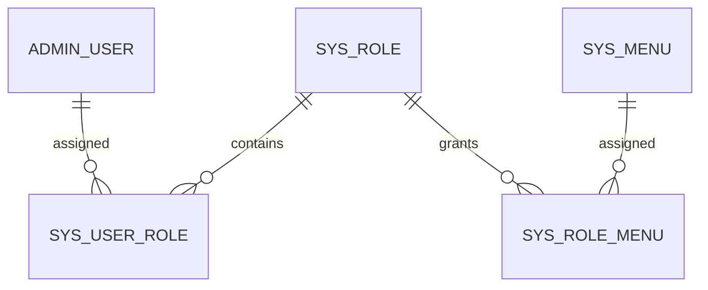
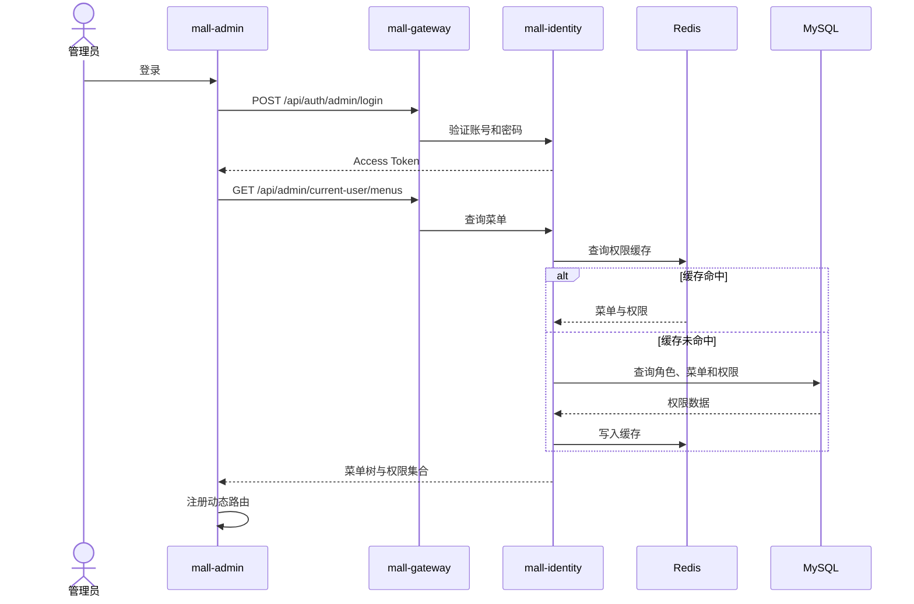

# AI 智能电商微服务平台——权限与功能配置

## 1. 文档信息

- **项目名称**：AI 智能电商微服务平台
- **英文名称**：AI-Powered E-Commerce Platform
- **项目代号**：AI Mall
- **仓库名称**：`ai-mall-platform`
- **文档名称**：权限与功能配置
- **文档路径**：`docs/11-权限与功能配置.md`
- **当前版本**：V0.1
- **文档状态**：初稿
- **关联文档**：
  - `docs/00-项目总览.md`
  - `docs/01-产品需求文档.md`
  - `docs/02-统一语言词汇表.md`
  - `docs/03-领域事件风暴.md`
  - `docs/04-子域与限界上下文.md`
  - `docs/05-上下文映射图.md`
  - `docs/06-聚合与领域模型设计.md`
  - `docs/07-核心业务流程.md`
  - `docs/08-系统与微服务架构.md`
  - `docs/09-数据库设计.md`
  - `docs/10-API与事件契约.md`

### 1.1 版本记录

| 版本 | 日期 | 说明 |
|---|---|---|
| V0.1 | 初始版本 | 完成身份隔离、RBAC、动态菜单、按钮权限、接口授权、数据权限、功能开关和系统参数设计 |

---

## 2. 文档目的

本文档用于定义 AI 智能电商微服务平台的身份认证、访问控制、动态菜单、按钮权限、数据权限、功能开关和系统参数方案，明确：

1. 商城会员身份和后台管理员身份如何隔离；
2. 管理员、角色、菜单和权限之间的关系；
3. 目录、页面、按钮和接口权限如何建模；
4. 后台动态菜单和动态路由如何生成；
5. 前端按钮权限如何控制；
6. Spring Security 如何完成后端最终授权；
7. 数据归属和数据范围如何校验；
8. 权限缓存如何设计；
9. 角色和权限变更后如何生效；
10. 功能开关和系统参数如何配置；
11. 前端入口和后端接口如何保持一致；
12. 配置缓存和失效如何实现；
13. 默认角色和权限矩阵如何定义；
14. 权限与配置操作如何审计；
15. 权限和功能配置如何测试和验收。

第一版面向单平台后台，不包含多租户、多组织、多商户和复杂行级数据权限。

---

# 3. 设计目标

## 3.1 安全目标

系统应保证：

- 未登录用户不能访问受保护资源；
- 商城会员不能访问后台接口；
- 后台管理员不能冒充商城会员下单；
- 无权限管理员不能访问页面、按钮和 API；
- 前端隐藏按钮不能替代后端权限校验；
- 用户只能访问自己的地址、订单和退款；
- AI 不能绕过 Java 业务权限；
- 内部服务接口不能被公网客户端直接访问；
- 权限变更和配置修改有完整审计记录。

## 3.2 灵活性目标

系统应支持：

- 新增管理员和角色；
- 自定义菜单树；
- 目录、页面、按钮三级权限；
- 动态生成前端路由；
- 动态启停业务功能；
- 动态调整业务参数；
- 不重新发布前端即可调整后台菜单；
- 不重新部署服务即可调整部分业务能力。

## 3.3 可维护性目标

统一：

- 身份模型；
- 权限编码；
- 权限注解；
- 动态菜单结构；
- 配置键；
- 配置类型；
- 缓存 Key；
- 变更事件；
- 操作日志；
- 错误码。

---

# 4. 身份体系

## 4.1 身份类型

```text
GUEST
MEMBER
ADMIN
SERVICE
```

| 身份类型 | 说明 |
|---|---|
| `GUEST` | 未登录商城访问者 |
| `MEMBER` | 已登录商城会员 |
| `ADMIN` | 已登录后台管理员 |
| `SERVICE` | 微服务间内部调用身份 |

## 4.2 接口边界

### 商城公开接口

```text
/api/mall/products/**
/api/mall/search/**
/api/mall/public-features
```

### 商城会员接口

```text
/api/mall/cart/**
/api/mall/orders/**
/api/mall/shipping-addresses/**
/api/ai/order-assistant/**
```

### 后台接口

```text
/api/admin/**
```

### 内部接口

```text
/api/internal/**
```

## 4.3 商城和后台身份隔离

商城和后台 Token 必须包含不同的：

```text
subjectType
audience
tokenPurpose
```

商城 Token 示例：

```json
{
  "sub": "10001",
  "subjectType": "MEMBER",
  "aud": "mall-web",
  "iss": "mall-identity",
  "jti": "member-token-001"
}
```

后台 Token 示例：

```json
{
  "sub": "1",
  "subjectType": "ADMIN",
  "aud": "mall-admin",
  "iss": "mall-identity",
  "jti": "admin-token-001"
}
```

## 4.4 禁止身份混用

禁止：

- `MEMBER` Token 访问 `/api/admin/**`；
- `ADMIN` Token 代替商城会员下单；
- 浏览器伪造 `X-Subject-Id`；
- AI 服务自行决定当前会员 ID；
- 服务间 Token 暴露给前端。

---

# 5. 认证方案

## 5.1 登录流程

```text
提交账号和密码
→ mall-identity 校验凭据
→ 校验账号状态
→ 生成 Access Token
→ 生成 Refresh Token
→ 返回登录结果
```

## 5.2 Access Token

建议有效期：

```text
2 小时
```

包含：

- subject ID；
- subject type；
- token ID；
- audience；
- issuer；
- issued at；
- expiration；
- 可选权限版本。

不建议包含：

- 完整菜单树；
- 大量权限编码；
- 用户详细资料；
- 敏感数据。

## 5.3 Refresh Token

建议有效期：

```text
7～30 天
```

数据库保存：

```text
token_id
subject_id
subject_type
token_hash
expires_at
revoked
```

## 5.4 退出登录

退出时：

- 撤销 Refresh Token；
- 可将 Access Token 的 `jti` 写入短期黑名单；
- 清理用户权限缓存；
- 前端清除本地 Token；
- 后台前端清除动态路由。

## 5.5 密码策略

- 最少 8 位；
- 包含字母和数字；
- 后台管理员密码建议包含特殊字符；
- 使用 BCrypt 或 Argon2；
- 禁止明文存储；
- 禁止日志记录；
- 重置密码后使旧 Refresh Token 失效。

---

# 6. RBAC 模型

## 6.1 模型关系

```text
管理员
→ 分配角色
→ 角色分配菜单
→ 菜单包含权限编码
→ 权限编码控制页面、按钮和 API
```



## 6.2 核心对象

```text
AdminUser
Role
Menu
PermissionCode
```

## 6.3 关系说明

### AdminUser 与 Role

多对多：

```text
一个管理员可拥有多个角色
一个角色可分配给多个管理员
```

### Role 与 Menu

多对多：

```text
一个角色可拥有多个菜单
一个菜单可分配给多个角色
```

### Menu 与 PermissionCode

一个菜单节点最多对应一个权限编码。

目录可不配置权限编码；页面和按钮通常配置权限编码。

---

# 7. 菜单模型

## 7.1 菜单类型

```text
DIRECTORY
PAGE
BUTTON
```

| 类型 | 说明 | 侧边栏 | 动态路由 | 按钮控制 |
|---|---|---:|---:|---:|
| `DIRECTORY` | 菜单目录 | 是 | 可选 | 否 |
| `PAGE` | 业务页面 | 是 | 是 | 否 |
| `BUTTON` | 页面操作权限 | 否 | 否 | 是 |

## 7.2 菜单字段

```text
menuId
parentId
menuName
menuType
routeName
routePath
componentPath
permissionCode
icon
sortOrder
visible
cacheable
status
externalLink
linkUrl
```

## 7.3 页面菜单示例

```json
{
  "menuId": "101",
  "parentId": "100",
  "menuName": "商品列表",
  "menuType": "PAGE",
  "routeName": "ProductList",
  "routePath": "list",
  "componentPath": "product/list/index",
  "permissionCode": "product:list",
  "sortOrder": 1,
  "visible": true,
  "status": "ENABLED"
}
```

## 7.4 按钮菜单示例

```json
{
  "menuId": "102",
  "parentId": "101",
  "menuName": "商品上架",
  "menuType": "BUTTON",
  "permissionCode": "product:publish",
  "visible": false,
  "status": "ENABLED"
}
```

## 7.5 菜单约束

- 按钮不能拥有子节点；
- 页面可拥有按钮；
- 目录可拥有目录或页面；
- 菜单不能将自己设置为父节点；
- 不能形成循环；
- 删除父菜单前必须处理子节点；
- 禁用菜单不产生有效权限；
- 组件路径必须映射到前端本地组件。

---

# 8. 权限编码规范

## 8.1 格式

```text
资源:动作
```

示例：

```text
product:list
product:create
product:update
product:publish
order:list
order:ship
system:role:update
```

## 8.2 命名规则

- 全部小写；
- 使用英文；
- 使用冒号分隔；
- 动作语义明确；
- 不包含页面路径；
- 不包含角色名称；
- 权限编码不可随意更改。

## 8.3 常见动作

```text
list
detail
create
update
delete
enable
disable
publish
unpublish
ship
cancel
approve
reject
export
configure
reset-password
```

## 8.4 权限粒度

避免过粗：

```text
system:all
product:manage
```

避免过细：

```text
product:name:update
product:subtitle:update
```

第一版以页面和关键业务动作粒度为主。

---

# 9. 默认角色

## 9.1 SUPER_ADMIN

- 拥有全部权限；
- 管理管理员、角色和菜单；
- 管理系统配置；
- 内置角色；
- 不能删除；
- 不能被普通管理员禁用。

## 9.2 PRODUCT_ADMIN

- 商品、分类、品牌；
- SKU；
- 商品上下架；
- 库存查看和调整；
- 订单只读可选。

## 9.3 ORDER_ADMIN

- 订单查询；
- 订单详情；
- 发货；
- 订单取消；
- 退款审核；
- 库存流水只读。

## 9.4 OPERATOR

- 工作台；
- 功能配置；
- AI 知识库；
- 商品和订单只读；
- 运营数据。

## 9.5 CUSTOMER_SERVICE

- 会员查询；
- 订单查询；
- 退款查询；
- AI 对话查询；
- 不允许发货；
- 不允许调整库存；
- 不允许修改系统配置。

---

# 10. 默认权限矩阵

符号：

```text
✓ 允许
— 不允许
R 只读
```

| 模块/权限 | 超级管理员 | 商品管理员 | 订单管理员 | 运营人员 | 客服人员 |
|---|---:|---:|---:|---:|---:|
| 工作台查看 | ✓ | ✓ | ✓ | ✓ | ✓ |
| 管理员管理 | ✓ | — | — | — | — |
| 角色管理 | ✓ | — | — | — | — |
| 菜单管理 | ✓ | — | — | — | — |
| 商品列表 | ✓ | ✓ | R | R | R |
| 创建商品 | ✓ | ✓ | — | — | — |
| 修改商品 | ✓ | ✓ | — | — | — |
| 商品上架 | ✓ | ✓ | — | — | — |
| 商品下架 | ✓ | ✓ | — | — | — |
| 分类管理 | ✓ | ✓ | — | — | — |
| 品牌管理 | ✓ | ✓ | — | — | — |
| 库存查看 | ✓ | ✓ | ✓ | R | R |
| 库存初始化 | ✓ | ✓ | — | — | — |
| 库存调整 | ✓ | ✓ | — | — | — |
| 订单列表 | ✓ | R | ✓ | R | ✓ |
| 订单发货 | ✓ | — | ✓ | — | — |
| 退款审核 | ✓ | — | ✓ | — | R |
| 功能配置 | ✓ | — | — | ✓ | — |
| 系统参数 | ✓ | — | — | R | — |
| AI 知识库 | ✓ | — | — | ✓ | R |
| AI 对话记录 | ✓ | — | R | ✓ | ✓ |
| 操作日志 | ✓ | — | R | R | — |

---

# 11. 权限编码清单

## 11.1 工作台

```text
dashboard:view
```

## 11.2 管理员

```text
system:admin:list
system:admin:detail
system:admin:create
system:admin:update
system:admin:enable
system:admin:disable
system:admin:reset-password
system:admin:assign-role
```

## 11.3 角色

```text
system:role:list
system:role:detail
system:role:create
system:role:update
system:role:enable
system:role:disable
system:role:assign-menu
```

## 11.4 菜单

```text
system:menu:list
system:menu:create
system:menu:update
system:menu:delete
system:menu:enable
system:menu:disable
```

## 11.5 商品

```text
product:list
product:detail
product:create
product:update
product:publish
product:unpublish
product:delete
product:sku:create
product:sku:update
product:sku:enable
product:sku:disable
```

## 11.6 分类与品牌

```text
product:category:list
product:category:create
product:category:update
product:category:delete
product:category:enable
product:category:disable

product:brand:list
product:brand:create
product:brand:update
product:brand:delete
product:brand:enable
product:brand:disable
```

## 11.7 库存

```text
inventory:list
inventory:detail
inventory:create
inventory:increase
inventory:decrease
inventory:adjust
inventory:transaction:list
```

## 11.8 订单和退款

```text
order:list
order:detail
order:ship
order:cancel
order:status-history:list
order:refund:list
order:refund:detail
order:refund:approve
order:refund:reject
```

## 11.9 系统配置

```text
system:feature:list
system:feature:update
system:parameter:list
system:parameter:update
system:config-history:list
```

## 11.10 AI

```text
ai:knowledge-base:list
ai:knowledge-base:create
ai:knowledge-base:update
ai:knowledge-base:enable
ai:knowledge-base:disable
ai:document:list
ai:document:upload
ai:document:delete
ai:document:reindex
ai:conversation:list
ai:conversation:detail
ai:tool-call:list
```

## 11.11 日志

```text
system:operation-log:list
system:login-log:list
```

---

# 12. 后台登录与权限加载

## 12.1 接口

```text
POST /api/auth/admin/login
GET  /api/admin/current-user
GET  /api/admin/current-user/menus
GET  /api/admin/current-user/permissions
```

## 12.2 加载流程



## 12.3 菜单生成规则

1. 查询管理员有效角色；
2. 过滤禁用角色；
3. 查询角色菜单；
4. 合并重复菜单；
5. 过滤禁用菜单；
6. 构建菜单树；
7. 目录和页面用于路由；
8. 按钮用于权限集合；
9. 按 `sortOrder` 排序；
10. 返回前端。

---

# 13. 前端动态路由

## 13.1 静态路由

```text
/login
/403
/404
```

## 13.2 动态路由

示例：

```text
/product/list
/product/create
/order/list
/system/role
```

## 13.3 组件映射

前端维护安全组件映射：

```ts
const viewModules = import.meta.glob("../views/**/*.vue");
```

后端只返回逻辑组件路径：

```text
product/list/index
```

前端只允许从本地 `views` 目录匹配。

## 13.4 注册流程

```text
获取菜单树
→ 转换 RouteRecordRaw
→ 校验 routeName 唯一
→ 校验 componentPath
→ router.addRoute()
→ 记录移除函数
```

## 13.5 页面刷新

```text
读取 Token
→ 请求权限和菜单
→ 重新注册动态路由
→ 进入原目标页面
```

## 13.6 退出登录

- 删除 Token；
- 清空权限 Store；
- 清空菜单 Store；
- 移除动态路由；
- 跳转登录页。

---

# 14. 前端按钮权限

## 14.1 Permission Store

```ts
interface PermissionState {
  permissions: Set<string>;
}
```

## 14.2 工具函数

```ts
function hasPermission(code: string): boolean {
  return permissionStore.permissions.has(code);
}
```

## 14.3 指令

```vue
<el-button v-permission="'product:publish'">
  上架
</el-button>
```

## 14.4 权限组件

```vue
<PermissionGuard code="order:ship">
  <el-button>发货</el-button>
</PermissionGuard>
```

## 14.5 原则

- 前端权限用于用户体验；
- 隐藏按钮不代表安全；
- 所有写接口后端必须校验；
- 无权限页面由路由守卫处理；
- 直接调用 API 必须返回 403。

---

# 15. 后端权限校验

## 15.1 Spring Security

```java
@PostMapping("/api/admin/products/{productId}/publish")
@PreAuthorize("hasAuthority('product:publish')")
public ApiResponse<Void> publish(
    @PathVariable String productId
) {
    productApplicationService.publish(productId);
    return ApiResponse.success();
}
```

## 15.2 多权限判断

```java
@PreAuthorize(
    "hasAnyAuthority('order:ship', 'order:cancel')"
)
```

## 15.3 超级管理员

可使用自定义权限评估器：

```java
@PreAuthorize(
    "@permissionEvaluator.hasPermission(authentication, 'order:ship')"
)
```

## 15.4 授权边界

Gateway 负责：

- Token 校验；
- 身份类型隔离；
- 路径初步控制。

业务服务负责：

- 最终权限；
- 数据归属；
- 领域状态；
- 业务不变量。

---

# 16. 权限上下文传递

## 16.1 Gateway 处理

Gateway 校验 Token 后生成：

```text
X-Subject-Id
X-Subject-Type
X-Token-Id
X-Trace-Id
```

## 16.2 防伪造

Gateway 转发前：

- 删除客户端传入的内部身份 Header；
- 写入经过验证的值；
- 业务服务只信任受控来源。

## 16.3 Feign 传递

服务间调用传递：

- TraceId；
- SubjectId；
- SubjectType；
- ServiceName；
- ServiceToken。

内部服务权限不能简单等同于外部管理员权限。

---

# 17. 数据权限

## 17.1 商城会员

会员只能访问自己的：

- 资料；
- 地址；
- 购物车；
- 订单；
- 退款；
- 收藏；
- 浏览记录；
- AI 订单会话。

## 17.2 查询方式

正确：

```text
WHERE order_id = ?
AND member_id = ?
```

错误：

```text
只按 order_id 查询
```

## 17.3 地址归属

创建订单时同时校验：

```text
currentMemberId
shippingAddressId
```

## 17.4 AI 数据权限

- AI 不接受任意 `memberId`；
- Java 根据可信身份决定会员；
- AI 只查询当前会员订单；
- AI 写操作需要二次确认；
- Java 订单聚合完成最终状态判断。

## 17.5 后台数据范围

第一版不实现部门级数据范围。

默认：

- 拥有模块权限即可查看该模块全部数据；
- 客服人员只读；
- 商品管理员只读订单；
- 订单管理员只读商品。

后续可扩展：

```text
ALL
DEPARTMENT
SELF
CUSTOM
```

---

# 18. 权限缓存

## 18.1 缓存内容

- 管理员有效角色；
- 权限编码集合；
- 菜单树；
- 权限版本；
- 账号状态摘要。

## 18.2 Redis Key

```text
aimall:{env}:identity:admin-permissions:{adminUserId}
aimall:{env}:identity:admin-menus:{adminUserId}
aimall:{env}:identity:role-menus:{roleId}
aimall:{env}:identity:permission-version:{adminUserId}
```

## 18.3 TTL

建议：

```text
30 分钟
```

权限变化时主动失效。

## 18.4 缓存失效场景

- 管理员被禁用；
- 管理员角色变更；
- 角色被禁用；
- 角色菜单变更；
- 菜单被禁用；
- 权限编码变更；
- 密码重置；
- 超级管理员状态变化。

## 18.5 Redis 不可用

- 回源 MySQL；
- 不允许因缓存失败放行；
- 权限查询变慢但安全性不下降；
- 记录告警。

---

# 19. 权限变更生效

## 19.1 第一版方案

```text
权限变更
→ 清理 Redis
→ 后端下一次请求重新加载
```

前端已显示的菜单可能暂时存在，但后端权限立即生效。

## 19.2 前端更新

第一版：

- 重新登录后菜单更新；
- 后端返回 403 时提示重新加载权限。

P1：

```text
权限版本变化
→ 返回 AUTH_PERMISSION_CHANGED
→ 前端重新请求菜单和权限
```

## 19.3 禁用管理员

应立即：

- 清理权限缓存；
- 撤销 Refresh Token；
- 可加入 Access Token 黑名单；
- 后续请求返回 `AUTH_ACCOUNT_DISABLED`。

---

# 20. 角色授权流程

## 20.1 接口

```text
PUT /api/admin/roles/{roleId}/menus
```

请求：

```json
{
  "menuIds": ["100", "101", "102"]
}
```

## 20.2 流程

```text
校验操作者权限
→ 查询 Role
→ 校验 Role 状态
→ 校验 Menu
→ role.replaceMenus(menuIds)
→ 删除旧关系
→ 写入新关系
→ 提交事务
→ 清理相关管理员缓存
→ 记录操作日志
```

## 20.3 规则

- 菜单 ID 去重；
- 内置超级管理员角色不能清空；
- 禁用菜单不能授予；
- 不存在菜单不能授予；
- 重复提交结果一致；
- 本地事务完成关系替换。

---

# 21. 管理员角色分配

接口：

```text
PUT /api/admin/admin-users/{adminUserId}/roles
```

请求：

```json
{
  "roleIds": ["10", "20"]
}
```

规则：

- 管理员必须存在；
- 角色必须存在且启用；
- 普通管理员不能修改超级管理员；
- 新管理员至少一个角色；
- 角色 ID 去重；
- 分配后清理该管理员缓存；
- 记录操作日志。

---

# 22. 功能配置模型

## 22.1 FeatureConfig

字段：

```text
configKey
featureName
configGroup
enabled
publicFlag
builtIn
description
version
```

## 22.2 SystemParameter

字段：

```text
configKey
parameterName
parameterType
configValue
defaultValue
minValue
maxValue
configGroup
publicFlag
builtIn
description
version
```

## 22.3 与 Nacos 的区别

Nacos 管理：

- 数据库连接；
- Redis、MQ 地址；
- 服务超时；
- 线程池；
- 技术运行参数。

`mall-system` 管理：

- 注册是否开放；
- 退款是否启用；
- AI 是否启用；
- 订单超时时间；
- 购物车数量上限；
- 文件大小限制。

---

# 23. 功能配置清单

## 23.1 商城功能

| 配置键 | 默认值 | 公开 | 说明 |
|---|---:|---:|---|
| `member.register.enabled` | true | 是 | 是否允许会员注册 |
| `favorite.enabled` | true | 是 | 是否启用收藏 |
| `browsing-history.enabled` | true | 是 | 是否记录浏览历史 |
| `review.enabled` | false | 是 | 是否启用商品评价 |
| `refund.enabled` | true | 是 | 是否允许申请退款 |
| `payment.simulation.enabled` | true | 是 | 是否允许模拟支付 |

## 23.2 AI 功能

| 配置键 | 默认值 | 公开 | 说明 |
|---|---:|---:|---|
| `ai.shopping.enabled` | true | 是 | AI 智能导购 |
| `ai.compare.enabled` | false | 是 | AI 商品对比 |
| `ai.customer-service.enabled` | true | 是 | RAG 智能客服 |
| `ai.order-assistant.enabled` | false | 是 | AI 订单助手 |
| `ai.order-write.enabled` | false | 否 | AI 是否允许执行订单写操作 |

## 23.3 后台功能

| 配置键 | 默认值 | 公开 | 说明 |
|---|---:|---:|---|
| `product.review.required` | false | 否 | 商品上架是否需要审核 |
| `inventory.low-stock-alert.enabled` | true | 否 | 低库存预警 |
| `operation-log.enabled` | true | 否 | 操作日志 |
| `order.auto-confirm.enabled` | false | 否 | 自动确认收货 |

---

# 24. 系统参数清单

## 24.1 订单参数

| 参数键 | 类型 | 默认值 | 范围 | 说明 |
|---|---|---:|---|---|
| `order.timeout.minutes` | INTEGER | 30 | 5～1440 | 支付超时 |
| `order.auto-confirm.days` | INTEGER | 7 | 1～30 | 自动确认收货 |
| `order.remark.max-length` | INTEGER | 200 | 0～500 | 备注长度 |

## 24.2 购物车参数

| 参数键 | 类型 | 默认值 | 范围 | 说明 |
|---|---|---:|---|---|
| `cart.max-items` | INTEGER | 100 | 1～500 | 最大项数 |
| `cart.max-quantity` | INTEGER | 99 | 1～999 | 单项最大数量 |
| `cart.expire-days` | INTEGER | 30 | 1～365 | 过期时间 |

## 24.3 商品参数

| 参数键 | 类型 | 默认值 | 范围 | 说明 |
|---|---|---:|---|---|
| `product.max-buy-quantity` | INTEGER | 20 | 1～999 | 单次最大购买量 |
| `product.max-sku-count` | INTEGER | 100 | 1～1000 | 单商品最大 SKU 数 |
| `product.max-image-count` | INTEGER | 10 | 1～50 | 商品图片上限 |

## 24.4 AI 参数

| 参数键 | 类型 | 默认值 | 范围 | 说明 |
|---|---|---:|---|---|
| `ai.chat.max-rounds` | INTEGER | 20 | 1～100 | 最大对话轮数 |
| `ai.search.max-products` | INTEGER | 10 | 1～50 | 导购候选数量 |
| `ai.rag.top-k` | INTEGER | 5 | 1～20 | RAG 召回数量 |
| `ai.request.timeout-seconds` | INTEGER | 60 | 5～180 | AI 请求超时 |
| `ai.product-compare.max-count` | INTEGER | 4 | 2～10 | 最大对比商品数 |

## 24.5 文件参数

| 参数键 | 类型 | 默认值 | 范围 | 说明 |
|---|---|---:|---|---|
| `upload.file.max-size` | LONG | 10485760 | 1MB～100MB | 普通文件限制 |
| `upload.image.max-size` | LONG | 5242880 | 1MB～20MB | 图片限制 |
| `upload.knowledge.max-size` | LONG | 20971520 | 1MB～200MB | 知识文档限制 |

---

# 25. 功能开关生效原则

## 25.1 前端入口

关闭功能后：

- 对应导航和按钮隐藏；
- 路由可显示不可用提示；
- 前端不再发起正常业务请求。

## 25.2 后端接口

即使前端隐藏，后端仍必须检查开关。

关闭时返回：

```text
FEATURE_DISABLED
AI_FEATURE_DISABLED
REFUND_FEATURE_DISABLED
```

## 25.3 典型影响

### 关闭注册

- 新用户不能注册；
- 已有用户仍可登录。

### 关闭退款

- 新申请被拒绝；
- 已提交退款继续处理。

### 关闭 AI 导购

- 新会话不可创建；
- 商品浏览和下单不受影响。

### 关闭模拟支付

- 新支付请求被拒绝；
- 待付款订单等待重新开放或超时取消。

---

# 26. 系统参数生效原则

## 26.1 新对象读取最新值

```text
创建订单
→ 读取 order.timeout.minutes
→ 计算 paymentDeadline
→ 保存到订单
```

## 26.2 已有对象使用快照

以下参数需要快照：

- 订单支付截止时间；
- AI 会话最大轮数；
- 自动确认收货时间。

## 26.3 实时参数

可以实时生效：

- 新文件上传限制；
- 新购物车数量限制；
- AI 新请求超时；
- RAG Top-K；
- 新商品最大 SKU 数。

---

# 27. 配置缓存

## 27.1 Redis Key

```text
aimall:{env}:system:feature:{configKey}
aimall:{env}:system:parameter:{configKey}
aimall:{env}:system:public-features
```

## 27.2 缓存层级

```text
本地缓存
→ Redis
→ mall-system API
→ MySQL
```

## 27.3 TTL

```text
Redis：10 分钟
本地缓存：1～5 分钟
```

## 27.4 更新流程

```text
数据库更新成功
→ 删除 Redis 缓存
→ 发布配置变更事件
→ 下游删除本地缓存
```

---

# 28. 配置变更事件

## 28.1 功能配置事件

```text
FeatureConfigChangedIntegrationEvent
```

```json
{
  "configKey": "ai.shopping.enabled",
  "oldEnabled": false,
  "newEnabled": true,
  "changedBy": "1",
  "changedAt": "2026-08-01T15:00:00+08:00"
}
```

## 28.2 系统参数事件

```text
SystemParameterChangedIntegrationEvent
```

```json
{
  "configKey": "order.timeout.minutes",
  "oldValue": "30",
  "newValue": "45",
  "parameterType": "INTEGER",
  "changedBy": "1",
  "changedAt": "2026-08-01T15:00:00+08:00"
}
```

消费者只负责：

- 删除本地缓存；
- 更新内存配置；
- 记录日志。

不批量修改已有业务对象。

---

# 29. 配置值校验

## 29.1 类型

```text
STRING
INTEGER
LONG
DECIMAL
BOOLEAN
DURATION
```

## 29.2 范围

例如：

```text
order.timeout.minutes ∈ [5, 1440]
```

## 29.3 业务语义

- 自动确认天数不能小于 1；
- 商品对比数量不能小于 2；
- 文件限制不能超过基础设施上限；
- 订单超时不能为 0；
- RAG Top-K 不能超过检索上限。

## 29.4 并发修改

配置表使用 `version` 乐观锁。

版本冲突返回：

```text
CONFIG_VERSION_CONFLICT
```

前端提示重新加载。

---

# 30. 配置历史与回滚

## 30.1 记录内容

```text
configType
configKey
oldValue
newValue
changedBy
changeReason
traceId
changedAt
```

## 30.2 回滚

```text
选择历史值
→ 提交新的配置修改
→ 生成新的历史记录
```

不直接删除或覆盖历史。

---

# 31. 安全默认值

当配置服务不可用且无缓存时：

| 配置 | 默认值 |
|---|---|
| `member.register.enabled` | false |
| `refund.enabled` | false |
| `ai.shopping.enabled` | false |
| `ai.compare.enabled` | false |
| `ai.order-write.enabled` | false |
| `payment.simulation.enabled` | false |
| `operation-log.enabled` | true |
| `order.timeout.minutes` | 30 |
| `cart.max-quantity` | 20 |
| `product.max-buy-quantity` | 10 |
| `upload.file.max-size` | 5MB |

原则：

- 高风险写能力默认关闭；
- 安全控制不能因配置服务异常而放开；
- 数值配置使用保守值。

---

# 32. 代码设计

## 32.1 FeatureGate

```java
public interface FeatureGate {

    boolean isEnabled(String configKey);

    void ensureEnabled(String configKey);
}
```

使用：

```java
featureGate.ensureEnabled("refund.enabled");
```

## 32.2 注解方式

可扩展：

```java
@FeatureRequired("ai.shopping.enabled")
```

## 32.3 SystemParameterProvider

```java
public interface SystemParameterProvider {

    int getInt(String key);

    long getLong(String key);

    boolean getBoolean(String key);

    String getString(String key);
}
```

## 32.4 类型安全策略

```java
public record OrderPolicy(
    Duration paymentTimeout,
    int autoConfirmDays
) {
}
```

领域层依赖 `OrderPolicy`，不直接依赖配置服务。

---

# 33. 内部服务权限

## 33.1 服务身份

```text
X-Service-Name
X-Service-Token
X-Trace-Id
```

## 33.2 服务白名单

| 内部能力 | 允许调用方 |
|---|---|
| 获取订单商品快照 | `mall-order` |
| 获取 SKU 销售信息 | `mall-cart`、`mall-order`、`ai-service` |
| 获取地址 | `mall-order` |
| 锁定库存 | `mall-order` |
| 释放库存 | `mall-order` |
| 确认扣减库存 | 库存事件消费者或补偿任务 |
| 查询会员订单 | `ai-service`、受控后台服务 |
| 获取系统配置 | 所有业务服务 |

## 33.3 原则

- 不因处于内网就完全信任；
- 校验调用方服务；
- 使用最小授权；
- 内部写接口仍需幂等；
- 记录 TraceId；
- 禁止普通客户端直接访问。

---

# 34. AI 权限边界

## 34.1 AI 导购

游客可使用时：

- 仅访问公开商品；
- 不访问会员数据；
- 不访问订单；
- 不执行写操作。

## 34.2 AI 订单助手

必须满足：

```text
ai.order-assistant.enabled = true
用户已登录
```

写操作还需：

```text
ai.order-write.enabled = true
用户完成二次确认
Java 订单规则允许
```

## 34.3 后台 AI 管理

需要：

```text
ai:knowledge-base:*
ai:document:*
ai:conversation:*
```

AI 对话展示必须脱敏。

---

# 35. 审计

## 35.1 权限操作

必须记录：

- 创建管理员；
- 禁用管理员；
- 重置密码；
- 分配角色；
- 创建和禁用角色；
- 角色菜单授权；
- 创建和修改菜单；
- 修改权限编码。

## 35.2 配置操作

必须记录：

- 启停功能；
- 修改订单超时；
- 修改退款开关；
- 修改 AI 开关；
- 修改文件限制；
- 修改支付配置。

## 35.3 日志字段

```text
operatorId
operatorName
module
action
resourceType
resourceId
oldValue
newValue
result
traceId
ipAddress
occurredAt
```

禁止记录：

- 密码；
- Token；
- API Key；
- 服务间密钥。

---

# 36. 错误处理

| 场景 | HTTP | 错误码 |
|---|---:|---|
| 未登录 | 401 | `AUTH_UNAUTHORIZED` |
| Token 无效 | 401 | `AUTH_TOKEN_INVALID` |
| Token 过期 | 401 | `AUTH_TOKEN_EXPIRED` |
| 无权限 | 403 | `AUTH_FORBIDDEN` |
| 账号禁用 | 403 | `AUTH_ACCOUNT_DISABLED` |
| 权限变化 | 409 | `AUTH_PERMISSION_CHANGED` |
| 功能关闭 | 503 | `FEATURE_DISABLED` |
| 配置值错误 | 400 | `CONFIG_VALUE_INVALID` |
| 配置并发冲突 | 409 | `CONFIG_VERSION_CONFLICT` |

---

# 37. 前端 Store

## 37.1 Auth Store

```text
accessToken
refreshToken
adminUser
loggedIn
```

## 37.2 Permission Store

```text
permissions
permissionVersion
loaded
```

## 37.3 Menu Store

```text
menuTree
dynamicRoutes
routeRemoveHandlers
```

## 37.4 Feature Store

```text
publicFeatures
loadedAt
```

## 37.5 后台加载顺序

```text
登录
→ 当前用户
→ 权限
→ 菜单
→ 动态路由
→ 首页
```

## 37.6 商城加载顺序

```text
应用启动
→ 获取公开功能配置
→ 决定注册、退款和 AI 入口
```

---

# 38. 路由守卫

## 38.1 未登录

```text
跳转 /login
```

## 38.2 动态路由未加载

```text
加载权限和菜单
→ 注册路由
→ replace 原目标地址
```

## 38.3 无页面权限

```text
跳转 /403
```

## 38.4 路由不存在

```text
跳转 /404
```

---

# 39. 安全防护

## 39.1 防水平越权

测试：

- 修改订单 ID；
- 修改地址 ID；
- 修改退款 ID；
- 伪造 memberId。

均应拒绝。

## 39.2 防垂直越权

测试：

- 商品管理员调用发货；
- 客服审核退款；
- 订单管理员修改角色；
- 普通管理员修改超级管理员。

均应拒绝。

## 39.3 防 Header 伪造

Gateway 必须删除客户端自带的内部身份 Header。

## 39.4 防菜单注入

- 组件路径仅允许本地映射；
- 不允许远程脚本；
- 不允许路径穿越；
- 不允许任意 URL 作为页面组件。

## 39.5 防配置注入

- 类型校验；
- 长度限制；
- 范围校验；
- 枚举白名单；
- 不执行配置表达式；
- 不将配置拼接 SQL。

---

# 40. 测试方案

## 40.1 权限单元测试

覆盖：

- 禁用管理员不能登录；
- 禁用角色不产生权限；
- 菜单树构建；
- 权限编码去重；
- 超级管理员全权限；
- 菜单循环校验；
- 内置角色保护；
- 覆盖式角色授权。

## 40.2 接口测试

覆盖：

- 无 Token 返回 401；
- 商城 Token 调后台返回 403；
- 无权限管理员发货返回 403；
- 有权限管理员发货成功；
- 禁用管理员已有 Token 失效；
- 权限变更后缓存失效；
- 直接访问他人订单被拒绝。

## 40.3 前端测试

覆盖：

- 不同角色显示不同菜单；
- 无权限按钮隐藏；
- 刷新后动态路由恢复；
- 权限变化后重新加载；
- 退出后动态路由清理；
- 无权限路径进入 403。

## 40.4 配置测试

覆盖：

- 注册开关；
- 退款开关；
- AI 开关；
- 模拟支付开关；
- 前端入口和后端接口一致；
- 配置缓存失效；
- 类型和范围校验；
- 已有订单不受新参数影响；
- 配置服务异常使用安全默认值；
- 并发修改触发乐观锁。

---

# 41. 验收场景

## 41.1 商品管理员

1. 登录后仅看到商品、分类、品牌和库存菜单；
2. 可以创建和上架商品；
3. 不能进入角色管理；
4. 直接调用角色 API 返回 403；
5. 不能发货。

## 41.2 订单管理员

1. 看到订单、退款和库存只读菜单；
2. 可以发货；
3. 可以审核退款；
4. 不能创建商品；
5. 不能修改功能配置。

## 41.3 客服人员

1. 可查询订单；
2. 可查询退款；
3. 可查看 AI 会话；
4. 不显示发货按钮；
5. 发货 API 返回 403。

## 41.4 权限变更

1. 移除管理员 `order:ship`；
2. 清理权限缓存；
3. 管理员继续点击发货；
4. 后端返回 403；
5. 重新登录后按钮消失。

## 41.5 AI 开关

1. 关闭 `ai.shopping.enabled`；
2. 商城隐藏导购入口；
3. 直接调用接口返回功能关闭；
4. 商品浏览和下单正常；
5. 重新开启后入口恢复。

---

# 42. 第一版优先级

## 42.1 P0

- 商城和后台 Token 隔离；
- AdminUser、Role、Menu；
- 用户角色关系；
- 角色菜单关系；
- 动态菜单；
- 动态路由；
- 按钮权限；
- Spring Security；
- `@PreAuthorize`；
- 订单和地址归属校验；
- 权限缓存；
- 权限变更清理缓存；
- 注册开关；
- AI 导购开关；
- 模拟支付开关；
- 订单超时参数；
- 购物车数量参数。

## 42.2 P1

- 权限版本；
- Token 黑名单；
- 退款开关；
- AI 商品对比开关；
- AI 订单助手开关；
- 配置历史；
- 本地缓存；
- 配置变更 MQ 事件；
- 操作日志异步化；
- 服务级权限白名单。

## 42.3 P2

- 多组织；
- 多租户；
- 数据范围权限；
- 字段级权限；
- 菜单灰度；
- 配置灰度；
- AB 实验；
- mTLS；
- 统一策略中心。

---

# 43. 验收标准

完成后应满足：

1. 商城会员和后台管理员身份完全隔离；
2. 内部服务身份与外部身份隔离；
3. 管理员可分配多个角色；
4. 角色可分配目录、页面和按钮；
5. 菜单树可动态生成；
6. 前端可动态注册路由；
7. 无权限按钮不显示；
8. 无权限 API 返回 403；
9. 无权限路由不可访问；
10. 商城用户只能访问自己的数据；
11. AI 无法查询其他会员订单；
12. 权限缓存可回源数据库；
13. 角色和菜单变更能清理缓存；
14. 禁用管理员后不能继续访问；
15. 功能开关前后端同时生效；
16. 高风险功能无配置时默认关闭；
17. 系统参数具有类型和范围校验；
18. 已有订单不受新超时参数影响；
19. 配置变更有历史和操作日志；
20. 权限与配置测试覆盖核心场景。

---

# 44. 当前设计决策

## 44.1 已确定

- 采用 RBAC；
- 管理员、角色、菜单多对多；
- 菜单类型为目录、页面、按钮；
- 权限编码采用英文冒号格式；
- 后台菜单由后端动态返回；
- 前端使用 `router.addRoute()`；
- 前端按钮权限使用指令或权限组件；
- 后端使用 Spring Security 和 `@PreAuthorize`；
- 前端权限不作为安全边界；
- 商城 Token 和后台 Token 隔离；
- 用户数据归属由后端校验；
- 权限缓存使用 Redis；
- 权限变更后清理缓存；
- 功能配置与系统参数由 `mall-system` 管理；
- 业务配置与 Nacos 技术配置分离；
- 功能开关前后端双重控制；
- 高风险功能默认关闭；
- 配置变更通过事件清理本地缓存；
- 配置修改记录历史和操作日志。

## 44.2 待确认

- 权限变更是否强制当前 Token 失效；
- 是否第一版实现权限版本；
- Access Token 是否使用黑名单；
- 商品管理员是否允许调整库存；
- 客服是否允许后台取消待付款订单；
- 运营人员是否可修改全部系统参数；
- 是否实现 Caffeine 本地缓存；
- 服务间认证使用固定 Token、签名还是 mTLS；
- 配置历史回滚是否进入 P1；
- AI 订单写操作何时开放；
- 是否增加数据范围权限。

---

# 45. 下一步文档

下一份文档为：

```text
docs/12-测试方案.md
```

下一份文档需要明确：

1. 测试目标和范围；
2. 测试环境；
3. 单元测试；
4. 领域模型测试；
5. 应用服务测试；
6. Repository 集成测试；
7. API 测试；
8. 契约测试；
9. 微服务集成测试；
10. RocketMQ 测试；
11. Redis 和缓存测试；
12. 数据库并发测试；
13. 权限和安全测试；
14. AI 工具、RAG 和输出测试；
15. 端到端测试；
16. 性能测试；
17. 故障注入和恢复测试；
18. 测试数据；
19. CI 测试门禁；
20. 验收用例。

本文档作为 V0.1 权限与功能配置基线。后续权限模型、菜单、配置键、接口或业务规则发生变化时，应同步更新本文档。
