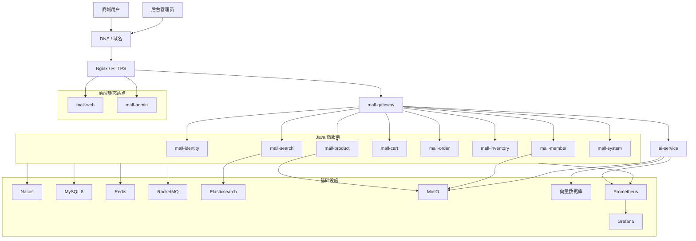

# AI 智能电商微服务平台——部署方案

## 1. 文档信息

- **项目名称**：AI 智能电商微服务平台
- **英文名称**：AI-Powered E-Commerce Platform
- **项目代号**：AI Mall
- **仓库名称**：`ai-mall-platform`
- **文档名称**：部署方案
- **文档路径**：`docs/13-部署方案.md`
- **当前版本**：V0.1
- **文档状态**：初稿
- **关联文档**：
  - `docs/00-项目总览.md`
  - `docs/01-产品需求文档.md`
  - `docs/02-统一语言词汇表.md`
  - `docs/03-领域事件风暴.md`
  - `docs/04-子域与限界上下文.md`
  - `docs/05-上下文映射图.md`
  - `docs/06-聚合与领域模型设计.md`
  - `docs/07-核心业务流程.md`
  - `docs/08-系统与微服务架构.md`
  - `docs/09-数据库设计.md`
  - `docs/10-API与事件契约.md`
  - `docs/11-权限与功能配置.md`
  - `docs/12-测试方案.md`

### 1.1 版本记录

| 版本 | 日期 | 说明 |
|---|---|---|
| V0.1 | 初始版本 | 完成本地开发、Docker Compose、镜像、环境变量、配置、监控、备份、发布、回滚和演示环境部署设计 |

---

## 2. 文档目的

本文档用于定义 AI 智能电商微服务平台的部署方式和运行要求，明确：

1. 本地开发环境如何启动；
2. Docker Compose 如何组织基础设施和应用服务；
3. Java、Vue 和 Python 服务如何构建镜像；
4. Nginx、Gateway、Nacos 和业务服务如何协同；
5. 数据库、Redis、RocketMQ、Elasticsearch、MinIO 和向量数据库如何部署；
6. 环境变量和敏感配置如何管理；
7. 数据库初始化与 Flyway 迁移如何执行；
8. 服务启动顺序和健康检查如何设计；
9. 日志、指标、链路追踪和告警如何部署；
10. 数据备份和恢复如何执行；
11. CI/CD 如何完成自动构建、测试和发布；
12. 发布失败后如何回滚；
13. 演示环境如何以较低成本稳定运行；
14. 基础设施和应用如何进行安全加固；
15. 第一版部署需要多少资源；
16. 部署完成后的验收标准。

本文档面向个人项目、作品集演示和中小规模测试环境，不将第一版描述为生产级高可用平台。

---

# 3. 部署目标

## 3.1 可重复

任意开发者在准备好环境变量后，应能够通过统一命令启动系统。

```bash
docker compose up -d
```

或：

```bash
docker compose -f docker-compose.infra.yml up -d
```

## 3.2 环境隔离

至少支持：

```text
local
dev
test
prod
```

每个环境独立管理：

- 配置；
- 数据库；
- Redis Key；
- MQ Topic；
- Elasticsearch 索引；
- MinIO Bucket；
- 向量数据库 Collection；
- API Key；
- 域名。

## 3.3 安全

部署时必须：

- 不在 Git 中提交密码；
- 不使用默认中间件密码；
- 不将内部服务端口暴露公网；
- 生产环境启用 HTTPS；
- 数据库按服务分配账号；
- MinIO 私有文件使用私有 Bucket；
- AI Key 通过 Secret 注入；
- 日志中不打印敏感信息。

## 3.4 可观测

每个服务应具备：

- 健康检查；
- 结构化日志；
- TraceId；
- 指标；
- 错误告警；
- 消息堆积监控；
- 核心补偿任务查询。

## 3.5 可回滚

每次发布应具备：

- 镜像版本；
- 数据库迁移记录；
- 上一版本镜像；
- 配置备份；
- 回滚步骤；
- 数据兼容策略。

---

# 4. 部署架构总览



---

# 5. 部署目录结构

```text
deploy
├── docker-compose.yml
├── docker-compose.infra.yml
├── docker-compose.apps.yml
├── docker-compose.monitoring.yml
├── .env.example
├── env
│   ├── local.env.example
│   ├── dev.env.example
│   └── prod.env.example
├── nginx
│   ├── nginx.conf
│   ├── conf.d
│   │   ├── mall-web.conf
│   │   ├── mall-admin.conf
│   │   └── gateway.conf
│   └── certs
├── mysql
│   ├── init
│   ├── conf.d
│   └── backup
├── redis
│   └── redis.conf
├── nacos
│   └── application.properties
├── rocketmq
│   ├── broker.conf
│   └── store
├── elasticsearch
│   ├── config
│   └── data
├── minio
│   └── data
├── vector-db
│   └── data
├── monitoring
│   ├── prometheus.yml
│   ├── alert-rules.yml
│   └── grafana
│       ├── dashboards
│       └── provisioning
└── scripts
    ├── start-infra.sh
    ├── stop-infra.sh
    ├── start-all.sh
    ├── health-check.sh
    ├── backup-mysql.sh
    ├── restore-mysql.sh
    ├── rebuild-search-index.sh
    └── seed-demo-data.sh
```

---

# 6. 部署模式

## 6.1 本地混合模式

推荐开发阶段使用：

```text
基础设施：Docker Compose
Java：IDE
Python AI：本地虚拟环境
Vue：Vite 开发服务器
```

优点：

- 调试方便；
- 修改快速；
- 日志清晰；
- 无需频繁构建镜像。

## 6.2 全容器模式

用于：

- 集成测试；
- 最终演示；
- CI；
- 服务器部署。

## 6.3 分层 Compose

```text
docker-compose.infra.yml
docker-compose.apps.yml
docker-compose.monitoring.yml
```

启动：

```bash
docker compose -f docker-compose.infra.yml up -d
docker compose -f docker-compose.apps.yml up -d
docker compose -f docker-compose.monitoring.yml up -d
```

---

# 7. 本地开发环境要求

## 7.1 软件版本

```text
Java 21
Maven 3.9+
Node.js 20+
pnpm 9+
Python 3.11+
Docker 26+
Docker Compose v2
Git
```

## 7.2 本地资源

最低建议：

```text
CPU：8 核
内存：16GB
磁盘：50GB 可用
```

完整启动全部组件推荐：

```text
内存：24GB～32GB
```

## 7.3 启动顺序

```text
基础设施
→ mall-identity
→ mall-system
→ mall-member
→ mall-product
→ mall-inventory
→ mall-cart
→ mall-order
→ mall-search
→ ai-service
→ mall-gateway
→ mall-web / mall-admin
```

---

# 8. Docker 网络

## 8.1 网络

```text
aimall-network
```

```yaml
networks:
  aimall-network:
    driver: bridge
```

## 8.2 容器服务名

```text
mysql:3306
redis:6379
nacos:8848
rocketmq-namesrv:9876
elasticsearch:9200
minio:9000
qdrant:6333
ai-service:8200
```

## 8.3 端口暴露

生产环境只对公网开放：

```text
80
443
```

数据库、Redis、MQ、Elasticsearch 和内部微服务不直接暴露公网。

---

# 9. 环境变量与 Secret

## 9.1 基础变量

```dotenv
APP_ENV=local
APP_VERSION=0.1.0
TZ=Asia/Shanghai

MYSQL_HOST=mysql
MYSQL_PORT=3306
MYSQL_ROOT_PASSWORD=change-me

REDIS_HOST=redis
REDIS_PORT=6379
REDIS_PASSWORD=change-me

NACOS_SERVER_ADDR=nacos:8848
NACOS_NAMESPACE=local
NACOS_USERNAME=nacos
NACOS_PASSWORD=change-me

ROCKETMQ_NAMESRV_ADDR=rocketmq-namesrv:9876

ELASTICSEARCH_HOST=http://elasticsearch:9200
ELASTICSEARCH_USERNAME=elastic
ELASTICSEARCH_PASSWORD=change-me

MINIO_ENDPOINT=http://minio:9000
MINIO_ACCESS_KEY=change-me
MINIO_SECRET_KEY=change-me

SERVICE_TOKEN=change-me

LLM_API_KEY=change-me
LLM_BASE_URL=https://example.com
LLM_MODEL=example-model
EMBEDDING_MODEL=example-embedding-model
```

## 9.2 数据库变量

```dotenv
IDENTITY_DB=mall_identity_db
MEMBER_DB=mall_member_db
PRODUCT_DB=mall_product_db
ORDER_DB=mall_order_db
INVENTORY_DB=mall_inventory_db
SYSTEM_DB=mall_system_db
AI_DB=ai_db
```

## 9.3 敏感配置

敏感信息通过：

- Docker Secret；
- CI/CD Secret；
- 云平台 Secret；
- 服务器环境变量。

仓库只提交：

```text
.env.example
```

## 9.4 Docker Secret

建议管理：

```text
mysql_root_password
redis_password
nacos_password
minio_access_key
minio_secret_key
jwt_private_key
jwt_public_key
service_token
llm_api_key
```

容器内读取：

```text
/run/secrets/<secret_name>
```

---

# 10. 基础设施容器

## 10.1 MySQL

```yaml
services:
  mysql:
    image: mysql:8.4
    restart: unless-stopped
    environment:
      MYSQL_ROOT_PASSWORD: ${MYSQL_ROOT_PASSWORD}
      TZ: ${TZ}
    ports:
      - "3306:3306"
    volumes:
      - mysql-data:/var/lib/mysql
      - ./mysql/conf.d:/etc/mysql/conf.d
      - ./mysql/init:/docker-entrypoint-initdb.d
    networks:
      - aimall-network
    healthcheck:
      test: ["CMD", "mysqladmin", "ping", "-h", "localhost"]
      interval: 10s
      timeout: 5s
      retries: 20
```

## 10.2 Redis

```yaml
  redis:
    image: redis:7.4
    restart: unless-stopped
    command:
      - redis-server
      - /usr/local/etc/redis/redis.conf
      - --requirepass
      - ${REDIS_PASSWORD}
    ports:
      - "6379:6379"
    volumes:
      - redis-data:/data
      - ./redis/redis.conf:/usr/local/etc/redis/redis.conf
    networks:
      - aimall-network
```

## 10.3 Nacos

本地使用单机模式，可连接 MySQL 存储配置。

```yaml
  nacos:
    image: nacos/nacos-server:v2.4.3
    restart: unless-stopped
    environment:
      MODE: standalone
      SPRING_DATASOURCE_PLATFORM: mysql
      MYSQL_SERVICE_HOST: mysql
      MYSQL_SERVICE_PORT: 3306
      MYSQL_SERVICE_DB_NAME: nacos_config
      MYSQL_SERVICE_USER: nacos_user
      MYSQL_SERVICE_PASSWORD: ${NACOS_DB_PASSWORD}
    ports:
      - "8848:8848"
      - "9848:9848"
    networks:
      - aimall-network
```

## 10.4 RocketMQ

包括：

```text
NameServer
Broker
可选 Dashboard
```

Broker 数据必须挂载 Volume。

## 10.5 Elasticsearch

```yaml
  elasticsearch:
    image: docker.elastic.co/elasticsearch/elasticsearch:8.15.0
    restart: unless-stopped
    environment:
      discovery.type: single-node
      xpack.security.enabled: "true"
      ELASTIC_PASSWORD: ${ELASTICSEARCH_PASSWORD}
      ES_JAVA_OPTS: "-Xms1g -Xmx1g"
    ports:
      - "9200:9200"
    volumes:
      - es-data:/usr/share/elasticsearch/data
    networks:
      - aimall-network
```

## 10.6 MinIO

```yaml
  minio:
    image: minio/minio:latest
    restart: unless-stopped
    command: server /data --console-address ":9001"
    environment:
      MINIO_ROOT_USER: ${MINIO_ACCESS_KEY}
      MINIO_ROOT_PASSWORD: ${MINIO_SECRET_KEY}
    ports:
      - "9000:9000"
      - "9001:9001"
    volumes:
      - minio-data:/data
    networks:
      - aimall-network
```

## 10.7 向量数据库

第一版可使用 Qdrant：

```yaml
  qdrant:
    image: qdrant/qdrant:latest
    restart: unless-stopped
    ports:
      - "6333:6333"
    volumes:
      - qdrant-data:/qdrant/storage
    networks:
      - aimall-network
```

---

# 11. MySQL 初始化与迁移

## 11.1 数据库

```text
nacos_config
mall_identity_db
mall_member_db
mall_product_db
mall_order_db
mall_inventory_db
mall_system_db
ai_db
```

## 11.2 数据库账号

```text
mall_identity_user
mall_member_user
mall_product_user
mall_order_user
mall_inventory_user
mall_system_user
ai_user
nacos_user
```

每个账号只访问自己的数据库。

## 11.3 初始化脚本

```text
deploy/mysql/init/001-create-databases.sql
deploy/mysql/init/002-create-users.sql
deploy/mysql/init/003-nacos-schema.sql
```

## 11.4 字符集

```text
utf8mb4
utf8mb4_0900_ai_ci
```

## 11.5 Flyway

每个服务维护自己的迁移脚本：

```text
src/main/resources/db/migration
```

例如：

```text
V1__create_order_tables.sql
V2__create_refund_tables.sql
V3__create_outbox_table.sql
```

生产迁移前：

1. 备份数据库；
2. staging 验证；
3. 检查锁表风险；
4. 优先兼容性变更；
5. 不修改已发布脚本。

---

# 12. Java 服务镜像

## 12.1 多阶段构建

```dockerfile
FROM maven:3.9-eclipse-temurin-21 AS builder
WORKDIR /workspace
COPY . .
RUN mvn clean package -DskipTests

FROM eclipse-temurin:21-jre
WORKDIR /app
COPY --from=builder /workspace/target/*.jar app.jar
RUN useradd -r -u 10001 appuser
USER appuser
EXPOSE 8080
ENTRYPOINT ["java", "-jar", "/app/app.jar"]
```

## 12.2 JVM 参数

```dotenv
JAVA_TOOL_OPTIONS=-XX:MaxRAMPercentage=75.0 -XX:+UseG1GC -Dfile.encoding=UTF-8
```

## 12.3 健康检查

```text
/actuator/health/liveness
/actuator/health/readiness
/actuator/prometheus
```

---

# 13. Python AI 服务镜像

```dockerfile
FROM python:3.11-slim AS builder
WORKDIR /app
COPY pyproject.toml uv.lock ./
RUN pip install uv && uv sync --frozen --no-dev

FROM python:3.11-slim
WORKDIR /app
COPY --from=builder /app/.venv /app/.venv
COPY . .
ENV PATH="/app/.venv/bin:$PATH"
RUN useradd -r -u 10002 aiuser
USER aiuser
EXPOSE 8200
CMD ["uvicorn", "main:app", "--host", "0.0.0.0", "--port", "8200"]
```

健康接口：

```text
/health/live
/health/ready
/metrics
```

AI Ready 检查不应每次真实调用大模型，只检查必要配置和关键依赖。

---

# 14. Vue 前端镜像

```dockerfile
FROM node:20-alpine AS builder
WORKDIR /app
COPY package.json pnpm-lock.yaml ./
RUN corepack enable && pnpm install --frozen-lockfile
COPY . .
RUN pnpm build

FROM nginx:alpine
COPY --from=builder /app/dist /usr/share/nginx/html
COPY deploy/nginx/default.conf /etc/nginx/conf.d/default.conf
EXPOSE 80
```

SPA 路由：

```nginx
try_files $uri $uri/ /index.html;
```

前端统一访问相对路径：

```text
/api
```

避免不同环境重复构建。

---

# 15. Nginx

## 15.1 域名建议

```text
mall.example.com
admin.example.com
api.example.com
```

## 15.2 API 代理

```nginx
location /api/ {
    proxy_pass http://mall-gateway:8080;
    proxy_set_header Host $host;
    proxy_set_header X-Real-IP $remote_addr;
    proxy_set_header X-Forwarded-For $proxy_add_x_forwarded_for;
    proxy_set_header X-Forwarded-Proto $scheme;
    proxy_set_header X-Request-Id $request_id;
}
```

## 15.3 SSE

```nginx
location /api/ai/ {
    proxy_pass http://mall-gateway:8080;
    proxy_http_version 1.1;
    proxy_buffering off;
    proxy_cache off;
    proxy_read_timeout 120s;
    chunked_transfer_encoding on;
}
```

## 15.4 文件上传

```nginx
client_max_body_size 20m;
proxy_read_timeout 120s;
```

## 15.5 HTTPS

生产环境：

- TLS 1.2+；
- HTTP 重定向 HTTPS；
- 证书自动续期；
- 禁用弱加密套件；
- HSTS 可选。

---

# 16. Nacos 配置

## 16.1 Namespace

```text
local
dev
test
prod
```

## 16.2 Data ID

```text
mall-gateway.yaml
mall-identity.yaml
mall-member.yaml
mall-product.yaml
mall-cart.yaml
mall-order.yaml
mall-inventory.yaml
mall-search.yaml
mall-system.yaml
ai-service.yaml
```

## 16.3 Nacos 存放

- 数据源；
- Redis；
- MQ；
- Elasticsearch；
- MinIO；
- Feign 超时；
- Sentinel；
- 日志级别；
- Actuator；
- 线程池。

## 16.4 mall-system 存放

- AI 开关；
- 退款开关；
- 注册开关；
- 订单超时；
- 购物车数量；
- 文件限制。

业务配置与技术配置必须分离。

---

# 17. 应用 Compose

通用示例：

```yaml
services:
  mall-order:
    image: aimall/mall-order:${APP_VERSION}
    restart: unless-stopped
    environment:
      SPRING_PROFILES_ACTIVE: ${APP_ENV}
      NACOS_SERVER_ADDR: nacos:8848
      NACOS_NAMESPACE: ${NACOS_NAMESPACE}
      TZ: ${TZ}
    networks:
      - aimall-network
    depends_on:
      mysql:
        condition: service_healthy
      redis:
        condition: service_healthy
    healthcheck:
      test: ["CMD", "wget", "-qO-", "http://localhost:8105/actuator/health"]
      interval: 30s
      timeout: 5s
      retries: 10
```

注意：

- `depends_on` 不能替代应用重试；
- 服务应设置连接超时；
- 服务应支持依赖恢复；
- 启动失败可自动重启。

---

# 18. 端口规划

| 服务 | 端口 | 公网 |
|---|---:|---:|
| Nginx | 80/443 | 是 |
| mall-gateway | 8080 | 否 |
| mall-identity | 8101 | 否 |
| mall-member | 8102 | 否 |
| mall-product | 8103 | 否 |
| mall-cart | 8104 | 否 |
| mall-order | 8105 | 否 |
| mall-inventory | 8106 | 否 |
| mall-search | 8107 | 否 |
| mall-system | 8108 | 否 |
| ai-service | 8200 | 否 |
| MySQL | 3306 | 否 |
| Redis | 6379 | 否 |
| Nacos | 8848/9848 | 管理网 |
| RocketMQ | 9876/10911 | 否 |
| Elasticsearch | 9200 | 否 |
| MinIO | 9000/9001 | 管理网 |
| Qdrant | 6333 | 否 |
| Prometheus | 9090 | 管理网 |
| Grafana | 3000 | 管理网 |

---

# 19. 健康检查

## 19.1 Liveness

判断进程是否存活。

不应因可降级依赖短暂异常导致服务持续重启。

## 19.2 Readiness

判断服务是否能接收请求，检查：

- 数据库；
- Flyway；
- Nacos；
- 核心依赖；
- 必要缓存。

## 19.3 检查脚本

```text
scripts/health-check.sh
```

检查：

- 容器状态；
- HTTP 健康端点；
- MySQL；
- Redis；
- MQ；
- Elasticsearch；
- MinIO；
- AI。

---

# 20. 日志与监控

## 20.1 日志格式

```json
{
  "timestamp": "2026-08-01T15:00:00+08:00",
  "level": "INFO",
  "service": "mall-order",
  "traceId": "trace-001",
  "spanId": "span-001",
  "subjectId": "10001",
  "message": "Order created",
  "orderNo": "ORD202608010001"
}
```

## 20.2 日志输出

第一版统一输出：

```text
stdout / stderr
```

## 20.3 日志平台

可选：

```text
Loki + Promtail + Grafana
```

## 20.4 Prometheus

抓取：

- Gateway；
- Java 服务；
- AI 服务；
- Redis；
- RocketMQ；
- Elasticsearch；
- Nginx。

## 20.5 Grafana

至少提供：

- 系统总览；
- JVM；
- API 耗时；
- 错误率；
- MySQL；
- Redis；
- MQ；
- ES；
- AI；
- 订单和库存业务指标。

## 20.6 业务指标

```text
orders_created_total
orders_paid_total
orders_cancelled_total
inventory_reserve_failed_total
inventory_compensation_pending
outbox_pending_total
mq_consume_failed_total
ai_requests_total
ai_tool_call_failed_total
```

## 20.7 告警

- 服务不可用；
- 5xx 持续升高；
- 数据库连接池耗尽；
- MQ 堆积；
- Outbox 积压；
- 库存补偿积压；
- ES 不健康；
- AI 工具失败率过高；
- 磁盘空间不足。

---

# 21. 链路追踪

## 21.1 第一版

最少实现：

```text
Gateway 生成 X-Trace-Id
→ Feign 传递
→ MQ 事件携带
→ AI 请求携带
→ 日志打印
```

## 21.2 后续增强

```text
OpenTelemetry
Jaeger
Tempo
SkyWalking
```

---

# 22. MinIO 初始化

## 22.1 Bucket

```text
aimall-public
aimall-private
```

## 22.2 用途

### aimall-public

- 商品图片；
- 品牌 Logo；
- 公开头像。

### aimall-private

- 知识文档；
- 导出文件；
- 敏感附件。

## 22.3 初始化

```bash
mc alias set aimall http://minio:9000 "$MINIO_ACCESS_KEY" "$MINIO_SECRET_KEY"
mc mb --ignore-existing aimall/aimall-public
mc mb --ignore-existing aimall/aimall-private
```

匿名用户只允许读取明确公开对象，禁止匿名写入。

---

# 23. Elasticsearch 初始化

## 23.1 索引

```text
aimall_product_v1
```

别名：

```text
aimall_product
```

## 23.2 Mapping

保存于：

```text
deploy/elasticsearch/config/product-index-v1.json
```

## 23.3 重建

```text
创建新索引
→ 全量同步商品
→ 校验数量
→ 切换别名
→ 暂时保留旧索引
```

脚本：

```text
scripts/rebuild-search-index.sh
```

---

# 24. RocketMQ 初始化

## 24.1 Topic

```text
product-events
order-events
inventory-events
system-events
audit-events
ai-events
```

## 24.2 Consumer Group

```text
search-product-index-consumer
inventory-payment-consumer
inventory-order-cancel-consumer
order-timeout-consumer
service-config-cache-consumer
system-audit-log-consumer
ai-document-index-consumer
```

## 24.3 环境隔离

可使用：

```text
dev-product-events
prod-product-events
```

或独立 MQ 实例。

---

# 25. 数据备份

## 25.1 MySQL

建议：

- 每日全量备份；
- 开启 Binlog；
- 压缩；
- 加密；
- 定期恢复演练。

示例：

```bash
mysqldump \
  -h "$MYSQL_HOST" \
  -u root \
  -p"$MYSQL_ROOT_PASSWORD" \
  --single-transaction \
  --routines \
  --events \
  --databases \
  mall_identity_db \
  mall_member_db \
  mall_product_db \
  mall_order_db \
  mall_inventory_db \
  mall_system_db \
  ai_db \
  | gzip > "backup/aimall-$(date +%F-%H%M%S).sql.gz"
```

## 25.2 Redis

- AOF；
- RDB；
- 定期备份数据文件。

## 25.3 MinIO

备份：

- 商品图片；
- 知识文档；
- Bucket 配置。

## 25.4 Elasticsearch

搜索索引可重建，重点保留：

- 商品数据库；
- Mapping；
- 重建脚本。

## 25.5 向量数据库

向量可从原始文档重建，保留：

- 原始文档；
- 分块策略；
- Embedding 模型版本；
- 文档处理状态。

---

# 26. 恢复方案

## 26.1 MySQL

1. 停止写入；
2. 备份当前异常数据；
3. 恢复全量备份；
4. 应用 Binlog；
5. 校验关键表；
6. 启动服务；
7. 检查 Outbox 和补偿任务；
8. 重建搜索索引；
9. 检查 AI 文档状态。

## 26.2 Elasticsearch

```text
创建新索引
→ 全量同步
→ 校验
→ 切换别名
```

## 26.3 Redis

- 权限和配置缓存自动重建；
- Token 异常时要求重新登录；
- 购物车从 AOF/RDB 恢复；
- 无法恢复时明确说明购物车风险。

## 26.4 RocketMQ

恢复后：

- 检查消息堆积；
- 检查消费失败；
- 检查 Outbox；
- 执行补偿；
- 逐步恢复消费速度。

---

# 27. CI/CD

## 27.1 Pull Request

```text
格式检查
→ 编译
→ 单元测试
→ 静态分析
→ 架构测试
→ 前端测试
→ Python 测试
→ 覆盖率
```

## 27.2 主分支

```text
集成测试
→ 契约测试
→ 构建镜像
→ 漏洞扫描
→ 推送镜像仓库
→ 部署测试环境
→ E2E
```

## 27.3 发布标签

```text
v0.1.0
v0.2.0
v1.0.0
```

触发：

```text
正式镜像
→ 发布说明
→ 数据库备份
→ staging
→ 验收
→ 正式或演示环境
```

## 27.4 Registry

可选：

- GitHub Container Registry；
- Docker Hub；
- 阿里云 ACR；
- Harbor。

---

# 28. 镜像版本

正式：

```text
aimall/mall-order:0.1.0
```

提交版本：

```text
aimall/mall-order:sha-abc1234
```

生产不使用：

```text
latest
```

通过：

```dotenv
APP_VERSION=0.1.0
```

固定部署版本。

---

# 29. 发布流程

## 29.1 发布前

1. 测试通过；
2. 构建镜像；
3. 数据库备份；
4. 迁移脚本审查；
5. staging 部署；
6. 核心 E2E；
7. 安全检查；
8. 发布确认。

## 29.2 服务顺序

```text
技术配置
→ mall-identity
→ mall-system
→ mall-member
→ mall-product
→ mall-inventory
→ mall-cart
→ mall-order
→ mall-search
→ ai-service
→ mall-gateway
→ 前端
```

若接口契约有变化：

```text
先发布兼容提供方
→ 再发布消费者
```

## 29.3 数据库变更

```text
增加兼容字段
→ 发布兼容代码
→ 回填数据
→ 切换新逻辑
→ 后续删除旧字段
```

---

# 30. 回滚

## 30.1 应用

```text
APP_VERSION 改回上一版本
→ pull
→ up -d
→ 健康检查
```

## 30.2 前端

恢复上一版本静态镜像。

## 30.3 配置

- Nacos 恢复上一版本；
- `mall-system` 使用历史值创建一次新变更；
- 清理缓存。

## 30.4 数据库

优先：

```text
向前修复
```

谨慎使用逆向迁移。

## 30.5 事件兼容

回滚前确认旧消费者能否处理新事件，不兼容时需先部署兼容消费者或暂停生产者。

---

# 31. 演示环境

## 31.1 用途

- 简历作品展示；
- 面试演示；
- 项目验收；
- README 截图和视频。

## 31.2 资源

最低建议：

```text
CPU：8 核
内存：16GB
磁盘：100GB SSD
```

更稳定：

```text
CPU：8～16 核
内存：24GB～32GB
```

## 31.3 低成本策略

- 单实例 MySQL；
- 单实例 Redis；
- Nacos 单机；
- RocketMQ 单 Broker；
- ES 512MB～1GB；
- Java 服务限制内存；
- 监控按需启动；
- AI 使用外部 LLM API；
- 演示前预热搜索和 RAG。

## 31.4 演示数据

预置：

- 超级管理员；
- 五类角色；
- 分类和品牌；
- 多 SKU 商品；
- 正常库存；
- 多状态订单；
- AI 知识文档；
- 示例导购对话。

---

# 32. 安全加固

## 32.1 网络

- 仅 Nginx 公网开放；
- 内部服务私有网络；
- 数据库和 Redis 禁止公网；
- 控制台限制 IP；
- 防火墙和安全组最小开放。

## 32.2 账号

- 修改默认账号；
- 强密码；
- 服务独立数据库账号；
- 应用非 root；
- Nacos 和 MinIO 禁用默认密码。

## 32.3 镜像

- 固定版本；
- 精简镜像；
- 漏洞扫描；
- 不写入密钥；
- 非 root；
- 定期更新。

## 32.4 Nginx

- HTTPS；
- 限流；
- 文件大小限制；
- 隐藏版本；
- 禁止目录列表；
- 安全响应头。

## 32.5 Java 与 AI

- Actuator 仅开放必要端点；
- Swagger 生产环境限制；
- 内部 API 不公网开放；
- Prompt 和 API Key 不暴露；
- AI 工具白名单；
- AI 写操作二次确认。

---

# 33. 故障处理

## 33.1 启动失败

检查：

1. 环境变量；
2. Nacos；
3. 数据库；
4. Flyway；
5. Redis；
6. MQ；
7. 端口；
8. 健康日志。

## 33.2 MQ 堆积

- 检查消费者；
- 查看消费异常；
- 扩容消费者；
- 限制生产；
- 修复后逐步恢复；
- 验证幂等。

## 33.3 库存补偿积压

- 暂停异常写路径；
- 检查库存服务；
- 查询补偿表；
- 重试；
- 对账订单和库存；
- 必要时人工修正并审计。

## 33.4 搜索异常

- 保持交易可用；
- 修复 ES；
- 全量重建；
- 切换别名。

## 33.5 AI 异常

- 关闭 AI 功能；
- 保留普通搜索；
- 检查 Key、配额和网络；
- 恢复后重新开启。

---

# 34. 部署检查清单

## 34.1 发布前

- [ ] 所有测试通过；
- [ ] 镜像版本明确；
- [ ] 数据库已备份；
- [ ] 环境变量完整；
- [ ] 密钥未提交；
- [ ] Flyway 已验证；
- [ ] Nacos 配置已备份；
- [ ] MQ Topic 已创建；
- [ ] MinIO Bucket 已创建；
- [ ] ES Mapping 已创建；
- [ ] 健康检查可用；
- [ ] 回滚版本已确认。

## 34.2 发布后

- [ ] 容器正常；
- [ ] Gateway 健康；
- [ ] 服务注册成功；
- [ ] 数据库迁移成功；
- [ ] Redis 可用；
- [ ] MQ 无异常堆积；
- [ ] ES 健康；
- [ ] MinIO 可用；
- [ ] AI 可用；
- [ ] mall-web 可访问；
- [ ] mall-admin 可访问；
- [ ] 登录正常；
- [ ] 创建订单正常；
- [ ] 支付与库存正常；
- [ ] 日志包含 TraceId；
- [ ] 监控有数据。

---

# 35. 部署验收场景

## 35.1 冷启动

```text
启动基础设施
→ 创建数据库
→ Flyway 建表
→ 初始化权限与配置
→ 启动应用
→ 创建演示数据
```

验收：

- 不手工改库；
- 所有服务健康；
- 前后台可访问。

## 35.2 重启

```bash
docker compose restart
```

验收：

- 数据不丢失；
- 服务重新注册；
- 购物车、MQ、ES 和文件保留。

## 35.3 升级

```text
0.1.0 → 0.2.0
```

验收：

- 迁移成功；
- 旧数据兼容；
- 核心链路通过；
- 应用可回滚。

## 35.4 故障恢复

分别停止：

```text
Redis
RocketMQ
Elasticsearch
ai-service
```

验证：

- 降级；
- 恢复；
- 最终一致；
- 补偿；
- 告警。

---

# 36. 第一版优先级

## 36.1 P0

- Docker Compose 基础设施；
- MySQL；
- Redis；
- Nacos；
- MinIO；
- Java 服务镜像；
- AI 服务镜像；
- 两个前端镜像；
- Nginx；
- 环境变量；
- Flyway；
- 健康检查；
- 基础日志；
- 单机演示；
- 备份脚本；
- 启停脚本。

## 36.2 P1

- RocketMQ；
- Elasticsearch；
- 向量数据库；
- Prometheus；
- Grafana；
- Outbox 监控；
- CI/CD；
- HTTPS；
- 漏洞扫描；
- 自动备份；
- 发布和回滚脚本。

## 36.3 P2

- OpenTelemetry；
- Loki；
- 多实例；
- 滚动发布；
- Kubernetes；
- Redis Sentinel；
- MySQL 主从；
- RocketMQ 多 Broker；
- ES 多节点；
- MinIO 分布式。

---

# 37. 部署验收标准

1. 基础设施可通过 Docker Compose 启动；
2. 应用使用明确版本镜像；
3. 前后端统一经过 Nginx；
4. 外部只访问 80/443；
5. 内部服务不直接暴露公网；
6. 商城和后台可访问；
7. Java 服务注册到 Nacos；
8. Flyway 自动迁移；
9. 数据卷重启后保留；
10. MinIO Bucket 正确初始化；
11. MQ Topic 和消费者组可用；
12. ES 索引可重建；
13. AI 可调用 Java 内部 API；
14. SSE 可流式输出；
15. 所有服务有健康检查；
16. 日志包含 TraceId；
17. 监控可查看指标；
18. 数据库可备份和恢复；
19. 应用可回滚；
20. 演示环境可完成完整购买链路。

---

# 38. 当前部署决策

## 38.1 已确定

- 本地基础设施使用 Docker Compose；
- 开发采用混合启动；
- 演示采用全容器；
- Nginx 统一接入；
- 生产只暴露 80/443；
- 敏感配置使用环境变量或 Secret；
- MySQL 按服务分库分账号；
- Flyway 管理业务迁移；
- Java 21；
- Python 3.11；
- 前端由 Nginx 托管；
- AI 使用 SSE；
- 日志输出 stdout；
- 使用健康检查；
- 数据使用持久化 Volume；
- 镜像使用固定版本；
- 发布前备份数据库；
- 搜索和向量索引支持重建；
- AI 故障通过功能开关降级。

## 38.2 待确认

- 向量数据库选择 Qdrant 还是 pgvector；
- Nacos 演示环境是否使用外部 MySQL；
- RocketMQ 镜像和版本；
- 是否第一版部署 Prometheus 和 Grafana；
- 是否使用 Loki；
- CI/CD 使用 GitHub Actions 还是其他平台；
- 镜像仓库选择；
- 域名与 HTTPS 方案；
- Java 服务内存限制；
- 是否实现蓝绿发布；
- 是否第一版使用 Docker Secret；
- 是否迁移 Kubernetes。

---

# 39. 下一步文档

最后一份文档为：

```text
docs/14-开发计划.md
```

下一份文档需要明确：

1. 项目开发阶段；
2. 模块优先级；
3. 里程碑；
4. 每阶段任务；
5. 验收标准；
6. 前后端和 AI 的依赖顺序；
7. 每周计划；
8. 风险和缓冲；
9. V1、V2、V3 版本范围；
10. Git 分支和提交规范；
11. 代码评审；
12. 文档同步；
13. 演示准备；
14. 简历项目描述；
15. 最终交付清单。

本文档作为 V0.1 部署方案基线。后续架构、技术选型、资源条件或发布方式发生变化时，应同步更新本文档。
