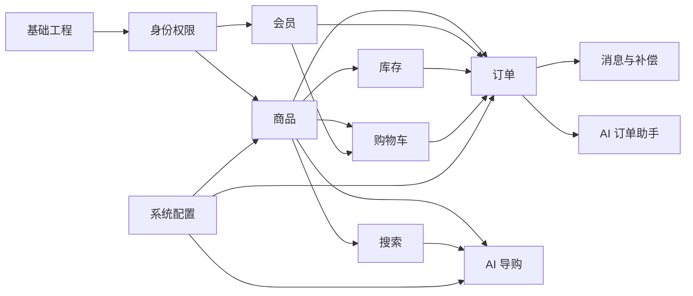

# AI 智能电商微服务平台——开发计划

## 1. 文档信息

- **项目名称**：AI 智能电商微服务平台
- **英文名称**：AI-Powered E-Commerce Platform
- **项目代号**：AI Mall
- **仓库名称**：`ai-mall-platform`
- **文档名称**：开发计划
- **文档路径**：`docs/14-开发计划.md`
- **当前版本**：V0.1
- **文档状态**：初稿
- **目标岗位**：Java 后端开发工程师｜具备 Vue 与 AI 应用开发能力
- **关联文档**：
  - `docs/00-项目总览.md`
  - `docs/01-产品需求文档.md`
  - `docs/02-统一语言词汇表.md`
  - `docs/03-领域事件风暴.md`
  - `docs/04-子域与限界上下文.md`
  - `docs/05-上下文映射图.md`
  - `docs/06-聚合与领域模型设计.md`
  - `docs/07-核心业务流程.md`
  - `docs/08-系统与微服务架构.md`
  - `docs/09-数据库设计.md`
  - `docs/10-API与事件契约.md`
  - `docs/11-权限与功能配置.md`
  - `docs/12-测试方案.md`
  - `docs/13-部署方案.md`

### 1.1 版本记录

| 版本 | 日期 | 说明 |
|---|---|---|
| V0.1 | 初始版本 | 明确开发阶段、里程碑、优先级、周计划、验收标准、风险、Git 规范和最终交付清单 |

---

## 2. 文档目的

本文档用于把前面的产品、领域、架构、数据库、接口、权限、测试和部署设计转换为可执行开发计划，明确：

1. 项目分几个阶段完成；
2. 每个阶段先做什么、后做什么；
3. 前端、后端、AI 和基础设施之间的依赖顺序；
4. V1、V2、V3 各自包含哪些功能；
5. 每周需要完成哪些任务；
6. 每个里程碑的验收标准；
7. 哪些任务属于必须完成，哪些可以延期；
8. 如何控制微服务、DDD 和 AI 带来的复杂度；
9. Git 分支、提交和代码评审如何规范；
10. 文档、测试、部署和演示如何同步推进；
11. 如何形成可用于简历、GitHub 和面试展示的最终成果；
12. 项目风险出现时如何缩减范围而不破坏核心价值。

本文档假设项目由个人主导开发，可根据实际时间调整周期，但不得随意打乱核心交易链路的开发顺序。

---

# 3. 总体开发原则

## 3.1 先交易闭环，后智能增强

开发顺序必须遵循：

```text
身份与权限
→ 商品
→ SKU
→ 库存
→ 购物车
→ 订单
→ 模拟支付
→ 发货
→ 搜索
→ 配置
→ AI
→ 监控与部署
```

不得一开始先做：

- AI Agent；
- 首页视觉；
- 复杂搜索；
- 推荐算法；
- 监控大屏；
- Kubernetes；
- 多租户；
- 秒杀。

原因是这些能力都依赖稳定的商品、库存和订单基础。

---

## 3.2 先完成可运行版本，再做架构增强

每个功能先达到：

```text
可运行
可验证
可测试
可演示
```

再逐步增加：

- MQ；
- Outbox；
- Elasticsearch；
- RAG；
- 监控；
- 链路追踪；
- 性能优化。

---

## 3.3 核心域深度优先

重点投入：

```text
订单
库存
商品
权限
```

这些模块需要体现：

- DDD；
- 状态机；
- 聚合；
- 幂等；
- 并发；
- 最终一致性；
- 权限控制。

以下模块可轻量实现：

- 搜索；
- 操作日志；
- 文件上传；
- 配置查询；
- AI 会话管理。

---

## 3.4 不为微服务数量而拆分

第一版固定服务：

```text
mall-identity
mall-member
mall-product
mall-cart
mall-order
mall-inventory
mall-search
mall-system
ai-service
mall-gateway
```

暂不拆：

- 支付服务；
- 退款服务；
- 文件服务；
- 日志服务；
- 通知服务；
- 推荐服务；
- 报表服务。

---

## 3.5 每个阶段必须有验收结果

每个阶段结束时必须至少产生一种可见成果：

- 可调用 API；
- 可操作页面；
- 自动化测试；
- Docker 可启动；
- 演示视频；
- README 截图；
- 技术说明文档。

不能只完成代码框架而没有可验证业务结果。

---

# 4. 项目版本规划

## 4.1 V1：核心交易闭环

目标：

```text
完成一个可以注册、登录、浏览商品、加入购物车、下单、模拟支付、发货和确认收货的电商系统
```

### V1 范围

#### 后台

- 管理员登录；
- RBAC；
- 动态菜单；
- 动态路由；
- 商品、分类、品牌；
- SKU；
- 库存初始化和调整；
- 订单查询；
- 发货；
- 基础系统配置。

#### 商城

- 会员注册和登录；
- 商品列表；
- 商品详情；
- SKU 选择；
- 购物车；
- 地址；
- 订单预览；
- 创建订单；
- 模拟支付；
- 订单列表和详情；
- 取消；
- 确认收货。

#### 后端

- Gateway；
- Nacos；
- MySQL；
- Redis；
- OpenFeign；
- Spring Security；
- JWT；
- DDD 基础；
- 同步库存锁定；
- 订单创建失败释放库存；
- 基础测试；
- Docker Compose。

#### AI

- 基础智能导购；
- 真实商品工具调用；
- 结构化推荐结果；
- AI 故障降级。

### V1 完成定义

用户可以完整完成：

```text
注册
→ 登录
→ 浏览商品
→ 加入购物车
→ 下单
→ 支付
→ 后台发货
→ 确认收货
```

---

## 4.2 V2：分布式能力与 AI 完善

目标：

```text
将 V1 从“可运行业务系统”增强为“有分布式架构亮点的作品集项目”
```

### V2 范围

- RocketMQ；
- 延迟取消订单；
- Outbox；
- 消息消费幂等；
- Elasticsearch；
- 商品索引同步；
- 退款申请和审核；
- 功能开关；
- 系统参数；
- 操作日志；
- AI 商品对比；
- RAG 智能客服；
- AI 知识库；
- Prometheus 基础指标；
- 核心链路集成测试。

### V2 完成定义

系统能够展示：

- 最终一致性；
- 延迟消息；
- 消息重试；
- 搜索索引；
- 配置动态生效；
- RAG；
- 退款流程；
- 监控指标。

---

## 4.3 V3：工程化与面试展示增强

目标：

```text
将项目打磨为可以公开展示、稳定演示、适合写入简历的成熟作品
```

### V3 范围

- OpenTelemetry 或 SkyWalking；
- Loki 或日志平台；
- Grafana Dashboard；
- 性能测试；
- 并发库存测试；
- 故障注入；
- AI 订单助手；
- AI 写操作二次确认；
- 自动确认收货；
- 低库存告警；
- GitHub Actions；
- 自动构建镜像；
- 演示环境；
- README；
- 架构图；
- 演示视频；
- 简历描述；
- 面试问答整理。

### V3 完成定义

项目具备：

- 在线或本地一键演示；
- 清晰文档；
- 稳定测试；
- 可解释架构；
- 可展示技术难点；
- 可复现部署；
- 简历和面试材料。

---

# 5. 总体里程碑

| 里程碑 | 名称 | 核心结果 |
|---|---|---|
| M0 | 项目初始化 | 仓库、基础规范、Compose、公共模块 |
| M1 | 身份与权限 | 后台登录、RBAC、动态菜单 |
| M2 | 商品与库存 | 商品、SKU、库存、上下架 |
| M3 | 商城基础 | 商品浏览、会员、地址、购物车 |
| M4 | 订单闭环 | 下单、锁库存、支付、取消、发货、收货 |
| M5 | 搜索与配置 | Elasticsearch、功能开关、系统参数 |
| M6 | AI 能力 | 导购、对比、RAG、订单助手 |
| M7 | 分布式增强 | RocketMQ、Outbox、补偿和幂等 |
| M8 | 测试与监控 | 自动化测试、性能、监控、告警 |
| M9 | 部署与展示 | Docker、演示环境、README、简历材料 |

---

# 6. 阶段 0：项目初始化

## 6.1 目标

建立所有模块能够共同开发的基础工程。

## 6.2 后端任务

- 创建 Maven 多模块；
- 创建 `mall-common`；
- 创建 `mall-contracts`；
- 创建 Gateway；
- 创建各微服务空模块；
- 统一 Java 版本；
- 统一 Spring Boot 依赖；
- 统一 Spring Cloud Alibaba 依赖；
- 配置 MyBatis-Plus；
- 配置统一响应；
- 配置统一异常；
- 配置 TraceId；
- 配置日志；
- 配置 OpenAPI；
- 配置 Flyway；
- 配置基础测试。

## 6.3 前端任务

- 创建 `mall-web`；
- 创建 `mall-admin`；
- 配置 Vue3、TypeScript 和 Vite；
- 配置 Pinia；
- 配置 Router；
- 配置 Axios；
- 配置 ESLint 和 Prettier；
- 创建基础布局；
- 创建请求封装；
- 创建统一类型。

## 6.4 AI 任务

- 创建 FastAPI 工程；
- 配置 Pydantic；
- 配置日志；
- 配置健康检查；
- 配置测试；
- 创建 LLM 接口抽象；
- 创建 Java API Client 抽象。

## 6.5 基础设施任务

- Docker Compose；
- MySQL；
- Redis；
- Nacos；
- MinIO；
- 创建数据库；
- 创建本地 `.env.example`；
- 启动脚本；
- 健康检查脚本。

## 6.6 验收标准

- Maven 全模块编译成功；
- 两个前端可以启动；
- AI 服务可以启动；
- Gateway 可启动；
- Java 服务可以注册到 Nacos；
- MySQL 和 Redis 可连接；
- 所有服务健康接口可访问；
- Git 提交中不包含密钥。

---

# 7. 阶段 1：身份认证与 RBAC

## 7.1 目标

先完成后台系统安全基础，再开发商品和订单后台。

## 7.2 后端任务

### 管理员

- `admin_user`；
- 管理员创建；
- 启用和禁用；
- 密码加密；
- 登录；
- Refresh Token；
- 退出；
- 登录日志。

### 角色与菜单

- `sys_role`；
- `sys_menu`；
- `sys_user_role`；
- `sys_role_menu`；
- 角色 CRUD；
- 菜单 CRUD；
- 角色授权；
- 管理员角色分配；
- 菜单树；
- 权限编码集合。

### 安全

- JWT；
- Spring Security；
- `@PreAuthorize`；
- 商城和后台 Token 隔离；
- Gateway 身份 Header；
- Redis 权限缓存；
- 权限缓存失效。

## 7.3 前端任务

### mall-admin

- 登录页；
- Auth Store；
- Permission Store；
- Menu Store；
- 静态路由；
- 动态路由；
- 路由守卫；
- 侧边栏；
- 权限指令；
- 403 和 404；
- 管理员管理页；
- 角色管理页；
- 菜单管理页。

## 7.4 测试任务

- 登录成功和失败；
- 禁用管理员；
- Token 过期；
- 商城 Token 访问后台；
- 不同角色菜单；
- 按钮权限；
- 后端 403；
- 权限缓存失效；
- 菜单循环；
- 超级管理员保护。

## 7.5 验收标准

- 超级管理员可以登录；
- 可以创建角色；
- 可以给角色分配页面和按钮；
- 可以给管理员分配角色；
- 不同管理员看到不同菜单；
- 无权限按钮不显示；
- 无权限 API 返回 403；
- 页面刷新后动态路由恢复。

---

# 8. 阶段 2：商品与库存

## 8.1 目标

建立可销售商品的权威模型和库存模型。

## 8.2 商品后端任务

- 分类聚合或轻量模型；
- 品牌；
- Product 聚合；
- SKU 实体；
- 商品图片；
- 商品属性；
- 商品创建；
- 商品编辑；
- SKU 添加和修改；
- SKU 启用和禁用；
- 商品上架；
- 商品下架；
- 商品列表；
- 商品详情；
- 商品快照内部 API；
- ProductRepository；
- Flyway 脚本；
- Redis 商品缓存。

## 8.3 库存后端任务

- Inventory 聚合；
- 库存初始化；
- 增加库存；
- 减少库存；
- 库存流水；
- 库存查询；
- 库存可用性内部 API；
- 库存锁定接口；
- 库存释放接口；
- 确认扣减接口；
- 乐观锁；
- 条件更新；
- 幂等唯一键。

## 8.4 后台前端任务

- 分类管理；
- 品牌管理；
- 商品列表；
- 商品创建；
- 商品编辑；
- SKU 编辑；
- 图片上传；
- 商品上架和下架；
- 库存列表；
- 库存初始化；
- 库存调整；
- 库存流水。

## 8.5 测试任务

- 商品聚合测试；
- SKU 重复规格；
- 商品上架条件；
- 库存初始化；
- 库存不足；
- 并发锁定；
- 释放和扣减；
- 权限；
- Repository；
- 文件上传。

## 8.6 验收标准

```text
创建分类
→ 创建品牌
→ 创建商品
→ 添加多个 SKU
→ 初始化库存
→ 上架商品
→ 商城接口可读取
```

并且：

- 商品和库存数据分属不同服务；
- 商品服务不直接修改库存；
- 库存不能出现负数；
- 商品下架后不可购买。

---

# 9. 阶段 3：商城会员、地址与购物车

## 9.1 会员任务

- 会员注册；
- 会员登录；
- 会员资料；
- 禁用状态；
- 地址；
- 默认地址；
- 地址归属校验；
- 会员内部 API。

## 9.2 购物车任务

- Redis Hash；
- 加入购物车；
- 相同 SKU 合并；
- 修改数量；
- 删除；
- 选择和取消选择；
- 全选；
- 查询商品实时状态；
- 查询库存；
- 失效项；
- 登录后游客购物车合并可放 P1。

## 9.3 mall-web 任务

- 登录；
- 注册；
- 首页基础布局；
- 分类；
- 商品列表；
- 商品详情；
- SKU 选择；
- 数量选择；
- 购物车；
- 地址管理；
- 会员中心基础页；
- 功能开关 Store。

## 9.4 测试任务

- 注册开关；
- 登录；
- 地址归属；
- 默认地址；
- 商品下架后购物车失效；
- 数量上限；
- Redis TTL；
- Redis 故障；
- 游客和会员行为。

## 9.5 验收标准

- 会员可注册和登录；
- 可创建地址；
- 可浏览已上架商品；
- 可选择 SKU；
- 可加入购物车；
- 购物车显示实时价格和库存；
- 失效商品不能结算。

---

# 10. 阶段 4：订单核心闭环

## 10.1 目标

完成项目最重要的订单与库存交易闭环。

## 10.2 订单预览

任务：

- 获取购物车选中项；
- 获取商品快照；
- 获取实时价格；
- 获取库存可用性；
- 获取地址；
- 计算总金额；
- 生成预览 Token；
- 返回预览 DTO。

## 10.3 创建订单

任务：

- Idempotency-Key；
- 请求摘要；
- 最新商品校验；
- 地址归属；
- 订单号；
- 同步锁定库存；
- 创建 Order 聚合；
- 保存订单和明细；
- 保存商品快照；
- 保存地址快照；
- 保存状态历史；
- 清理购物车；
- 创建订单失败释放库存；
- 释放失败补偿任务。

## 10.4 模拟支付

任务：

- 支付功能开关；
- 支付记录；
- 支付幂等；
- 支付截止时间；
- 订单状态变化；
- V1 可同步调用库存确认扣减；
- V2 改为事件驱动。

## 10.5 取消

任务：

- 用户主动取消；
- 后台取消；
- 状态校验；
- 释放库存；
- 幂等；
- 取消原因；
- 状态历史。

## 10.6 发货与收货

任务：

- 后台发货；
- 物流公司和单号；
- 发货权限；
- 用户确认收货；
- 订单完成；
- 状态历史。

## 10.7 前端任务

### mall-web

- 订单预览；
- 提交订单；
- 支付结果；
- 订单列表；
- 订单详情；
- 取消；
- 确认收货。

### mall-admin

- 订单列表；
- 订单详情；
- 发货对话框；
- 状态历史；
- 基础筛选。

## 10.8 测试任务

- 订单聚合；
- 金额；
- 快照；
- 重复提交；
- 库存不足；
- 锁定成功、订单保存失败；
- 支付与取消并发；
- 重复支付；
- 重复取消；
- 发货权限；
- 他人订单越权；
- E2E 购买链路。

## 10.9 验收标准

完整链路成功：

```text
商品上架
→ 加入购物车
→ 订单预览
→ 创建订单
→ 库存锁定
→ 模拟支付
→ 库存扣减
→ 后台发货
→ 用户确认收货
```

异常链路成功：

```text
创建待付款订单
→ 取消
→ 库存恢复
```

---

# 11. 阶段 5：RocketMQ 与分布式一致性

## 11.1 目标

把 V1 中的部分同步后续处理升级为可靠异步事件。

## 11.2 任务

- RocketMQ 基础封装；
- 事件 Envelope；
- Topic 和 Tag；
- 消费者组；
- 消费幂等表；
- Outbox；
- Outbox 投递任务；
- 重试；
- 死信或失败任务；
- TraceId；
- 事件版本。

## 11.3 订单事件

- `OrderCreatedIntegrationEvent`；
- `PaymentSucceededIntegrationEvent`；
- `OrderCancelledIntegrationEvent`；
- `OrderCompletedIntegrationEvent`。

## 11.4 库存消费者

- 支付成功确认扣减；
- 订单取消释放库存；
- 重复消息；
- 乱序消息；
- 补偿任务。

## 11.5 延迟订单取消

- 创建订单后发送延迟消息；
- 到期重新检查状态；
- 自动取消；
- 定时任务补偿；
- 重复延迟消息幂等。

## 11.6 验收标准

- 支付后库存最终扣减；
- 取消后库存最终释放；
- 重复消息不重复处理；
- MQ 停止时 Outbox 保留；
- MQ 恢复后事件继续发送；
- 超时订单自动取消；
- 补偿任务可人工查询。

---

# 12. 阶段 6：搜索与配置

## 12.1 搜索任务

- Elasticsearch 索引；
- Mapping；
- 商品上架事件消费；
- 商品修改同步；
- 商品下架同步；
- 关键词搜索；
- 分类、品牌、价格筛选；
- 排序；
- 分页；
- 索引重建；
- 搜索降级。

## 12.2 配置任务

### FeatureConfig

- 注册开关；
- 退款开关；
- AI 导购开关；
- AI 对比开关；
- 模拟支付开关。

### SystemParameter

- 订单超时；
- 购物车数量；
- 最大购买数量；
- AI 最大轮数；
- 文件大小。

### 缓存

- Redis；
- 本地缓存可选；
- 配置变更事件；
- 配置历史；
- 安全默认值。

## 12.3 前端任务

- 搜索页；
- 搜索筛选；
- 后台功能配置页；
- 后台系统参数页；
- 配置历史页可放 P1；
- 商城功能入口动态显示。

## 12.4 验收标准

- 上架商品可搜索；
- 下架商品从搜索消失；
- ES 不可用时交易仍可用；
- 关闭功能后前端入口隐藏；
- 直接调用后端也被拒绝；
- 新订单使用新超时参数；
- 已有订单保持原截止时间。

---

# 13. 阶段 7：AI 能力

## 13.1 AI 基础框架

- FastAPI；
- 配置；
- LLM Client；
- Embedding Client；
- Java API Client；
- 会话；
- Prompt；
- Pydantic 输出；
- SSE；
- 日志；
- TraceId；
- 超时和重试。

## 13.2 AI 智能导购

流程：

```text
用户输入
→ 意图识别
→ 条件提取
→ 调用商品搜索工具
→ 调用商品详情工具
→ 生成推荐理由
→ 返回真实商品
```

任务：

- 商品搜索工具；
- 商品详情工具；
- 条件结构；
- 推荐结构；
- 无结果处理；
- 功能开关；
- AI 故障降级。

## 13.3 商品对比

- 商品 ID 校验；
- 获取真实参数；
- 结构化对比；
- 优缺点；
- 使用场景；
- 最大商品数量。

## 13.4 RAG 客服

- 知识库；
- 文档上传；
- MinIO；
- 解析；
- 分块；
- Embedding；
- 向量数据库；
- 检索；
- 引用；
- 文档状态；
- 删除和重建。

## 13.5 AI 订单助手

P2：

- 查询本人订单；
- 解释订单状态；
- 查询物流；
- 查询退款；
- 取消订单；
- 二次确认；
- Java 最终校验；
- ToolCall 幂等。

## 13.6 AI 测试

- Mock LLM；
- 意图；
- 参数提取；
- 工具选择；
- 输出 Schema；
- 幻觉防护；
- Prompt 注入；
- 无知识回答；
- 权限；
- 二次确认。

## 13.7 验收标准

- AI 推荐的商品真实存在；
- 不编造价格和库存；
- 无结果时明确说明；
- AI 异常不影响普通搜索；
- RAG 回答带引用；
- 无依据时不编造规则；
- AI 不能访问他人订单；
- 写操作不能绕过确认。

---

# 14. 阶段 8：测试、监控与性能

## 14.1 自动化测试

- 领域单元测试；
- 应用服务测试；
- Repository 集成测试；
- Controller 测试；
- 契约测试；
- MQ 测试；
- Playwright；
- AI Pytest；
- 覆盖率。

## 14.2 性能测试

- 商品列表；
- 商品详情；
- 搜索；
- 购物车；
- 创建订单；
- 热点库存；
- AI 首 Token。

## 14.3 监控

- Actuator；
- Prometheus；
- Grafana；
- JVM；
- Redis；
- MQ；
- ES；
- AI；
- 业务指标。

## 14.4 故障测试

- Redis 停止；
- MQ 停止；
- ES 停止；
- AI 停止；
- 订单数据库失败；
- 库存补偿；
- 搜索重建。

## 14.5 验收标准

- 核心测试自动化；
- 库存并发不超卖；
- 支付和取消并发无非法状态；
- MQ 重复消费幂等；
- 核心 E2E 通过；
- 监控可显示业务指标；
- 故障恢复流程可执行。

---

# 15. 阶段 9：部署与作品集整理

## 15.1 部署任务

- 完整 Compose；
- 应用镜像；
- Nginx；
- HTTPS；
- Flyway；
- 初始化脚本；
- 演示数据；
- 备份；
- 恢复；
- GitHub Actions；
- 镜像仓库。

## 15.2 README

README 至少包含：

1. 项目介绍；
2. 业务功能；
3. 技术栈；
4. 系统架构；
5. DDD 设计；
6. 核心业务流程；
7. 目录结构；
8. 启动方式；
9. 环境变量；
10. 演示账号；
11. 截图；
12. API 文档；
13. 测试结果；
14. 性能结果；
15. 项目亮点；
16. 后续计划。

## 15.3 演示素材

- 商城首页；
- 商品详情；
- 购物车；
- 订单；
- 后台商品；
- 库存；
- 订单发货；
- 动态菜单；
- AI 导购；
- RAG；
- Grafana；
- 架构图；
- 事件流程图。

## 15.4 演示视频

建议 5～8 分钟：

```text
项目介绍
→ 架构
→ 权限
→ 商品和库存
→ 下单和支付
→ MQ 与补偿
→ AI 导购
→ RAG
→ 监控和部署
```

## 15.5 验收标准

- 仓库可公开阅读；
- README 完整；
- 一键启动；
- 演示账号可用；
- 核心链路稳定；
- 架构图和文档一致；
- 简历描述准确；
- 面试中能解释主要设计决策。

---

# 16. 参考周计划

以下以 16 周个人开发周期为例。时间紧张时可压缩，但不得跳过关键依赖。

## 第 1 周：工程初始化

- 仓库；
- Maven；
- 两个 Vue 应用；
- FastAPI；
- Compose；
- MySQL、Redis、Nacos；
- 统一响应和异常；
- TraceId；
- 基础 CI。

**周验收：**

```text
所有工程可启动并通过健康检查
```

## 第 2 周：管理员认证

- AdminUser；
- 登录；
- JWT；
- Refresh Token；
- Gateway；
- Security；
- 登录页；
- Auth Store。

**周验收：**

```text
管理员可以登录后台并访问受保护接口
```

## 第 3 周：RBAC

- Role；
- Menu；
- 用户角色；
- 角色菜单；
- 动态菜单；
- 动态路由；
- 按钮权限；
- 权限缓存。

**周验收：**

```text
不同角色看到不同菜单并受到 API 权限限制
```

## 第 4 周：商品基础

- 分类；
- 品牌；
- Product；
- 图片；
- 商品后台列表和编辑。

**周验收：**

```text
后台可以创建草稿商品
```

## 第 5 周：SKU 与库存

- SKU；
- 规格；
- 价格；
- Inventory；
- 库存初始化；
- 调整；
- 流水；
- 商品上架条件。

**周验收：**

```text
商品可添加 SKU、初始化库存并上架
```

## 第 6 周：商城商品与会员

- 注册；
- 登录；
- 商品列表；
- 商品详情；
- SKU 选择；
- 地址。

**周验收：**

```text
会员可以登录并浏览商品
```

## 第 7 周：购物车

- Redis 购物车；
- 加入、修改、删除；
- 失效检查；
- 结算选择；
- 页面完成。

**周验收：**

```text
商城购物车可稳定使用
```

## 第 8 周：订单预览与创建

- 预览；
- 商品快照；
- 地址；
- 金额；
- Idempotency-Key；
- 锁库存；
- 创建订单；
- 失败补偿。

**周验收：**

```text
用户可以创建待付款订单且库存正确锁定
```

## 第 9 周：支付、取消、发货和收货

- 模拟支付；
- 取消；
- 释放；
- 发货；
- 确认收货；
- 后台订单页；
- 会员订单页。

**周验收：**

```text
完整交易闭环可演示
```

## 第 10 周：RocketMQ

- Topic；
- 事件；
- 支付扣减；
- 取消释放；
- 消费幂等；
- 延迟取消；
- 补偿任务。

**周验收：**

```text
订单与库存通过事件实现最终一致性
```

## 第 11 周：搜索与配置

- Elasticsearch；
- 索引同步；
- 搜索页；
- 功能开关；
- 系统参数；
- 配置缓存。

**周验收：**

```text
商品可搜索，功能和参数可动态生效
```

## 第 12 周：AI 导购

- FastAPI；
- LLM；
- 工具；
- 商品搜索；
- 推荐结构；
- SSE；
- 前端 AI 页面。

**周验收：**

```text
AI 能根据真实商品数据生成推荐
```

## 第 13 周：RAG 与对比

- 知识库；
- 文档；
- 向量库；
- 检索；
- 引用；
- 商品对比；
- 后台 AI 管理。

**周验收：**

```text
RAG 客服可基于平台文档回答并显示来源
```

## 第 14 周：测试与并发

- 领域测试；
- 集成测试；
- E2E；
- 库存并发；
- MQ 重复；
- 权限安全；
- AI 测试。

**周验收：**

```text
核心测试自动化且无 P0 缺陷
```

## 第 15 周：部署与监控

- 完整 Compose；
- 镜像；
- Nginx；
- Prometheus；
- Grafana；
- 备份；
- 演示环境。

**周验收：**

```text
服务器或本地可一键启动完整系统
```

## 第 16 周：作品集打磨

- README；
- 截图；
- 视频；
- 架构图；
- 性能报告；
- 简历描述；
- 面试题；
- Bug 修复。

**周验收：**

```text
项目可以公开展示并用于求职
```

---

# 17. 时间不足时的缩减顺序

## 17.1 绝对不能删除

- 管理员登录；
- RBAC；
- 商品；
- SKU；
- 库存；
- 购物车；
- 订单；
- 模拟支付；
- 发货；
- AI 导购；
- Docker；
- README。

## 17.2 可以延期到 V2

- 退款；
- Elasticsearch；
- RAG；
- Outbox；
- 操作日志异步化；
- 配置历史；
- AI 商品对比；
- Prometheus。

## 17.3 可以延期到 V3

- AI 订单写操作；
- 自动确认收货；
- 收藏；
- 浏览历史；
- 低库存告警；
- OpenTelemetry；
- Loki；
- Kubernetes；
- 多实例；
- 蓝绿发布。

## 17.4 缩减原则

宁可完成：

```text
一个稳定的核心交易闭环
+
一个真实可用的 AI 导购
```

也不要完成：

```text
大量半成品服务
+
无法运行的复杂架构
```

---

# 18. 模块依赖顺序



关键约束：

- 订单依赖商品、会员和库存；
- AI 导购依赖商品或搜索；
- AI 订单助手依赖订单；
- 前端订单页不能先于订单接口稳定；
- 搜索不阻塞 V1 交易闭环。

---

# 19. 人力投入建议

个人开发时间比例：

| 领域 | 比例 |
|---|---:|
| Java 后端 | 45% |
| 商城前端 | 20% |
| 后台前端 | 15% |
| AI 服务 | 15% |
| 部署与文档 | 5% |

实际开发中测试应融入每个模块，不单独视为最后补充任务。

---

# 20. 每日开发节奏

建议每个开发日按以下顺序：

1. 回顾当前里程碑；
2. 选择一个可完成的小任务；
3. 先写测试或验收条件；
4. 实现后端或领域规则；
5. 运行测试；
6. 联调前端；
7. 更新文档；
8. 提交 Git；
9. 记录问题和下一步。

避免：

- 一天同时切换多个服务；
- 未完成一个用例就开始另一个；
- 大量代码长时间不提交；
- 功能完成后才补测试和文档。

---

# 21. 任务拆分规范

## 21.1 单个任务大小

一个任务建议控制在：

```text
2～8 小时
```

示例：

合理：

```text
实现订单取消领域规则
实现商品上架接口
实现角色菜单授权
实现购物车数量修改
```

过大：

```text
完成订单服务
完成 AI 系统
完成后台管理
```

## 21.2 任务描述

每个任务包含：

- 背景；
- 输入；
- 输出；
- 业务规则；
- 接口；
- 数据；
- 测试；
- 验收标准；
- 关联文档。

## 21.3 Definition of Done

任务完成必须满足：

- 代码可编译；
- 核心测试通过；
- 异常路径处理；
- API 文档更新；
- 数据库迁移存在；
- 权限存在；
- 日志和错误码存在；
- 无明显安全问题；
- 可演示。

---

# 22. Git 分支规范

## 22.1 分支

```text
main
develop
feature/*
fix/*
refactor/*
docs/*
release/*
```

个人项目也可以简化为：

```text
main
feature/*
fix/*
```

但 `main` 必须保持可运行。

## 22.2 示例

```text
feature/order-create
feature/inventory-reservation
feature/ai-shopping-assistant
fix/order-duplicate-payment
docs/update-api-contract
```

## 22.3 提交流程

```text
创建分支
→ 小步提交
→ 本地测试
→ Pull Request
→ 自动检查
→ 合并
```

---

# 23. Git Commit 规范

推荐 Conventional Commits：

```text
feat
fix
refactor
test
docs
chore
build
ci
perf
```

示例：

```text
feat(order): implement order creation with inventory reservation
fix(inventory): prevent duplicate stock deduction
test(order): add payment and cancellation concurrency tests
docs(api): add inventory reservation contract
chore(deploy): add local docker compose
```

要求：

- 一个提交聚焦一个主题；
- 不提交编译产物；
- 不提交密钥；
- 不使用“修改一下”“更新代码”等模糊描述；
- 数据库迁移与对应代码放在同一功能 PR。

---

# 24. Pull Request 规范

PR 内容至少包括：

```text
变更目的
主要实现
影响模块
数据库变更
API 变更
事件变更
测试结果
截图
风险
回滚方式
```

## 24.1 检查项

- [ ] 编译通过；
- [ ] 单元测试通过；
- [ ] 代码格式通过；
- [ ] 权限校验完整；
- [ ] 错误码完整；
- [ ] 幂等检查；
- [ ] 数据归属检查；
- [ ] 数据库迁移；
- [ ] API 文档；
- [ ] 事件兼容；
- [ ] 日志脱敏；
- [ ] 文档同步。

---

# 25. 代码评审重点

## 25.1 DDD

- 聚合边界是否正确；
- 领域规则是否放在领域层；
- Application 是否只负责编排；
- Infrastructure 是否实现端口；
- 是否共享了不应共享的领域对象。

## 25.2 微服务

- 是否直接访问其他服务数据库；
- 是否形成循环调用；
- 同步写调用是否幂等；
- 超时和错误是否处理；
- 是否需要事件而不是同步耦合。

## 25.3 订单与库存

- 金额是否后端计算；
- 库存是否可能为负；
- 支付和取消是否并发冲突；
- 重复消息是否幂等；
- 失败是否有补偿。

## 25.4 权限

- 是否只做前端权限；
- 是否校验数据归属；
- 内部 Header 是否可信；
- 超级管理员保护；
- 敏感操作是否有日志。

## 25.5 AI

- 数据是否来自真实工具；
- 是否可能编造商品；
- 是否直接访问业务数据库；
- 是否存在越权；
- 写操作是否二次确认；
- 输出是否 Schema 校验。

---

# 26. 文档同步规则

发生以下变化时必须更新文档：

| 变更 | 需要更新 |
|---|---|
| 新增业务功能 | PRD、流程、API |
| 修改术语 | 统一语言词汇表 |
| 修改上下文 | 子域、上下文图、架构 |
| 修改聚合 | 聚合与领域模型 |
| 修改核心流程 | 核心业务流程 |
| 新增服务 | 系统架构、部署 |
| 修改表 | 数据库设计 |
| 修改接口或事件 | API 与事件契约 |
| 修改权限或配置 | 权限与功能配置 |
| 新增关键测试 | 测试方案 |
| 修改部署 | 部署方案 |
| 修改里程碑 | 开发计划 |

文档不应在项目最后一次性补写。

---

# 27. 风险管理

## 27.1 微服务过多

风险：

- 启动慢；
- 联调复杂；
- 网络问题多；
- 个人开发成本高。

措施：

- 固定服务数量；
- 先单服务内部完成；
- 使用契约；
- Docker 分层启动；
- 不新增空壳服务。

## 27.2 DDD 过度设计

风险：

- 类数量过多；
- CRUD 复杂化；
- 进度延误。

措施：

- 订单和库存完整 DDD；
- 商品适度 DDD；
- 会员、配置轻量 DDD；
- 搜索、日志使用简单模型；
- 查询采用 Read Model。

## 27.3 分布式一致性

风险：

- 支付后库存未扣减；
- 取消后库存未释放；
- 商品索引不一致。

措施：

- 幂等；
- Outbox；
- 重试；
- 补偿；
- 对账；
- 告警；
- 人工任务。

## 27.4 AI 不稳定

风险：

- 输出随机；
- API 费用；
- 模型超时；
- 幻觉；
- Prompt 注入。

措施：

- Mock LLM；
- 结构化输出；
- 工具白名单；
- 真实业务数据；
- 超时；
- 降级；
- 无依据不回答；
- 写操作确认。

## 27.5 前端耗时过多

风险：

- 页面细节拖慢核心后端；
- 视觉设计反复修改。

措施：

- 使用 Element Plus；
- 先功能后视觉；
- 页面复用；
- 不追求大型电商全部页面；
- 作品集阶段再统一优化。

## 27.6 部署资源不足

风险：

- 本地内存不足；
- ES 和 MQ 占用高；
- 演示环境成本高。

措施：

- 分阶段启动；
- 监控按需；
- ES 限制堆；
- AI 使用外部 API；
- 先完成本地演示；
- 资源不足时关闭非核心组件。

## 27.7 时间失控

风险：

- 功能不断增加；
- V1 无法完成。

措施：

- 严格 P0/P1/P2；
- 每周验收；
- 两周一次范围检查；
- 不在 V1 增加优惠券、多商户和真实支付；
- 优先完成可演示闭环。

---

# 28. 缓冲计划

建议预留总周期的：

```text
15%～20%
```

用于：

- 集成问题；
- 数据库迁移；
- MQ 调试；
- 前端联调；
- AI 输出修复；
- 部署问题；
- 演示前 Bug。

16 周计划中至少预留：

```text
2 周等价缓冲
```

缓冲不用于新增功能，优先用于修复和稳定。

---

# 29. Bug 修复优先级

## P0

- 无法登录；
- 无法下单；
- 库存负数；
- 重复扣减；
- 越权；
- 数据丢失；
- 迁移失败。

## P1

- 搜索失效；
- 配置不生效；
- 取消后库存不释放；
- AI 推荐不存在商品；
- 退款状态错误；
- MQ 长时间积压。

## P2

- 页面样式；
- 次要筛选；
- 文案；
- 非核心日志。

开发阶段每个里程碑结束前必须清理 P0，原则上清理 P1。

---

# 30. 演示数据计划

## 30.1 管理员

```text
admin
product_admin
order_admin
operator
customer_service
```

## 30.2 商品

至少准备：

- 3 个分类；
- 5 个品牌；
- 20 个商品；
- 每个商品 2～4 个 SKU；
- 有库存、无库存、下架、禁用 SKU 等场景。

## 30.3 订单

准备：

- 待付款；
- 待发货；
- 已发货；
- 已完成；
- 已取消；
- 退款中；
- 已退款。

## 30.4 AI 知识文档

- 订单规则；
- 退款规则；
- 发货规则；
- 地址帮助；
- AI 使用说明。

## 30.5 初始化脚本

```text
scripts/seed-demo-data.sh
```

要求可重复执行或能识别已初始化数据。

---

# 31. README 项目亮点

建议重点突出：

1. 基于 Spring Cloud Alibaba 的微服务架构；
2. 使用 DDD 划分商品、订单和库存上下文；
3. 订单与库存通过同步锁定和异步事件实现最终一致性；
4. 使用 RocketMQ 延迟消息关闭超时订单；
5. 使用 Redis 购物车、权限缓存和配置缓存；
6. 使用 Elasticsearch 实现商品全文检索；
7. 使用 Spring Security、JWT 和 RBAC 实现动态菜单与按钮权限；
8. 使用 FastAPI、LangGraph、RAG 和 Agent 实现 AI 导购与客服；
9. AI 通过受控 Java 工具访问业务数据，不直接访问数据库；
10. 使用 Docker Compose、Prometheus 和自动化测试提升工程完整性。

---

# 32. 简历项目描述

## 32.1 项目名称

```text
AI 智能电商微服务平台
```

## 32.2 简历定位

```text
Java 后端开发工程师｜具备 Vue 与 AI 应用开发能力
```

## 32.3 项目描述示例

> 独立设计并开发基于 Java 21、Spring Boot 3、Spring Cloud Alibaba 和 DDD 的 AI 智能电商微服务平台，包含商城端、后台管理端、商品、购物车、订单、库存、搜索、权限和 AI 服务，实现完整电商交易闭环及智能导购、RAG 客服等功能。

## 32.4 技术亮点示例

- 基于 DDD 划分商品、订单、库存等限界上下文，使用聚合、值对象、领域事件和仓储接口实现核心业务规则；
- 设计订单与库存协作流程，通过库存预占、支付确认扣减、取消释放、幂等和补偿任务避免超卖与重复处理；
- 使用 RocketMQ、Outbox 和消费幂等实现商品索引、订单状态和库存状态的最终一致性；
- 基于 Spring Security、JWT 和 RBAC 实现商城与后台身份隔离、动态菜单、动态路由及按钮级权限；
- 使用 Redis 实现购物车、权限缓存、配置缓存和幂等控制，使用 Elasticsearch 实现商品检索；
- 基于 FastAPI、LangGraph、RAG 和工具调用构建 AI 导购与客服，AI 仅通过 Java 内部 API 访问真实业务数据；
- 使用 Testcontainers、Playwright、Pytest 和 Docker Compose 建立自动化测试与可复现部署流程。

## 32.5 数据量和性能描述

只有实际压测后才能填写：

```text
P95
并发数
错误率
库存并发测试结果
```

不得虚构数据。

---

# 33. 面试准备清单

需要能够解释：

## 33.1 DDD

- 为什么订单和库存是核心域；
- 为什么 SKU 属于 Product 聚合；
- 为什么库存独立；
- 为什么订单保存快照；
- 为什么不是所有服务都使用重 DDD。

## 33.2 分布式

- 创建订单为什么同步锁库存；
- 支付后为什么异步扣减；
- MQ 重复消息如何处理；
- Outbox 如何工作；
- 订单取消后库存释放失败怎么办；
- 如何防止超卖。

## 33.3 权限

- 动态菜单如何生成；
- 前端按钮权限为什么不安全；
- `@PreAuthorize` 如何工作；
- 商城和后台 Token 如何隔离；
- 如何防止水平越权。

## 33.4 AI

- 为什么 AI 不直接访问业务数据库；
- Agent 和普通聊天有什么区别；
- RAG 如何减少幻觉；
- 商品推荐如何保证真实；
- AI 写操作如何保证安全；
- Prompt 注入如何处理。

## 33.5 部署与测试

- 为什么用 Testcontainers；
- Redis 故障怎么办；
- ES 故障是否影响下单；
- Docker Compose 如何启动；
- 如何回滚；
- 如何监控库存补偿。

---

# 34. 最终交付清单

## 34.1 代码

- [ ] `mall-web`
- [ ] `mall-admin`
- [ ] `mall-gateway`
- [ ] `mall-identity`
- [ ] `mall-member`
- [ ] `mall-product`
- [ ] `mall-cart`
- [ ] `mall-order`
- [ ] `mall-inventory`
- [ ] `mall-search`
- [ ] `mall-system`
- [ ] `ai-service`
- [ ] `mall-common`
- [ ] `mall-contracts`

## 34.2 基础设施

- [ ] MySQL
- [ ] Redis
- [ ] Nacos
- [ ] RocketMQ
- [ ] Elasticsearch
- [ ] MinIO
- [ ] 向量数据库
- [ ] Nginx
- [ ] Prometheus
- [ ] Grafana

## 34.3 文档

- [ ] 00-项目总览
- [ ] 01-产品需求文档
- [ ] 02-统一语言词汇表
- [ ] 03-领域事件风暴
- [ ] 04-子域与限界上下文
- [ ] 05-上下文映射图
- [ ] 06-聚合与领域模型设计
- [ ] 07-核心业务流程
- [ ] 08-系统与微服务架构
- [ ] 09-数据库设计
- [ ] 10-API 与事件契约
- [ ] 11-权限与功能配置
- [ ] 12-测试方案
- [ ] 13-部署方案
- [ ] 14-开发计划
- [ ] README
- [ ] API 文档
- [ ] 部署说明

## 34.4 测试

- [ ] 领域单元测试
- [ ] 应用服务测试
- [ ] Repository 集成测试
- [ ] API 测试
- [ ] 契约测试
- [ ] MQ 测试
- [ ] 权限安全测试
- [ ] AI 测试
- [ ] Playwright E2E
- [ ] 并发库存测试
- [ ] 性能报告

## 34.5 展示材料

- [ ] 系统架构图
- [ ] 上下文映射图
- [ ] 订单流程图
- [ ] 库存状态图
- [ ] 商品截图
- [ ] 商城截图
- [ ] 后台截图
- [ ] AI 导购截图
- [ ] RAG 截图
- [ ] Grafana 截图
- [ ] 演示视频
- [ ] 简历项目描述
- [ ] 面试问题说明

---

# 35. 项目完成标准

项目不能仅以“代码写完”为完成标准。

最终完成应同时满足：

1. 核心业务闭环可运行；
2. 商品、订单和库存边界清晰；
3. 权限和数据归属安全；
4. 库存并发不超卖；
5. 重复请求和消息幂等；
6. 异常存在补偿路径；
7. AI 使用真实业务数据；
8. AI 异常不影响交易；
9. 测试覆盖核心规则；
10. Docker 可重复部署；
11. 文档与代码一致；
12. README 清晰；
13. 演示数据完整；
14. 演示视频可展示主要功能；
15. 简历描述不夸大；
16. 能在面试中解释主要技术选择。

---

# 36. 当前开发决策

## 36.1 已确定

- 先完成交易闭环，再增强 AI；
- 订单和库存优先级最高；
- V1 完成基础同步流程；
- V2 增加 RocketMQ、ES、退款和 RAG；
- V3 完成监控、性能、部署和展示；
- 不在第一版引入多租户和多商户；
- 不接入真实支付和真实物流；
- 不采用微前端；
- 不增加空壳微服务；
- 核心域采用 DDD；
- 搜索和日志采用轻量架构；
- AI 不直接访问业务数据库；
- 每周必须有可运行验收结果；
- 文档、测试和代码同步更新；
- 最终项目面向 Java 后端岗位展示。

## 36.2 待确认

- 实际开发周期是 12 周、16 周还是更长；
- 每周可投入时间；
- V1 是否直接包含 RocketMQ；
- Elasticsearch 是否进入 V1；
- RAG 是否必须在首个公开版本完成；
- 是否部署在线演示环境；
- 是否使用 GitHub Actions；
- 向量数据库最终选择；
- 是否第一版部署监控；
- 是否制作英文 README；
- 是否公开所有源码；
- 是否准备项目答辩演示文稿。

---

# 37. 文档结论

本项目的正确开发路线不是一次性实现全部功能，而是围绕以下主线逐层演进：

```text
稳定的权限基础
→ 清晰的商品和库存模型
→ 正确的订单交易闭环
→ 可靠的分布式一致性
→ 真实受控的 AI 能力
→ 完整的测试、部署和展示
```

优先保证：

```text
业务正确
边界清晰
数据安全
可测试
可部署
可解释
```

在此基础上再增加功能数量和技术复杂度。

本文档作为 V0.1 开发计划基线。后续实际进度、版本范围或求职时间发生变化时，应更新里程碑、周计划和交付范围，但不得破坏核心业务依赖顺序。
