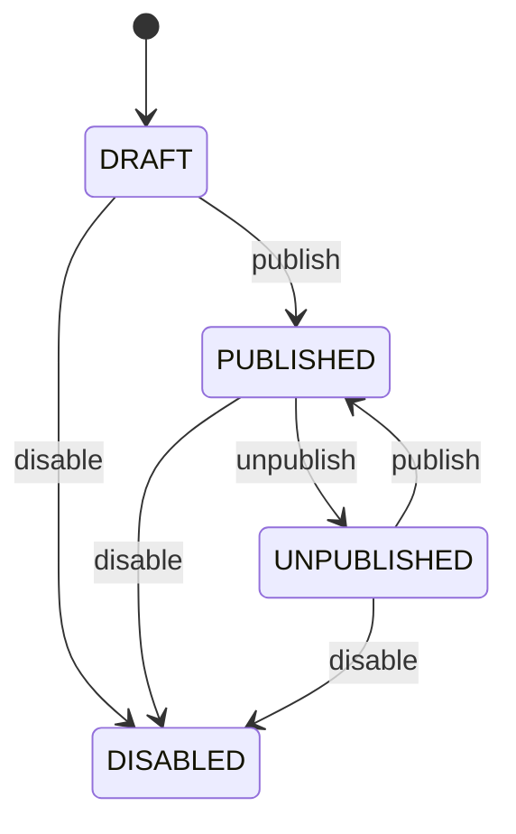
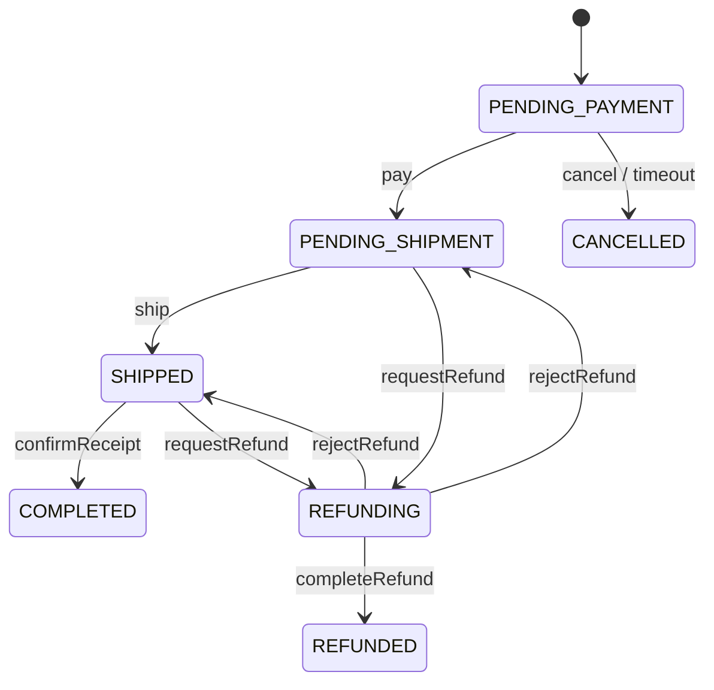
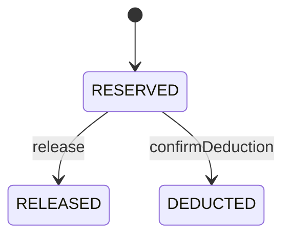
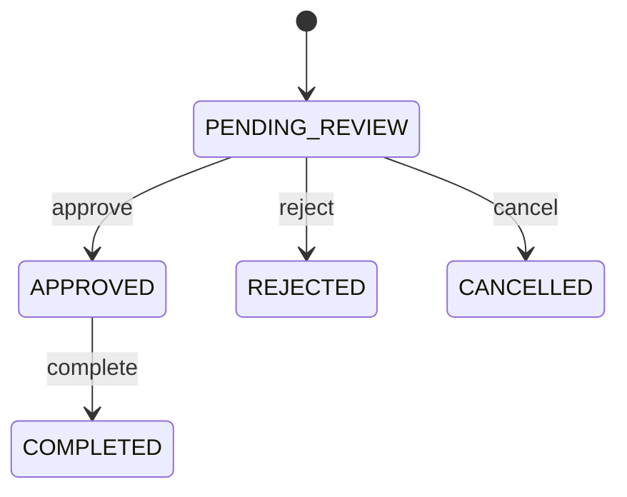

# AI 智能电商微服务平台——聚合与领域模型设计

## 1. 文档信息

- **项目名称**：AI 智能电商微服务平台
- **英文名称**：AI-Powered E-Commerce Platform
- **项目代号**：AI Mall
- **仓库名称**：`ai-mall-platform`
- **文档名称**：聚合与领域模型设计
- **文档路径**：`docs/06-聚合与领域模型设计.md`
- **当前版本**：V0.1
- **文档状态**：初稿
- **关联文档**：
  - `docs/00-项目总览.md`
  - `docs/01-产品需求文档.md`
  - `docs/02-统一语言词汇表.md`
  - `docs/03-领域事件风暴.md`
  - `docs/04-子域与限界上下文.md`
  - `docs/05-上下文映射图.md`

### 1.1 版本记录

| 版本 | 日期 | 说明 |
|---|---|---|
| V0.1 | 初始版本 | 完成各上下文聚合、实体、值对象、不变量、仓储、领域服务和领域事件设计 |

---

## 2. 文档目的

本文档在限界上下文和上下文映射的基础上，进一步完成战术级 DDD 设计，明确：

1. 每个限界上下文包含哪些聚合；
2. 每个聚合的聚合根；
3. 聚合内部包含哪些实体和值对象；
4. 聚合需要维护哪些业务不变量；
5. 聚合对外暴露哪些业务行为；
6. 哪些规则属于领域服务；
7. 哪些能力通过仓储接口提供；
8. 哪些业务事实需要生成领域事件；
9. 哪些操作属于应用服务编排；
10. 哪些查询可以绕过聚合直接使用查询模型；
11. 领域对象、接口对象和持久化对象如何分离；
12. 订单和库存核心模型如何保证业务一致性。

本文档用于指导后续 Java 工程实现、数据库设计、API 设计、单元测试和代码评审。

---

## 3. 建模原则

### 3.1 聚合是事务一致性边界

同一聚合内部的状态变化通过一个本地事务完成。

不同聚合之间不要求在一个数据库事务中同时提交，跨聚合协作通过：

- 应用服务；
- 领域服务；
- 内部 API；
- 领域事件；
- 集成事件；
- 最终一致性。

### 3.2 聚合应尽量小

聚合只包含必须在同一事务中保持一致的对象。

不因为页面需要一起展示，就将多个对象放进一个聚合。

例如：

```text
商品详情页同时展示：
商品
品牌
分类
库存
评价
```

不代表它们必须属于同一个聚合。

### 3.3 外部只能通过聚合根修改聚合

聚合内部实体不直接被外部修改。

正确：

```java
product.addSku(...)
order.ship(...)
inventory.reserve(...)
role.assignMenus(...)
```

错误：

```java
product.getSkus().add(...)
order.setStatus(...)
inventory.setAvailableQuantity(...)
role.getMenuIds().add(...)
```

### 3.4 领域行为优先于 Setter

领域模型应表达业务语义。

推荐：

```text
publish
unpublish
reserve
release
confirmDeduction
pay
cancel
ship
confirmReceipt
requestRefund
```

不推荐：

```text
setStatus
updateCount
changeFlag
modifyData
```

### 3.5 领域层不依赖技术框架

领域层不依赖：

- Spring MVC；
- MyBatis-Plus；
- Redis；
- RocketMQ；
- OpenFeign；
- Elasticsearch；
- MinIO；
- FastAPI；
- 数据库表结构。

领域层可以依赖：

- Java 基础类型；
- 本上下文领域类型；
- 仓储接口；
- 领域服务接口；
- 领域事件接口。

### 3.6 查询不必全部加载聚合

复杂列表、统计和报表可以使用轻量 CQRS：

```text
写操作
→ 聚合
→ 仓储

查询操作
→ Query Service
→ Mapper / Elasticsearch
→ DTO
```

---

## 4. 聚合总览

| 限界上下文 | 聚合根 | 主要职责 |
|---|---|---|
| 身份与访问 | `AdminUser` | 管理员状态和角色关联 |
| 身份与访问 | `Role` | 角色状态和菜单权限分配 |
| 身份与访问 | `Menu` | 菜单层级、路由和权限编码 |
| 会员 | `Member` | 会员状态和个人资料 |
| 会员 | `ShippingAddress` | 收货地址和默认地址规则 |
| 商品 | `Product` | 商品信息、SKU 和上下架 |
| 商品 | `Category` | 分类层级和状态 |
| 商品 | `Brand` | 品牌信息和状态 |
| 购物车 | `ShoppingCart` | 购物车项、数量和选择状态 |
| 订单 | `Order` | 订单快照、状态流转和履约 |
| 订单 | `RefundRequest` | 退款申请与审核 |
| 库存 | `Inventory` | SKU 库存数量和锁定规则 |
| 系统配置 | `FeatureConfig` | 功能开关 |
| 系统配置 | `SystemParameter` | 业务参数和值校验 |
| AI | `Conversation` | AI 会话和消息 |
| AI | `KnowledgeBase` | 知识库和文档索引状态 |

---

# 5. 身份与访问上下文领域模型

## 5.1 AdminUser 聚合

### 5.1.1 聚合职责

`AdminUser` 负责：

- 管理员基础信息；
- 管理员启用和禁用；
- 密码状态；
- 角色关联；
- 登录资格判断；
- 重置密码；
- 管理员生命周期。

### 5.1.2 聚合结构

```text
AdminUser
├── AdminUserId
├── AdminAccount
├── PasswordHash
├── AdminUserStatus
├── DisplayName
├── RoleId 集合
├── CreatedAt
└── UpdatedAt
```

### 5.1.3 值对象

#### AdminUserId

```text
管理员唯一标识
```

#### AdminAccount

规则：

- 不能为空；
- 长度受限；
- 统一大小写策略；
- 不能包含非法字符；
- 唯一性由应用层和数据库共同保证。

#### PasswordHash

规则：

- 不允许保存明文；
- 不对外返回；
- 只保存加密结果；
- 密码校验通过领域服务或认证服务完成。

#### AdminUserStatus

```text
ENABLED
DISABLED
LOCKED
```

### 5.1.4 领域行为

```text
AdminUser.create(...)
adminUser.enable()
adminUser.disable(reason)
adminUser.lock(reason)
adminUser.unlock()
adminUser.assignRoles(roleIds)
adminUser.removeRole(roleId)
adminUser.resetPassword(passwordHash)
adminUser.ensureCanSignIn()
```

### 5.1.5 不变量

- 管理员账号不能为空；
- 管理员账号在系统中唯一；
- 禁用管理员不能登录；
- 锁定管理员不能登录；
- 管理员角色 ID 不能重复；
- 超级管理员不能被普通管理员禁用；
- 密码不能以明文形式进入持久化对象。

### 5.1.6 领域事件

```text
AdminUserCreatedDomainEvent
AdminUserEnabledDomainEvent
AdminUserDisabledDomainEvent
AdminUserLockedDomainEvent
AdminUserRolesAssignedDomainEvent
AdminUserPasswordResetDomainEvent
```

### 5.1.7 仓储接口

```java
public interface AdminUserRepository {
    Optional<AdminUser> findById(AdminUserId id);
    Optional<AdminUser> findByAccount(AdminAccount account);
    boolean existsByAccount(AdminAccount account);
    void save(AdminUser adminUser);
}
```

---

## 5.2 Role 聚合

### 5.2.1 聚合职责

`Role` 负责：

- 角色基本信息；
- 角色状态；
- 菜单和按钮权限分配；
- 权限集合变更；
- 内置角色保护。

### 5.2.2 聚合结构

```text
Role
├── RoleId
├── RoleCode
├── RoleName
├── RoleStatus
├── BuiltIn
├── MenuId 集合
└── PermissionCode 集合或由 Menu 计算
```

### 5.2.3 领域行为

```text
Role.create(...)
role.rename(...)
role.enable()
role.disable()
role.assignMenus(menuIds)
role.removeMenu(menuId)
role.replaceMenus(menuIds)
role.ensureCanDelete()
```

### 5.2.4 不变量

- 角色编码唯一；
- 角色名称不能为空；
- 菜单 ID 不重复；
- 禁用角色不能提供有效权限；
- 系统内置角色不能删除；
- 超级管理员角色不能被清空权限；
- 分配的菜单必须存在且有效。

### 5.2.5 领域事件

```text
RoleCreatedDomainEvent
RoleEnabledDomainEvent
RoleDisabledDomainEvent
RoleMenusAssignedDomainEvent
RoleMenusChangedDomainEvent
```

### 5.2.6 仓储接口

```java
public interface RoleRepository {
    Optional<Role> findById(RoleId id);
    Optional<Role> findByCode(RoleCode code);
    boolean existsByCode(RoleCode code);
    void save(Role role);
}
```

---

## 5.3 Menu 聚合

### 5.3.1 聚合职责

`Menu` 负责：

- 菜单节点；
- 菜单类型；
- 父子关系；
- 路由配置；
- 权限编码；
- 菜单显示状态；
- 菜单启用状态。

### 5.3.2 聚合结构

```text
Menu
├── MenuId
├── ParentMenuId
├── MenuName
├── MenuType
├── RouteName
├── RoutePath
├── ComponentPath
├── PermissionCode
├── Icon
├── SortOrder
├── Visible
├── Cacheable
└── MenuStatus
```

### 5.3.3 MenuType

```text
DIRECTORY
PAGE
BUTTON
```

### 5.3.4 领域行为

```text
Menu.createDirectory(...)
Menu.createPage(...)
Menu.createButton(...)
menu.updateRoute(...)
menu.updatePermissionCode(...)
menu.moveTo(parentMenuId)
menu.show()
menu.hide()
menu.enable()
menu.disable()
```

### 5.3.5 不变量

- 目录和页面可以有子节点；
- 按钮不能作为目录使用；
- 按钮权限必须配置权限编码；
- 页面必须配置合法路由；
- 权限编码唯一；
- 菜单不能将自己设置为父节点；
- 不能形成循环父子关系；
- 删除菜单前必须处理子菜单和角色绑定。

---

# 6. 会员上下文领域模型

## 6.1 Member 聚合

### 6.1.1 聚合职责

`Member` 负责：

- 商城会员身份；
- 会员状态；
- 基础资料；
- 昵称和头像；
- 注册状态；
- 会员启用和禁用。

### 6.1.2 聚合结构

```text
Member
├── MemberId
├── MemberAccountId
├── Nickname
├── Avatar
├── MemberStatus
├── RegisteredAt
└── Profile
```

### 6.1.3 领域行为

```text
Member.register(...)
member.updateProfile(...)
member.changeNickname(...)
member.changeAvatar(...)
member.enable()
member.disable(reason)
member.ensureCanTrade()
```

### 6.1.4 不变量

- 会员 ID 唯一；
- 会员账号标识唯一；
- 禁用会员不能创建订单；
- 昵称和头像必须满足格式约束；
- 会员身份不能在订单创建后被替换。

### 6.1.5 领域事件

```text
MemberRegisteredDomainEvent
MemberProfileUpdatedDomainEvent
MemberEnabledDomainEvent
MemberDisabledDomainEvent
```

---

## 6.2 ShippingAddress 聚合

### 6.2.1 设计结论

第一版将 `ShippingAddress` 设计为独立聚合，而不是 Member 聚合内部集合。

原因：

- 一个会员可以有多个地址；
- 地址单独增删改频繁；
- 加载会员时不需要加载所有地址；
- 默认地址变更可以通过应用服务协调；
- 避免 Member 聚合过大。

### 6.2.2 聚合结构

```text
ShippingAddress
├── ShippingAddressId
├── MemberId
├── ReceiverName
├── ReceiverPhone
├── Province
├── City
├── District
├── DetailAddress
├── PostalCode
├── DefaultFlag
└── AddressStatus
```

### 6.2.3 值对象

```text
ReceiverName
PhoneNumber
AdministrativeRegion
DetailedAddress
PostalCode
```

### 6.2.4 领域行为

```text
ShippingAddress.create(...)
address.updateReceiver(...)
address.updateLocation(...)
address.setDefault()
address.cancelDefault()
address.enable()
address.disable()
address.ensureOwnedBy(memberId)
```

### 6.2.5 默认地址规则

“每个会员最多一个默认地址”涉及多个地址聚合，不能只依赖单个聚合保证。

由应用服务协调：

```text
查询当前默认地址
→ 取消旧默认地址
→ 设置新默认地址
→ 同一数据库事务提交
```

如果地址数据处于同一服务和数据库，可以使用本地事务保证。

### 6.2.6 领域事件

```text
ShippingAddressCreatedDomainEvent
ShippingAddressUpdatedDomainEvent
DefaultShippingAddressChangedDomainEvent
ShippingAddressDeletedDomainEvent
```

---

# 7. 商品上下文领域模型

## 7.1 Product 聚合

### 7.1.1 聚合职责

`Product` 负责：

- 商品基本信息；
- SKU 配置；
- 商品图片；
- 商品属性；
- 商品状态；
- 上架和下架规则；
- SKU 启用和禁用；
- SKU 价格变更。

### 7.1.2 聚合结构

```text
Product
├── ProductId
├── ProductCode
├── ProductName
├── ProductSubtitle
├── ProductDescription
├── CategoryId
├── BrandId
├── ProductStatus
├── ProductImage 集合
├── ProductAttribute 集合
└── Sku 集合
```

### 7.1.3 SKU 是否属于 Product 聚合

第一版结论：

```text
SKU 作为 Product 聚合内部实体
```

原因：

- 商品上架需要检查 SKU；
- SKU 规格组合唯一性属于商品内部规则；
- 第一版单个商品 SKU 数量可控；
- 商品编辑通常同时管理多个 SKU；
- 适合个人项目实现。

后续当单个商品 SKU 数量极大时，可拆为独立聚合。

### 7.1.4 Sku 实体

```text
Sku
├── SkuId
├── SkuCode
├── Specification 集合
├── SalePrice
├── SkuStatus
├── MainImage
└── Version
```

### 7.1.5 ProductImage 实体或值对象

```text
ProductImage
├── ImageId
├── ObjectKey
├── ImageUrl
├── ImageType
├── SortOrder
└── MainFlag
```

### 7.1.6 ProductAttribute 值对象

```text
ProductAttribute
├── AttributeName
└── AttributeValue
```

### 7.1.7 Specification 值对象

```text
Specification
├── SpecificationName
└── SpecificationValue
```

### 7.1.8 领域行为

```text
Product.create(...)
product.updateBasicInfo(...)
product.changeCategory(...)
product.changeBrand(...)
product.addImage(...)
product.removeImage(...)
product.setMainImage(...)
product.addAttribute(...)
product.addSku(...)
product.updateSku(...)
product.enableSku(...)
product.disableSku(...)
product.changeSkuPrice(...)
product.publish(...)
product.unpublish(...)
product.disable(...)
product.ensureSalable(...)
product.createOrderSnapshot(...)
```

### 7.1.9 商品上架不变量

商品上架前必须满足：

- 商品名称存在；
- 分类存在且有效；
- 品牌存在且有效；
- 主图存在；
- 至少一个 SKU；
- 至少一个启用 SKU；
- 启用 SKU 价格合法；
- SKU 规格组合不重复；
- 商品未被禁用；
- 必要时至少一个 SKU 已完成库存初始化。

库存初始化状态来自外部上下文，不建议直接放入 Product 聚合。

应用服务在上架前先查询库存初始化状态，再将校验结果传给聚合。

### 7.1.10 领域行为示例

```java
public void publish(ProductPublishability publishability) {
    if (status == ProductStatus.DISABLED) {
        throw new ProductCannotBePublishedException();
    }
    if (!hasMainImage()) {
        throw new ProductMainImageMissingException();
    }
    if (!hasEnabledSku()) {
        throw new ProductSkuMissingException();
    }
    if (!publishability.hasInitializedInventory()) {
        throw new ProductInventoryNotInitializedException();
    }
    this.status = ProductStatus.PUBLISHED;
    registerEvent(new ProductPublishedDomainEvent(id));
}
```

### 7.1.11 不变量

- 商品编码唯一；
- SKU 编码唯一；
- 同一商品中 SKU 规格组合唯一；
- SKU 价格不能小于零；
- 已禁用商品不能上架；
- 没有有效 SKU 的商品不能上架；
- 一个商品只能有一张主图；
- 商品状态变化必须通过领域行为；
- 历史订单不依赖当前 Product 对象。

### 7.1.12 领域事件

```text
ProductCreatedDomainEvent
ProductUpdatedDomainEvent
ProductPublishedDomainEvent
ProductUnpublishedDomainEvent
SkuAddedDomainEvent
SkuUpdatedDomainEvent
SkuPriceChangedDomainEvent
SkuEnabledDomainEvent
SkuDisabledDomainEvent
```

### 7.1.13 仓储接口

```java
public interface ProductRepository {
    Optional<Product> findById(ProductId id);
    Optional<Product> findBySkuId(SkuId skuId);
    boolean existsByProductCode(ProductCode code);
    boolean existsBySkuCode(SkuCode code);
    void save(Product product);
}
```

---

## 7.2 Category 聚合

### 7.2.1 聚合结构

```text
Category
├── CategoryId
├── ParentCategoryId
├── CategoryName
├── Level
├── SortOrder
└── CategoryStatus
```

### 7.2.2 领域行为

```text
Category.create(...)
category.rename(...)
category.moveTo(parentId)
category.changeSortOrder(...)
category.enable()
category.disable()
category.ensureCanDelete(...)
```

### 7.2.3 不变量

- 分类不能将自己设置为父分类；
- 分类树不能形成循环；
- 分类层级不能超过系统限制；
- 被商品使用的分类不能物理删除；
- 存在有效子分类时不能直接删除。

---

## 7.3 Brand 聚合

### 7.3.1 聚合结构

```text
Brand
├── BrandId
├── BrandName
├── BrandLogo
├── Description
├── SortOrder
└── BrandStatus
```

### 7.3.2 不变量

- 品牌名称唯一；
- 被商品使用的品牌不能物理删除；
- 禁用品牌不能用于新商品；
- 已有商品是否自动下架由应用策略决定。

---

# 8. 购物车上下文领域模型

## 8.1 ShoppingCart 聚合

### 8.1.1 聚合职责

`ShoppingCart` 负责：

- 保存购物车项；
- 合并相同 SKU；
- 修改购买数量；
- 选择和取消选择；
- 删除购物车项；
- 游客购物车合并；
- 清理已结算项。

### 8.1.2 聚合结构

```text
ShoppingCart
├── CartId
├── OwnerId
├── OwnerType
└── CartItem 集合
```

### 8.1.3 CartItem 实体

```text
CartItem
├── CartItemId
├── ProductId
├── SkuId
├── Quantity
├── Selected
├── AddedAt
└── CachedProductSummary
```

### 8.1.4 领域行为

```text
ShoppingCart.create(...)
cart.addItem(productId, skuId, quantity)
cart.changeQuantity(skuId, quantity)
cart.removeItem(skuId)
cart.selectItem(skuId)
cart.unselectItem(skuId)
cart.selectAll()
cart.unselectAll()
cart.merge(otherCart)
cart.removeCheckedOutItems(skuIds)
cart.getSelectedItems()
```

### 8.1.5 不变量

- 同一 SKU 在购物车中只保留一项；
- 数量必须大于零；
- 数量不能超过系统上限；
- 失效状态不由购物车聚合永久决定；
- 商品实时状态在查询或结算时由应用层校验；
- 加入购物车不锁定库存；
- 购物车金额不是成交金额。

### 8.1.6 存储建议

第一版使用 Redis。

聚合持久化接口：

```java
public interface ShoppingCartRepository {
    Optional<ShoppingCart> findByOwner(CartOwner owner);
    void save(ShoppingCart cart);
    void delete(CartId cartId);
}
```

基础设施层使用 Redis 实现。

---

# 9. 订单上下文领域模型

## 9.1 Order 聚合

### 9.1.1 聚合职责

`Order` 是系统核心聚合，负责：

- 订单创建；
- 订单编号；
- 购买人；
- 商品快照；
- 地址快照；
- 订单金额；
- 支付截止时间；
- 订单状态；
- 取消；
- 支付确认；
- 发货；
- 确认收货；
- 退款状态关联；
- 状态历史。

### 9.1.2 聚合结构

```text
Order
├── OrderId
├── OrderNo
├── BuyerId
├── OrderStatus
├── OrderSource
├── OrderItem 集合
├── ShippingAddressSnapshot
├── OrderAmount
├── PaymentDeadline
├── LogisticsInfo
├── RefundStatus
├── OrderRemark
├── CreatedAt
├── PaidAt
├── ShippedAt
├── CompletedAt
└── CancelledAt
```

### 9.1.3 OrderItem 实体

```text
OrderItem
├── OrderItemId
├── ProductId
├── SkuId
├── ProductNameSnapshot
├── SkuSpecificationSnapshot
├── ProductImageSnapshot
├── UnitPrice
├── Quantity
└── LineAmount
```

### 9.1.4 值对象

#### OrderId

订单内部唯一标识。

#### OrderNo

对外业务编号。

规则：

- 全局唯一；
- 不暴露数据库自增含义；
- 可由雪花算法、时间序列或专用编号服务生成。

#### BuyerId

只保存会员标识，不持有 Member 实体。

#### Money

```text
amountInCents
currency
```

规则：

- 不允许负数；
- 相同币种才能相加；
- 第一版固定 CNY；
- 禁止使用 double。

#### ShippingAddressSnapshot

```text
receiverName
receiverPhone
province
city
district
detailAddress
postalCode
```

创建后不可修改。

#### LogisticsInfo

```text
logisticsCompany
trackingNumber
shippedAt
```

#### PaymentDeadline

订单最晚支付时间。

创建时根据系统参数计算，之后不受参数变更影响。

### 9.1.5 OrderStatus

```text
PENDING_PAYMENT
PENDING_SHIPMENT
SHIPPED
COMPLETED
CANCELLED
REFUNDING
REFUNDED
```

### 9.1.6 OrderSource

```text
CART
BUY_NOW
AI_ASSISTANT
```

第一版可只使用：

```text
CART
BUY_NOW
```

### 9.1.7 创建订单

```text
Order.create(...)
```

输入：

- OrderId；
- OrderNo；
- BuyerId；
- 商品快照列表；
- 地址快照；
- 支付截止时间；
- 订单备注；
- 订单来源。

创建时：

- 校验明细非空；
- 校验数量；
- 计算每项小计；
- 汇总订单金额；
- 初始状态为待付款；
- 记录创建事件。

### 9.1.8 支付

```text
order.pay(paymentNo, paidAt)
```

规则：

- 只有待付款订单可支付；
- 当前时间不能超过允许支付时间；
- 重复支付返回已支付结果或幂等成功；
- 支付成功后状态变为待发货；
- 记录支付时间；
- 生成支付成功领域事件。

### 9.1.9 取消订单

```text
order.cancel(cancelReason, cancelledAt)
```

规则：

- 只有待付款订单可由会员主动取消；
- 已取消订单重复取消保持幂等；
- 已支付订单不能走普通取消；
- 记录取消原因和时间。

### 9.1.10 超时取消

```text
order.cancelForTimeout(now)
```

规则：

- 只有待付款订单可超时取消；
- 当前时间必须超过支付截止时间；
- 已支付订单不能取消；
- 生成订单取消事件，原因为 `PAYMENT_TIMEOUT`。

### 9.1.11 发货

```text
order.ship(logisticsInfo)
```

规则：

- 只有待发货订单可发货；
- 物流公司和单号必须有效；
- 重复发货保持幂等或拒绝；
- 状态变为已发货；
- 记录发货时间。

### 9.1.12 确认收货

```text
order.confirmReceipt(receivedAt)
```

规则：

- 只有已发货订单可确认；
- 已完成订单重复确认保持幂等；
- 状态变为已完成；
- 记录完成时间。

### 9.1.13 退款

```text
order.requestRefund(refundRequestId)
order.markRefundApproved(...)
order.markRefundRejected(...)
order.completeRefund(...)
```

第一版中订单聚合只维护订单侧退款状态。

退款申请的审核细节由 `RefundRequest` 聚合管理。

### 9.1.14 订单状态转移表

| 当前状态 | 命令 | 目标状态 |
|---|---|---|
| PENDING_PAYMENT | 支付 | PENDING_SHIPMENT |
| PENDING_PAYMENT | 主动取消 | CANCELLED |
| PENDING_PAYMENT | 超时取消 | CANCELLED |
| PENDING_SHIPMENT | 发货 | SHIPPED |
| PENDING_SHIPMENT | 申请退款 | REFUNDING |
| SHIPPED | 确认收货 | COMPLETED |
| SHIPPED | 申请退款 | REFUNDING |
| REFUNDING | 退款完成 | REFUNDED |
| REFUNDING | 退款拒绝 | 原状态 |

### 9.1.15 订单不变量

- 订单至少包含一个明细；
- 商品数量必须大于零；
- 订单金额等于明细金额之和；
- 订单金额不能由前端决定；
- 订单归属会员创建后不可变化；
- 地址快照创建后不可变化；
- 商品快照创建后不可变化；
- 待付款订单才能支付；
- 待付款订单才能直接取消；
- 待发货订单才能发货；
- 已发货订单才能确认收货；
- 已取消订单不能支付；
- 已完成订单不能再次完成；
- 状态变化必须通过领域方法。

### 9.1.16 领域事件

```text
OrderCreatedDomainEvent
OrderPaidDomainEvent
OrderCancelledDomainEvent
OrderShippedDomainEvent
OrderCompletedDomainEvent
RefundRequestedDomainEvent
RefundApprovedDomainEvent
RefundRejectedDomainEvent
RefundCompletedDomainEvent
```

### 9.1.17 仓储接口

```java
public interface OrderRepository {
    Optional<Order> findById(OrderId id);
    Optional<Order> findByOrderNo(OrderNo orderNo);
    boolean existsByIdempotencyToken(IdempotencyToken token);
    void save(Order order);
}
```

幂等令牌也可以由独立幂等组件管理。

---

## 9.2 RefundRequest 聚合

### 9.2.1 当前结论

第一版将 `RefundRequest` 设计为独立聚合，归订单上下文。

原因：

- 退款有独立编号；
- 有独立状态；
- 有审核人和审核说明；
- 可能在订单状态之外长期演化；
- 避免 Order 聚合过大。

### 9.2.2 聚合结构

```text
RefundRequest
├── RefundRequestId
├── RefundNo
├── OrderId
├── MemberId
├── RefundAmount
├── RefundReason
├── RefundStatus
├── ReviewRemark
├── ReviewerId
├── CreatedAt
├── ReviewedAt
└── CompletedAt
```

### 9.2.3 RefundStatus

```text
PENDING_REVIEW
APPROVED
REJECTED
COMPLETED
CANCELLED
```

### 9.2.4 领域行为

```text
RefundRequest.create(...)
refund.approve(reviewerId, remark)
refund.reject(reviewerId, remark)
refund.complete(completedAt)
refund.cancel(...)
```

### 9.2.5 不变量

- 退款金额不能小于零；
- 退款金额不能超过订单可退金额；
- 同一订单不能存在多个进行中的退款；
- 只有待审核退款可审核；
- 已拒绝退款不能完成；
- 审核人不能为空；
- 审核说明按规则填写。

---

# 10. 库存上下文领域模型

## 10.1 Inventory 聚合

### 10.1.1 聚合职责

`Inventory` 负责：

- SKU 库存初始化；
- 可用库存；
- 锁定库存；
- 已售数量；
- 库存增加；
- 库存减少；
- 锁定；
- 释放；
- 确认扣减；
- 数量不变量；
- 乐观锁版本。

### 10.1.2 聚合结构

```text
Inventory
├── InventoryId
├── SkuId
├── TotalQuantity
├── AvailableQuantity
├── ReservedQuantity
├── SoldQuantity
├── LowStockThreshold
├── InventoryStatus
└── Version
```

### 10.1.3 数量关系

第一版采用：

```text
totalQuantity = availableQuantity + reservedQuantity + soldQuantity
```

说明：

- `availableQuantity`：可被新订单锁定；
- `reservedQuantity`：已被待付款订单锁定；
- `soldQuantity`：已完成确认扣减的累计数量。

如果后续发生退货入库，需要定义 soldQuantity 回退策略。

### 10.1.4 InventoryReservation 实体

库存锁定记录独立持久化，但归 Inventory 业务规则管理。

```text
InventoryReservation
├── ReservationId
├── ReservationNo
├── BusinessNo
├── SkuId
├── Quantity
├── ReservationStatus
├── ReservedAt
├── ReleasedAt
└── DeductedAt
```

### 10.1.5 ReservationStatus

```text
RESERVED
RELEASED
DEDUCTED
```

### 10.1.6 库存初始化

```text
Inventory.initialize(skuId, initialQuantity, threshold)
```

规则：

- 初始数量不能为负；
- 同一 SKU 只能初始化一次；
- 初始可用库存等于总库存；
- 锁定库存和已售数量为零。

### 10.1.7 增加库存

```text
inventory.increase(quantity, reason)
```

结果：

```text
totalQuantity += quantity
availableQuantity += quantity
```

### 10.1.8 减少可用库存

```text
inventory.decrease(quantity, reason)
```

规则：

- 只能减少可用库存；
- 不能影响锁定库存；
- 减少后可用库存不能小于零；
- 总库存同步减少。

### 10.1.9 锁定库存

```text
inventory.reserve(reservationNo, businessNo, quantity)
```

结果：

```text
availableQuantity -= quantity
reservedQuantity += quantity
```

规则：

- quantity > 0；
- availableQuantity >= quantity；
- businessNo 不重复；
- reservationNo 不重复；
- 重复请求返回原锁定结果；
- 生成锁定记录。

### 10.1.10 释放库存

```text
inventory.release(reservationNo)
```

结果：

```text
reservedQuantity -= quantity
availableQuantity += quantity
```

规则：

- 锁定记录必须存在；
- 状态必须为 RESERVED；
- RELEASED 重复调用幂等；
- DEDUCTED 状态不能释放。

### 10.1.11 确认扣减

```text
inventory.confirmDeduction(reservationNo)
```

结果：

```text
reservedQuantity -= quantity
soldQuantity += quantity
```

规则：

- 锁定记录必须存在；
- 状态必须为 RESERVED；
- DEDUCTED 重复调用幂等；
- RELEASED 状态不能确认扣减。

### 10.1.12 调整库存

后台库存调整不直接调用 Setter。

```text
inventory.adjust(adjustment)
```

`InventoryAdjustment` 值对象包含：

```text
adjustmentType
quantity
reason
operatorId
```

### 10.1.13 不变量

- totalQuantity >= 0；
- availableQuantity >= 0；
- reservedQuantity >= 0；
- soldQuantity >= 0；
- 数量关系始终成立；
- 同一业务号不能重复锁定；
- 已释放记录不能再次释放；
- 已扣减记录不能再次扣减；
- 已扣减记录不能释放；
- 后台不能直接修改 reservedQuantity；
- 所有变更必须生成库存流水。

### 10.1.14 领域事件

```text
InventoryInitializedDomainEvent
InventoryIncreasedDomainEvent
InventoryDecreasedDomainEvent
InventoryReservedDomainEvent
InventoryReleasedDomainEvent
InventoryDeductedDomainEvent
LowStockDetectedDomainEvent
```

### 10.1.15 仓储接口

```java
public interface InventoryRepository {
    Optional<Inventory> findBySkuId(SkuId skuId);
    void save(Inventory inventory);
}
```

锁定记录仓储：

```java
public interface InventoryReservationRepository {
    Optional<InventoryReservation> findByReservationNo(ReservationNo reservationNo);
    Optional<InventoryReservation> findByBusinessNoAndSkuId(
        InventoryBusinessNo businessNo,
        SkuId skuId
    );
    void save(InventoryReservation reservation);
}
```

### 10.1.16 并发控制

第一版建议：

```text
数据库乐观锁 version
+
条件更新
+
业务唯一索引
```

可选 SQL 语义：

```text
UPDATE inventory_stock
SET available_quantity = available_quantity - ?,
    reserved_quantity = reserved_quantity + ?,
    version = version + 1
WHERE sku_id = ?
  AND available_quantity >= ?
  AND version = ?
```

Redis 分布式锁不是库存正确性的唯一保证。

---

# 11. 系统配置上下文领域模型

## 11.1 FeatureConfig 聚合

### 11.1.1 聚合结构

```text
FeatureConfig
├── FeatureConfigId
├── ConfigKey
├── FeatureName
├── Enabled
├── ConfigGroup
├── PublicFlag
├── Description
└── Version
```

### 11.1.2 领域行为

```text
FeatureConfig.create(...)
feature.enable()
feature.disable()
feature.changeDescription(...)
feature.markPublic()
feature.markInternal()
```

### 11.1.3 不变量

- ConfigKey 唯一；
- 功能状态只能为启用或停用；
- 内置功能不能被非法删除；
- 敏感配置不能作为公开配置；
- 变更后必须触发缓存失效。

### 11.1.4 领域事件

```text
FeatureEnabledDomainEvent
FeatureDisabledDomainEvent
FeatureConfigChangedDomainEvent
```

---

## 11.2 SystemParameter 聚合

### 11.2.1 聚合结构

```text
SystemParameter
├── ParameterId
├── ConfigKey
├── ParameterName
├── ParameterType
├── ConfigValue
├── DefaultValue
├── MinValue
├── MaxValue
├── PublicFlag
└── Description
```

### 11.2.2 ParameterType

```text
STRING
INTEGER
LONG
DECIMAL
BOOLEAN
DURATION
```

### 11.2.3 领域行为

```text
SystemParameter.create(...)
parameter.updateValue(...)
parameter.restoreDefault()
parameter.markPublic()
parameter.markInternal()
parameter.validate(...)
```

### 11.2.4 不变量

- ConfigKey 唯一；
- 当前值必须符合类型；
- 数值必须满足范围；
- 内置参数不能非法删除；
- 默认值必须合法；
- 参数修改后产生变更事件。

---

# 12. AI 上下文领域模型

## 12.1 Conversation 聚合

### 12.1.1 聚合职责

`Conversation` 负责：

- 会话生命周期；
- 用户和 AI 消息；
- 会话类型；
- 对话轮数；
- 会话状态；
- 工具调用关联；
- 最大轮数限制。

### 12.1.2 聚合结构

```text
Conversation
├── ConversationId
├── SubjectId
├── SubjectType
├── ConversationType
├── ConversationStatus
├── Message 集合
├── RoundCount
├── MaxRounds
├── CreatedAt
└── UpdatedAt
```

### 12.1.3 ConversationType

```text
SHOPPING_ASSISTANT
PRODUCT_COMPARISON
CUSTOMER_SERVICE
ORDER_ASSISTANT
```

### 12.1.4 Message 实体

```text
Message
├── MessageId
├── Role
├── Content
├── CreatedAt
├── ToolCallId
└── Metadata
```

### 12.1.5 领域行为

```text
Conversation.create(...)
conversation.addUserMessage(...)
conversation.addAssistantMessage(...)
conversation.recordToolCall(...)
conversation.complete()
conversation.fail(reason)
conversation.ensureCanContinue()
```

### 12.1.6 不变量

- 会话 ID 唯一；
- 会话轮数不能超过最大值；
- 已完成或失败会话不能继续追加普通消息；
- 订单助手必须关联可信会员身份；
- AI 工具调用结果必须与当前会话关联；
- 敏感数据不得任意持久化。

---

## 12.2 KnowledgeBase 聚合

### 12.2.1 聚合结构

```text
KnowledgeBase
├── KnowledgeBaseId
├── Name
├── Description
├── KnowledgeBaseStatus
└── KnowledgeDocument 集合或引用
```

第一版文档数量可能较多，建议 `KnowledgeDocument` 作为独立聚合。

### 12.2.2 KnowledgeDocument 聚合

```text
KnowledgeDocument
├── DocumentId
├── KnowledgeBaseId
├── FileName
├── ObjectKey
├── FileType
├── DocumentStatus
├── ChunkCount
├── ErrorMessage
├── UploadedAt
└── IndexedAt
```

### 12.2.3 DocumentStatus

```text
UPLOADED
PARSING
PARSED
INDEXING
INDEXED
FAILED
DISABLED
```

### 12.2.4 领域行为

```text
document.markParsing()
document.markParsed(chunkCount)
document.markIndexing()
document.markIndexed(indexedAt)
document.markFailed(errorMessage)
document.disable()
document.reindex()
```

### 12.2.5 不变量

- 未上传成功的文档不能解析；
- 解析失败文档不能参与检索；
- 未解析文档不能建立向量索引；
- 删除或禁用文档后不能继续召回；
- 错误状态必须记录失败原因。

---

# 13. 领域服务设计

## 13.1 领域服务使用原则

当业务规则：

- 不自然属于单一实体；
- 需要多个领域对象共同参与；
- 仍然属于当前上下文业务规则；

可以使用领域服务。

领域服务不负责：

- 开启事务；
- 调用 Controller；
- 调用数据库 Mapper；
- 发送 HTTP 请求；
- 组织完整业务用例。

---

## 13.2 ProductPublishabilityService

负责判断商品是否满足上架条件。

输入：

```text
Product
InventoryInitializationStatus
CategoryStatus
BrandStatus
```

输出：

```text
ProductPublishability
```

注意：

外部上下文数据由应用层先查询，再转换为领域值对象传入。

---

## 13.3 OrderPricingService

负责订单金额计算。

输入：

```text
OrderItemDraft 列表
```

输出：

```text
OrderPricingResult
```

第一版不含优惠时，计算较简单。

后续加入：

- 优惠券；
- 满减；
- 运费；
- 会员价格；

可扩展该领域服务。

---

## 13.4 RefundEligibilityService

负责判断订单是否允许退款。

输入：

```text
Order
RefundPolicy
ExistingRefundSummary
```

输出：

```text
RefundEligibility
```

---

## 13.5 InventoryReservationDomainService

如果一次订单锁定多个 SKU，且需要协调多个 Inventory 聚合，可以使用领域服务：

```text
reserveAll(inventories, requestItems)
```

但事务和仓储加载仍由应用服务负责。

---

# 14. 应用服务设计

## 14.1 应用服务职责

应用服务负责：

- 接收 Command；
- 校验调用身份；
- 加载聚合；
- 调用领域行为；
- 调用外部上下文；
- 开启和提交事务；
- 保存聚合；
- 发布领域或集成事件；
- 返回 DTO。

应用服务不直接实现复杂业务规则。

---

## 14.2 商品应用服务

```text
CreateProductApplicationService
UpdateProductApplicationService
AddSkuApplicationService
PublishProductApplicationService
UnpublishProductApplicationService
ChangeSkuPriceApplicationService
```

### PublishProductApplicationService

流程：

```text
加载 Product
→ 查询分类状态
→ 查询品牌状态
→ 查询库存初始化状态
→ 构建 ProductPublishability
→ product.publish(...)
→ 保存 Product
→ 发布 ProductPublishedIntegrationEvent
```

---

## 14.3 创建订单应用服务

```text
CreateOrderApplicationService
```

流程：

```text
读取当前 MemberId
→ 校验幂等令牌
→ 获取提交商品项
→ 调用商品上下文获取商品快照
→ 调用会员上下文获取地址
→ 计算订单金额
→ 生成 OrderNo
→ 调用库存上下文锁定库存
→ 创建 Order 聚合
→ 保存 Order
→ 发布 OrderCreated 事件
→ 清理购物车
```

失败补偿：

```text
库存已锁定
→ 保存订单失败
→ 调用库存释放
→ 释放失败则记录补偿任务
```

---

## 14.4 支付订单应用服务

```text
PayOrderApplicationService
```

流程：

```text
加载 Order
→ 校验订单归属
→ 创建或读取支付记录
→ order.pay(...)
→ 保存 Order 和支付记录
→ 发布 PaymentSucceededIntegrationEvent
```

---

## 14.5 取消订单应用服务

```text
CancelOrderApplicationService
```

流程：

```text
加载 Order
→ 校验订单归属或管理员权限
→ order.cancel(...)
→ 保存 Order
→ 发布 OrderCancelledIntegrationEvent
```

---

## 14.6 发货应用服务

```text
ShipOrderApplicationService
```

流程：

```text
校验 order:ship 权限
→ 加载 Order
→ 构建 LogisticsInfo
→ order.ship(...)
→ 保存 Order
→ 发布 OrderShipped 事件
→ 记录操作日志
```

---

## 14.7 库存锁定应用服务

```text
ReserveInventoryApplicationService
```

流程：

```text
校验 businessNo
→ 按 skuId 排序加载 Inventory
→ 检查重复锁定
→ 对每个 Inventory 执行 reserve
→ 保存库存与锁定记录
→ 返回 ReservationResult
```

多个 SKU 在同一库存数据库时使用本地事务。

---

# 15. 仓储接口总览

| 上下文 | 仓储接口 |
|---|---|
| 身份与访问 | `AdminUserRepository` |
| 身份与访问 | `RoleRepository` |
| 身份与访问 | `MenuRepository` |
| 会员 | `MemberRepository` |
| 会员 | `ShippingAddressRepository` |
| 商品 | `ProductRepository` |
| 商品 | `CategoryRepository` |
| 商品 | `BrandRepository` |
| 购物车 | `ShoppingCartRepository` |
| 订单 | `OrderRepository` |
| 订单 | `RefundRequestRepository` |
| 订单 | `PaymentRecordRepository` |
| 库存 | `InventoryRepository` |
| 库存 | `InventoryReservationRepository` |
| 系统配置 | `FeatureConfigRepository` |
| 系统配置 | `SystemParameterRepository` |
| AI | `ConversationRepository` |
| AI | `KnowledgeBaseRepository` |
| AI | `KnowledgeDocumentRepository` |

仓储以聚合为单位，不按数据库表机械建立 Repository。

---

# 16. 领域事件设计

## 16.1 领域事件基类

建议：

```java
public interface DomainEvent {
    String eventId();
    Instant occurredAt();
}
```

聚合根基础类：

```java
public abstract class AggregateRoot<ID> {
    private final List<DomainEvent> domainEvents = new ArrayList<>();

    protected void registerEvent(DomainEvent event) {
        domainEvents.add(event);
    }

    public List<DomainEvent> pullDomainEvents() {
        List<DomainEvent> events = List.copyOf(domainEvents);
        domainEvents.clear();
        return events;
    }
}
```

## 16.2 领域事件与集成事件转换

```text
OrderPaidDomainEvent
→ Application Event Handler
→ PaymentSucceededIntegrationEvent
→ RocketMQ
```

领域事件不直接作为跨服务消息。

原因：

- 领域事件属于当前上下文；
- 集成事件属于公开契约；
- 两者版本和字段稳定性要求不同。

---

# 17. 查询模型与轻量 CQRS

## 17.1 查询原则

以下查询可以直接通过查询服务读取数据库或 Elasticsearch，不强制加载聚合：

- 后台商品列表；
- 商城商品列表；
- 商品搜索；
- 订单列表；
- 订单详情；
- 库存流水；
- 工作台统计；
- 操作日志；
- 动态菜单树；
- AI 对话记录。

## 17.2 示例结构

```text
application/query
├── OrderQueryService
├── ProductQueryService
├── InventoryQueryService
└── AdminMenuQueryService
```

基础设施：

```text
infrastructure/query
├── OrderQueryMapper
├── ProductQueryMapper
└── InventoryQueryMapper
```

返回：

```text
OrderListDTO
OrderDetailDTO
ProductListDTO
InventoryListDTO
```

## 17.3 查询不能修改领域状态

Query Service 不执行：

- 支付；
- 取消；
- 发货；
- 库存扣减；
- 商品上架；
- 角色授权。

---

# 18. 对象分层与转换

## 18.1 对象类型

| 对象类型 | 所属层 | 作用 |
|---|---|---|
| Request | Interfaces | 接收 HTTP 请求 |
| Command | Application | 表达写操作 |
| Query | Application | 表达查询 |
| DTO | Application / Interfaces | 返回数据 |
| Aggregate Root | Domain | 维护业务不变量 |
| Entity | Domain | 聚合内部有身份对象 |
| Value Object | Domain | 无独立身份的不可变对象 |
| PO | Infrastructure | 数据库存储对象 |
| Integration Event | Contracts | 跨服务消息 |
| API Contract DTO | Contracts | 内部服务接口契约 |

## 18.2 创建订单对象流

```text
CreateOrderRequest
→ CreateOrderCommand
→ OrderSubmissionItem
→ ProductSnapshotResponse
→ OrderProductSnapshot
→ Order
→ OrderPO / OrderItemPO
```

## 18.3 查询订单对象流

```text
OrderQuery
→ QueryMapper
→ OrderDetailView
→ OrderDetailDTO
→ JSON
```

## 18.4 禁止做法

- Request 直接传到 Repository；
- PO 直接返回 Controller；
- Feign Response 直接进入领域层；
- Domain Entity 放入 mall-common；
- 跨服务共享聚合根；
- 使用一个 `User` 同时表示会员和管理员。

---

# 19. 持久化映射原则

## 19.1 领域对象与 PO 分离

订单领域对象：

```text
Order
OrderItem
Money
ShippingAddressSnapshot
```

持久化对象：

```text
OrderPO
OrderItemPO
OrderStatusHistoryPO
```

通过：

```text
OrderPersistenceConverter
```

转换。

## 19.2 值对象持久化

值对象可以：

- 拆成多个字段；
- JSON 存储；
- 独立表存储。

第一版建议：

```text
Money → amount + currency
ShippingAddressSnapshot → 独立地址快照字段
SpecificationSnapshot → JSON 字段
```

## 19.3 聚合加载

仓储必须能够完整重建聚合当前执行业务行为所需的状态。

例如：

```text
OrderRepository.findById
```

需要加载：

- Order；
- OrderItem；
- 物流信息；
- 当前退款状态。

不一定需要加载完整状态历史列表。

---

# 20. 事务边界

## 20.1 单聚合事务

以下操作在单聚合事务内完成：

```text
商品上架
商品下架
订单支付状态变更
订单取消
订单发货
订单确认收货
库存锁定
库存释放
库存确认扣减
角色菜单分配
功能配置变更
```

## 20.2 多聚合本地事务

同一服务、同一数据库内可以使用本地事务：

```text
创建订单 + 保存订单明细
设置默认地址时更新两个地址聚合
多个 SKU 库存在同一库存服务中批量锁定
退款审核 + 更新退款聚合 + 更新订单退款状态
```

需要谨慎控制聚合数量。

## 20.3 跨服务事务

跨服务不使用大事务。

采用：

```text
本地事务
+
集成事件
+
幂等
+
重试
+
补偿
```

---

# 21. 领域异常设计

## 21.1 领域异常示例

### 商品

```text
ProductNotFoundException
ProductCannotBePublishedException
ProductMainImageMissingException
DuplicateSkuSpecificationException
SkuDisabledException
InvalidSalePriceException
```

### 订单

```text
OrderNotFoundException
OrderStatusNotAllowedException
OrderAlreadyPaidException
OrderAlreadyCancelledException
OrderPaymentExpiredException
OrderOwnershipException
OrderAmountMismatchException
```

### 库存

```text
InventoryNotInitializedException
InsufficientInventoryException
DuplicateInventoryReservationException
InventoryReservationNotFoundException
InventoryAlreadyReleasedException
InventoryAlreadyDeductedException
```

### 权限

```text
AdminUserDisabledException
RoleDisabledException
PermissionDeniedException
InvalidMenuHierarchyException
```

## 21.2 异常转换

领域异常：

```text
Domain Exception
→ Global Exception Handler
→ Business Error Code
→ User-Friendly Message
```

领域层不直接返回 HTTP 状态码。

---

# 22. Java 包结构建议

以订单服务为例：

```text
com.aimall.order
├── interfaces
│   ├── rest
│   │   ├── mall
│   │   └── admin
│   ├── rpc
│   ├── mq
│   └── scheduler
├── application
│   ├── command
│   ├── query
│   ├── service
│   ├── dto
│   ├── assembler
│   ├── port
│   └── event
├── domain
│   ├── model
│   │   ├── order
│   │   └── refund
│   ├── service
│   ├── event
│   ├── repository
│   ├── specification
│   └── exception
└── infrastructure
    ├── persistence
    │   ├── po
    │   ├── mapper
    │   ├── repository
    │   └── converter
    ├── client
    ├── acl
    ├── mq
    ├── cache
    └── config
```

依赖方向：

```text
interfaces
→ application
→ domain

infrastructure
→ application port
→ domain repository
```

---

# 23. 核心模型伪代码

## 23.1 Order

```java
public final class Order extends AggregateRoot<OrderId> {

    private final OrderId id;
    private final OrderNo orderNo;
    private final BuyerId buyerId;
    private final List<OrderItem> items;
    private final ShippingAddressSnapshot shippingAddress;
    private final OrderAmount amount;
    private final Instant paymentDeadline;

    private OrderStatus status;
    private LogisticsInfo logisticsInfo;
    private Instant paidAt;
    private Instant shippedAt;
    private Instant completedAt;
    private Instant cancelledAt;

    public void pay(PaymentNo paymentNo, Instant paidAt) {
        if (status == OrderStatus.PENDING_SHIPMENT) {
            return;
        }
        ensureStatus(OrderStatus.PENDING_PAYMENT);
        if (paidAt.isAfter(paymentDeadline)) {
            throw new OrderPaymentExpiredException(orderNo);
        }
        this.status = OrderStatus.PENDING_SHIPMENT;
        this.paidAt = paidAt;
        registerEvent(new OrderPaidDomainEvent(id, orderNo, paymentNo, paidAt));
    }

    public void cancel(CancelReason reason, Instant cancelledAt) {
        if (status == OrderStatus.CANCELLED) {
            return;
        }
        ensureStatus(OrderStatus.PENDING_PAYMENT);
        this.status = OrderStatus.CANCELLED;
        this.cancelledAt = cancelledAt;
        registerEvent(new OrderCancelledDomainEvent(id, orderNo, reason, cancelledAt));
    }

    public void ship(LogisticsInfo logisticsInfo) {
        ensureStatus(OrderStatus.PENDING_SHIPMENT);
        this.logisticsInfo = logisticsInfo;
        this.status = OrderStatus.SHIPPED;
        this.shippedAt = logisticsInfo.shippedAt();
        registerEvent(new OrderShippedDomainEvent(id, orderNo, logisticsInfo));
    }

    public void confirmReceipt(Instant receivedAt) {
        if (status == OrderStatus.COMPLETED) {
            return;
        }
        ensureStatus(OrderStatus.SHIPPED);
        this.status = OrderStatus.COMPLETED;
        this.completedAt = receivedAt;
        registerEvent(new OrderCompletedDomainEvent(id, orderNo, receivedAt));
    }

    private void ensureStatus(OrderStatus expected) {
        if (status != expected) {
            throw new OrderStatusNotAllowedException(orderNo, status, expected);
        }
    }
}
```

## 23.2 Inventory

```java
public final class Inventory extends AggregateRoot<InventoryId> {

    private final InventoryId id;
    private final SkuId skuId;

    private Quantity total;
    private Quantity available;
    private Quantity reserved;
    private Quantity sold;
    private long version;

    public InventoryReservation reserve(
        ReservationNo reservationNo,
        InventoryBusinessNo businessNo,
        Quantity quantity
    ) {
        if (available.isLessThan(quantity)) {
            throw new InsufficientInventoryException(skuId, available, quantity);
        }

        available = available.subtract(quantity);
        reserved = reserved.add(quantity);

        InventoryReservation reservation =
            InventoryReservation.reserve(
                reservationNo,
                businessNo,
                skuId,
                quantity
            );

        validateInvariant();
        registerEvent(new InventoryReservedDomainEvent(
            skuId,
            reservationNo,
            businessNo,
            quantity
        ));
        return reservation;
    }

    public void release(InventoryReservation reservation) {
        if (reservation.isReleased()) {
            return;
        }
        if (reservation.isDeducted()) {
            throw new InventoryAlreadyDeductedException(
                reservation.reservationNo()
            );
        }

        reserved = reserved.subtract(reservation.quantity());
        available = available.add(reservation.quantity());
        reservation.release();

        validateInvariant();
        registerEvent(new InventoryReleasedDomainEvent(
            skuId,
            reservation.reservationNo(),
            reservation.quantity()
        ));
    }

    public void confirmDeduction(InventoryReservation reservation) {
        if (reservation.isDeducted()) {
            return;
        }
        if (reservation.isReleased()) {
            throw new InventoryAlreadyReleasedException(
                reservation.reservationNo()
            );
        }

        reserved = reserved.subtract(reservation.quantity());
        sold = sold.add(reservation.quantity());
        reservation.confirmDeduction();

        validateInvariant();
        registerEvent(new InventoryDeductedDomainEvent(
            skuId,
            reservation.reservationNo(),
            reservation.quantity()
        ));
    }

    private void validateInvariant() {
        if (available.isNegative() || reserved.isNegative() || sold.isNegative()) {
            throw new InventoryInvariantViolationException(skuId);
        }
        if (!total.equals(available.add(reserved).add(sold))) {
            throw new InventoryInvariantViolationException(skuId);
        }
    }
}
```

---

# 24. 聚合生命周期图

## 24.1 Product 生命周期



## 24.2 Order 生命周期



## 24.3 InventoryReservation 生命周期



## 24.4 RefundRequest 生命周期



---

# 25. 第一版实现优先级

## 25.1 P0 核心聚合

必须优先实现：

```text
AdminUser
Role
Menu
Member
ShippingAddress
Product
Category
Brand
ShoppingCart
Order
Inventory
FeatureConfig
SystemParameter
```

## 25.2 P1 聚合

```text
RefundRequest
PaymentRecord
KnowledgeBase
KnowledgeDocument
Conversation
```

## 25.3 P2 聚合或模型

```text
Favorite
BrowsingHistory
LowStockAlert
AI Prompt Version
AI Agent Execution
会员成长值
自动确认收货任务
```

---

# 26. 单元测试重点

## 26.1 Order 测试

必须覆盖：

- 创建订单金额计算；
- 空明细不能创建；
- 待付款订单支付成功；
- 已取消订单不能支付；
- 超时订单不能支付；
- 待付款订单取消；
- 已支付订单不能普通取消；
- 待发货订单发货；
- 非待发货订单不能发货；
- 已发货订单确认收货；
- 重复确认幂等；
- 退款状态变化。

## 26.2 Inventory 测试

必须覆盖：

- 初始化库存；
- 可用库存不足时锁定失败；
- 正常锁定；
- 重复锁定幂等；
- 正常释放；
- 重复释放幂等；
- 已扣减不能释放；
- 正常确认扣减；
- 重复确认幂等；
- 已释放不能确认扣减；
- 数量不变量；
- 并发版本冲突。

## 26.3 Product 测试

必须覆盖：

- 创建商品；
- 添加 SKU；
- 重复 SKU 规格拒绝；
- 负价格拒绝；
- 缺少主图不能上架；
- 无有效 SKU 不能上架；
- 库存未初始化不能上架；
- 商品下架；
- SKU 禁用；
- 价格变更事件。

## 26.4 Role 和 Menu 测试

必须覆盖：

- 角色编码唯一；
- 内置角色不能删除；
- 分配菜单；
- 禁用角色；
- 按钮必须有权限编码；
- 菜单父子循环拒绝；
- 权限编码重复拒绝。

---

# 27. 领域模型验收标准

本阶段完成后应满足：

- 每个核心上下文有明确聚合根；
- 聚合边界与事务边界一致；
- 订单和库存不属于同一聚合；
- 商品与库存不属于同一聚合；
- 订单保存商品和地址快照；
- 领域行为代替直接 Setter；
- 领域层不依赖技术框架；
- 仓储以聚合为单位；
- 跨上下文 DTO 不进入领域层；
- 领域事件和集成事件分离；
- 写操作经过聚合；
- 复杂查询使用查询模型；
- 核心不变量可通过单元测试验证；
- 聚合不会因为页面展示需求无限扩大。

---

# 28. 当前设计决策

## 28.1 已确定

- SKU 第一版作为 Product 聚合内部实体；
- ShippingAddress 作为独立聚合；
- RefundRequest 作为订单上下文中的独立聚合；
- Inventory 每个 SKU 一个聚合；
- 库存锁定记录独立持久化；
- 订单保存商品、SKU、价格和地址快照；
- 购物车使用 Redis 仓储；
- 查询采用轻量 CQRS；
- 领域事件与集成事件分离；
- 领域对象和 PO 分离；
- 核心状态变化通过领域方法完成。

## 28.2 待确认

- Product 聚合中 SKU 最大数量限制；
- 商品库存初始化是否为强制上架条件；
- 退款拒绝后恢复订单状态的保存方式；
- PaymentRecord 是否独立聚合；
- 是否使用状态机库，当前建议不用；
- 库存多 SKU 锁定时的加锁顺序；
- 是否使用 Outbox 保存集成事件；
- AI Conversation 是否长期持久化；
- 知识文档分块是否作为独立聚合；
- 系统配置是否需要配置版本和历史表。

---

# 29. 下一步文档

下一份文档为：

```text
docs/07-核心业务流程.md
```

下一份文档需要进一步明确：

1. 商品创建和发布流程；
2. 会员注册和登录流程；
3. 购物车流程；
4. 订单预览流程；
5. 创建订单和库存锁定流程；
6. 支付与库存确认扣减流程；
7. 主动取消和超时取消流程；
8. 发货和确认收货流程；
9. 退款流程；
10. 权限和动态菜单流程；
11. 功能配置生效流程；
12. AI 导购、RAG 和订单助手流程；
13. 每条流程的正常路径、异常路径和补偿路径；
14. 每条流程的参与服务、事务边界和幂等要求。

本文档作为 V0.1 聚合与领域模型基线。后续数据库、API 和代码实现如调整聚合边界，应同步更新本文档。
