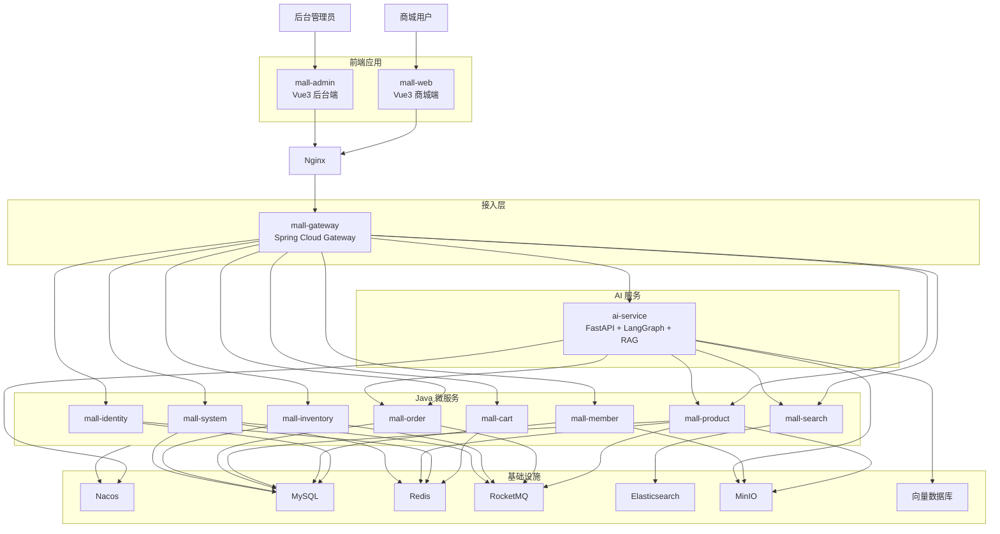
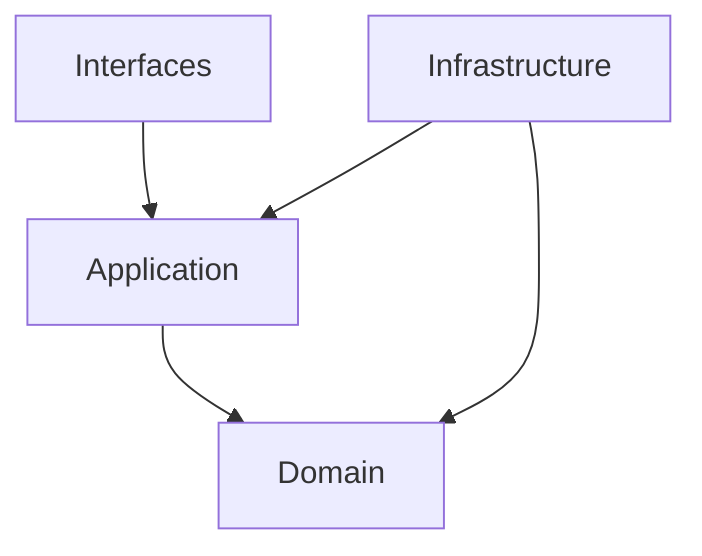
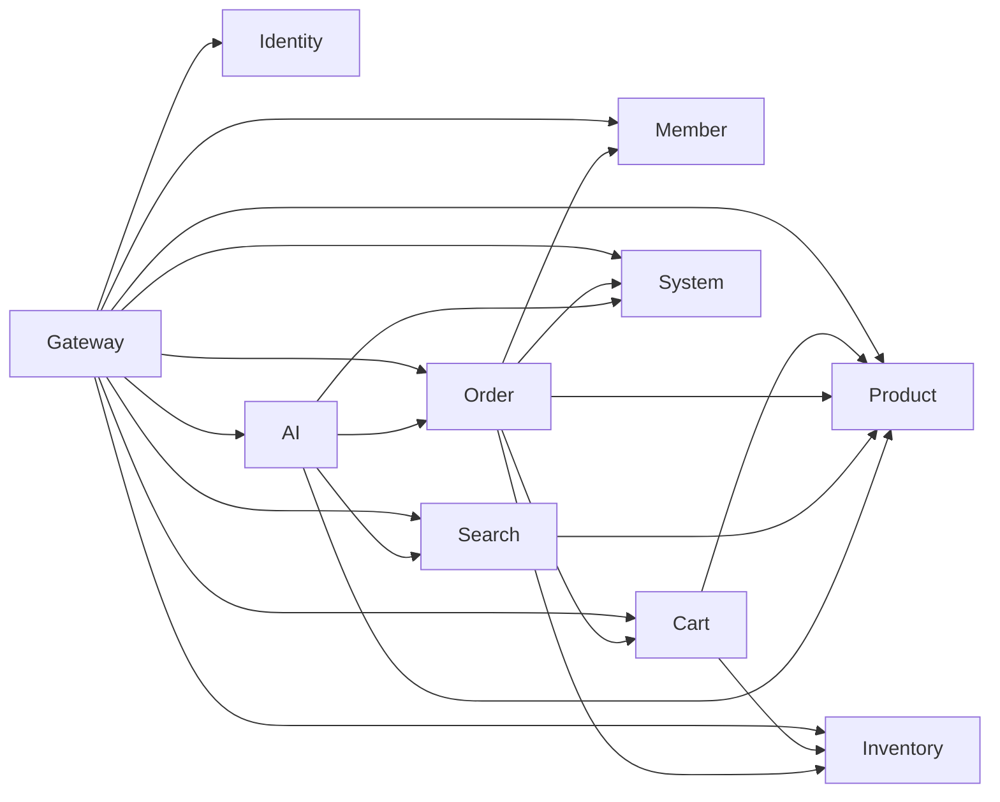

# AI 智能电商微服务平台——系统与微服务架构

## 1. 文档信息

- **项目名称**：AI 智能电商微服务平台
- **英文名称**：AI-Powered E-Commerce Platform
- **项目代号**：AI Mall
- **仓库名称**：`ai-mall-platform`
- **文档名称**：系统与微服务架构
- **文档路径**：`docs/08-系统与微服务架构.md`
- **当前版本**：V0.1
- **文档状态**：初稿
- **关联文档**：
  - `docs/00-项目总览.md`
  - `docs/01-产品需求文档.md`
  - `docs/02-统一语言词汇表.md`
  - `docs/03-领域事件风暴.md`
  - `docs/04-子域与限界上下文.md`
  - `docs/05-上下文映射图.md`
  - `docs/06-聚合与领域模型设计.md`
  - `docs/07-核心业务流程.md`

### 1.1 版本记录

| 版本 | 日期 | 说明 |
|---|---|---|
| V0.1 | 初始版本 | 明确系统总体架构、微服务拆分、技术组件、服务通信、安全、缓存、消息和部署拓扑 |

---

## 2. 文档目的

本文档用于定义 AI 智能电商微服务平台的系统架构与微服务实现方案，明确：

1. 系统整体分层与运行边界；
2. 商城端和后台端的前端架构；
3. Java 微服务拆分与职责；
4. 每个业务服务内部的 DDD 分层结构；
5. Gateway、Nacos、Redis、RocketMQ、Elasticsearch 和 MinIO 的职责；
6. Python AI 服务的内部架构；
7. 服务之间的同步和异步通信方式；
8. 身份认证、权限校验和内部服务安全；
9. 缓存、消息、幂等和最终一致性方案；
10. 日志、链路追踪、监控和告警方案；
11. 本地开发、测试和生产部署拓扑；
12. 各服务端口、依赖关系和启动顺序；
13. 第一版必须实现的架构能力；
14. 后续可扩展的架构方向。

---

## 3. 架构目标

系统架构需要同时满足以下目标。

### 3.1 业务完整性

支持完整业务链路：

```text
商品创建
→ SKU 配置
→ 库存初始化
→ 商品上架
→ 商城展示
→ 加入购物车
→ 创建订单
→ 库存锁定
→ 模拟支付
→ 库存确认扣减
→ 后台发货
→ 用户确认收货
```

### 3.2 领域边界清晰

通过 DDD 限界上下文实现：

- 商品、订单和库存模型隔离；
- 会员与身份模型隔离；
- 搜索不拥有商品真实状态；
- AI 不直接访问业务数据库；
- 各服务只访问自己的数据。

### 3.3 可独立开发和部署

商城端、后台端、Java 微服务、AI 服务和基础设施可以独立：

- 开发；
- 构建；
- 启动；
- 测试；
- 部署；
- 扩容。

### 3.4 可维护性

通过统一规范降低维护成本：

- 统一异常；
- 统一响应；
- 统一错误码；
- 统一日志；
- 统一链路 ID；
- 统一 API 契约；
- 统一事件契约；
- 统一配置管理；
- 统一安全上下文。

### 3.5 稳定性

核心链路需要具备：

- 超时控制；
- 幂等；
- 重试；
- 补偿；
- 服务降级；
- 消息可靠性；
- 数据最终一致性；
- 可观测性。

### 3.6 AI 与业务解耦

AI 服务异常时：

- 商品浏览仍可用；
- 购物车仍可用；
- 下单仍可用；
- 支付仍可用；
- 后台管理仍可用。

AI 属于增强能力，不成为基础交易链路的强依赖。

---

# 4. 系统总体架构

## 4.1 总体架构图



---

## 4.2 系统分层

```text
用户交互层
├── mall-web
└── mall-admin

统一接入层
├── Nginx
└── mall-gateway

业务服务层
├── mall-identity
├── mall-member
├── mall-product
├── mall-cart
├── mall-order
├── mall-inventory
├── mall-search
└── mall-system

智能应用层
└── ai-service

数据与中间件层
├── MySQL
├── Redis
├── RocketMQ
├── Elasticsearch
├── MinIO
├── 向量数据库
└── Nacos
```

---

## 4.3 逻辑架构原则

- 前端不直接访问各业务微服务；
- 外部请求统一经过 Gateway；
- 业务微服务不直接暴露公网；
- 内部服务调用使用独立内部接口；
- AI 通过 Java 业务接口访问真实数据；
- 每个业务上下文拥有自己的数据边界；
- 搜索索引和缓存属于可重建数据；
- 订单和库存通过 API 与事件协作；
- 业务服务不依赖前端菜单实现安全控制。

---

# 5. 项目仓库结构

```text
ai-mall-platform
├── frontend
│   ├── mall-web
│   ├── mall-admin
│   └── packages
│       ├── shared-types
│       ├── shared-utils
│       └── shared-api
│
├── backend
│   ├── pom.xml
│   ├── mall-bom
│   ├── mall-common
│   │   ├── mall-common-core
│   │   ├── mall-common-web
│   │   ├── mall-common-security
│   │   ├── mall-common-redis
│   │   ├── mall-common-mq
│   │   ├── mall-common-openfeign
│   │   ├── mall-common-log
│   │   └── mall-common-test
│   │
│   ├── mall-contracts
│   │   ├── mall-api-contracts
│   │   └── mall-event-contracts
│   │
│   ├── mall-gateway
│   └── mall-services
│       ├── mall-identity
│       ├── mall-member
│       ├── mall-product
│       ├── mall-cart
│       ├── mall-order
│       ├── mall-inventory
│       ├── mall-search
│       └── mall-system
│
├── ai-service
│   ├── app
│   ├── agents
│   ├── workflows
│   ├── tools
│   ├── rag
│   ├── prompts
│   ├── models
│   ├── repositories
│   ├── infrastructure
│   ├── tests
│   └── main.py
│
├── deploy
│   ├── docker-compose.yml
│   ├── docker-compose.infra.yml
│   ├── docker-compose.apps.yml
│   ├── nginx
│   ├── nacos
│   ├── mysql
│   ├── redis
│   ├── rocketmq
│   ├── elasticsearch
│   ├── minio
│   └── monitoring
│
├── sql
│   ├── identity
│   ├── member
│   ├── product
│   ├── order
│   ├── inventory
│   ├── system
│   └── ai
│
├── docs
│   ├── 00-项目总览.md
│   ├── 01-产品需求文档.md
│   ├── 02-统一语言词汇表.md
│   ├── 03-领域事件风暴.md
│   ├── 04-子域与限界上下文.md
│   ├── 05-上下文映射图.md
│   ├── 06-聚合与领域模型设计.md
│   ├── 07-核心业务流程.md
│   ├── 08-系统与微服务架构.md
│   ├── 09-数据库设计.md
│   ├── 10-API与事件契约.md
│   ├── 11-权限与功能配置.md
│   ├── 12-测试方案.md
│   ├── 13-部署方案.md
│   └── 14-开发计划.md
│
├── scripts
├── .gitignore
├── README.md
└── LICENSE
```

> **仓库落地修订（CHG-0001，M0 工程基线）**：
> 原种子文档假定为单一 Monorepo（`ai-mall-platform`），经 M0 工程决策后调整为**双仓结构**，更利于 AI Agent 工作区与内部代码仓边界隔离（参见 `.sdd/repositories.yaml`）：
>
> 1. **ai-platform-workspace（工作区仓，repo-workspace）**：存放 SDD 文档产物、delivery/、standards/、product/、skills/、plans/ 与 AI Agent 配置；`.gitignore` 显式忽略 `implementation/` 目录，不追踪内部代码仓。
> 2. **ai-platform-backend（后端代码仓，repo-1）**：独立 Git 仓，位于工作区 `implementation/ai-platform-backend/`；Maven 根 = 仓库根（直接含 `pom.xml` / `mall-bom/` / `mall-common/` / `mall-contracts/` / `mall-gateway/` / `mall-services/`），不再有 `backend/` 前缀目录。
>
> 其余前端仓（mall-web / mall-admin）与 AI 服务仓（ai-service）在 M0 尚未建立，后续里程碑按产品决策以独立仓加入，不与后端仓混合。上方单仓目录图（§5）作为"逻辑总览"保留，实际仓库结构以本小节说明为准。

---

# 6. 前端架构

## 6.1 前端应用划分

前端采用两个独立 Vue3 应用：

```text
mall-web
mall-admin
```

不是微前端。

两个应用：

- 独立路由；
- 独立状态管理；
- 独立构建；
- 独立部署；
- 独立权限模型；
- 共享少量基础类型和工具。

---

## 6.2 mall-web 商城端

### 技术栈

```text
Vue 3
TypeScript
Vite
Pinia
Vue Router
Axios
Element Plus 或自定义商城组件
```

### 目录建议

```text
mall-web
├── src
│   ├── api
│   ├── assets
│   ├── components
│   ├── composables
│   ├── layouts
│   ├── router
│   ├── stores
│   ├── types
│   ├── utils
│   ├── views
│   │   ├── home
│   │   ├── product
│   │   ├── cart
│   │   ├── checkout
│   │   ├── order
│   │   ├── member
│   │   └── ai
│   ├── App.vue
│   └── main.ts
├── public
├── vite.config.ts
└── package.json
```

### 核心 Store

```text
useAuthStore
useMemberStore
useCartStore
useFeatureStore
useConversationStore
```

### 主要职责

- 用户登录状态；
- 商品展示；
- 购物车状态；
- 订单交互；
- AI 流式回复；
- 功能开关展示；
- 请求失败提示；
- Token 自动刷新。

---

## 6.3 mall-admin 后台端

### 技术栈

```text
Vue 3
TypeScript
Vite
Pinia
Vue Router
Element Plus
ECharts
Axios
```

### 目录建议

```text
mall-admin
├── src
│   ├── api
│   ├── assets
│   ├── components
│   ├── directives
│   │   └── permission.ts
│   ├── layouts
│   ├── router
│   │   ├── static-routes.ts
│   │   ├── dynamic-routes.ts
│   │   └── guards.ts
│   ├── stores
│   │   ├── auth.ts
│   │   ├── permission.ts
│   │   ├── menu.ts
│   │   └── app.ts
│   ├── types
│   ├── utils
│   ├── views
│   │   ├── dashboard
│   │   ├── product
│   │   ├── inventory
│   │   ├── order
│   │   ├── ai
│   │   └── system
│   ├── App.vue
│   └── main.ts
├── vite.config.ts
└── package.json
```

### 动态路由流程

```text
管理员登录
→ 获取菜单树
→ 菜单转路由
→ 校验组件映射
→ router.addRoute()
→ 渲染侧边栏
```

### 按钮权限

```vue
<el-button v-permission="'order:ship'">
  发货
</el-button>
```

前端按钮权限只负责展示，后端仍进行最终校验。

---

## 6.4 前端共享包

可以通过 Monorepo 管理共享内容：

```text
frontend/packages
```

允许共享：

- 基础 TypeScript 类型；
- 分页结构；
- 通用 HTTP 工具；
- 日期和金额格式化；
- 错误码映射；
- 通用组件；
- API 客户端基础封装。

不建议共享：

- 商城业务 Store；
- 后台权限 Store；
- 页面路由；
- 商城和后台专属组件。

---

## 6.5 前端请求架构

```text
View
→ Store / Composable
→ API Module
→ Axios Instance
→ Gateway
```

Axios 统一处理：

- Token 注入；
- TraceId；
- 401；
- 403；
- Token 刷新；
- 重复请求取消；
- 统一错误提示；
- 文件上传；
- 流式 AI 响应。

---

# 7. Gateway 接入层

## 7.1 服务名称

```text
mall-gateway
```

## 7.2 主要职责

- 统一 API 入口；
- 路由转发；
- 跨域处理；
- Token 基础校验；
- 用户身份解析；
- 请求日志；
- TraceId 生成；
- 限流；
- 黑名单；
- 商城与后台接口隔离；
- 内部接口阻断；
- AI 流式请求转发。

## 7.3 路由规划

```text
/api/auth/**       → mall-identity
/api/mall/members/** → mall-member
/api/mall/products/** → mall-product
/api/mall/cart/**  → mall-cart
/api/mall/orders/** → mall-order
/api/mall/search/** → mall-search
/api/mall/public-features → mall-system

/api/admin/admin-users/** → mall-identity
/api/admin/roles/**       → mall-identity
/api/admin/menus/**       → mall-identity
/api/admin/products/**    → mall-product
/api/admin/categories/**  → mall-product
/api/admin/brands/**      → mall-product
/api/admin/inventories/** → mall-inventory
/api/admin/orders/**      → mall-order
/api/admin/refund-requests/** → mall-order
/api/admin/feature-configs/** → mall-system
/api/admin/system-parameters/** → mall-system
/api/admin/operation-logs/** → mall-system
/api/admin/ai/**          → ai-service

/api/ai/** → ai-service 或 Java AI Facade
```

## 7.4 内部接口

```text
/api/internal/**
```

不得通过公网 Gateway 对普通客户端开放。

可采用：

- 独立内部网关；
- Gateway 路由白名单；
- 仅容器内网络访问；
- 服务间 Token；
- 请求签名；
- mTLS。

第一版可使用内部网络 + 服务间 Token。

## 7.5 网关不负责的内容

Gateway 不负责：

- 最终业务权限；
- 订单状态校验；
- 库存规则；
- 商品上架规则；
- 退款资格判断；
- AI 业务规则。

---

# 8. Java 微服务总览

## 8.1 服务清单

| 服务 | 职责 | 数据存储 |
|---|---|---|
| `mall-identity` | 登录、Token、管理员、角色、菜单、权限 | MySQL + Redis |
| `mall-member` | 会员资料、收货地址、收藏、浏览记录 | MySQL |
| `mall-product` | 商品、SKU、分类、品牌、价格、上下架 | MySQL + Redis + MinIO |
| `mall-cart` | 购物车、选择状态、游客购物车合并 | Redis |
| `mall-order` | 订单、支付记录、发货、退款、状态历史 | MySQL + RocketMQ |
| `mall-inventory` | 库存、锁定、释放、扣减、流水 | MySQL + RocketMQ |
| `mall-search` | 商品检索、筛选、排序、索引管理 | Elasticsearch |
| `mall-system` | 功能配置、系统参数、操作日志 | MySQL + Redis |
| `mall-gateway` | 路由、接入、安全前置、限流 | Redis 可选 |

---

# 9. 单个微服务 DDD 结构

以 `mall-order` 为例：

```text
mall-order
├── pom.xml
└── src/main/java/com/aimall/order
    ├── interfaces
    │   ├── rest
    │   │   ├── mall
    │   │   └── admin
    │   ├── rpc
    │   ├── mq
    │   └── scheduler
    │
    ├── application
    │   ├── command
    │   ├── query
    │   ├── service
    │   ├── dto
    │   ├── assembler
    │   ├── port
    │   └── event
    │
    ├── domain
    │   ├── model
    │   │   ├── order
    │   │   └── refund
    │   ├── repository
    │   ├── service
    │   ├── event
    │   ├── specification
    │   └── exception
    │
    └── infrastructure
        ├── persistence
        │   ├── po
        │   ├── mapper
        │   ├── repository
        │   └── converter
        ├── client
        ├── acl
        ├── mq
        ├── cache
        └── config
```

## 9.1 Interfaces 层

负责：

- REST Controller；
- Feign 内部接口；
- MQ Consumer；
- 定时任务入口；
- 参数校验；
- Request 转 Command；
- DTO 返回。

不负责：

- 订单状态流转；
- 金额计算；
- 库存修改；
- 复杂事务。

---

## 9.2 Application 层

负责：

- 业务用例；
- 事务；
- 聚合加载；
- 聚合保存；
- 外部端口调用；
- 事件发布；
- Command / Query；
- DTO 组装。

示例：

```text
CreateOrderApplicationService
PayOrderApplicationService
CancelOrderApplicationService
ShipOrderApplicationService
OrderQueryService
```

---

## 9.3 Domain 层

负责：

- 聚合根；
- 实体；
- 值对象；
- 领域服务；
- 仓储接口；
- 领域事件；
- 领域异常；
- 业务不变量。

领域层不依赖：

```text
Spring
MyBatis-Plus
Feign
Redis
RocketMQ
Elasticsearch
```

---

## 9.4 Infrastructure 层

负责：

- MyBatis-Plus；
- MySQL；
- Redis；
- Feign；
- RocketMQ；
- MinIO；
- Elasticsearch；
- Repository 实现；
- PO 转换；
- 外部服务适配；
- 配置。

---

## 9.5 依赖方向



禁止：

```text
Domain → Infrastructure
Domain → Interfaces
Application → Controller
```

---

# 10. mall-common 设计

## 10.1 mall-common-core

包含：

- 基础异常；
- 错误码接口；
- 通用分页；
- TraceId；
- 时间工具；
- ID 基础接口；
- 领域事件基础接口；
- 基础枚举接口。

## 10.2 mall-common-web

包含：

- 统一响应；
- 全局异常处理；
- 参数校验错误处理；
- Jackson 配置；
- Web Filter；
- 请求日志；
- 分页响应。

## 10.3 mall-common-security

包含：

- Security Context；
- 当前用户上下文；
- Token 解析基础；
- 权限注解支持；
- 身份类型；
- 服务间认证基础。

## 10.4 mall-common-redis

包含：

- RedisTemplate 配置；
- Key 命名；
- 分布式锁基础；
- 缓存序列化；
- 缓存工具；
- 幂等缓存基础。

## 10.5 mall-common-mq

包含：

- RocketMQ 基础配置；
- 事件元数据；
- 消息发送模板；
- 消费幂等基础；
- 重试和死信基础。

## 10.6 mall-common-openfeign

包含：

- Feign Header 传递；
- TraceId；
- 服务间 Token；
- 错误解码；
- 超时配置；
- 基础拦截器。

## 10.7 mall-common-log

包含：

- 日志切面；
- TraceId；
- 操作日志注解；
- 敏感字段过滤；
- JSON 日志格式。

## 10.8 mall-common-test

包含：

- 测试基类；
- Testcontainers 配置；
- 测试数据构造工具；
- Mock 安全上下文；
- 领域断言工具。

## 10.9 禁止放入 common 的内容

禁止：

- Product；
- Order；
- Inventory；
- Member；
- Role；
- 菜单业务规则；
- 订单状态机；
- 商品上架逻辑；
- 库存锁定逻辑；
- 跨领域 Service。

---

# 11. mall-contracts 设计

## 11.1 mall-api-contracts

用于：

- 内部 API DTO；
- Feign 接口契约；
- 稳定请求和响应；
- 服务间错误码。

示例：

```text
ProductOrderSnapshotRequest
ProductOrderSnapshotResponse
ReserveInventoryRequest
ReserveInventoryResponse
MemberAddressResponse
```

## 11.2 mall-event-contracts

用于：

- 集成事件；
- 事件元数据；
- 事件版本；
- Topic 和 Tag 常量。

示例：

```text
ProductPublishedIntegrationEvent
PaymentSucceededIntegrationEvent
OrderCancelledIntegrationEvent
FeatureConfigChangedIntegrationEvent
```

## 11.3 契约约束

- 不共享聚合；
- 不共享 Repository；
- 不共享 PO；
- 事件字段变化必须版本化；
- 内部接口变更需要兼容；
- DTO 语义必须清晰。

---

# 12. 服务通信架构

## 12.1 同步通信

主要使用：

```text
OpenFeign
HTTP/JSON
```

适用：

- 获取商品快照；
- 获取会员地址；
- 锁定库存；
- 获取购物车项；
- AI 查询商品；
- AI 查询订单；
- 获取配置。

## 12.2 异步通信

主要使用：

```text
RocketMQ
```

适用：

- 商品索引同步；
- 订单超时；
- 支付后库存确认扣减；
- 取消后库存释放；
- 操作日志；
- 配置缓存失效；
- AI 文档解析任务。

## 12.3 同步调用规则

- 必须设置超时；
- 查询调用可有限重试；
- 写调用只有在幂等时才可重试；
- 服务返回业务错误时不重试；
- 超时不能默认视为未执行；
- 通过 ACL 转换外部 DTO。

## 12.4 异步调用规则

- 消费者幂等；
- 事件有唯一 eventId；
- 事件有版本；
- 失败自动重试；
- 超过次数进入死信或补偿；
- 业务不可恢复错误不无限重试；
- 事件消费记录可追踪。

---

# 13. 服务注册与配置中心

## 13.1 Nacos 职责

- 服务注册；
- 服务发现；
- 技术配置；
- 环境隔离；
- 服务健康状态；
- 部分动态配置。

## 13.2 Nacos 不负责的内容

Nacos 不用于存储：

- AI 功能开关；
- 退款开关；
- 用户注册开关；
- 购物车最大数量；
- 订单超时时间等业务参数。

这些属于：

```text
mall-system
```

## 13.3 Namespace 规划

```text
dev
test
prod
```

## 13.4 Group 规划

```text
DEFAULT_GROUP
MALL_INFRA_GROUP
MALL_SERVICE_GROUP
AI_SERVICE_GROUP
```

## 13.5 配置文件建议

```text
mall-gateway-dev.yaml
mall-identity-dev.yaml
mall-member-dev.yaml
mall-product-dev.yaml
mall-cart-dev.yaml
mall-order-dev.yaml
mall-inventory-dev.yaml
mall-search-dev.yaml
mall-system-dev.yaml
ai-service-dev.yaml
```

## 13.6 敏感配置

敏感信息不提交 Git：

- 数据库密码；
- Redis 密码；
- MinIO 密钥；
- 大模型 API Key；
- JWT 私钥；
- 服务间 Token；
- Nacos 密码。

使用：

- 环境变量；
- Docker Secret；
- CI/CD Secret；
- 安全配置中心。

---

# 14. 数据存储架构

## 14.1 MySQL

建议一个 MySQL 实例内划分多个数据库：

```text
mall_identity_db
mall_member_db
mall_product_db
mall_order_db
mall_inventory_db
mall_system_db
ai_db
```

原则：

- 每个服务只访问自己的数据库；
- 不跨库 JOIN；
- 不建立跨上下文外键；
- 外部 ID 作为普通字段；
- 数据迁移脚本独立管理。

## 14.2 Redis

用途：

- 购物车；
- Token 状态；
- 权限缓存；
- 功能配置缓存；
- 系统参数缓存；
- 商品详情缓存；
- 幂等令牌；
- 分布式锁；
- 限流计数；
- AI 会话短期缓存。

## 14.3 Elasticsearch

用途：

- 商品全文检索；
- 品牌和分类筛选；
- 价格区间；
- 高亮；
- 排序；
- 搜索建议；
- 商品索引重建。

## 14.4 MinIO

用途：

- 商品图片；
- 品牌 Logo；
- 用户头像；
- AI 知识文档；
- 导出文件。

## 14.5 向量数据库

用途：

- 文档向量；
- 文档分块；
- RAG 检索；
- 可选商品语义检索。

第一版可以使用：

- PostgreSQL + pgvector；
- Qdrant；
- Milvus；
- Chroma 仅用于本地原型。

文档中暂不固定具体产品，部署方案再确认。

---

# 15. Redis Key 设计原则

## 15.1 命名格式

```text
aimall:{environment}:{service}:{business}:{identifier}
```

示例：

```text
aimall:dev:identity:token:{tokenId}
aimall:dev:identity:permissions:{adminUserId}
aimall:dev:cart:member:{memberId}
aimall:dev:product:detail:{productId}
aimall:dev:system:feature:{configKey}
aimall:dev:order:idempotency:{token}
```

## 15.2 TTL 原则

| Key | TTL |
|---|---|
| Access Token 状态 | 与 Token 有效期一致 |
| 权限缓存 | 30 分钟或权限变更主动失效 |
| 购物车 | 30 天或更长 |
| 商品详情 | 10～30 分钟 |
| 功能配置 | 10 分钟并主动失效 |
| 系统参数 | 10 分钟并主动失效 |
| 幂等令牌 | 订单提交窗口 |
| 分布式锁 | 短 TTL + 自动续期谨慎使用 |

## 15.3 缓存一致性

推荐：

```text
先更新数据库
→ 再删除缓存
```

对重要缓存可采用延迟双删，但第一版不强制。

## 15.4 防止缓存问题

### 缓存穿透

- 空值缓存；
- 参数校验；
- Bloom Filter 可选。

### 缓存击穿

- 互斥重建；
- 逻辑过期；
- 热点 Key 预热。

### 缓存雪崩

- TTL 随机化；
- 分批预热；
- 限流；
- 降级。

---

# 16. RocketMQ 消息架构

## 16.1 Topic 规划

```text
product-events
order-events
inventory-events
system-events
audit-events
ai-events
```

## 16.2 核心事件

```text
ProductPublishedIntegrationEvent
ProductUpdatedIntegrationEvent
ProductUnpublishedIntegrationEvent
OrderCreatedIntegrationEvent
PaymentSucceededIntegrationEvent
OrderCancelledIntegrationEvent
OrderCompletedIntegrationEvent
FeatureConfigChangedIntegrationEvent
SystemParameterChangedIntegrationEvent
AdminOperationIntegrationEvent
KnowledgeDocumentUploadedEvent
```

## 16.3 订单超时

采用 RocketMQ 延迟消息：

```text
OrderCreated
→ 发送延迟检查消息
→ 到期后查询订单状态
→ 超时则取消
```

同时使用定时任务补偿：

```text
扫描超时待付款订单
```

## 16.4 消息可靠性

第一版推荐实现：

```text
Outbox 本地消息表
+
定时投递
+
MQ 消费重试
+
消费幂等
+
死信或补偿表
```

若开发时间有限，可先使用：

```text
本地事务后发送消息
+
发送失败记录补偿
```

但最终简历展示版本建议补充 Outbox。

## 16.5 消费幂等

可以使用：

- 事件消费记录表；
- Redis SETNX；
- 业务唯一键；
- 聚合当前状态；
- 数据库唯一约束。

核心场景必须优先使用业务唯一键和状态校验。

---

# 17. 订单与库存一致性架构

## 17.1 创建订单

```text
订单服务
→ 同步调用库存服务锁定库存
→ 锁定成功
→ 订单服务本地事务创建订单
```

## 17.2 订单创建失败

```text
库存已锁定
→ 订单创建失败
→ 同步释放库存
→ 释放失败进入补偿任务
```

## 17.3 支付成功

```text
订单本地事务完成
→ PaymentSucceededIntegrationEvent
→ 库存服务确认扣减
```

## 17.4 订单取消

```text
订单本地事务完成
→ OrderCancelledIntegrationEvent
→ 库存服务释放锁定库存
```

## 17.5 架构原则

- 不使用跨库大事务；
- 不让订单服务直接写库存表；
- 不让库存服务直接改订单状态；
- 所有消息消费幂等；
- 使用状态和业务号防止重复处理；
- 异常通过补偿任务最终修复。

---

# 18. 搜索架构

## 18.1 数据流

```text
商品服务
→ 商品上架或修改
→ 发布商品事件
→ 搜索服务消费
→ 构建 ProductSearchDocument
→ 写入 Elasticsearch
```

## 18.2 搜索文档字段

建议包含：

- productId；
- productName；
- subtitle；
- categoryId；
- categoryName；
- brandId；
- brandName；
- keywords；
- attributes；
- minPrice；
- maxPrice；
- mainImage；
- published；
- available；
- salesCount；
- updatedAt。

## 18.3 索引同步失败

```text
消费失败
→ MQ 重试
→ 失败任务
→ 定时补偿
→ 支持按 productId 重建
```

## 18.4 全量重建

```text
后台触发重建
→ 分页读取商品投影
→ 批量写入新索引
→ 别名切换
→ 删除旧索引
```

第一版可以先实现简单全量覆盖，后续再做别名切换。

## 18.5 搜索降级

- 分类浏览；
- MySQL 简单 LIKE 查询；
- 返回暂时不可用；
- AI 导购提示搜索服务不可用。

---

# 19. AI 服务架构

## 19.1 技术栈

```text
Python
FastAPI
Pydantic
LangChain
LangGraph
RAG
AI Agent
HTTP Client
向量数据库
MinIO
```

## 19.2 目录结构

```text
ai-service
├── app
│   ├── api
│   ├── config
│   ├── dependencies
│   └── middleware
├── agents
│   ├── shopping_agent.py
│   ├── order_agent.py
│   └── customer_service_agent.py
├── workflows
│   ├── shopping_workflow.py
│   ├── comparison_workflow.py
│   └── order_workflow.py
├── tools
│   ├── product_tools.py
│   ├── order_tools.py
│   ├── search_tools.py
│   └── refund_tools.py
├── rag
│   ├── loaders
│   ├── splitters
│   ├── embeddings
│   ├── retrievers
│   └── vector_store.py
├── prompts
│   ├── shopping
│   ├── customer_service
│   └── order
├── models
│   ├── request.py
│   ├── response.py
│   └── state.py
├── repositories
├── infrastructure
│   ├── java_clients
│   ├── minio
│   ├── vector_db
│   └── llm
├── tests
└── main.py
```

## 19.3 AI 服务职责

- 意图识别；
- 条件提取；
- 工作流编排；
- 工具选择；
- RAG 检索；
- 提示词管理；
- 结构化输出；
- 会话管理；
- 工具调用日志；
- AI 降级。

## 19.4 AI 不负责

- 商品真实状态；
- 订单真实状态；
- 库存扣减；
- 权限最终判断；
- 退款最终规则；
- 业务数据库访问；
- 支付处理。

## 19.5 Java 与 AI 交互

推荐：

```text
前端
→ Gateway
→ Java AI Facade 或直接代理
→ ai-service
```

涉及业务工具时：

```text
ai-service
→ Java internal API
→ Application Service
→ Domain
```

## 19.6 身份传递

Java 向 AI 传递最小可信上下文：

```json
{
  "subjectId": "10001",
  "subjectType": "MEMBER",
  "traceId": "trace-001",
  "permissions": ["order:list", "order:cancel"]
}
```

AI 不信任浏览器直接传入的 memberId。

## 19.7 结构化输出

所有 AI 业务响应使用 Pydantic Schema 校验。

例如：

```text
ShoppingRecommendationResponse
ProductComparisonResponse
CustomerServiceResponse
OrderAssistantResponse
```

若模型输出不符合 Schema：

```text
自动修复一次
→ 仍失败则返回降级结果
```

---

# 20. 安全架构

## 20.1 身份类型

```text
GUEST
MEMBER
ADMIN
SERVICE
```

## 20.2 Token

商城和后台令牌必须区分：

```text
audience
subjectType
issuer
tokenId
expiration
```

## 20.3 外部请求安全

- HTTPS；
- JWT；
- 密码加密；
- 参数校验；
- CORS 白名单；
- 文件上传校验；
- 限流；
- 防重复提交；
- 敏感日志脱敏；
- 统一 401 和 403。

## 20.4 后台权限

```text
管理员
→ 角色
→ 菜单
→ 权限编码
```

后端：

```java
@PreAuthorize("hasAuthority('order:ship')")
```

## 20.5 数据权限

商城用户只能访问自己的：

- 地址；
- 购物车；
- 订单；
- 退款；
- AI 订单会话。

数据权限必须由后端校验。

## 20.6 内部服务安全

内部 API 使用：

- 容器内部网络；
- 服务间 Token；
- 调用方服务名；
- 请求签名可选；
- mTLS 后续增强；
- 内部接口禁止公网访问。

## 20.7 密码安全

- BCrypt 或 Argon2；
- 不存明文；
- 不记录密码日志；
- 重置密码后使旧 Token 失效；
- 登录失败次数限制可作为 P1。

---

# 21. 幂等架构

## 21.1 HTTP 幂等

创建订单：

```text
Idempotency-Key
```

库存锁定：

```text
businessNo
```

支付：

```text
paymentNo
```

退款审核：

```text
refundNo + action
```

## 21.2 消息幂等

```text
eventId
+
业务唯一键
+
当前状态
```

## 21.3 幂等存储

可选：

- Redis；
- MySQL 唯一索引；
- 消费记录表；
- 聚合状态。

核心交易优先使用 MySQL 唯一约束和领域状态。

---

# 22. 可观测性架构

## 22.1 日志

统一记录：

- timestamp；
- serviceName；
- traceId；
- spanId；
- userId 或 adminUserId；
- requestPath；
- httpMethod；
- status；
- duration；
- errorCode；
- message。

## 22.2 TraceId

```text
Nginx
→ Gateway
→ Feign
→ RocketMQ
→ AI Service
```

全链路传递 TraceId。

## 22.3 指标

建议监控：

- QPS；
- 错误率；
- 接口耗时；
- JVM；
- CPU；
- 内存；
- MySQL 连接池；
- Redis 命中率；
- RocketMQ 堆积；
- Elasticsearch 查询耗时；
- AI 响应时间；
- AI 工具调用失败率。

## 22.4 监控组件

第一版可选：

```text
Spring Boot Actuator
Prometheus
Grafana
Loki 或 ELK
SkyWalking 或 OpenTelemetry
```

第一版最少实现：

- Actuator；
- 健康检查；
- 结构化日志；
- TraceId；
- 基础 Prometheus 指标。

## 22.5 告警

重点告警：

- 库存确认扣减持续失败；
- 库存释放持续失败；
- RocketMQ 消息堆积；
- 订单超时补偿异常；
- 数据库连接池耗尽；
- AI 服务不可用；
- Elasticsearch 索引同步失败；
- MinIO 上传失败率异常。

---

# 23. 健康检查

每个服务提供：

```text
/actuator/health
/actuator/info
/actuator/prometheus
```

健康状态包括：

- MySQL；
- Redis；
- RocketMQ；
- Elasticsearch；
- MinIO；
- Nacos；
- AI 模型服务；
- 向量数据库。

Gateway 只将健康服务纳入路由。

---

# 24. 服务端口规划

本地开发建议：

| 服务 | 端口 |
|---|---|
| mall-gateway | 8080 |
| mall-identity | 8101 |
| mall-member | 8102 |
| mall-product | 8103 |
| mall-cart | 8104 |
| mall-order | 8105 |
| mall-inventory | 8106 |
| mall-search | 8107 |
| mall-system | 8108 |
| ai-service | 8200 |
| Nacos | 8848 |
| MySQL | 3306 |
| Redis | 6379 |
| RocketMQ NameServer | 9876 |
| RocketMQ Broker | 10911 |
| Elasticsearch | 9200 |
| MinIO API | 9000 |
| MinIO Console | 9001 |
| Prometheus | 9090 |
| Grafana | 3000 |

端口仅用于本地开发，生产环境由服务发现和容器网络管理。

---

# 25. 服务依赖关系

## 25.1 依赖图



## 25.2 禁止同步反向依赖

禁止：

```text
Inventory → Order 同步调用
Search → Product 写操作
Product → Order
Identity → 商品业务
AI → MySQL 业务库
```

---

# 26. 服务启动顺序

## 26.1 基础设施

```text
MySQL
→ Redis
→ Nacos
→ RocketMQ
→ Elasticsearch
→ MinIO
→ 向量数据库
```

## 26.2 后端服务

建议：

```text
mall-identity
→ mall-system
→ mall-member
→ mall-product
→ mall-inventory
→ mall-cart
→ mall-order
→ mall-search
→ ai-service
→ mall-gateway
```

实际服务注册后可以并行启动，但首次开发时按依赖顺序更容易排查。

## 26.3 前端

```text
mall-web
mall-admin
```

---

# 27. 本地开发拓扑

## 27.1 推荐方式

基础设施使用 Docker Compose：

```text
MySQL
Redis
Nacos
RocketMQ
Elasticsearch
MinIO
向量数据库
```

应用服务在 IDE 中启动：

```text
Java 微服务
Python AI 服务
Vue 前端
```

优点：

- 调试方便；
- 启动快；
- 日志清晰；
- 不必每次重建镜像。

## 27.2 全容器模式

用于最终演示：

```text
docker compose up -d
```

启动：

- 基础设施；
- Java 服务；
- AI 服务；
- 前端；
- Nginx。

---

# 28. 环境划分

```text
local
dev
test
staging
prod
```

个人项目至少实现：

```text
local
dev
prod
```

## 28.1 local

- 本地调试；
- Docker Compose 基础设施；
- 本地服务；
- 测试大模型 Key。

## 28.2 dev

- 集成测试；
- 共享环境；
- 独立数据库；
- 测试账号。

## 28.3 prod

- 演示部署；
- HTTPS；
- 独立密钥；
- 数据备份；
- 监控和日志；
- 禁止使用默认密码。

---

# 29. 构建与发布

## 29.1 Java

```text
Maven
Java 21
Spring Boot Jar
Docker Image
```

构建：

```bash
mvn clean package -DskipTests
```

## 29.2 前端

```text
pnpm
Vite
```

构建：

```bash
pnpm build
```

## 29.3 AI

```text
Python
uv 或 Poetry
Docker
```

## 29.4 镜像命名

```text
aimall/mall-gateway:0.1.0
aimall/mall-identity:0.1.0
aimall/mall-member:0.1.0
aimall/mall-product:0.1.0
aimall/mall-cart:0.1.0
aimall/mall-order:0.1.0
aimall/mall-inventory:0.1.0
aimall/mall-search:0.1.0
aimall/mall-system:0.1.0
aimall/ai-service:0.1.0
aimall/mall-web:0.1.0
aimall/mall-admin:0.1.0
```

---

# 30. 性能设计

## 30.1 商品

- 商品详情 Redis 缓存；
- 列表分页；
- 搜索使用 Elasticsearch；
- 图片走对象存储和 CDN 可选；
- 热门商品缓存预热。

## 30.2 购物车

- Redis Hash；
- 批量查询商品；
- 避免每项单独 RPC；
- 商品和库存信息批量返回。

## 30.3 订单

- 列表分页；
- 订单详情快照；
- 状态字段索引；
- 创建订单防重复；
- 大量历史订单考虑分库分表属于后续能力。

## 30.4 库存

- 条件更新；
- 乐观锁；
- 批量加载按 SKU 排序；
- 避免死锁；
- 业务唯一索引；
- 不将 Redis 作为最终库存真相。

## 30.5 AI

- 流式响应；
- 超时控制；
- 会话裁剪；
- Prompt 缓存；
- 工具调用批量化；
- RAG Top-K 限制；
- 大模型失败降级。

---

# 31. 高可用与容错

第一版不是生产级高可用集群，但架构应预留：

- 服务多实例；
- Gateway 多实例；
- MySQL 主从；
- Redis Sentinel 或 Cluster；
- RocketMQ 多 Broker；
- Elasticsearch 多节点；
- MinIO 分布式；
- AI 服务水平扩展；
- Nginx 负载均衡。

第一版本地环境可以单实例。

---

# 32. 架构风险

## 32.1 服务拆分过多

风险：

- 启动复杂；
- 调试困难；
- 网络调用增加；
- 个人项目开发成本高。

控制方式：

- 不再拆支付、退款、文件、日志等空壳服务；
- 核心边界保持独立；
- 技术模块不强行服务化。

## 32.2 DDD 过度设计

风险：

- 类数量过多；
- 简单 CRUD 复杂化；
- 查询性能差；
- 开发进度受影响。

控制方式：

- 核心域使用富领域模型；
- 查询使用轻量 CQRS；
- 搜索和日志使用简单架构；
- 不为每张表创建聚合。

## 32.3 分布式一致性

风险：

- 支付成功但库存未确认；
- 订单取消但库存未释放；
- 商品上架但索引未更新。

控制方式：

- 幂等；
- MQ 重试；
- Outbox；
- 补偿任务；
- 管理后台异常查询；
- 告警。

## 32.4 AI 幻觉

风险：

- 推荐不存在商品；
- 返回错误订单状态；
- 编造退款政策。

控制方式：

- 真实工具调用；
- RAG；
- Schema 校验；
- 权限校验；
- 引用来源；
- 无依据时明确说明。

---

# 33. 第一版架构范围

## 33.1 P0 必须完成

- 两个独立 Vue 应用；
- Gateway；
- Nacos；
- 8 个 Java 业务服务；
- DDD 四层结构；
- MySQL 多数据库；
- Redis；
- Spring Security；
- JWT；
- RBAC；
- OpenFeign；
- 统一异常；
- 统一响应；
- TraceId；
- 商品详情缓存；
- Redis 购物车；
- 订单和库存独立；
- 同步库存锁定；
- 模拟支付；
- AI FastAPI 服务；
- Docker Compose 基础环境。

## 33.2 P1 重要增强

- RocketMQ；
- 延迟关闭订单；
- Elasticsearch；
- Outbox；
- 操作日志异步化；
- 功能配置；
- RAG；
- AI 商品对比；
- Prometheus；
- Grafana；
- Sentinel。

## 33.3 P2 后续增强

- SkyWalking/OpenTelemetry；
- Redis Cluster；
- MySQL 主从；
- Kubernetes；
- 服务网格；
- 灰度发布；
- 多仓库存；
- 真正支付服务；
- 多商户；
- 推荐算法平台。

---

# 34. 架构验收标准

架构设计完成后，第一版实现至少满足：

1. 商城端和后台端独立构建；
2. 所有外部 API 经过 Gateway；
3. Java 服务注册到 Nacos；
4. 每个核心服务具有 DDD 四层；
5. 服务之间不共享领域实体；
6. 服务之间不访问对方数据库；
7. 商品、订单和库存数据边界清晰；
8. 订单通过 API 获取商品快照；
9. 订单同步锁定库存；
10. 支付后通过事件确认扣减；
11. 取消后通过事件释放库存；
12. 商品通过事件同步搜索索引；
13. AI 不直接访问业务数据库；
14. 后台接口具备权限校验；
15. Redis Key 有统一规范；
16. 核心消息消费幂等；
17. 所有请求包含 TraceId；
18. AI 故障不影响交易链路；
19. Docker Compose 可启动基础设施；
20. 服务健康检查可用。

---

# 35. 当前架构决策

## 35.1 已确定

- 前端为两个独立 Vue3 应用；
- 后端使用 Spring Cloud Alibaba；
- 核心服务内部采用 DDD；
- 使用 Nacos 注册和技术配置；
- 使用 OpenFeign 同步调用；
- 使用 RocketMQ 异步事件；
- 使用 MySQL、Redis、Elasticsearch 和 MinIO；
- 订单和库存独立服务；
- AI 使用 Python FastAPI；
- AI 通过 Java API 访问业务数据；
- 系统配置与 Nacos 技术配置分离；
- 查询采用轻量 CQRS；
- 服务不跨库访问；
- 商城和后台 Token 区分；
- 内部接口不直接对公网开放。

## 35.2 待确认

- Spring Cloud Alibaba 具体版本组合；
- 向量数据库具体选型；
- 是否第一版直接实现 Outbox；
- 内部服务认证采用服务 Token 还是 mTLS；
- 是否使用 Sentinel；
- 是否使用 SkyWalking 或 OpenTelemetry；
- AI 流式响应采用 SSE 还是 WebSocket；
- Redis 是否承担 Token 黑名单；
- 商品搜索降级是否进入 P1；
- 是否使用前端 Monorepo；
- 是否使用 Docker Compose Profile 区分基础设施和应用。

---

# 36. 下一步文档

下一份文档为：

```text
docs/09-数据库设计.md
```

下一份文档需要明确：

1. 数据库和 Schema 划分；
2. 每个服务的数据归属；
3. 核心表结构；
4. 主键和业务编号；
5. 字段类型；
6. 索引；
7. 唯一约束；
8. 乐观锁；
9. 逻辑删除；
10. 审计字段；
11. 商品、订单和库存表；
12. 权限、配置和 AI 表；
13. Outbox、消费幂等和补偿表；
14. 数据初始化脚本；
15. 数据库迁移策略；
16. 数据备份和恢复。

本文档作为 V0.1 系统架构基线。后续数据库、API、部署或技术选型发生变化时，应同步更新本文档。
